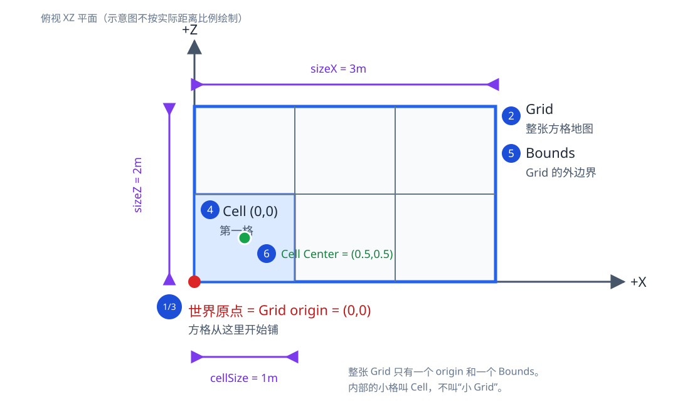
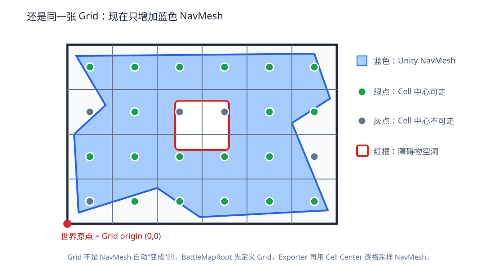

# Skynet Battle Navigation 第一课实操：从 Unity 地图到 Skynet 查询

第一课完成一条可以亲手运行、调试和破坏测试的地图生产链。团结引擎中的 3D 场景先经过 NavMesh Authoring，再采样成单层 2.5D Grid；Exporter 写出带版本和 CRC 的 BMAP；WSL 中的 C++ Module 加载 BMAP，多个 Skynet QueryWorker 共享同一份 immutable GridMap；最后，Unity 用 Protobuf 发送 WorldPosition，Server 返回这个位置的可走性、高度、Area 和 Clearance。

```text
Tuanjie Scene
  -> NavMesh Authoring
  -> Grid Sampling / Validation
  -> BMAP V1
  -> C++ BMapReader / GridMap / MapRegistry
  -> Lua C Binding
  -> Skynet QueryWorker
  -> socketdriver + netpack + Protobuf
  -> Unity Server Query Window
```

这条链中有两个不同的数据边界：

```text
离线资产：Unity -> BMAP -> Server
运行消息：Unity <-> Protobuf <-> Skynet
```

不要把 BMAP 改成 Protobuf。BMAP 是大块、定长、可随机索引的导航资产；Protobuf 是运行时请求和响应。两者的版本、校验和失败路径都要明确。

本课正式出现：

```text
WorldPosition
GridPos
NavCell
BMapReader
GridMap
MapRegistry
Lua C Binding
Skynet Query Service
```

本课不实现：

```text
A*
AgentProfile
Path
NavigationContext
Dynamic Occupancy
BattleWorker
INavigationBackend
Detour
```

后续可选高级课可能增加另一种导航实现，所以正式业务位置使用 WorldPosition，不把 GridPos 存成长期业务数据。第一课只需要记住这一句，不展开未来模块。

### 这份教程怎样分工

学习者以 Server 开发经验为前提，但不默认熟悉 Unity。为了避免把时间消耗在摆放模型上，仓库已经提供 `Battle_1001` 基础场景；其余与资产生产链有关的工作都由学习者按教程亲自完成。

```text
工程预先提供：基础场景几何、灯光、观察相机、双方出生点、基础 Collider

学习者实操：
打开工程
-> 安装并确认 Package
-> 理解 GameObject / Component / Collider
-> 添加并配置 NavMeshSurface
-> Bake 并观察结果
-> 运行 Grid Sampling / Validator
-> Export BMAP
-> 检查 manifest / CRC
-> 发布给 Server
-> 编译、运行、调试和测试
```

Unity 专有名词首次用于操作前会解释“是什么、为什么需要、它影响哪条边界”。如果一个操作只改变显示、不影响 Server 资产，文档也会明确说明。

完整源码不是学习起点。每个核心文件在代码前先给出概念准备和学习导航，明确必须精读、可以略读、输入、输出、失败条件和理解自测；学习者不需要靠通读实现反推 Unity 概念。

每个文件步骤都会明确写出操作类型：`新建文件`、`完整替换已有文件`、`局部修改` 或 `只阅读`。只有路径而没有操作类型，学习者无法判断该做什么。

正文使用自然、直接的中文，优先说明对象是什么、解决什么问题、下一步谁会使用。避免反复使用“不是……而是……”等模板句式。

课程中的版本管理统一使用 VS Code 内置 Source Control 和 Git。此前主要使用 SVN 的学习者，先完成 [VS Code Git 实操：给长期使用 SVN 的开发者](VS_CODE_GIT_FOR_SVN.md)，尤其要理解 `Stage -> Commit -> Push` 与 SVN Commit 的区别。

### 第一课的面试目标

这不是一堂“会点 Unity 菜单”的课。Unity 操作只是让你亲手建立上游事实；第一课真正要形成的是一条能经受主程面试追问的 Server 资产与查询链。

完成后你需要能用代码、运行日志和测试回答：

```text
1. 为什么 Server 不能读取 .unity Scene？
2. 为什么运行消息用 Protobuf，而 BMAP 不用 Protobuf 替代？
3. WorldPosition 和 GridPos 分别属于什么边界？
4. 负世界坐标怎样稳定映射到 GridPos？
5. BMapReader 为什么要显式检查长度、字节序、版本和 CRC？
6. GridMap 为什么加载后 immutable？
7. 多个 Skynet Service 在不同 OS Thread 查询同一地图时，安全条件是什么？
8. 为什么不能让一个 MapService 永久代理全部高频查询？
9. Lua C Binding 为什么应当薄，不保存业务状态？
10. 怎样证明 Unity、C++ Native 和 Skynet 查询的是同一份地图语义？
```

本课每个阶段保留三类证据：

```text
行为证据：实际输出、日志或 Overlay
失败证据：损坏输入、错误版本、越界或 malformed packet
设计证据：可以说明 WHY、替代方案和适用限制
```

面试回答不要停在“用了 CRC”“用了 immutable”这种名词层面。应继续说明威胁是什么、检查发生在哪里、失败如何返回、测试怎样覆盖。

## 1. 本课要完成的行为与四个终端

最终在 Unity 的 `Server Query` 窗口依次查询四个点：

```text
Ground       -> walkable=true，height_mm=0
CenterBlock  -> walkable=false
Slope        -> walkable=true，height_mm>0
Outside      -> error_code=OUT_OF_BOUNDS
```

同一个点会在三个位置显示同样的结果：

```text
Unity Scene Overlay
C++ Golden Query
Unity -> Skynet Protobuf Response
```

实操过程中保留四个终端：

```text
Windows PowerShell   检查 Editor、生成 C# Protobuf、查看 G 盘资产
WSL Build            编译 Skynet、lua-protobuf 和 battle_nav.so
WSL Server           运行 Skynet，不在这个终端继续执行构建命令
WSL Command          跑测试、查看端口、连接 Debug Console
```

Unity Editor 是第五个可观察现场。不要把 Server 长驻进程、构建命令和临时测试混在同一个 Terminal；否则报错以后很难知道当前目录、环境变量和进程属于哪一步。

## 2. 检查现有环境，不做破坏性重装

当前机器已经安装：

```text
Tuanjie Editor 1.10.0
Editor build 2022.3.62t12_ab02e98c9779
实际安装路径由本机 Tuanjie Hub 决定
```

先在 Tuanjie Hub 的 Installs 页面找到 2022.3.62t12，再把对应 `Tuanjie.exe` 路径写入当前 PowerShell 会话。环境变量只用于这次检查，不写入工程文件：

```powershell
$editor = $env:TUANJIE_EDITOR
if ([string]::IsNullOrWhiteSpace($editor)) {
    throw '请先设置 TUANJIE_EDITOR，例如：$env:TUANJIE_EDITOR = ''<Tuanjie Editor 安装目录>\Editor\Tuanjie.exe'''
}
Get-Item -LiteralPath $editor |
    Select-Object FullName,
        @{Name='ProductVersion'; Expression={$_.VersionInfo.ProductVersion}}
Get-AuthenticodeSignature -LiteralPath $editor |
    Select-Object Status, StatusMessage
Get-PSDrive -PSProvider FileSystem |
    Select-Object Name,
        @{Name='FreeGB'; Expression={[math]::Round($_.Free / 1GB, 2)}}
```

预期 ProductVersion：

```text
2022.3.62t12_ab02e98c9779
```

若 Hub 的 Installs 页面没有自动列出已有 Editor，使用 `Locate/定位` 并选择：

```text
<Tuanjie Editor 安装目录>\Editor\Tuanjie.exe
```

这只是让 Hub 记录一个已有 Editor，不会复制安装文件。

WSL Build 终端：

```bash
pwd
uname -a
cat /etc/os-release
g++ --version
cmake --version
make --version
git --version
gdb --version
```

再确认参考工程的开发环境存在，但不把它合并到新项目：

```bash
reference_root="${SKYNET_SLG_REFERENCE_ROOT:?请设置参考工程在当前机器上的路径}"
test -d "$reference_root"
find "$reference_root" -maxdepth 2 -type f \
  -name 'AGENTS.md' -o -name 'README.md'
```

`skynet-slg-learning` 只提供教学组织、依赖固定、Skynet ownership/yield、测试和调试方式。不要从中复制 Login、World、Region、H5 或双协议业务。

## 3. 目录约定：所有工程路径从仓库根目录推导

```text
课程资料：
<仓库根目录>

Unity 工程：
<仓库根目录>\unity\BattleNavigation

Server 工程：
<仓库根目录>/server
```

仓库可以克隆到任意磁盘或 WSL 文件系统。后续命令通过 `git rev-parse --show-toplevel` 获取仓库根目录；不要把某台机器的盘符或用户名写入脚本。若主要在 WSL 编译 Skynet、CMake 和大量小文件，放在 WSL Linux 文件系统通常更稳定；若主要使用 Windows Editor，也可以放在 Windows 文件系统并通过 `/mnt/<drive>/...` 访问。

终端当前目录位于仓库或任一子目录时，可以这样取得真实路径：

```powershell
$repoRoot = (git rev-parse --show-toplevel).Trim()
```

```bash
repo_root="$(git rev-parse --show-toplevel)"
```

后文的 `<仓库根目录>` 只用于展示文件身份；可执行命令会使用这两个动态结果或脚本自身位置推导路径。

Server 运行时也不直接读取 Unity Project。Unity 把候选 BMAP 写入仓库 `shared/navigation/`；验证后提交和推送，Server 所在机器再拉取同一个 Git 提交。这是课程里的最小跨机器资产发布动作。

### 3.1 先只认识 Bake 需要的 Unity 对象

本节只帮你看懂 Unity 窗口并完成第 6 节的 Bake，不在这里提前讲 Grid、origin、Cell 和坐标公式。那些概念会在看到蓝色 NavMesh 之后，用同一张图逐步引入。

第一次阅读只要知道“这个词在 Unity 哪里看到、影响什么”，不用背定义。

#### Project（工程）

Unity Project 是包含 `Assets/`、`Packages/` 和 `ProjectSettings/` 的整个目录，可以类比成一个带依赖锁定和运行配置的 Server 仓库。

```text
Assets/          业务资源和 C# 脚本，类似 src/ + assets/
Packages/        Package 依赖声明和锁文件，类似 package manifest/lock
ProjectSettings/ 引擎级配置，类似服务配置与构建配置
Library/         本机导入缓存，类似 build cache，不提交 Git
```

#### Scene（场景）

`.unity` Scene 是一组对象及其配置的序列化文件。它不是图片，也不是 Server 地图文件。可以把它类比成“编辑器中的对象配置树”。

本课的 Scene 是：

```text
Assets/BattleNavigation/Scenes/Battle_1001.unity
```

Server 不读取 Scene。Scene 只是 BMAP 的上游 Authoring Source。

#### GameObject（游戏对象）

GameObject 本身主要提供名称、层级和开关，具体能力来自挂在它上面的 Component。可以类比成一个只有 identity 和 component list 的 Entity。

例如 `MainGround` 是 GameObject，它通过以下 Component 获得能力：

```text
Transform     位置、旋转、缩放
MeshFilter    使用什么几何网格
MeshRenderer  怎样显示
BoxCollider   怎样参与物理与导航采集
```

#### Component（组件）

Component 是挂在 GameObject 上的功能或数据单元，接近“组合优于继承”里的组件。`NavMeshSurface` 和 `BoxCollider` 都是 Component。场景中还会看到 `BattleMapRoot` Component：它用来保存“这个 Scene 将怎样导出成 Server Grid”的配置，第 6.11 节会在 Grid 图上正式讲它。

在 Inspector 里点击 `Add Component`，就是给当前 GameObject 增加一个组件实例。

自定义 C# Component 通常继承 `MonoBehaviour`。它让脚本实例可以挂到 GameObject、读取 Transform、被 Scene 序列化并接收 Unity 回调。这里的 “Behaviour” 不表示 Server 业务服务，也不意味着必须实现每帧 `Update()`。

#### Hierarchy（层级窗口）

Hierarchy 显示当前 Scene 中 GameObject 的父子树。父子关系会影响组织方式，也可能影响 Transform。它可以类比成进程内的一棵配置对象树，不是磁盘目录。

#### Inspector（属性窗口）

选中 GameObject 后，Inspector 显示该对象所有 Component 的字段。可以类比成管理后台里的结构化配置编辑器。修改后必须保存 Scene，否则重新打开会丢失。

#### Transform

每个 GameObject 都有 Transform：

```text
Position  世界或父节点局部位置
Rotation  旋转
Scale     缩放
```

现在只需要把 Transform 理解为“GameObject 放在哪里、怎样旋转和缩放”。当第 6.11 节真正需要世界坐标时，再配合 Grid 图解讲 Position；现在不需要先记 World/Local 公式。

#### Mesh、Renderer 与 Material

```text
Mesh      物体的三角形几何形状
Renderer  把 Mesh 画到屏幕
Material  颜色、贴图和渲染方式
```

它们主要回答“玩家看见什么”。Server 导航不能只根据 Renderer 推断阻挡，因为装饰模型可能可穿过，也可能使用与实际阻挡不同的简化形状。

#### Collider（碰撞体）

Collider 是用于物理碰撞和空间占用的几何描述，例如 `BoxCollider`。在本课中它还是 NavMesh 的采集输入。

后端类比：Renderer 像展示 DTO，Collider 才像经过业务确认的判定数据。建筑看起来有墙，不代表 Server 可以从贴图推断墙；必须用 Collider 明确表达“这里阻挡”。

本课选择 `Use Geometry = Physics Colliders`，含义是：Bake 时读取 Collider，不读取视觉 Mesh。

#### Layer（层）与 Layer Mask（层掩码）

Layer 是 GameObject 的分类编号；Layer Mask 是“允许哪些分类参与本次操作”的位集合，类似权限 bit mask 或按类型过滤的数据源。

NavMeshSurface 的 Layer Mask 决定哪些对象会进入 Bake。若把特效、出生点标记或摄像机也采集进去，结果可能污染；若漏掉地面 Layer，Bake 后会没有蓝色区域。

#### Static（静态标记）

Static 表示对象不会在运行时移动，引擎可以对它做离线预处理。本课地面、墙、台地属于静态 Authoring 数据；动态战斗单位不属于它们。

不要把“Static”理解成 C++ `static` 变量。这里描述的是场景对象生命周期。

#### Package Manager

Package Manager 是 Unity 的依赖管理界面，作用接近 Conan/vcpkg/npm 的包管理器。本课用它安装固定版本的 AI Navigation，而不是从论坛随便下载一个脚本压缩包。

#### AI Navigation

AI Navigation 是提供 NavMesh Authoring 组件的 Unity Package。它解决的是离线导航表面构建与编辑器配置，不是 Server 运行时寻路库。

```text
AI Navigation != Recast/Detour Server Runtime
AI Navigation != BMAP
```

#### NavMesh

Navigation Mesh，导航网格。它用多边形表达角色能够站立和移动的表面。Scene View 中 Bake 成功后看到的蓝色区域就是可行走 NavMesh 的可视化。

本课不会把 Unity NavMesh 文件发给 Server。它只是 Unity 内的“可走性权威输入”，随后还要采样成 2.5D Grid。

这里暂时只需要记住：蓝色区域表示 Unity 认为能站立和移动的表面。如何把它变成 Server Grid，到第 6.11 节再讲。

#### NavMeshSurface

NavMeshSurface 是挂在 GameObject 上的 Authoring Component。它定义：

```text
为哪一种 Agent 构建
从哪些 GameObject 收集数据
收集 Renderer 还是 Collider
使用哪些 Layer
构建范围是什么
```

可以把它类比成离线地图构建任务的配置对象。没有它，构建输入和范围就不够显式、难以复现。

#### NavMesh Area

Area 是 Bake 后可走表面的分类，例如 `Walkable`、`Mud`、`Grass`。它回答“这块表面是什么类型”，与 GameObject Layer 不同：

```text
Layer  过滤哪些 GameObject 参与构建
Area   标记构建出的 NavMesh 表面类型
```

Unity 内部用 Area index/bit mask 表示它，但 BMAP 不直接保存这个可变内部编号；Exporter 按名称映射成本课程稳定的 `BattleArea` 编码。

#### Agent

Agent 是在 NavMesh 上移动的角色模型，常见参数有半径、高度、最大坡度和可跨越台阶高度。它们会改变哪些地方能够 Bake 成可走区域。

第一课只用一个默认 Agent 验证地图，不提前引入业务 `AgentProfile`。两者不是同一个概念：Unity Agent 是 Authoring/Bake 参数；第二课的 `AgentProfile` 才是 Server 寻路约束。

#### Bake

Bake 是离线构建动作：读取 Scene 中符合规则的静态几何，计算出 NavMesh。

```text
Scene GameObject + Collider + Surface 配置
                    ↓ Bake
              Unity NavMesh
```

Bake 不是运行游戏，不是 BMAP Export，也不是 Server 寻路。它与“编译资产”更接近。

#### Scene View 与 Game View

```text
Scene View  编辑器工作视图，用来选对象、看 Collider 和 NavMesh
Game View   运行游戏时摄像机看到的画面
```

本课主要使用 Scene View。我们关心的是地图生产，不需要先做角色控制和漂亮画面。

#### Gizmo 与 Overlay

Gizmo 是只在编辑器中辅助观察的线框、图标或颜色标记；Overlay 是叠加显示的调试信息。它们帮助你检查采样格子和出生点，不进入 Server 资产。

#### Console

Console 是 Unity 的日志与编译错误窗口，接近 Server 日志终端。红色通常表示脚本编译或运行错误，黄色是警告。进入下一步前应先清理与本课有关的红色错误。

## 4. 创建 Unity 工程并固定 Package

当前仓库已经创建好 Unity 工程，不需要再在 Hub 中新建。使用下列 Editor 打开：

```text
Editor:  <Tuanjie Editor 安装目录>\Editor\Tuanjie.exe
Project: <仓库根目录>\unity\BattleNavigation
```

### 4.1 第一次打开工程

可以从 Tuanjie Hub 选择 `Open` 并定位到 Project 目录，也可以直接运行 Editor 后选择工程。不要选择到 `Assets` 子目录；Project 根目录必须同时看到：

```text
Assets
Packages
ProjectSettings
```

第一次打开时 Editor 会生成 `Library/` 并编译 C#，可能需要几分钟。等待右下角进度结束，然后打开：

```text
Window -> General -> Console
```

成功标准：

```text
Console 没有红色 C# 编译错误；
Project 窗口能展开 Assets/BattleNavigation；
顶部没有一直停留在 Compiling 状态。
```

如果出现红色错误，先看最上面的第一条。后续错误常常只是第一条编译错误的连锁结果，不要从最后一条开始修。

### 4.2 确认或安装 AI Navigation 1.1.7

先打开：

```text
Window -> Package Manager
```

如果 `In Project` 已经显示 AI Navigation 1.1.7，不要重复安装，直接检查 Console。如果尚未安装，在 Package Manager 左上角点击 `+`，选择：

```text
Add package by name...
```

填写：

```text
Name:    com.unity.ai.navigation
Version: 1.1.7
```

点击 `Add`，等待 Package Manager 完成下载和脚本重编译。

为什么固定 `1.1.7`：当前团结引擎 1.10.0 工程已经由 `packages.tuanjie.cn` 解析并锁定这个版本。Package 小版本变化也可能改变默认参数或序列化字段；不能在没有记录的情况下改装其他版本。

安装完成后，在 Package Manager 的 `In Project` 列表里应看到 AI Navigation。再打开：

```text
<仓库根目录>\unity\BattleNavigation\Packages\manifest.json
<仓库根目录>\unity\BattleNavigation\Packages\packages-lock.json
```

`manifest.json` 中应出现：

```json
{
  "dependencies": {
    "com.unity.ai.navigation": "1.1.7"
  }
}
```

`packages-lock.json` 还会记录实际解析结果和依赖深度。不要只改 JSON 假装安装成功；必须让 Package Manager 完成解析，并确认 Console 没有编译错误。

如果 Package Manager 提示网络或 registry 错误：

1. 复制完整错误到运行笔记；
2. 不要删除整个 `Library/` 作为第一反应；
3. 不要从未知网站下载 `NavMeshSurface.cs` 放进 Assets；
4. 先确认 Tuanjie Hub 登录、网络和 Package Registry；
5. 仍失败时停在这里排查，不进入 Bake。

### 4.3 为什么不能跳过 Package 安装

内置 `com.unity.modules.ai` 提供运行时 NavMesh 基础 API。本课使用 AI Navigation Package 的 `NavMeshSurface` Authoring 工作流，把采集来源、范围和参数保存在 Scene 中并纳入版本控制。

工程已经包含 `.gitignore`，规则如下：

```gitignore
/Library/
/Temp/
/Obj/
/Logs/
/UserSettings/
/MemoryCaptures/
/Recordings/
/BuildArtifacts/

*.csproj
*.sln
*.user
*.pidb
*.booproj
*.svd
*.pdb
*.mdb
*.opendb
*.VC.db

.vs/
.vscode/
```

`Assets/`、`Packages/manifest.json`、`Packages/packages-lock.json` 和 `ProjectSettings/` 必须提交。`Library/` 可以从源文件恢复，不提交。

## 5. 创建 Server 空工程并固定 Skynet

WSL Build 终端：

```bash
cd "$(git rev-parse --show-toplevel)/server"

mkdir -p \
  config \
  lualib/navigation \
  lualib/network \
  lualib/protocol \
  native/grid_map/include \
  native/grid_map/src \
  native/grid_map/tests \
  protocol \
  scripts/linux \
  service \
  tests/protocol \
  tests/skynet

mkdir -p \
  ../shared/protocol/generated/server \
  ../shared/protocol/generated/unity \
  ../shared/navigation/battle_1001
```

完整替换 `<仓库根目录>/server/.gitignore`：

```gitignore
/build/
/logs/
/run/
/tmp/
/maps/
/third_party/skynet/
/third_party/lua-protobuf/
/third_party/lua-protobuf-runtime/
*.orig
*.so
*.o
core
core.*
```

新建 `scripts/linux/bootstrap_skynet.sh`：

```bash
#!/usr/bin/env bash
# 职责：下载并准备课程固定版本的 Skynet 源码快照。
# 边界：Server Build Bootstrap；只写入 server/third_party/skynet，不编译、不启动进程。
# 输入/输出：Skynet 固定 tag -> 带 .pinned-tag 标记的源码目录。
# 生命周期：首次准备依赖时执行；目录存在且标记匹配时只做校验。
# 不负责：不保留 Git 历史、不升级系统工具、不修改 Unity 或 shared 发布资产。
set -euo pipefail
# 脚本位置推导 server 根目录，调用者不必先 cd 到固定目录。
SERVER_ROOT="$(cd -- "$(dirname -- "${BASH_SOURCE[0]}")/../.." && pwd)"
SOURCE_DIR="$SERVER_ROOT/third_party/skynet"
EXPECTED_TAG="v1.8.0"
JEMALLOC_COMMIT="54eaed1d8b56b1aa528be3bdd1877e59c56fa90c"

log() { printf '[skynet-bootstrap] %s\n' "$*"; }
fail() { printf '[skynet-bootstrap] ERROR: %s\n' "$*" >&2; exit 1; }

# codeload 只下载固定 tag 的源码快照，不保留 Git 历史或远程配置。
download_snapshot() {
    local archive jemalloc_archive temp_dir
    archive="$(mktemp --suffix=.tar.gz)"
    jemalloc_archive="$(mktemp --suffix=.tar.gz)"
    temp_dir="$(mktemp -d)"
    trap 'rm -f "$archive" "$jemalloc_archive"; rm -rf "$temp_dir"' RETURN

    # -f 让 HTTP 错误失败，-L 跟随重定向，retry 应对临时网络错误。
    curl -fL --retry 4 --retry-delay 2 \
        -o "$archive" \
        "https://codeload.github.com/cloudwu/skynet/tar.gz/refs/tags/$EXPECTED_TAG"
    # 去掉 GitHub 压缩包的外层目录，保证 Makefile 位于目标目录根部。
    tar -xzf "$archive" --strip-components=1 -C "$temp_dir"
    test -f "$temp_dir/Makefile" || fail "Skynet snapshot has no Makefile"
    # Skynet 的 jemalloc 是 submodule，源码归档不会自动带上 gitlink 指向的内容。
    curl -fL --retry 4 --retry-delay 2 \
        -o "$jemalloc_archive" \
        "https://codeload.github.com/jemalloc/jemalloc/tar.gz/$JEMALLOC_COMMIT"
    mkdir -p "$temp_dir/3rd/jemalloc"
    tar -xzf "$jemalloc_archive" --strip-components=1 -C "$temp_dir/3rd/jemalloc"
    test -x "$temp_dir/3rd/jemalloc/autogen.sh" || fail "jemalloc snapshot is incomplete"
    printf '%s\n' "$EXPECTED_TAG" > "$temp_dir/.pinned-tag"
    mkdir -p "$(dirname "$SOURCE_DIR")"
    mv "$temp_dir" "$SOURCE_DIR"
    trap - RETURN
    rm -f "$archive"
}

# 只接受由本脚本准备且版本标记匹配的目录，不覆盖用户目录。
verify_snapshot() {
    local actual_tag
    [[ -f "$SOURCE_DIR/.pinned-tag" ]] || fail "Skynet pin marker missing"
    actual_tag="$(cat "$SOURCE_DIR/.pinned-tag")"
    [[ "$actual_tag" == "$EXPECTED_TAG" ]] || \
        fail "SKYNET_VERSION_MISMATCH expected=$EXPECTED_TAG actual=$actual_tag"
    [[ -f "$SOURCE_DIR/Makefile" ]] || fail "Skynet source incomplete"
    log "SKYNET_SOURCE_OK tag=$actual_tag path=$SOURCE_DIR"
}

if [[ ! -e "$SOURCE_DIR" ]]; then
    download_snapshot
elif [[ ! -f "$SOURCE_DIR/.pinned-tag" ]]; then
    fail "SKYNET_SOURCE_INVALID unmanaged directory: $SOURCE_DIR"
fi
verify_snapshot
```

新建 `scripts/linux/build_skynet.sh`：

```bash
#!/usr/bin/env bash
# 职责：使用已固定的 Skynet 源码构建 skynet 可执行文件和 bundled Lua 运行时。
# 边界：Server Build；读取 third_party/skynet，写回本机构建产物。
# 输入/输出：Skynet Makefile -> skynet 与 bundled Lua 5.4。
# 生命周期：bootstrap_skynet 成功后执行；可重复执行，不修改源码版本。
# 不负责：不下载依赖、不启动 Server、不使用系统 Lua 替代 bundled Lua。
set -euo pipefail
SERVER_ROOT="$(cd -- "$(dirname -- "${BASH_SOURCE[0]}")/../.." && pwd)"
cd "$SERVER_ROOT"

# Makefile 缺失表示源码快照不完整。
test -f third_party/skynet/Makefile
# linux 目标构建 Skynet 和它实际使用的 Lua ABI。
make -C third_party/skynet linux

# 这些文件是后续 Native Lua 模块和 Server 启动的前置条件。
test -x third_party/skynet/skynet
test -f third_party/skynet/3rd/lua/lua.h
echo "SKYNET_BUILD_OK"
```

赋予执行权限并运行：

```bash
chmod +x scripts/linux/bootstrap_skynet.sh scripts/linux/build_skynet.sh
./scripts/linux/bootstrap_skynet.sh
./scripts/linux/build_skynet.sh
```

脚本发现已有目录版本不符时只报错，不自动 reset、不删除用户文件。新项目需要自己的恢复脚本；“本机另一个仓库已经有 Skynet”不能代替当前项目的可复现依赖声明。

### 为什么第三方源码统一使用 `curl` 快照

本课程的第三方初始化脚本统一下载固定版本快照：

```text
curl + tar.gz   Skynet、LuaPanda、LuaSocket、lua-protobuf 源码
curl + zip      protoc 固定版本二进制包
```

这里的 `curl` 负责把网络上的归档下载到临时文件，`-f` 让 HTTP 错误变成脚本失败，`-L` 跟随 GitHub 重定向，`--retry` 处理暂时性网络错误。`tar --strip-components=1` 用于去掉 GitHub 压缩包外层目录，使源码直接落在脚本约定的目录结构中。

初始化脚本不需要第三方仓库的历史、分支和远程配置，因此不使用 `git clone`。下载完成后脚本写入 `.pinned-tag` 或 `.pinned-commit`，后续只验证标记和必要文件，不覆盖一个无法确认来源的已有目录。`git -C` 也不再参与第三方初始化；它只是“在指定目录执行 Git 命令”，本课统一后不需要它。

这套快照方式的输入是固定 tag/commit，输出是本机 `third_party/` 下的源码；下载失败、解压失败、版本标记不匹配、源码不完整和编译失败都必须停止。脚本不会自动 `sudo`、不会从系统中寻找“能用的另一个版本”，也不会把第三方源码提交到课程仓库。

## 6. 创建 Battle_1001 场景

场景和基础 Authoring 脚本已经生成：

```text
Assets/BattleNavigation/Editor
Assets/BattleNavigation/Runtime
Assets/BattleNavigation/Scenes
Assets/BattleNavigation/Tests/Editor
```

保存场景：

```text
Assets/BattleNavigation/Scenes/Battle_1001.unity
```

实际层级：

```text
BattleMapRoot
├── Environment
│   ├── Ground
│   ├── StaticObstacles
│   └── Landmarks
├── SpawnPoints
├── Lighting
└── Authoring Camera
```

这里同名的两层不要混淆：

```text
BattleMapRoot GameObject
  是 Hierarchy 中组织整张地图的根对象。

挂在它上的 BattleMapRoot Component
  保存这张地图的 Server Grid 导出配置。
```

当前只需要知道它的职责，不要在还没有建立 Grid 空间图像时追着字段和公式读代码。

课程场景参数：

```text
MainGround    center=(0, -0.25, 0), scale=(30, 0.5, 20)
West/EastRamp 连接地面与两侧台地
CenterBlock   地图中央静态障碍
West/EastPillar 两侧静态障碍
Team1/2 Spawn 空 GameObject，只作为 Golden Point 标记
```

需要重建场景时使用：

```text
Tools -> 战斗导航 -> 示例 -> 90 重建 Battle_1001 示例场景
```

该菜单会覆盖场景里的手工调整，交互模式下会先询问。先执行 `01 校验当前战斗场景`，确认地图身份、网格范围、Collider 和双方出生点都正确。

从这里开始，地图转换必须由学习者亲自操作：安装/确认 AI Navigation Package、配置 NavMeshSurface、点击 Bake、检查 2.5D 限制、运行 Grid Sampling/Validator、执行 BMAP Export、核对 manifest/CRC，最后再通过 Git 发布给 Server。自动化脚本不会替你完成这条生产链。

### 6.1 打开已经生成的场景

在 Project 窗口依次展开：

```text
Assets
-> BattleNavigation
-> Scenes
-> Battle_1001
```

双击 `Battle_1001`。如果 Unity 询问是否保存当前 Untitled Scene，当前空场景可以选择 `Don't Save`。

成功后 Hierarchy 顶层应看到 `BattleMapRoot`。在 Scene View 中按 `F` 可以把当前选中对象居中；如果画面中什么也没有，先在 Hierarchy 选中 `BattleMapRoot`，再把鼠标移到 Scene View 按 `F`。

工程预先生成了场景。摆放 Cube、调整摄像机和颜色不属于本课程目标；本课要看清这些几何怎样成为导航输入，以及输入怎样变成 Server 地图资产。

### 6.2 先运行 Authoring Validator

下面的 `Battle Navigation` 不是 Unity 或 AI Navigation 自带的菜单。课程已经提供了一个 Editor 检查工具；Unity 编译脚本时，会根据工具代码中的 `MenuItem` 标记，把命令注册到顶部的 `Tools` 菜单。

这里使用的是“检查当前 Battle Scene”的通用命令。它读取当前场景中的 `BattleMapRoot`，不绑定场景文件名，也不写死 `mapId=1001`。本节只要求会使用这个命令，不要求阅读或修改检查工具的代码。

点击：

```text
Tools -> 战斗导航 -> 01 校验当前战斗场景
```

打开 Console，预期日志类似：

```text
BATTLE_MAP_AUTHORING_OK map=1001 version=1 grid=60x40 cell_mm=500 colliders=12 spawns=4
```

这里先只确认日志以 `AUTHORING_OK` 结束。`grid=60x40` 和 `cell_mm=500` 的空间含义到第 6.11 节配合图解再说，现在不需要从日志反推。

这一步还没有检查 NavMesh，也没有生成 BMAP。它只证明：地图身份、网格范围、基础 Collider 和双方出生点存在。将验证拆层后，未来出现错误时才能判断是 Scene Authoring、Bake、Sampling 还是 Export 出错。

另一个 `示例 -> 90 重建 Battle_1001 示例场景` 菜单只用于重建课程示例场景，它不是新地图创建器。不要用它创建其他地图，也不要把“示例场景生成器”和这里的“通用当前场景检查器”当成同一个工具。

### 6.3 亲自检查 Collider

在 Hierarchy 展开：

```text
BattleMapRoot
-> Environment
   -> Ground
   -> StaticObstacles
   -> Landmarks
```

依次选择 `MainGround`、`CenterBlock`、`WestRamp`、`WestPlateau`。在 Inspector 中确认每个对象都有 `Box Collider`。

检查时关注：

```text
Center       Collider 相对 GameObject 的局部中心
Size         Collider 的局部尺寸
Is Trigger   必须关闭；Trigger 不表达实体阻挡
Enabled      必须开启
```

点击 Inspector 中 Collider 组件的 `Edit Collider` 按钮，Scene View 会显示绿色线框和编辑手柄。线框应包住对应的地面、墙、坡道或台地。

为什么不直接采集 Renderer：

```text
Renderer = 展示事实
Collider = 导航/碰撞事实
```

商业项目的视觉模型经常有装饰细节、洞、复杂三角形或 LOD。用 Renderer 烘焙会让换皮和美术优化意外改变 Server 路径；用简化 Collider 可以把导航语义稳定下来。

出生点和相机不需要 Collider。动态单位也不能加入这批静态 Collider；它们将在第二课通过每场战斗独立的动态占位表达。

Collider 只说明几何参与 Bake，它不自动说明顶面能否行走。课程场景已给 `StaticObstacles` 下的四面墙、中央障碍和两根柱子添加 `Nav Mesh Modifier`，并配置：

```text
Override Area  开启
Area           Not Walkable
```

它的作用是把这些 Collider 标记为静态不可走障碍，防止建筑顶面又被 Bake 成另一层蓝色区域。`Landmarks` 下的坡道和台地不加这个标记，因为它们本来就是设计中的可走表面。

### 6.4 创建 Navigation 配置对象

在 Hierarchy 选中 `BattleMapRoot`，右键选择：

```text
Create Empty
```

把新对象重命名为：

```text
Navigation
```

为什么单独建对象：`NavMeshSurface` 是构建配置，不是地面本身。独立对象能把“地图几何”和“如何构建导航”分开，并让配置跟随 Scene 保存。

保持 Navigation 的 Transform 为：

```text
Position = (0, 0, 0)
Rotation = (0, 0, 0)
Scale    = (1, 1, 1)
```

如果数值被改过，点击 Transform 组件右上菜单，选择 `Reset`。Surface 的 Volume 范围使用这个 Transform 作为参考；不必要的缩放会让范围难以理解。

### 6.5 添加 NavMeshSurface

选中 `Navigation`，在 Inspector 点击：

```text
Add Component
```

搜索并添加：

```text
Nav Mesh Surface
```

如果搜不到：

```text
先确认 Package Manager 的 In Project 中存在 AI Navigation 1.1.7；
再确认 Console 没有红色编译错误；
不要继续创建同名 C# 脚本。
```

### 6.6 配置 NavMeshSurface

按下面的值配置：

```text
Agent Type      Humanoid（本课只使用一个默认 Bake Agent）
Collect Objects Volume
Use Geometry    Physics Colliders
Layer Mask      Default
Volume Center   (0, 4, 0)
Volume Size     (30, 12, 20)
```

不同版本 Inspector 的字段布局可能略有差异，但语义应一致。

逐项解释：

- `Agent Type`：决定 Bake 使用的半径、高度、坡度和台阶参数。本课只验证单一静态地图，不在这里教学 Server `AgentProfile`。
- `Collect Objects = Volume`：只采集一个明确盒状范围内的对象。相比 `All`，它不会因为 Scene 以后增加远处展示模型而悄悄改变地图。
- `Use Geometry = Physics Colliders`：以 Collider 为导航事实，忽略纯视觉 Mesh 细节。
- `Layer Mask = Default`：当前课程生成的地图几何都位于 Default Layer。相机和出生点没有 Collider，因此不会成为可走表面。
- `Volume Center/Size`：覆盖 30×20 米地图，并在 Y 方向容纳地面、坡道、台地和墙。

`Layer Mask` 决定收集哪些对象，`Nav Mesh Modifier` 决定已收集几何的导航语义。障碍物仍位于 Default Layer，Surface 仍会看到它的 Collider，然后根据 Modifier 在该位置留出不可走空间。

设置完按 `Ctrl+S` 保存 Scene。没有保存时，Inspector 看起来已修改，但重开 Scene 后配置可能消失。

### 6.7 点击 Bake 前先排除上下双层结构

本课后面会把蓝色 NavMesh 转换成一张单层方格地图。每个格子只能保存一个地面高度。

因此，坡地、丘陵和有坡道连通的台地可以使用。普通建筑障碍要用 `Nav Mesh Modifier -> Not Walkable` 排除顶面。桥上和桥下都能行走、两层楼都能进入、地下与地面重叠的结构不能使用。第 6.11 节会在 Grid 图上解释这条限制，这里先只检查场景外形。

在 Scene View 旋转观察场景，确认：

```text
没有可以同时从上层和下层行走的桥；
没有两个可进入楼层占用同一 XZ；
坡道只连接地面和一个台地；
台地下方没有可进入空间；
墙和柱子是实体阻挡。
```

为什么必须在 Bake 前检查：NavMesh 本身能够表达多层多边形，但第一课 BMAP 的单层 Grid 不能。等 Export 才发现多层冲突，会浪费排错时间；Exporter 仍必须再次检测并 Fail，不能静默挑一个高度。

### 6.8 亲自 Bake NavMesh

在 Hierarchy 选中 `Navigation`，找到 NavMeshSurface 组件底部的 `Bake` 按钮并点击。

Bake 会读取 Volume 内、Layer Mask 匹配且带 Collider 的对象，根据 Agent 参数生成导航多边形。它不会生成 Server 文件。

完成后 Scene View 应显示蓝色可行走区域。若没显示，确认 Scene View 顶部或右上角的 NavMesh/Gizmos 可视化已开启。

成功标准：

```text
MainGround 大部分区域为蓝色；
坡道与对应台地连续；
CenterBlock、Pillar 和四周墙附近留出不可走区域；
墙外没有意外的大片蓝色区域；
场景没有上下两层同时可走的区域。
```

这里不要追求蓝色区域贴住障碍边缘。Agent 有半径，中心点必须和墙保持距离；边缘缩进是正确行为。

### 6.9 Bake 后的典型问题

#### 完全没有蓝色区域

按顺序检查：

```text
AI Navigation Package 是否安装成功；
NavMeshSurface 是否在启用状态；
Collect Objects 的 Volume 是否覆盖地图；
Layer Mask 是否包含 Default；
Use Geometry 是否选择 Physics Colliders；
MainGround 的 BoxCollider 是否启用。
```

#### 障碍物上面也出现蓝色

建筑屋顶或台地顶部如果足够宽、坡度合法，NavMesh 会认为它可站立。需要根据地图设计处理：

- 如果是设计中的台地，应保留并确保有坡道连通；
- 如果是不可进入的建筑顶部，给该对象添加 `Nav Mesh Modifier`，设置 `Override Area = true`、`Area = Not Walkable`，然后重新 Bake；
- 不要仅仅因为“不好看”就删除 Collider。

课程的 2.5D Exporter 会在同一 XZ 发现地面和建筑顶面时报 `MULTI_LAYER_NOT_SUPPORTED`。这个错误表示要修正 Scene Authoring，不是调大采样容差。

#### 坡道和地面之间断开

检查坡道 Collider 是否真的接触地面与台地，坡度是否超过 Agent Max Slope，以及高度差是否超过 Step Height。不要先增加 Server Grid 的邻接容差；问题仍在 Unity Authoring 阶段。

#### 障碍附近蓝色区域太窄或太宽

这通常由 Agent Radius 决定。第一课保持默认 Agent 参数并记录实际值，不为了某个截图反复微调。第二课出现真实单位尺寸需求后才引入业务侧 AgentProfile。

### 6.10 保存你的 Bake 结果

确认结果后按 `Ctrl+S`。检查 Project 窗口和 Scene 是否出现 NavMeshData 关联。关闭再重新打开 `Battle_1001`，确认蓝色结果仍可显示。

到这里你只完成了：

```text
Scene Authoring -> Unity NavMesh
```

还没有完成：

```text
Unity NavMesh -> Grid Snapshot -> BMAP -> Server
```

### 6.11 从蓝色 NavMesh 到 Server Grid：先用一张图建立整体

到这里，Unity 已经显示出蓝色 NavMesh。它回答的是：

~~~text
Unity 认为场景中的哪些表面可以站立和移动？
~~~

但是 Server 不加载 Unity Scene，也不读取 Unity NavMesh。Server 最终需要一张结构规整、容易校验和查询的方格地图。下面先只建立这张地图的空间直觉，不写代码。

#### 先看完整底图

先看图，不看公式。图中使用一张只有 3m × 2m、每格 1m 的假想地图。为了先把概念讲清楚，这张图特意让 Grid origin 与世界原点同为 (0,0)。



这是一张从上往下看的俯视图。编号 1～6 是本节的阅读顺序。整节都复用这张图，不再换坐标、换地图或换比喻。

#### 第 1 步：世界坐标只是共同的尺子

图中编号 `1/3` 共用同一个红点。在这一步，先把它看成世界原点 (0,0)：整张 Scene 共用的坐标尺零点。

本节先只看地面：

~~~text
X：图中向右
Z：图中向上
~~~

地图中任何点都可以用 (worldX, worldZ) 表示它相对世界原点的位置。本项目约定 1 Unity Unit = 1m。

这里暂时不讨论 Y。Y 是高度，等 XZ 方格关系建立后再加入。

#### 第 2 步：Grid 是一整张方格地图

图中编号 2 的整个蓝色外框和内部方格合起来叫一个 Grid。

~~~text
一个 Grid
└─ 包含很多 Cell（格子）
~~~

不要把它理解成“大 Grid 切成很多小 Grid”。内部的小格统一叫 Cell。当前假想 Grid 有 3 列、2 行，一共 6 个 Cell。

Server 使用 Grid，是因为它可以把地图数据放进规则数组中，通过行列下标直接找到一个 Cell。

#### 第 3 步：origin 是 Grid 开始铺设的位置

再看编号 `1/3` 的同一个红点。对 Grid 来说，这个点同时是它的起点：

~~~text
origin = (0m,0m)
~~~

它只表示：

> 这张 Grid 从世界原点 (0m,0m) 开始铺方格。

origin 就是 Grid 的起始点，它的坐标以世界原点为参考。本例特意让两者重合，先建立最简单的空间关系；后文再代入 Grid 整体移到其他位置的情况。

整个 Grid 只有一个 origin。Cell 不再各自拥有一套 Grid origin。

#### 第 4 步：Cell 和 GridPos

图中编号 4 是第一格，叫 Cell。它的格子编号是：

~~~text
GridPos(0,0)
~~~

GridPos 表示格子编号。米制世界坐标表示场景中的实际位置。本课固定使用：

~~~text
GridPos(x,z) = (列编号,行编号)

x：第几列，从 0 开始
z：第几行，从 0 开始
~~~

所以：

~~~text
Cell(0,0) 是第一列、第一行
Cell(1,0) 是第二列、第一行
Cell(0,1) 是第一列、第二行
~~~

因此 `Cell(1,0)` 就是“第一行的第二列”。这里按世界轴顺序写成 `(x,z)`，不是二维数组常见的 `(行,列)`。

#### 第 5 步：Bounds 是整张 Grid 的外边界

图中编号 5 指向 Grid 的蓝色外框，这个外框叫 Bounds。

假想地图的数据是：

~~~text
origin   = (0m,0m)
sizeX    = 3m
sizeZ    = 2m
cellSize = 1m
~~~

因此它从 X=0 延伸到 X=3，从 Z=0 延伸到 Z=2：

~~~text
Bounds：X 从 0m 到 3m
        Z 从 0m 到 2m
~~~

size 是长度，不是终点坐标。X 的终点来自 0+3=3。

精确判定时，本课使用左闭右开范围：

~~~text
X = [0,3)
Z = [0,2)
~~~

意思是起点 0 在 Grid 内，X 终点 3 和 Z 终点 2 已经在 Grid 外。现在只需把它理解为一条明确的越界规则。

#### 第 6 步：Cell Center 是格子的中心点

图中编号 6 的绿点是第一格的中心。

第一格从 (0m,0m) 开始，宽和高都是 1m。从起始边各走半格，也就是 0.5m，就到达中心：

~~~text
Cell(0,0) 的中心
= (0m + 0.5m, 0m + 0.5m)
= (0.5m,0.5m)
~~~

到这里先不要背公式。只要能在图上指出“origin、第一格、第一格中心”，就已经建立了正确空间关系。

#### 现在才把蓝色 NavMesh 放回同一张图

下面仍然是同一张 Grid，只增加蓝色 NavMesh 和每个 Cell 的中心点：



三者职责不同：

~~~text
Grid
  规定 Server 地图覆盖哪里、分成多少格。

NavMesh
  表示 Unity 中哪些表面可以站立和移动。

Exporter
  遍历 Grid 的每个 Cell，
  用 Cell Center 查询蓝色 NavMesh，
  再把结果写成 NavCell。
~~~

所以，Grid 不是 Bake NavMesh 后自动得到的。先有显式配置的 Grid，Exporter 才知道应该从哪里开始、采样多大范围以及每隔多远采样一次。

蓝色区域覆盖某个 Cell Center，该 Cell 才会导出为可走；中心落在蓝色区域外或障碍空洞中，就导出为不可走。

#### BattleMapRoot 到底做什么

现在才引入这个名字：

> BattleMapRoot 是当前 Scene 的“Server 地图导出配置”。

它挂在 Unity GameObject 上，但它不是地面、不是蓝色 NavMesh，也不是 Server 运行时对象。它负责明确告诉 Exporter：

| 配置 | 回答的问题 |
|---|---|
| mapId / mapVersion | 正在导出哪一张、哪一版地图？ |
| origin | Grid 从世界中的哪里开始？ |
| sizeX / sizeZ | 整张 Grid 覆盖多大范围？ |
| cellSize | 每个 Cell 多大？ |
| 采样参数 | 怎样查询 NavMesh，并怎样拒绝多层结果？ |

可以把三个对象的职责压缩成三句话：

~~~text
NavMeshSurface：把场景几何 Bake 成蓝色可走表面。
BattleMapRoot：定义要导出的 Server Grid。
Exporter：按 BattleMapRoot 的配置逐格采样 NavMesh，生成 BMAP。
~~~

为什么第 7 节先实现 BattleMapRoot？因为 Sampler、Validator 和 Writer 都必须先知道“正在处理哪张地图、Grid 在哪里、总共有多少个 Cell”。没有这份配置，后续工具没有统一输入。

每张战斗地图 Scene 放一个 BattleMapRoot 配置实例；BattleMapRoot.cs 这套代码只实现一次，不会为每张地图复制一份。

**第一遍阅读可以先停在这里。** 如果你已经能指着图说出“Grid 是整张方格地图、origin 是铺设起点、BattleMapRoot 保存导出配置”，核心空间概念就已经建立。下面的公式、真实数值和 C# 类型只是实现精度，不是又一组新概念。

#### 写公式前，先说清楚要求什么

现在只解决一个具体问题：

> 已知目标 Cell 是第几列、第几行，求这一格中心点的世界坐标。

公式中每个变量先定义如下：

~~~text
gridX：目标 Cell 的列编号，从 0 开始
gridZ：目标 Cell 的行编号，从 0 开始
originX / originZ：Grid 起始点的世界坐标
cellSize：一格的边长
worldX / worldZ：最后求出的 Cell 中心世界坐标
~~~

用一句话计算 X：

~~~text
中心的世界 X
= Grid 起始 X
+ 目标列前面的完整格子宽度
+ 半格
~~~

然后才写成公式：

~~~text
worldX = originX
       + gridX * cellSize
       + 0.5 * cellSize

worldZ = originZ
       + gridZ * cellSize
       + 0.5 * cellSize
~~~

其中 `0.5 * cellSize` 就是半格。它不是固定的 0.5m：

~~~text
cellSize = 1m     半格 = 0.5m
cellSize = 0.5m   半格 = 0.25m
~~~

代码常把后两项合并为：

~~~text
worldX = originX + (gridX + 0.5) * cellSize
worldZ = originZ + (gridZ + 0.5) * cellSize
~~~

这只是上面那张图的数学写法，不是另一个新概念，也不要求死记。

#### 代入当前课程地图

建立直觉后，再换成 Battle_1001 的真实数据：

~~~text
origin   = (-15m,-10m)
sizeX    = 30m
sizeZ    = 20m
cellSize = 0.5m
~~~

负数只说明 Grid 起始点位于世界原点的负 X、负 Z 方向，不表示非法：

~~~text
X：从 -15m 延伸 30m，到 15m
Z：从 -10m 延伸 20m，到 10m

Bounds：
X = [-15m,15m)
Z = [-10m,10m)
~~~

Cell 数量是：

~~~text
width  = 30 / 0.5 = 60
height = 20 / 0.5 = 40
总数   = 60 * 40 = 2400
~~~

第一格的中心只需从 origin 各走半格：

~~~text
半格 = 0.5m / 2 = 0.25m

Cell(0,0) Center
= (-15m + 0.25m, -10m + 0.25m)
= (-14.75m,-9.75m)
~~~

算法没有因为出现负坐标而改变。

#### 最后加入 Y：每个 Cell 保存一个地面高度

前面的图是俯视图，所以只处理 XZ。真实世界位置仍然是三维的：

~~~text
WorldPosition(x,y,z)
X、Z：地面位置
Y：高度
~~~

Exporter 用 Cell Center 的 XZ 查询 NavMesh 后，还会记录命中的高度 Y：

~~~text
GridPos(x,z)       定位第几格
NavCell.heightMm   保存该格可走表面的高度
~~~

第一课 BMAP 是 2.5D：同一个 XZ Cell 最多只能保存一个可走高度。坡地可以，因为相邻 Cell 可以分别保存不同 Y；桥上和桥下不可以，因为同一个 Cell 会同时需要两个 Y，Exporter 必须失败。

#### 代码中为什么会出现 Vector2、Vector3、米和毫米

现在这些类型可以直接对应到本节底图：

~~~text
Vector3(x,y,z)
  表示完整三维世界位置。

originMeters 使用 Vector2
  originMeters.x 表示 world X
  originMeters.y 在这个字段中承载 world Z。
~~~

Vector2.y 在这里不是高度，只是这个二维容器的第二个分量。字段注释必须把业务含义写清楚。

Unity Authoring 使用米，BMAP 和 Server 正式业务位置使用整数毫米：

~~~text
Unity：1.5m
BMAP / Server：1500mm
~~~

它们是同一个位置的两种边界表示，不是两套可以分别手填的数据。

#### 进入代码前再确认两个 Unity 规则

[SerializeField]、[Header] 和 [Min] 让字段可以在 Inspector 中编辑，但 Inspector 不是可信输入边界：

~~~text
Inspector          让人能够编辑配置
ValidateOrThrow    阻止非法配置进入 BMAP
~~~

本课目录中的：

~~~text
Assets/BattleNavigation/Runtime/
  放 Scene Component 和普通 Unity 代码。

Assets/BattleNavigation/Editor/
  放只在 Unity Editor 中执行的导出、校验和可视化工具。
~~~

这里的 Runtime 是 Unity 程序集边界，不是 Skynet/C++ Server Runtime。Server 不加载这些 C#、GameObject 或 Scene。

进入第 7 节前，只检查自己能否回答下面四个问题：

1. Grid 是一整张什么东西，Cell 又是什么？
2. origin 在图中的哪里，它的坐标以谁为参考？
3. BattleMapRoot 与 NavMeshSurface 分别负责什么？
4. 为什么 Exporter 使用 Cell Center 查询 NavMesh？

如果其中任何一个问题还不能直接指着图回答，先不要看公式和代码。

#### 下一节为什么从 BattleMapRoot 开始

第 7 节把底图中的地图范围和尺寸配置保存为一个 Unity Component：

~~~text
图中的 Grid 配置
-> BattleMapRoot 字段
-> Sampler 的统一输入
-> BMAP Header
~~~

后续工具按真实数据流逐段出现：

~~~text
BattleMapRoot（地图合同）
-> NavCell / Snapshot（内存结果）
-> Sampler（查询 NavMesh）
-> Clearance
-> Validator
-> Writer / Exporter
-> Overlay / Test
~~~

这些工具类在项目中只实现一次。以后新增 Battle_1002 时，只需在新 Scene 中配置一个新的 BattleMapRoot 实例并重新 Bake、采样、校验和导出，不复制整套 C#。

#### 在另一套 Unity 工程中复用

Scene 文件只保存场景对象和组件配置；不会把本课的 C# 工具一起带过去。要让另一套 U3D 工程使用这条导出链，先把工具带入那个工程，再处理 Scene：

1. 最快的一次性迁移方式是在源工程使用 `Assets -> Export Package`，只选择 `Assets/BattleNavigation/Runtime` 和 `Assets/BattleNavigation/Editor`；取消 `Include dependencies`，或在导出列表中逐项复核没有带入网络目录，再在目标工程使用 `Assets -> Import Package -> Custom Package` 导入。不要勾选 `Scripts`、`Plugins` 或协议生成物，它们属于网络调试链；`Google.Protobuf` 也不是地图导出前置条件。不要用文件管理器跨工程硬拷贝后任意重建 `.meta` GUID。`Scenes` 是课程示例，可不导入；`Tests/EditMode` 也是可选项，导入它时目标工程还要解析 Test Framework `1.1.33`。
2. 在目标工程安装与当前工程一致的 AI Navigation `1.1.7`。本课代码以 Tuanjie `2022.3.62t12` 为验证基线；其他 Unity/Tuanjie 版本先确认 API 和 Package 兼容并编译通过。不要覆盖目标工程原有的 `manifest.json` 或 `packages-lock.json`。
3. 打开或导入目标 Scene，确认地面/障碍物有参与 Bake 的 Collider。给不可登上的墙、建筑和柱子添加 `Nav Mesh Modifier`，设置为 `Not Walkable`；坡道和设计中可达的台地保持可走。然后配置一个 `NavMeshSurface` 并 Bake。导入已 Bake 的 Scene 时，也要确认它引用的 NavMeshData 资产一并导入且有效；否则重新 Bake。
4. 在该 Scene 创建一个空的 `BattleMapRoot` GameObject，添加 `BattleMapRoot` Component，填写唯一的 `mapId`、`mapVersion`、Grid 的世界坐标范围和 Cell Size。再给双方至少各放一个 `BattleSpawnPoint`，因为当前通用 Authoring Validator 会检查双方出生点。
5. 推荐运行 `Tools -> 战斗导航 -> 00 一键执行：校验 -> 烘焙 -> 导出（推荐）`。需要排错时再分别运行编号 01、02、03。成功产物位于仓库 `shared/navigation/battle_<mapId>/`；按第 18 节验证、提交并发布，让 Server 在自己的机器拉取同一 `mapId/mapVersion`。

`Battle1001SceneBuilder` 只生成本课示例场景，不是复用工具链的前置条件。新工程只需要导入工具目录、解决 Package 依赖，并给自己的 Scene 配置 Authoring 对象；不需要复制或改写采样器、Writer 等工具代码。

Prefab 不能替代这次工具迁移。Prefab 可以在工具导入后保存一套 `BattleMapRoot + Navigation/NavMeshSurface + SpawnPoints` 的默认层级，减少每张地图的重复点击；它不会携带 Editor 导出器和程序集定义，而且不应携带另一张地图已经 Bake 的 NavMeshData。少量工程用 `.unitypackage` 最快；需要给多个工程长期发布和升级时，再把同一组地图工具整理成带版本号的私有 UPM Package。

每完成一段，先等 Unity 编译结束，处理 Console 第一条红色错误，再运行当前场景的 Validate 和 Export。这条复用流程只添加场景配置，不要为每张地图复制采样器或 Writer。

#### 在当前工程新增一张 Battle Scene：完整接入顺序

这一小节解决“新增 Scene 后，怎样让它进入同一条导航资产生产链”。Scene 文件只保存这一张地图的几何、Authoring 参数和 Bake 结果；通用的采样、校验和写出代码继续复用现有 `Runtime/` 与 `Editor/`。

先明确当前边界：

```text
新 Scene
-> Collider / NavMesh Modifier
-> NavMeshSurface Bake
-> BattleMapRoot + BattleSpawnPoint
-> 01 校验当前战斗场景
-> 02 烘焙当前场景 NavMesh
-> 03 导出当前场景 BMAP
-> battle_<mapId>.bmap + manifest
```

当前 `lesson1_prepare.sh` 是 `Battle_1001` 的课程验收脚本，固定校验 `map_id=1001`、`map_version=1` 和 `cell_size_mm=500`。新 Scene 的 Unity 导出链是通用的，但 `shared/navigation/battle_1002/` 不会自动替换 Server 当前加载的 `battle_1001`。接入 Server 时还要显式增加对应地图配置和发布规则；不能只改文件名让旧配置误加载新地图。

##### Step 0：先通过编译门禁

打开 `Window -> General -> Console`，确认没有红色编译错误。C# 编译失败时，`Tools -> 战斗导航` 菜单可能不出现，此时场景配置还不是排错对象。

常见根因：

```text
CS0101 / CS0111
  检查 Assets 下是否意外出现 Foo 1.cs、Foo 2.cs 等同名脚本副本。

The .meta file ... does not have a valid GUID
  可能是 meta 内容损坏，也可能是资产由不兼容的团结引擎许可证生成了受保护 GUID。
  先停止保存 Scene，核对生成资产时使用的团结引擎版本和许可证，再从 Git 或可信包恢复整组资产与 meta。
  不要给单个 meta 随意填写新 GUID，否则 Scene、Prefab 和 Script 引用仍会断开。

Assembly ... will not be loaded / Unable to resolve reference
  先修复 DLL、asmdef 和平台兼容性；不要用关闭 Reference Validation 掩盖问题。
```

团结引擎的 `.meta` 保存资产唯一标识与导入设置，Scene、Prefab 等资产通过该标识维持引用，详见[资源管理：Metadata Files](https://docs.unity.cn/cn/tuanjiemanual/Manual/AssetMetadata.html)。团结开发者社区也记录了 Pro 与 PE 等许可证环境混用后，较长的受保护 GUID 在另一环境无法识别的案例，详见[不同许可证生成的 meta 文件兼容问题](https://developer.unity.cn/ask/question/6768eb54edbc2a001e1afe36)。课程仓库提交可移植的标准 GUID；新增资产仍由 Editor 创建 `.meta`，不要求学习者日常手工维护。

##### Step 1：新建并立即保存 Scene

操作类型：新建 Scene 资产。

在 Project 窗口的 `Assets/BattleNavigation/Scenes` 下创建并保存，例如：

```text
Assets/BattleNavigation/Scenes/Battle_1002.unity
```

Scene 文件名方便人查找，真正进入 BMAP Header 和网络查询的是 `BattleMapRoot.mapId/mapVersion`。二者应保持易于对应，但 Exporter 不靠文件名猜 mapId。

可以复制 `Battle_1001.unity` 作为 Authoring 起点，但复制后必须为新地图重新 Bake 并确认 NavMeshData 属于新 Scene；不要让两张地图长期共享一个可被覆盖的 Bake 资产。`示例 -> 90 重建 Battle_1001 示例场景` 只服务示例地图，不能用它生成 1002。

##### Step 2：放入几何并明确 Bake 输入

给地面、坡道、台地和障碍物放置 Collider，并确认它们所在 Layer 被 `NavMeshSurface.Layer Mask` 收集。不可站立的墙顶、建筑顶和柱体使用 `NavMeshModifier -> Not Walkable`；真正可达的坡道和台地保留 Walkable。

当前格式遵守 `one XZ -> one walkable height`。同一 XZ 上若同时存在桥面和桥下、楼上和楼下，Exporter 必须失败；不能让采样器任意挑一层。

##### Step 3：配置唯一 BattleMapRoot

操作类型：在当前 Scene 新建一个空 GameObject，并添加已有 Component。

```text
GameObject: BattleMapRoot
Component:  BattleNavigation.BattleMapRoot
```

每张 Battle Scene 必须恰好一个。以 1002 为例：

```text
mapId                         1002
mapVersion                    1
originMeters                  Grid 的世界 XZ 左下角，单位米
sizeXMeters / sizeZMeters     Grid 覆盖长度，单位米
cellSizeMeters                Cell 边长，必须严格整除两个 size
multiLayerSeparationMeters    只合并同一表面的浮点误差
```

`mapVersion` 是资产合同版本。任何会改变 Walkable、Height、Area、Clearance 或 Grid 范围的修改，在对外发布后都要递增版本。

##### Step 4：配置 NavMeshSurface 与出生点

在独立的 `Navigation` GameObject 上添加一个 `NavMeshSurface`：

```text
Collect Objects = Volume
Volume Center/Size 覆盖 BattleMapRoot 的完整 Grid 和合理高度
Layer Mask 只包含 Authoring 几何层
Use Geometry 与当前课程示例保持一致
```

再为双方至少各放一个 `BattleSpawnPoint`，填写从 1 开始的 `team/index`。出生点 Transform 必须位于 Grid 范围内并落在可走表面；该组件只参与 Authoring 校验，不写入当前 BMAP Cell Payload。

##### Step 5：Bake、保存、校验、导出

日常推荐直接执行：

```text
Tools -> 战斗导航 -> 00 一键执行：校验 -> 烘焙 -> 导出（推荐）
```

该命令先做 Authoring 校验，再调用 AI Navigation 1.1.7 的异步 Bake。Bake 完成并生成 Scene 专属 NavMeshData 后，它保存 Scene，再调用同一个正式 Exporter。任何阶段失败都会停止；Git Review、提交、推送和 Server 更新不在这个 Unity 命令内。

定位问题时使用保留的单步入口：

```text
Tools -> 战斗导航 -> 01 校验当前战斗场景
Tools -> 战斗导航 -> 02 烘焙当前场景 NavMesh
Scene 视图确认蓝色可走面
Tools -> 战斗导航 -> 03 导出当前场景 BMAP
```

若 `mapId=1002`，预期输出：

```text
shared/navigation/battle_1002/battle_1002.bmap
shared/navigation/battle_1002/battle_1002.manifest.json
```

Console 应先出现：

```text
BATTLE_MAP_AUTHORING_OK map=1002 ...
BATTLE_MAP_BAKE_OK scene=... navmesh=...
```

导出成功后再出现：

```text
BMAP_EXPORT_OK ... map=1002 version=1 ...
BATTLE_MAP_PIPELINE_OK scene=...
```

谁会使用这些结果：Unity Overlay 使用本次内存 Snapshot 做可视化；Server 只读取导出的 BMAP，不加载 Scene、GameObject、Collider 或 NavMeshSurface。

理解自测：

1. 为什么复制 Scene 后仍要为新地图重新 Bake？
2. 为什么 Scene 名称不是 Server 地图身份？
3. 为什么 Console 有编译错误时不能先排查 BattleMapRoot？
4. 为什么成功导出 `battle_1002.bmap` 仍不等于当前 Lesson 1 Server 已经加载 1002？

### 本课程代码注释约定

从这里开始以及后续 Unity C# 客户端代码，都遵守同一套教学注释要求。注释必须帮助学习者和维护者恢复设计意图，重点覆盖：

```text
职责：这个类型属于 Authoring、临时 Snapshot、文件格式还是调试工具
单位：米/毫米、Cell/byte、世界坐标/Grid 坐标
不变量：唯一根、固定每 Cell 字节数、固定二维转一维数组顺序、one XZ -> one height
WHY：为何不用 Renderer Bounds、BitConverter、二次 Sample 或直接覆盖正式文件
失败语义：什么输入必须 Fail，为什么不能静默修复
算法限制：保守距离、复杂度、适用地图规模和生命周期
```

变量注释是强制项：

```text
成员字段：说明用途、单位、坐标系、合法范围，以及是否进入 BMAP/网络
方法参数：调用者应传入什么语义，不能只重复 C# 类型
非显然局部变量：在声明处说明它承载的中间结果和生命周期
x/z/index/offset：明确是 Grid 下标、数组下标还是 byte 偏移
集合和缓冲区：说明元素语义、所有者以及消费后是否保留
```

不写下面这种逐行翻译：

```csharp
// 遍历所有格子
for (...) { }

// 返回结果
return result;
```

仍不需要给花括号、赋值和 `return` 写逐句翻译。变量名负责简洁表达，变量注释负责给出仅靠局部代码无法可靠推导的领域语义。注释不能替代 Validator、测试和文档，行为改变时必须同步更新。

## 7. BattleMapRoot：把这张 Server Grid 写成明确配置

> 工程状态：第 7—17 节使用的 Unity Runtime、Editor 和 EditMode Test 文件已随课程提供。这些章节讲解现有工具链，不要再按正文重新创建或覆盖同名文件。以 Server 学习为主时，掌握每节的输入、输出、失败条件和验证方式即可；需要调试 Exporter 时再精读实现。

### 7.1 当前行为与本节目标

第 6.11 节的图已经说明：NavMeshSurface 负责蓝色可走表面，BattleMapRoot 负责 Server Grid 的配置。

本节只做一件事：把图中那张 Grid 的信息保存成 Unity Component，让后面的 Exporter 可以读取。这份明确写出来的配置，就是本节所说的 Authoring Contract：

```text
mapId / mapVersion
Grid 左下原点
Grid XZ 尺寸
cell size
2.5D 多层判定阈值
```

`BattleMapRoot` 脚本和场景中的配置实例已随课程提供。Hierarchy 中应只有一个 `BattleMapRoot` GameObject 和一个 `BattleMapRoot` Component；本节不要再添加第二个。

#### BattleMapRoot 学习导航

这个文件不是“地图对象基类”，也不保存 NavMesh。它就是一份带类型和校验的地图导出配置：说清楚导出哪张地图、Grid 在哪里、格子多大以及怎样采样。

本节必须形成四个概念：

```text
显式合同：Server Bounds 不能从 Renderer/NavMesh 猜
派生数据：Width/Height 由 Size/CellSize 唯一计算
单位边界：Inspector 米 -> BMAP 整数毫米
Fail Fast：非法尺寸在采样和写盘前失败
```

按下面顺序读，不要从第一行平均用力读到最后：

| 阅读级别 | 代码 | 要理解什么 |
|---|---|---|
| 精读 | Identity/Grid/Sampling 字段 | 每个字段属于哪条数据边界，单位是什么 |
| 精读 | `Width` / `Height` | 为什么不再手填一份 Cell 数 |
| 精读 | `GridToWorldCenter()` | Origin、Grid 下标和 Cell Center 的换算 |
| 精读 | `CheckedCellCount()` | 为什么不能截断半格 |
| 精读 | `MetersToMillimeters()` | 跨语言舍入规则 |
| 精读 | `ValidateOrThrow()` | 哪些错误必须在导出前 Fail |
| 略读 | `[Header]` / `[Min]` | Inspector 展示辅助，不是资产安全边界 |
| 略读 | 普通 getter、`string.Format` | C# 表达样板，不是本节概念 |

输入、输出和非职责：

```text
输入：Inspector 中的地图身份、米制范围和采样参数
输出：供 Sampler 读取的稳定地图合同
失败：非法 ID、非有限 origin、不能整除、乘法溢出
不负责：Bake NavMesh、生成 Cell、写 BMAP、处理动态单位
```

读代码前，先回看第 6.11 节的底图，确认你能把 `originMeters`、`sizeXMeters`、`sizeZMeters` 和 `cellSizeMeters` 指到图中对应的位置。当前地图的 `60×40` 和第一格中心坐标已在上一节推导，这里只用代码复现，不再引入新的空间概念。

### 7.2 阅读地图合同实现

操作类型：只读。工程已提供 `BattleMapRoot.cs`；在 Unity Inspector 核对字段，并按学习导航阅读下面的完整代码。

文件路径：

```text
Assets/BattleNavigation/Runtime/BattleMapRoot.cs
```

```csharp
// 职责：声明一张 Battle Scene 导出 BMAP 所需的唯一地图级 Authoring 参数。
// 边界：Unity Authoring；参数进入导出资产，Server 不加载本组件。
// 输入/输出：Inspector 米制配置 -> Sampler/Validator/Writer 使用的地图合同。
// 不负责：不 Bake NavMesh、不采样 Cell、不执行运行时寻路。
using System;
using UnityEngine;

namespace BattleNavigation
{
    /// <summary>
    /// Unity 场景中的唯一地图 Authoring Contract。
    /// Inspector 使用米，导出边界统一转换为整数毫米。
    /// </summary>
    [DisallowMultipleComponent]
    public sealed class BattleMapRoot : MonoBehaviour
    {
        // mapVersion 必须在任何影响导航语义的修改后递增。
        [Header("Identity")]
        // BMAP Header 的无符号数值地图 ID；0 保留为非法值。
        [Min(1)] public uint mapId = 1001;
        // 当前地图资产版本；用于拒绝客户端/服务端资产错配。
        [Min(1)] public uint mapVersion = 1;

        // 明确配置 Server Grid，禁止从 Renderer/NavMesh Bounds 猜测。
        // originMeters 是 XZ 左下角；sizeX/sizeZ 必须能被 cellSize 整除。
        [Header("Grid in Unity meters")]
        // Grid 左下角世界坐标：(Unity world X, Unity world Z)，单位米。
        public Vector2 originMeters = new Vector2(-15f, -10f);
        // Grid 沿世界 X 轴覆盖的物理长度，单位米。
        [Min(0.1f)] public float sizeXMeters = 30f;
        // Grid 沿世界 Z 轴覆盖的物理长度，单位米。
        [Min(0.1f)] public float sizeZMeters = 20f;
        // 正方形 Cell 的边长，单位米；导出时转换成 cell_size_mm。
        [Min(0.01f)] public float cellSizeMeters = 0.5f;

        // 分层阈值只合并同一表面的浮点误差，不能吞掉真实楼层。
        [Header("Sampling")]
        // 两个候选高度差不超过该值时视为同一层，单位米。
        [Min(0.01f)] public float multiLayerSeparationMeters = 0.25f;

        // Grid 沿世界 X 的 Cell 数，由 sizeXMeters / cellSizeMeters 严格计算。
        public int Width
        {
            get { return CheckedCellCount(sizeXMeters, cellSizeMeters, "sizeX"); }
        }

        // Grid 沿世界 Z 的 Cell 数，由 sizeZMeters / cellSizeMeters 严格计算。
        public int Height
        {
            get { return CheckedCellCount(sizeZMeters, cellSizeMeters, "sizeZ"); }
        }

        // 导出到 BMAP Header 的 Cell 边长，单位毫米。
        public int CellSizeMm
        {
            get { return MetersToMillimeters(cellSizeMeters, "cellSize"); }
        }

        // 导出到 BMAP Header 的 Grid 左下角世界 X，单位毫米。
        public int OriginXMm
        {
            get { return MetersToMillimeters(originMeters.x, "originX"); }
        }

        // 导出到 BMAP Header 的 Grid 左下角世界 Z，单位毫米。
        public int OriginZMm
        {
            get { return MetersToMillimeters(originMeters.y, "originZ"); }
        }

        /// <summary>把合法 Grid 下标转换成 Unity 世界空间的 Cell Center。</summary>
        /// <param name="x">Grid X 下标。</param>
        /// <param name="z">Grid Z 下标。</param>
        /// <returns>Cell 中心的世界 XZ；Y 固定为 0 且不参与采样。</returns>
        public Vector3 GridToWorldCenter(int x, int z)
        {
            // Grid 坐标只允许落在当前地图内；调用者不能依赖数组越界异常碰巧兜底。
            if (x < 0 || x >= Width || z < 0 || z >= Height)
            {
                throw new ArgumentOutOfRangeException(
                    string.Format("grid outside map: ({0},{1})", x, z));
            }

            // +0.5 表示 Cell Center；Unity Sampler 与 C++ 查询必须使用同一约定。
            return new Vector3(
                originMeters.x + (x + 0.5f) * cellSizeMeters,
                0f,
                originMeters.y + (z + 0.5f) * cellSizeMeters);
        }

        /// <summary>在采样或分配数组前验证地图合同；失败时抛出明确异常。</summary>
        public void ValidateOrThrow()
        {
            // 资产身份为 0 没有业务含义，禁止生成“匿名可加载”地图。
            if (mapId == 0 || mapVersion == 0)
            {
                throw new InvalidOperationException("mapId/mapVersion must be non-zero");
            }

            if (!float.IsFinite(originMeters.x) || !float.IsFinite(originMeters.y))
            {
                throw new InvalidOperationException("originMeters contains invalid number");
            }

            // 在分配数组前显式检查 Cell 数量乘法溢出。
            // 当前 Grid 的 X 方向 Cell 数。
            int width = Width;
            // 当前 Grid 的 Z 方向 Cell 数。
            int height = Height;
            checked
            {
                _ = width * height;
            }

        }

        /// <param name="size">某一世界轴的地图长度，单位米。</param>
        /// <param name="cellSize">Cell 边长，单位米。</param>
        /// <param name="field">用于错误信息的字段名。</param>
        /// <returns>该轴严格整除得到的 Cell 数。</returns>
        private static int CheckedCellCount(float size, float cellSize, string field)
        {
            // NaN/Infinity 会破坏比较和序列化，必须在 Authoring 阶段拒绝。
            if (!float.IsFinite(size) || !float.IsFinite(cellSize) ||
                size <= 0f || cellSize <= 0f)
            {
                throw new InvalidOperationException(field + " contains invalid number");
            }

            // 不允许截断半格，否则 Unity 边界与 Server width/height 会产生不同解释。
            // 未取整的 Cell 数，用 double 降低 float 除法误差对整除判断的影响。
            double cells = size / cellSize;
            // 按固定规则得到最近整数，用于与原值比较而不是静默截断。
            double rounded = Math.Round(cells, MidpointRounding.AwayFromZero);
            if (Math.Abs(cells - rounded) > 0.000001)
            {
                throw new InvalidOperationException(
                    field + " must be an integer multiple of cellSize");
            }

            return checked((int)rounded);
        }

        /// <param name="meters">待转换的 Unity 米制数值。</param>
        /// <param name="field">用于错误信息的字段名。</param>
        /// <returns>使用固定舍入规则得到的毫米整数。</returns>
        public static int MetersToMillimeters(float meters, string field)
        {
            if (!float.IsFinite(meters))
            {
                throw new InvalidOperationException(field + " is not finite");
            }

            // AwayFromZero 固定 .5 的舍入规则，负坐标不能依赖默认银行家舍入。
            return checked((int)Math.Round(
                meters * 1000.0,
                MidpointRounding.AwayFromZero));
        }
    }
}
```

### 7.3 按数据流阅读代码

不需要复习 C# 属性语法，重点理解四个边界：

1. `originMeters/sizeXMeters/sizeZMeters/cellSizeMeters` 是策划和美术在 Unity 中编辑的米制数据；`OriginXMm/OriginZMm/CellSizeMm` 是进入 BMAP 前的整数毫米。
2. `Width/Height` 由地图物理尺寸除以格子尺寸得到，不需要手填。尺寸不能整除时立即失败，避免静默截断。
3. `GridToWorldCenter(x,z)` 取格子中心，而不是左下角。后面 Unity 采样器和 C++ 查询必须遵守同一约定。
4. `ValidateOrThrow()` 检查非零 ID、有限 origin、Grid 尺寸和 Cell 数量乘法溢出；它不负责查询 NavMesh，也不提前依赖文件写入阶段的格式常量。

这里的 `GridPos` 只用于采样和调试。Lua 业务位置仍使用毫米制 `WorldPosition`，不能把 Grid 下标长期持久化为业务坐标。

### 7.4 在 Unity 中验证

这一小节不需要新增或修改 Validator 代码。课程提供的通用检查器会直接调用本节完成的 `BattleMapRoot.ValidateOrThrow()`；学习重点仍然是 `BattleMapRoot` 的参数和报错含义。

等待 Unity 编译完成，在 Hierarchy 选中 `BattleMapRoot`，按课程地图填写：

```text
Map Id                         1001
Map Version                    1
Origin Meters                  (-15, -10)
Size X Meters                  30
Size Z Meters                  20
Cell Size Meters               0.5
Multi Layer Separation Meters  0.25
```

当前地图因此得到：

```text
width  = 30 / 0.5 = 60
height = 20 / 0.5 = 40
cell count = 2400
```

运行：

```text
Tools -> 战斗导航 -> 01 校验当前战斗场景
```

预期 Console 出现 `BATTLE_MAP_AUTHORING_OK`，且打印 `grid=60x40 cell_mm=500`。

如果菜单没有出现，先查看 Console 是否存在红色编译错误，再执行 `Assets -> Refresh`；脚本成功重新编译后，Unity 才会注册这个菜单。

把 `Size X Meters` 改成 `30.1` 再运行一次，检查程序是否抛出 `sizeX must be an integer multiple of cellSize`，而没有生成 60 格。然后恢复为 `30` 并保存 Scene。

本节验收：你应能从 `(x,z)` 手算 Cell Center，并解释为什么 Renderer Bounds 不能成为 Server Contract。做到以后再进入第 8 节。

## 8. 保存单格采样结果：NavCell

一张 Grid 有 `width × height` 个格子，每格保存一条 `NavCell` 记录，类似 Server 中的 struct 数组。当前地图是 `60 × 40`，所以共有 `2400` 条记录。数组按行保存，格子 `(x,z)` 的下标是 `z × width + x`。

`NavCell` 记录这个格子的四项导航数据。比如：

```text
heightMm       1250 mm    可走表面的高度
flags          Walkable   是否可走
areaType       Normal     地表类型
clearanceCells 3          周围静态空间，以格子数表示
```

整张地图的 `NavCell` 会放进一维数组，后续 Snapshot 保存数组，Sampler 填入采样结果，Clearance 计算 `clearanceCells`。本节先声明这条记录的类型。

`flags` 用 bit 保存可组合的标记。检查可走状态时检查 `Walkable` 那一位：

```text
(flags & Walkable) != 0
```

例如 `flags` 同时设置 Walkable 和 VisionBlock 时，仍可单独判断 Walkable 是否存在。本节只需理解四个字段和 `IsWalkable`。

### 8.2 阅读 NavCell.cs

操作类型：只读。工程已提供 `NavCell.cs`。Snapshot 用它声明格子数组，Sampler 和 Clearance 填写其中的字段。本节只需理解四个字段和 `IsWalkable`。

已提供文件：

```text
Assets/BattleNavigation/Runtime/NavCell.cs
```

```csharp
// 职责：定义一个采样 Cell 在 Unity 内存中的静态导航字段。
// 边界：Unity Asset Pipeline 中间数据；Writer 会把字段编码进 BMAP。
// 输入/输出：Sampler/Clearance 写入 -> Validator/Overlay/Writer 读取。
// 不负责：不保存世界 XZ、不表达动态单位或路径。
namespace BattleNavigation
{
    // flags 用不同 bit 组合表示静态地图属性；每个 bit 都有固定含义。
    public static class NavCellFlags
    {
        // bit 0：Cell Center 对当前静态地图可走。
        public const ushort Walkable = 1 << 0;
        // bit 1：预留的静态视线阻挡语义；V1 Writer 保留该 bit。
        public const ushort VisionBlock = 1 << 1;
        // bit 2：预留的静态技能阻挡语义；不表示动态单位阻挡。
        public const ushort SkillBlock = 1 << 2;
        // bit 3：静态水域标志；具体 Area 仍由 areaType 表达。
        public const ushort Water = 1 << 3;
    }

    // Area 描述静态地表类型；是否可走仍由 flags 决定。
    public enum BattleArea : byte
    {
        // 默认普通地表。
        Normal = 0,
        // 泥地静态 Area；本课只导出类型，不展开后续消费策略。
        Mud = 1,
        // 草地静态 Area。
        Grass = 2,
        // 浅水静态 Area；是否可走仍读取 Walkable bit。
        WaterShallow = 3,
    }

    // 仅用于当前 Grid 实现和调试，不能持久化为长期 Lua 业务位置。
    public struct GridPos
    {
        // Grid X 下标，从左向右递增，不是世界坐标毫米值。
        public int x;
        // Grid Z 下标，从下向上递增，不是 Unity world Y。
        public int z;

        /// <param name="xValue">Grid X 下标。</param>
        /// <param name="zValue">Grid Z 下标。</param>
        public GridPos(int xValue, int zValue)
        {
            x = xValue;
            z = zValue;
        }
    }

    // 保存一个 Cell 的逻辑字段，供 Snapshot 和采样流程使用。
    public struct NavCell
    {
        // 可走表面的世界 Y，单位毫米；不可走格不得读取该值作为有效高度。
        public int heightMm;
        // NavCellFlags 位集合；bit 0 决定当前格是否可走。
        public ushort flags;
        // BattleArea 的稳定数值编码，用来标记静态地表类型。
        public byte areaType;
        // 到最近静态障碍/地图外的保守 8 邻域距离，单位 Cell。
        public byte clearanceCells;

        public bool IsWalkable
        {
            get { return (flags & NavCellFlags.Walkable) != 0; }
        }
    }
}
```

保存后等待 Unity 编译完成，确认 Console 没有红色错误。本节结束。下一节把 `width × height` 条记录放进 Snapshot。

## 9. 采样结果先留在内存，不边采边写文件

### 9.1 当前缺少什么

`NavCell` 只保存一个格子。整张地图还需要保存地图 ID、尺寸、原点和全部格子记录。后续程序会检查这些数据、把采样结果画在场景里供人核对，并将结果写成服务端读取的地图文件。它们共用同一份 Snapshot，保证检查、显示和写出的内容一致。

Unity 采样完成后，会把地图参数和全部 `NavCell` 放进一份内存数据，名字叫 `BattleMapSnapshot`。它只在本次导出过程中使用，供后续步骤共享：

```text
Scene/NavMesh -> 采样 -> 地图参数 + NavCell 数组
                         ├-> 计算静态空间距离
                         ├-> 检查数据
                         ├-> 在 Scene View 显示结果
                         └-> 写出 BMAP 文件
```

这样后续步骤都读取同一份采样结果，检查、画面显示和文件内容保持一致。导出结束后，这份内存数据就可以丢弃。服务端最终加载的 BMAP 是一份二进制地图文件，包含地图参数和全部格子记录；具体字节布局到第 14 节再讲。

#### Grid 数据怎样放入一维数组

可以把 Snapshot 理解成一次地图构建过程的输入数据包，类似 Server 构建流程中传给多个校验步骤的同一份只读结果。它只在本次 Unity 导出期间存在，不会保存成 Unity 资产。

Snapshot 中的地图 ID、版本、尺寸和原点后续会写入地图文件开头的元数据区域，供读取程序解释后面的格子记录。本节只保存这些逻辑值，第 14 节再看文件中的具体字节位置。

二维 Grid 放进一维数组时，先放完第一行，再放第二行。数组下标这样计算：

```text
index = z * width + x
```

以 `width=4` 为例：

```text
z=0: index  0  1  2  3
z=1: index  4  5  6  7
z=2: index  8  9 10 11
       x=0  1  2  3
```

Unity 写文件、服务端读文件和测试代码都使用同一公式。`x` 是列，`z` 是行；这里没有世界 Y。

#### 本文件要看懂什么

```text
看懂：地图参数保存在哪里，Cell 数组如何排列，如何把列行换算为数组下标
理解：后续检查、画面显示和写文件都读取这同一份数据
略读：数组初始化语法、异常文本和普通字段赋值
输入：场景采样后得到的地图参数和 Cell 记录
输出：供检查、显示和写文件共同使用的内存数据
失败：格子坐标越界、格子总数溢出或数组长度不匹配
不负责：再次读取场景或保存 Unity Scene
```

例如 `width=60`，第 4 列、第 3 行的下标是 `2 × 60 + 3 = 123`。列行编号从 0 开始。

### 9.2 创建 Snapshot

操作类型：只读。工程已提供这个内存数据容器；后续 Sampler、Validator、Overlay 和 Writer 会共用它。

已提供文件：

```text
Assets/BattleNavigation/Editor/BattleMapSnapshot.cs
```

```csharp
// 职责：保存一次完整采样结果，作为采样、验证、显示和写盘之间的唯一内存对象。
// 边界：Unity Editor Asset Pipeline；不进入 Player Runtime。
// 输入/输出：地图元数据和 z-major Cell 数组 -> 后续流水线只读输入。
// 生命周期：单次导出期间创建；成功后可供 Overlay 暂存观察。
using System;

namespace BattleNavigation.Editor
{
    /// <summary>
    /// 一次导出过程共用的内存地图数据，包含地图参数和按行排列的 Cell 数组。
    /// 后续检查、场景显示和文件写入都读取同一个实例。
    /// </summary>
    public sealed class BattleMapSnapshot
    {
        // 文件元数据的来源；位置和尺寸按毫米/Cell 保存。
        // 地图 ID。
        public uint mapId;
        // BMAP Header 的地图资产版本。
        public uint mapVersion;
        // X 方向 Cell 数。
        public int width;
        // Z 方向 Cell 数。
        public int height;
        // Cell 边长，单位毫米。
        public int cellSizeMm;
        // Grid 左下角世界 X，单位毫米。
        public int originXMm;
        // Grid 左下角世界 Z，单位毫米。
        public int originZMm;
        // Row-major：index = z * width + x。长度必须等于 width * height。
        public NavCell[] cells = Array.Empty<NavCell>();

        /// <param name="x">Grid X 下标。</param>
        /// <param name="z">Grid Z 下标。</param>
        /// <returns>row-major Cell 数组下标。</returns>
        public int IndexOf(int x, int z)
        {
            // 显式范围错误比错误索引到另一行更容易定位资产问题。
            if (x < 0 || x >= width || z < 0 || z >= height)
            {
                throw new ArgumentOutOfRangeException(
                    string.Format("grid outside snapshot: ({0},{1})", x, z));
            }

            return checked(z * width + x);
        }

        /// <summary>按 Grid 坐标读取 Cell 值。</summary>
        /// <param name="x">Grid X 下标。</param>
        /// <param name="z">Grid Z 下标。</param>
        public NavCell CellAt(int x, int z)
        {
            return cells[IndexOf(x, z)];
        }
    }
}
```

### 9.3 索引合同和本节检查

一维数组索引固定为：

```text
index = z * width + x
```

后面的 C++ `GridMap` 必须使用相同公式。`IndexOf` 先做范围检查，再使用 `checked` 计算；错误坐标应显式失败，不能越界读取相邻内存。

采样、校验、Overlay 和 Writer 都消费同一个 `BattleMapSnapshot`。Overlay 不能重新 Sample；否则画面上的绿色格子可能与写入 BMAP 的数据来自两次不同查询。

创建文件并等待编译。本节暂时没有菜单按钮，这是正常的：它只是后续模块之间的数据合同。不要为了“看见效果”提前创建 Exporter。

## 10. 单层采样：先证明一个 XZ 只有一个高度

### 10.1 当前行为与失败风险

现在有了 Grid 和 Snapshot，但 `cells` 仍然是空数据。采样器会检查每个 Cell Center 是否落在 Bake 后的三角形上，并从该三角形读取高度和 Area。

本课程第一课的 BMAP 是单层 2.5D：

```text
one XZ -> zero or one walkable height
```

因此采样器必须同时完成两件事：

1. 用 NavMesh Triangulation 检查 Cell Center 的 XZ 穿过多少个不同高度层；
2. 找到唯一表面后，从同一个三角形读取高度和 Area，写入 Cell。

本节只生成基础 Snapshot。Clearance 和完整 Validator 尚未出现，不能在本节代码里提前调用未来类。

#### Unity NavMesh Query 概念准备

`NavMesh` 是 Unity Bake 后得到的可走多边形集合。蓝色只是 Scene View 的可视化；代码查询的是引擎维护的导航数据。

本节使用 NavMesh Triangulation。每个三角形同时提供空间顶点和 Area 编号：

```text
NavMesh.CalculateTriangulation()
  vertices：三角形顶点，包含 Unity 世界坐标
  indices：每三个下标组成一个三角形
  areas：每个三角形对应的 Area 编号
```

高度由 Cell Center 在三角形上的位置插值得到；Area 直接取该三角形的 Area 编号。两者来自同一条数据，避免“先算高度、再从附近搜索另一个点”的结果不一致。

Triangulation 的数据形态接近 Server 熟悉的 indexed mesh：

```text
vertices[]：世界空间顶点，单位米
indices[] ：每连续 3 个下标组成一个三角形
```

如果 Cell Center 的 XZ 落在三角形投影内，就使用重心坐标插值该点的 Y。这里不要求背公式，但必须理解它回答的是：

> 这个 XZ 在当前三角形表面上对应什么高度？

NavMesh Triangulation 的 `areas[]` 保存每个三角形的 Unity Area 编号，不是本课程的 `BattleArea`。Sampler 按 Area 名称显式映射；未知名称必须失败，不能默认 Normal。

#### BattleMapSampler 学习导航

| 阅读级别 | 代码 | 目标 |
|---|---|---|
| 精读 | `Sample()` 外层流程 | 每个 Cell 怎样从 World Center 变成 NavCell |
| 精读 | `CollectHeightCandidates()` | 为什么能发现 one XZ 多层 |
| 理解公式用途 | `TryInterpolateY()` | 重心插值解决什么，不要求现场推导公式 |
| 精读 | `MapArea()` | 为什么 Unity Area index 不能直接写 BMAP |
| 略读 | `FormatHeights()` | 只为错误日志服务 |
| 略读 | `List.Sort`、字符串拼接 | 普通 C# 容器和显示样板 |

输入、输出和失败：

```text
输入：BattleMapRoot + 已 Bake 的 Unity NavMesh
输出：只有 height/flags/area 的基础 BattleMapSnapshot
失败：未 Bake、同 XZ 多层、三角形数据不一致、Area 未映射
不负责：Clearance、出生点校验、写文件、动态单位
```

读代码时先跟踪一个 Cell，不要一开始陷入全部双层循环：

```text
(x,z)
-> GridToWorldCenter
-> candidates
-> 0/1/>1 分支
-> 三角形高度与 Area
-> NavCell
-> cells[index]
```

### 10.2 创建最小采样器

操作类型：只读。工程已提供采样器。它读取已 Bake 的 NavMesh，按 BattleMapRoot 定义的 Cell Center 生成 Snapshot。

已提供文件：

```text
Assets/BattleNavigation/Editor/BattleMapSampler.cs
```

```csharp
// 职责：按 BattleMapRoot 的 Cell Center 从已 Bake NavMesh 生成 Snapshot。
// 边界：Unity Editor Authoring -> Asset Pipeline。
// 输入/输出：Scene、NavMesh、地图参数 -> 高度/可走/Area 已填写的 Snapshot。
// 失败条件：NavMesh 为空、2.5D 多层歧义、Area 映射缺失或采样不一致。
using System;
using System.Collections.Generic;
using UnityEngine;
using UnityEngine.AI;

namespace BattleNavigation.Editor
{
    public static class BattleMapSampler
    {
        // 同一 Cell Center XZ 上的一个 NavMesh 表面候选。
        private struct HeightCandidate
        {
            // 候选表面的 Unity world Y，单位米。
            public float y;
            // 候选表面的 Unity NavMesh Area 编号。
            public int areaIndex;

            public HeightCandidate(float yValue, int candidateAreaIndex)
            {
                y = yValue;
                areaIndex = candidateAreaIndex;
            }
        }

        /// <summary>把已经 Bake 的 Unity NavMesh 采样成单层基础 Snapshot。</summary>
        /// <param name="root">当前 Scene 唯一的地图合同与采样参数。</param>
        /// <returns>尚未计算 Clearance、尚未写盘的内存 Snapshot。</returns>
        public static BattleMapSnapshot Sample(BattleMapRoot root)
        {
            if (root == null)
            {
                throw new ArgumentNullException(nameof(root));
            }

            root.ValidateOrThrow();

            // 当前已 Bake NavMesh 的顶点和三角形快照；用于发现同 XZ 多层表面。
            NavMeshTriangulation triangulation = NavMesh.CalculateTriangulation();
            if (triangulation.vertices == null || triangulation.vertices.Length == 0 ||
                triangulation.indices == null || triangulation.indices.Length == 0)
            {
                throw new InvalidOperationException(
                    "NAVMESH_EMPTY: bake NavMeshSurface before export");
            }
            if (triangulation.indices.Length % 3 != 0 ||
                triangulation.areas == null ||
                triangulation.areas.Length != triangulation.indices.Length / 3)
            {
                throw new InvalidOperationException(
                    "NAVMESH_TRIANGULATION_AREA_COUNT_MISMATCH");
            }

            // 本次采样的唯一结果对象；后续 Clearance/Validator/Writer 复用同一实例。
            var snapshot = new BattleMapSnapshot
            {
                mapId = root.mapId,
                mapVersion = root.mapVersion,
                width = root.Width,
                height = root.Height,
                cellSizeMm = root.CellSizeMm,
                originXMm = root.OriginXMm,
                originZMm = root.OriginZMm,
                cells = new NavCell[checked(root.Width * root.Height)],
            };

            // z 是 Grid 行下标，对应世界 Z 方向。
            for (int z = 0; z < snapshot.height; ++z)
            {
                // x 是当前行内的 Grid 列下标，对应世界 X 方向。
                for (int x = 0; x < snapshot.width; ++x)
                {
                    // 当前 Cell Center 的 Unity world position，单位米。
                    Vector3 center = root.GridToWorldCenter(x, z);
                    // 该 XZ 穿过的去重高度层；0=不可走，1=单层，>1=格式无法表达。
                    List<HeightCandidate> candidates = CollectHeightCandidates(
                        triangulation,
                        center.x,
                        center.z,
                        root.multiLayerSeparationMeters);

                    if (candidates.Count > 1)
                    {
                        throw new InvalidOperationException(string.Format(
                            "MULTI_LAYER_NOT_SUPPORTED map={0} grid=({1},{2}) heights={3}",
                            root.mapId,
                            x,
                            z,
                            FormatHeights(candidates)));
                    }

                    // 默认 Cell 没有 Walkable bit，表示不可走；只有查询成功才填充。
                    NavCell cell = default;
                    if (candidates.Count == 1)
                    {
                        cell.flags = NavCellFlags.Walkable;
                        cell.heightMm = BattleMapRoot.MetersToMillimeters(
                            candidates[0].y,
                            "sampleHeight");
                        cell.areaType = MapArea(candidates[0].areaIndex);
                    }

                    snapshot.cells[snapshot.IndexOf(x, z)] = cell;
                }
            }

            return snapshot;
        }

        /// <param name="triangulation">当前 Bake NavMesh 的三角形快照。</param>
        /// <param name="x">待测 Cell Center 的世界 X，单位米。</param>
        /// <param name="z">待测 Cell Center 的世界 Z，单位米。</param>
        /// <param name="separation">合并同层浮点误差的高度阈值，单位米。</param>
        private static List<HeightCandidate> CollectHeightCandidates(
            NavMeshTriangulation triangulation,
            float x,
            float z,
            float separation)
        {
            // 单层地图通常只有 0/1 个候选，容量 2 足以容纳并报告首次多层冲突。
            var result = new List<HeightCandidate>(2);
            // Bake 后的世界空间顶点数组，坐标单位为米。
            Vector3[] vertices = triangulation.vertices;
            // 每连续三个下标定义一个三角形。
            int[] indices = triangulation.indices;
            // areas[i / 3] 是当前三角形对应的 Unity Area 编号。
            int[] areas = triangulation.areas;
            // i 是 indices 的三角形起始偏移，每次跨过三个顶点下标。
            for (int i = 0; i < indices.Length; i += 3)
            {
                // a 是当前三角形第一个世界空间顶点，单位米。
                Vector3 a = vertices[indices[i]];
                // b 是当前三角形第二个世界空间顶点，单位米。
                Vector3 b = vertices[indices[i + 1]];
                // c 是当前三角形第三个世界空间顶点，单位米。
                Vector3 c = vertices[indices[i + 2]];

                // y 是当前三角形在待测 XZ 上插值得到的世界高度，单位米。
                if (!TryInterpolateY(a, b, c, x, z, out float y))
                {
                    continue;
                }
                int areaIndex = areas[i / 3];

                // 标记 y 是否只是已有层的浮点扰动，避免共享三角形边产生重复候选。
                bool sameLayer = false;
                // candidateIndex 是 result 内已有高度候选的数组下标。
                for (int candidateIndex = 0;
                     candidateIndex < result.Count;
                     ++candidateIndex)
                {
                    if (Mathf.Abs(result[candidateIndex].y - y) <= separation)
                    {
                        sameLayer = true;
                        break;
                    }
                }

                if (!sameLayer)
                {
                    result.Add(new HeightCandidate(y, areaIndex));
                }
            }

            result.Sort((left, right) => left.y.CompareTo(right.y));
            return result;
        }

        /// <summary>判断 XZ 点是否落在三角形投影内，并插值得到世界 Y。</summary>
        /// <param name="a">三角形顶点 A，Unity 世界坐标（米）。</param>
        /// <param name="b">三角形顶点 B，Unity 世界坐标（米）。</param>
        /// <param name="c">三角形顶点 C，Unity 世界坐标（米）。</param>
        /// <param name="x">待测世界 X，单位米。</param>
        /// <param name="z">待测世界 Z，单位米。</param>
        /// <param name="y">成功时返回插值世界 Y，单位米。</param>
        private static bool TryInterpolateY(
            Vector3 a,
            Vector3 b,
            Vector3 c,
            float x,
            float z,
            out float y)
        {
            // v0x 是从 a 到 b 的世界 X 差值。
            double v0x = b.x - a.x;
            // v0z 是从 a 到 b 的世界 Z 差值。
            double v0z = b.z - a.z;
            // v1x 是从 a 到 c 的世界 X 差值。
            double v1x = c.x - a.x;
            // v1z 是从 a 到 c 的世界 Z 差值。
            double v1z = c.z - a.z;
            // v2x 是从 a 到待测 Cell Center 的世界 X 差值。
            double v2x = x - a.x;
            // v2z 是从 a 到待测 Cell Center 的世界 Z 差值。
            double v2z = z - a.z;

            // denominator 是 XZ 投影的二维叉积；接近 0 表示投影退化。
            double denominator = v0x * v1z - v1x * v0z;
            if (Math.Abs(denominator) < 1e-10)
            {
                y = 0f;
                return false;
            }

            // u 是 XZ 投影中沿 a->b 方向的重心坐标。
            double u = (v2x * v1z - v1x * v2z) / denominator;
            // v 是 XZ 投影中沿 a->c 方向的重心坐标。
            double v = (v0x * v2z - v2x * v0z) / denominator;
            // epsilon 只容忍三角形边界的浮点误差，不能扩大实际可走区域。
            const double epsilon = 1e-6;
            if (u < -epsilon || v < -epsilon || u + v > 1.0 + epsilon)
            {
                y = 0f;
                return false;
            }

            y = (float)(a.y + u * (b.y - a.y) + v * (c.y - a.y));
            return true;
        }

        /// <param name="areaIndex">NavMesh 三角形携带的 Unity Area 编号。</param>
        /// <returns>稳定的 BattleArea 单字节编码。</returns>
        private static byte MapArea(int areaIndex)
        {
            if (areaIndex < 0)
            {
                throw new InvalidOperationException("NAVMESH_AREA_MISSING");
            }

            // 团结引擎当前 API 提供“名称查编号”，这里逐个比较配置名称对应的编号。
            // 导出稳定的 BattleArea 编码，不把 Unity Area 编号直接写入地图资产。
            if (MatchesArea(areaIndex, "Walkable") || MatchesArea(areaIndex, "Normal"))
            {
                return (byte)BattleArea.Normal;
            }
            if (MatchesArea(areaIndex, "Mud"))
            {
                return (byte)BattleArea.Mud;
            }
            if (MatchesArea(areaIndex, "Grass"))
            {
                return (byte)BattleArea.Grass;
            }
            if (MatchesArea(areaIndex, "WaterShallow"))
            {
                return (byte)BattleArea.WaterShallow;
            }

            throw new InvalidOperationException(
                "UNMAPPED_NAVMESH_AREA index=" + areaIndex);
        }

        /// <param name="areaIndex">NavMesh 三角形携带的 Unity Area 编号。</param>
        /// <param name="areaName">Unity Navigation 面板中的 Area 名称。</param>
        /// <returns>该名称配置的编号是否与采样结果一致。</returns>
        private static bool MatchesArea(int areaIndex, string areaName)
        {
            // 未配置的名称会得到 -1，不会误匹配有效的 Area 编号。
            int configuredIndex = NavMesh.GetAreaFromName(areaName);
            return configuredIndex >= 0 && configuredIndex == areaIndex;
        }

        /// <param name="candidates">同一 XZ 上发现的高度层。</param>
        /// <returns>用于错误日志的毫米高度列表。</returns>
        private static string FormatHeights(List<HeightCandidate> candidates)
        {
            // values 只用于错误信息，把候选高度统一显示为毫米。
            var values = new string[candidates.Count];
            // i 是 candidates/values 的共同数组下标。
            for (int i = 0; i < candidates.Count; ++i)
            {
                values[i] = BattleMapRoot.MetersToMillimeters(
                    candidates[i].y,
                    "candidateHeight").ToString();
            }
            return "[" + string.Join(",", values) + "]";
        }
    }
}
```

### 10.3 顺执行链理解关键代码

`Sample()` 的执行顺序是：

```text
验证 BattleMapRoot
-> 确认已经 Bake，Triangulation 非空
-> 创建固定长度 Snapshot
-> 遍历 z，再遍历 x
-> GridToWorldCenter
-> 收集该 XZ 的高度候选
-> 多层则 Fail
-> 唯一候选则读取该三角形的高度与 Area
-> 米转毫米并映射 Area
-> 写入 cells[z * width + x]
```

三个容易误改的点：

- `multiLayerSeparationMeters` 只用于合并同一表面的浮点误差，不能大到把桥上和桥下合并成一层。
- 未识别的 Area 必须报 `UNMAPPED_NAVMESH_AREA`，不能静默当作 Normal，否则 Unity Authoring 错误会进入服务端资产。

这里按每个 Cell 扫描全部 NavMesh Triangle，当前 60×40 教学地图足以先验证语义。生产大地图应先测量，再决定是否按 XZ 建 Triangle Bin 或 Tile Index；本课不能在没有 Benchmark 的条件下声称它适用于任意规模。

### 10.4 给采样器一个临时可观察入口

此时还没有正式 Exporter。为了不带着未验证的 Sampler继续前进，在 `BattleMapSampler` 类内临时增加下面的 Editor 菜单方法，验证通过后可以删除；它不写任何文件：

```csharp
#if UNITY_EDITOR
[UnityEditor.MenuItem("Tools/战斗导航/调试/10 仅采样当前 Snapshot", false, 110)]
private static void DebugSampleSnapshot()
{
    // 当前 Scene 中唯一的地图合同；缺失时 Sample 会明确失败。
    BattleMapRoot root = UnityEngine.Object.FindObjectOfType<BattleMapRoot>();
    // 仅驻留内存的本次采样结果，不写 BMAP。
    BattleMapSnapshot snapshot = Sample(root);
    // 用于确认采样不是全阻挡或空结果的可走格计数。
    int walkable = 0;
    // cell 是当前参与可走格计数的 Snapshot 值。
    foreach (NavCell cell in snapshot.cells)
    {
        if (cell.IsWalkable) ++walkable;
    }

    Debug.Log(string.Format(
        "GRID_SAMPLE_OK map={0} size={1}x{2} walkable={3}",
        snapshot.mapId, snapshot.width, snapshot.height, walkable));
}
#endif
```

运行前确认已经保存并 Bake `Battle_1001`，然后点击：

```text
Tools -> 战斗导航 -> 调试 -> 10 仅采样当前 Snapshot
```

预期输出包含：

```text
GRID_SAMPLE_OK map=1001 size=60x40 walkable=<大于 0 且小于 2400>
```

如果得到 `NAVMESH_EMPTY`，回到第 6 节检查 Bake；如果得到 `MULTI_LAYER_NOT_SUPPORTED`，根据错误中的 Grid 和高度检查场景，不要删除检测代码。

主动把一个可行走 Plane 复制到原位置上方并重新 Bake，应触发多层错误。验证后撤销该物体并重新 Bake。本节验收是“基础采样真实运行过”，不是只有 C# 编译通过。

## 11. 计算静态 Clearance

### 11.1 为什么 Walkable 还不够

第 10 节只知道 Cell Center 是否可走。它不能回答“这个格子周围还有多少安全空间”。同一条窄路可能允许点通过，却不允许有体积的单位通过。

本节把距离最近静态障碍的保守格数写入 `clearanceCells`：

```text
不可走格             clearance = 0
紧邻障碍的可走格     clearance = 1
再向外一圈           clearance = 2
...
```

这里只生产静态地图属性，不引入第二课的单位体型和动态占位，也不决定某个具体单位能否通过。

#### Clearance 与多源 BFS 概念准备

`clearanceCells` 表示一个静态可走格离最近静态不可走区域还有多少格。它不是 Collider 半径、不是 NavMesh Agent Radius，也不包含战斗单位。

简单示意：

```text
# = 静态不可走，数字 = clearanceCells

# # # # #
# 1 1 1 #
# 1 2 1 #
# 1 1 1 #
# # # # #
```

多源 BFS 的“多源”表示所有障碍格同时作为距离 0 入队，而不是为每个可走格各跑一次搜索。地图外也视为障碍，所以边缘可走格最多从 1 开始。

本课使用 8 邻域且每条边成本都为 1：直线和对角线都会增加一格。因此它是便于存储和验证的保守格距离，不是欧氏距离。

#### BattleMapClearance 学习导航

```text
必须精读：障碍/边缘如何初始化、queue 为什么是多源、distance 如何传播
必须精读：NavCell 是 struct，修改后为什么要写回 snapshot.cells[index]
可以略读：Node 构造函数、NeighborX/NeighborZ 数组字面量
输入：已完成基础采样的 Snapshot
输出：原地补齐每个 Cell 的 clearanceCells
失败：Snapshot 为空、Cell 数量与 width*height 不一致、尺寸溢出
不负责：判断具体单位能否通过、动态占位、修改 Walkable
```

读代码前先预测一个 5×5 案例的中心和边缘值，再运行第 11.4 节验证；不要先看测试答案再接受算法。

### 11.2 实现多源距离传播

操作类型：只读。工程已提供 Clearance 计算器；本节关注输入、边界当障碍的规则和输出字段。

已提供文件：

```text
Assets/BattleNavigation/Editor/BattleMapClearance.cs
```

```csharp
// 职责：计算每个可走 Cell 到静态障碍或地图边界的保守距离。
// 边界：Unity Editor Asset Pipeline；只修改 Snapshot 的 clearance 字段。
// 输入/输出：已完成 Walkable 采样的 Grid -> clearance_cells。
// 不负责：不考虑动态单位，不替代 Lesson 2 的 Agent 查询规则。
using System;
using System.Collections.Generic;

namespace BattleNavigation.Editor
{
    /// <summary>
    /// 从所有静态障碍同时传播 8 邻域距离，结果写回 Snapshot.clearanceCells。
    /// 结果单位为 Cell，是保守距离，不是连续空间欧氏距离。
    /// </summary>
    public static class BattleMapClearance
    {
        private struct Node
        {
            // 队列节点的 Grid X 下标。
            public int x;
            // 队列节点的 Grid Z 下标。
            public int z;

            public Node(int xValue, int zValue)
            {
                x = xValue;
                z = zValue;
            }
        }

        // 8 邻域每个方向的 X 偏移；与 NeighborZ 同下标配对。
        private static readonly int[] NeighborX =
        {
            -1, 0, 1,
            -1,    1,
            -1, 0, 1,
        };

        // 8 邻域每个方向的 Z 偏移；与 NeighborX 同下标配对。
        private static readonly int[] NeighborZ =
        {
            -1, -1, -1,
             0,      0,
             1,  1,  1,
        };

        /// <param name="snapshot">待原地写入 clearanceCells 的基础 Snapshot。</param>
        public static void Compute(BattleMapSnapshot snapshot)
        {
            if (snapshot == null)
            {
                throw new ArgumentNullException(nameof(snapshot));
            }

            // Snapshot 期望的总 Cell 数；checked 防止错误尺寸溢出。
            int cellCount = checked(snapshot.width * snapshot.height);
            if (snapshot.cells == null || snapshot.cells.Length != cellCount)
            {
                throw new InvalidOperationException("CLEARANCE_CELL_COUNT_MISMATCH");
            }

            // 每个 Cell 到最近静态障碍/地图外的暂存距离，单位 Cell。
            var distance = new int[cellCount];
            Array.Fill(distance, int.MaxValue);
            // 多源 BFS 队列；所有障碍和地图边缘一起作为起点。
            var queue = new Queue<Node>(cellCount);

            // z/x 是当前初始化 Cell 的 Grid 行列下标。
            for (int z = 0; z < snapshot.height; ++z)
            {
                // x 是当前初始化 Cell 的 Grid 列下标。
                for (int x = 0; x < snapshot.width; ++x)
                {
                    // 当前 Grid 坐标对应的 row-major 数组下标。
                    int index = snapshot.IndexOf(x, z);
                    // 边缘外侧没有 Cell，因此按距离外部障碍 1 格处理。
                    bool boundary = x == 0 || z == 0 ||
                        x == snapshot.width - 1 || z == snapshot.height - 1;

                    if (!snapshot.cells[index].IsWalkable)
                    {
                        distance[index] = 0;
                        queue.Enqueue(new Node(x, z));
                    }
                    else if (boundary)
                    {
                        // 地图外视为静态不可走；边缘可走格离外部障碍一格。
                        distance[index] = 1;
                        queue.Enqueue(new Node(x, z));
                    }
                }
            }

            // 队列非空表示仍有更远的 Cell 需要传播最近障碍距离。
            while (queue.Count > 0)
            {
                // current 是本轮向邻居传播距离的 Grid 节点。
                Node current = queue.Dequeue();
                // currentIndex 是 current 在 Snapshot.cells/distance 中的下标。
                int currentIndex = snapshot.IndexOf(current.x, current.z);
                // 所有 8 邻域边权统一为 1，结果有意保持保守而非欧氏精确。
                int nextDistance = distance[currentIndex] + 1;

                // direction 同时索引 NeighborX 和 NeighborZ。
                for (int direction = 0; direction < NeighborX.Length; ++direction)
                {
                    // nextX 是待松弛邻居的 Grid X。
                    int nextX = current.x + NeighborX[direction];
                    // nextZ 是待松弛邻居的 Grid Z。
                    int nextZ = current.z + NeighborZ[direction];
                    if (nextX < 0 || nextX >= snapshot.width ||
                        nextZ < 0 || nextZ >= snapshot.height)
                    {
                        continue;
                    }

                    // nextIndex 是邻居对应的 row-major 数组下标。
                    int nextIndex = snapshot.IndexOf(nextX, nextZ);
                    if (nextDistance >= distance[nextIndex])
                    {
                        continue;
                    }

                    distance[nextIndex] = nextDistance;
                    queue.Enqueue(new Node(nextX, nextZ));
                }
            }

            // index 遍历所有 Cell，把临时 int 距离饱和写入 BMAP 的单字节字段。
            for (int index = 0; index < cellCount; ++index)
            {
                // struct 是值类型，修改后必须显式写回数组。
                NavCell cell = snapshot.cells[index];
                cell.clearanceCells = cell.IsWalkable
                    ? (byte)Math.Min(distance[index], byte.MaxValue)
                    : (byte)0;
                snapshot.cells[index] = cell;
            }
        }
    }
}
```

### 11.3 为什么从所有障碍同时入队

算法先把所有不可走格作为距离 0 的源点，同时放入队列；边缘可走格按“地图外也是障碍”处理为距离 1。随后用 8 邻域 BFS 向外传播。这样每个格子第一次得到的最小距离就是离最近静态障碍的保守格数，不需要从每个可走格分别搜索一次。

这个值不是连续空间的精确欧氏距离。对角线和直线都增加 1，因此结果偏保守；本课把这个限制写进资产语义，不伪装成精确半径。

动态单位绝不能写入 `snapshot.cells`。BMAP 是共享 immutable 静态地图，Battle 内单位占位要等第二课出现真实需求时再加入。

### 11.4 运行最小内存验证

先不要重新采样 Scene。创建一个 5×5 的内存 Snapshot：全部可走，再把 `(1,2)` 设为不可走，调用 `BattleMapClearance.Compute(snapshot)`。至少检查：

```text
(1,2) clearance = 0   障碍本身
(2,2) clearance = 1   紧邻障碍
(4,4) clearance = 1   地图边缘受地图外限制
```

第 17 节会把这个案例固化成 EditMode Test。本节可以先放进临时菜单或 NUnit 测试运行，验证后再继续。不能只凭肉眼阅读 BFS 判断正确。

## 12. Validator 先于 Writer

### 12.1 为什么现在还不能写 BMAP

Sampler 能产出数组，不代表这份数组可以交给服务端。Writer 一旦存在，任何脏数据都可能变成看似正式的资产，因此必须先建立拒绝规则：

```text
Snapshot 元数据必须与 BattleMapRoot 一致
Cell 数量必须等于 width * height
必须至少有一个可走格
可走格的 clearance 不能为 0
出生点必须存在、唯一、在范围内并落在可走格
```

Validator 只报告事实，不偷偷修复 Scene。出生点落在墙内时应该移动场景对象，而不是让 Validator 把对应 Cell 改成可走。

#### Authoring Marker 与 Validator 概念准备

`BattleSpawnPoint` 是挂在空 GameObject 上的 Authoring Marker。它利用 Transform 保存世界位置，再增加 Team/Index 语义；它没有 Collider，所以不会成为 NavMesh 输入。

可以类比 Server 配置中的一条带坐标记录，但区别是它此时仍生活在 Unity Scene 中：

```text
GameObject Transform  提供 World Position
BattleSpawnPoint      提供 team/index
Validator             把两者映射到 Snapshot Grid 并检查
```

Validator 是资产入口的拒绝层，不是自动修复器。自动把坏出生点吸附到最近可走格会掩盖地图错误，也会让同一 Scene 在参数变化后生成不同结果。

负坐标映射必须使用数学 floor，而不是 C#/C++ 默认的向 0 截断：

```text
relative_mm = -1
cell_mm     = 500

向 0 截断：0   错，会落入地图内第 0 格
数学 floor：-1 正确，仍在原点左侧
```

#### 两个文件的学习导航

| 文件 | 精读 | 略读 | 完成标准 |
|---|---|---|---|
| `BattleSpawnPoint.cs` | Marker 为什么无 Collider、Team/Index 如何形成稳定 ID | Gizmo 颜色绘制 | 能区分 Authoring Marker 与动态战斗单位 |
| `BattleMapValidator.cs` | 元数据一致性、Cell 数量、可走统计、出生点映射、`FloorDiv` | 日志格式化、HashSet 语法 | 能说明每个错误应回到哪一层修复 |

输入、输出和失败：

```text
输入：BattleMapRoot、已完成 Clearance 的 Snapshot、Scene 出生点
输出：成功日志或明确异常；不生成新的地图数据
失败：元数据错配、Cell 数错误、空地图、零 Clearance、出生点缺失/重复/越界/不可走
不负责：移动出生点、修改 Cell、重新 Bake、写 BMAP
```

精读时把每个错误码写到对应责任层：例如 `SPAWN_NOT_WALKABLE` 修 Scene Authoring，`SNAPSHOT_CELL_COUNT_MISMATCH` 查 Sampler/数据损坏，不能统一用“导出失败”模糊处理。

### 12.2 复用现有出生点组件

`BattleSpawnPoint.cs` 已由场景脚手架创建，`Battle1001SceneBuilder` 也通过 `Configure(team,index)` 使用它。不要用另一份只有 `spawnId` 的类覆盖，否则现有 Builder 会立刻编译失败。

操作类型：只读。工程中的 `BattleSpawnPoint.cs` 已与 SceneBuilder 和 Validator 对齐，不要再创建或覆盖同名组件。

文件路径：

```text
Assets/BattleNavigation/Runtime/BattleSpawnPoint.cs
```

```csharp
// 职责：在 Scene 中标记并编号需要接受静态地图验证的出生点。
// 边界：Unity Authoring；自身无 Collider，不参与 NavMesh Bake。
// 输入/输出：Inspector Team/Index + Transform -> Validator 使用的出生点数据。
// 不负责：不生成角色、不进入 BMAP Cell Payload。
using UnityEngine;

namespace BattleNavigation
{
    /// <summary>
    /// Unity 场景中的出生点 Authoring 标记；没有 Collider，不参与 NavMesh Bake。
    /// Team/Index 用于校验唯一性，MonoBehaviour 本身不会被 Server 加载。
    /// </summary>
    [DisallowMultipleComponent]
    public sealed class BattleSpawnPoint : MonoBehaviour
    {
        // 队伍编号，从 1 开始；0 保留为非法值。
        [SerializeField, Min(1)] private int team = 1;
        // 同队出生点序号，从 1 开始。
        [SerializeField, Min(1)] private int index = 1;

        // 对外只读的队伍编号，避免 Validator 修改 Authoring 数据。
        public int Team => team;
        // 对外只读的同队序号。
        public int Index => index;
        // 派生稳定 ID，避免再序列化一份可能与 Team/Index 冲突的数据。
        public uint SpawnId => checked((uint)(team * 1000 + index));

        /// <param name="valueTeam">队伍编号，从 1 开始。</param>
        /// <param name="valueIndex">同队出生点序号，从 1 开始。</param>
        public void Configure(int valueTeam, int valueIndex)
        {
            team = valueTeam;
            index = valueIndex;
        }

        private void OnDrawGizmos()
        {
            // 颜色和线框只帮助编辑器观察，不进入 BMAP。
            Gizmos.color = team == 1 ? Color.cyan : new Color(1f, 0.35f, 0.2f);
            Gizmos.DrawWireSphere(transform.position, 0.45f);
            Gizmos.DrawLine(transform.position, transform.position + Vector3.up * 1.5f);
        }
    }
}
```

当前场景已有四个出生点；`SpawnId` 由 `team * 1000 + index` 得到，例如 Team 1 的第 2 个点是 `1002`。这里用派生值避免再维护一份容易与 Team/Index 冲突的序列化 ID。

### 12.3 实现 Snapshot Validator

操作类型：只读。工程已提供 Snapshot Validator，Exporter 会在写盘前调用它。

已提供文件：

```text
Assets/BattleNavigation/Editor/BattleMapValidator.cs
```

```csharp
// 职责：在写盘前验证 Snapshot、地图合同和出生点是否满足导出约束。
// 边界：Unity Editor Asset Pipeline Gate；失败即阻止生成 BMAP。
// 输入/输出：BattleMapRoot + Snapshot + Scene 标记 -> 成功或明确异常。
// 不负责：不修复 Scene、不重新 Bake、不静默忽略坏数据。
using System;
using System.Collections.Generic;
using UnityEngine;

namespace BattleNavigation.Editor
{
    /// <summary>
    /// 在写盘前验证 Snapshot 与 Scene Authoring 的一致性。
    /// 发现错误只抛出明确异常，不静默修复地图或 Cell。
    /// </summary>
    public static class BattleMapValidator
    {
        /// <param name="root">当前 Scene 的地图合同。</param>
        /// <param name="snapshot">已经完成 Sampling 和 Clearance 的待验证快照。</param>
        public static void ValidateSnapshot(
            BattleMapRoot root,
            BattleMapSnapshot snapshot)
        {
            if (root == null || snapshot == null)
            {
                throw new ArgumentNullException("root/snapshot");
            }

            if (snapshot.mapId != root.mapId ||
                snapshot.mapVersion != root.mapVersion ||
                snapshot.width != root.Width ||
                snapshot.height != root.Height ||
                snapshot.cellSizeMm != root.CellSizeMm)
            {
                throw new InvalidOperationException("SNAPSHOT_METADATA_MISMATCH");
            }

            // 由 Header 尺寸推导的唯一合法 Cell 数量。
            int expectedCount = checked(snapshot.width * snapshot.height);
            if (snapshot.cells == null || snapshot.cells.Length != expectedCount)
            {
                throw new InvalidOperationException("SNAPSHOT_CELL_COUNT_MISMATCH");
            }

            // 可走格统计用于拒绝空地图并输出可观察日志。
            int walkableCount = 0;
            // 可走表面的最小世界 Y，单位毫米。
            int minHeight = int.MaxValue;
            // 可走表面的最大世界 Y，单位毫米。
            int maxHeight = int.MinValue;
            // i 是 Snapshot.cells 的 row-major 数组下标。
            for (int i = 0; i < snapshot.cells.Length; ++i)
            {
                // 当前待验证 Cell 的值拷贝。
                NavCell cell = snapshot.cells[i];
                if (!cell.IsWalkable)
                {
                    continue;
                }

                ++walkableCount;
                minHeight = Math.Min(minHeight, cell.heightMm);
                maxHeight = Math.Max(maxHeight, cell.heightMm);
                if (cell.clearanceCells == 0)
                {
                    throw new InvalidOperationException(
                        "WALKABLE_CELL_WITH_ZERO_CLEARANCE index=" + i);
                }
            }

            if (walkableCount == 0)
            {
                throw new InvalidOperationException("MAP_HAS_NO_WALKABLE_CELL");
            }

            // 可走格占比只用于可疑地图告警，不作为通用硬阈值拒绝资产。
            float walkableRatio = (float)walkableCount / expectedCount;
            if (walkableRatio < 0.05f || walkableRatio > 0.99f)
            {
                Debug.LogWarning(string.Format(
                    "Suspicious walkable ratio: {0:P2}",
                    walkableRatio));
            }

            ValidateSpawnPoints(snapshot);
            Debug.Log(string.Format(
                "MAP_VALIDATE_OK map={0} version={1} size={2}x{3} " +
                "walkable={4} min_height_mm={5} max_height_mm={6}",
                snapshot.mapId,
                snapshot.mapVersion,
                snapshot.width,
                snapshot.height,
                walkableCount,
                minHeight,
                maxHeight));
        }

        /// <param name="snapshot">出生点将映射到的静态 Grid 快照。</param>
        private static void ValidateSpawnPoints(BattleMapSnapshot snapshot)
        {
            // 当前 Scene 的全部出生点 Authoring 标记。
            BattleSpawnPoint[] points = UnityEngine.Object.FindObjectsByType<BattleSpawnPoint>(
                FindObjectsSortMode.None);
            if (points.Length < 2)
            {
                throw new InvalidOperationException("SPAWN_POINT_MISSING expected>=2");
            }

            // 已见 SpawnId 集合，用于拒绝 Team/Index 重复。
            var ids = new HashSet<uint>();
            // point 是当前待映射到 Grid 并验证的 Scene 出生点。
            foreach (BattleSpawnPoint point in points)
            {
                // 从 Team/Index 派生的稳定出生点 ID。
                uint spawnId = point.SpawnId;
                if (spawnId == 0 || !ids.Add(spawnId))
                {
                    throw new InvalidOperationException(
                        "SPAWN_ID_INVALID_OR_DUPLICATE id=" + spawnId);
                }

                // 出生点世界 X 转成毫米后再映射 Grid，避免 float 除法两端不一致。
                int worldXMm = BattleMapRoot.MetersToMillimeters(
                    point.transform.position.x,
                    "spawnX");
                // 出生点世界 Z，单位毫米。
                int worldZMm = BattleMapRoot.MetersToMillimeters(
                    point.transform.position.z,
                    "spawnZ");
                // 出生点相对 Grid 原点的 X Cell 下标；负数必须使用 floor division。
                int gridX = FloorDiv(worldXMm - snapshot.originXMm, snapshot.cellSizeMm);
                // 出生点相对 Grid 原点的 Z Cell 下标。
                int gridZ = FloorDiv(worldZMm - snapshot.originZMm, snapshot.cellSizeMm);

                if (gridX < 0 || gridX >= snapshot.width ||
                    gridZ < 0 || gridZ >= snapshot.height)
                {
                    throw new InvalidOperationException(
                        "SPAWN_OUT_OF_BOUNDS id=" + spawnId);
                }

                if (!snapshot.CellAt(gridX, gridZ).IsWalkable)
                {
                    throw new InvalidOperationException(
                        "SPAWN_NOT_WALKABLE id=" + spawnId);
                }
            }
        }

        /// <param name="value">相对 Grid 原点的毫米坐标，可为负数。</param>
        /// <param name="divisor">正的 Cell 边长，单位毫米。</param>
        /// <returns>向负无穷取整的 Grid 下标。</returns>
        public static int FloorDiv(int value, int divisor)
        {
            if (divisor <= 0)
            {
                throw new ArgumentOutOfRangeException(nameof(divisor));
            }

            // quotient 是 C# 向 0 截断的原始商，负非整除值还需向下修正。
            int quotient = value / divisor;
            // remainder 用于判断 value 是否可以整除 divisor。
            int remainder = value % divisor;
            if (remainder != 0 && value < 0)
            {
                --quotient;
            }
            return quotient;
        }
    }
}
```

### 12.4 负坐标为什么不能使用普通截断除法

C# 整数除法向 0 截断，但世界坐标映射到 Grid 需要数学上的 floor：

```text
-1 / 500
C# 截断结果 = 0
Grid floor 结果 = -1
```

如果这里写错，原点左侧 1 mm 的出生点会被误判进第 0 格。`FloorDiv` 因此是跨 Unity/C++ 必须一致的数据合同，而不是一个无关紧要的工具函数。

`FindObjectsByType` 是 2022.3 API。如果本机团结补丁只暴露旧 API，改为 `FindObjectsOfType<BattleSpawnPoint>()`，并在运行记录中写明实际 API；不要静默换引擎或 Package 版本。

### 12.5 把流水线推进到 Validate

临时调试菜单现在应按真实顺序调用：

```csharp
// snapshot 是本次调试流水线共享的唯一内存结果。
BattleMapSnapshot snapshot = BattleMapSampler.Sample(root);
// 原地补齐每个静态可走格的 clearanceCells。
BattleMapClearance.Compute(snapshot);
// 写盘前验证元数据、Cell 和 Scene 出生点。
BattleMapValidator.ValidateSnapshot(root, snapshot);
```

预期先看到 `MAP_VALIDATE_OK`，再看到你的采样摘要。

至少做三个破坏测试，每次确认错误后恢复 Scene：

1. 禁用所有地面 Collider、重新 Bake，确认导出因没有可走格失败；
2. 把一个出生点移到 `CenterBlock` 内，确认得到 `SPAWN_NOT_WALKABLE`；
3. 复制一个出生点并保持相同 Team/Index，确认得到 `SPAWN_ID_INVALID_OR_DUPLICATE`。

本节通过条件：Validator 对已知坏数据给出稳定、可定位的错误。

## 13. CRC32 和显式 Little Endian Writer

### 13.1 从内存对象进入跨语言字节合同

到第 12 节为止，数据只存在于 Unity 进程内。从本节开始，任何一个字节的含义都必须同时被 C# Writer 和 C++ Reader 理解。

先实现两个没有 Unity 场景依赖的小工具：

```text
BMapCrc32         检测 Header/Payload 是否损坏
BMapLittleEndian  以固定字节序读写整数
```

它们属于机械代码，不要求背诵实现；必须掌握的是使用的 CRC 变体、覆盖范围和字节序。如果两端只分别验证自己的实现，就可能得到两个“各自正确但互不兼容”的格式。

#### byte、offset、Endianness 与 CRC 概念准备

`byte[]` 是这里的跨语言文件缓冲区。`offset` 始终表示“从数组开头数第几个 byte”，不是 Cell 下标，也不是字段编号。

多字节整数必须规定 byte 顺序。以 `0x12345678` 为例：

```text
Little Endian bytes = 78 56 34 12
Big Endian bytes    = 12 34 56 78
```

BMAP 固定使用 Little Endian。即使当前 Windows 和 Linux CPU 都是小端，也要显式编码，因为文件合同不能依赖运行机器碰巧采用的字节序。

CRC 用来发现文件截断或 bit 损坏，不提供加密、身份认证或恶意篡改防护。本课固定两个覆盖范围：

```text
payload_crc32：只覆盖 Cell Payload
header_crc32 ：覆盖 64-byte Header，计算时自身字段先置 0
```

CRC 算法名字不够，初始值、反射方式和最终异或也必须一致，所以使用 Golden Vector `"123456789" -> 0xCBF43926` 锁定实现。

#### 两个工具文件的学习导航

```text
BMapCrc32.cs
  精读：Compute 的输入范围、固定初始/最终异或、Golden Vector
  略读：BuildTable 的逐 bit 生成过程，不要求背多项式循环

BMapLittleEndian.cs
  精读：WriteU16/WriteU32 后的实际 bytes、offset 边界检查
  略读：位移运算的 C# 语法

共同输入：byte buffer + byte offset/count
共同输出：确定 byte 序列或 CRC32
共同失败：null、负 offset/count、越过 buffer 边界
```

完成本节后，应能看懂一段 Header Hex 中的字段字节顺序，并能用同一 Golden Vector 对照 C# 和 C++ 的 CRC 结果；无需默写 CRC 查表代码。

### 13.2 实现 CRC32

操作类型：只读。工程已提供 CRC32 实现；本节只需核对算法参数和 Golden Vector。

已提供文件：

```text
Assets/BattleNavigation/Editor/BMapCrc32.cs
```

```csharp
// 职责：实现 BMAP V1 固定的 reflected CRC-32/ISO-HDLC。
// 边界：Unity Editor Binary Asset；算法参数必须与 C++ Reader 一致。
// 输入/输出：byte 范围 -> uint32 CRC。
// 不负责：不选择文件字段、不执行 I/O。
using System;

namespace BattleNavigation.Editor
{
    /// <summary>reflected CRC-32/ISO-HDLC；Unity Writer 与 C++ Reader 共用同一参数。</summary>
    public static class BMapCrc32
    {
        // 256 项查表在类型初始化时只构建一次，之后的 Compute 不再分配。
        private static readonly uint[] Table = BuildTable();

        /// <param name="bytes">完整参与 CRC 的 byte 数组。</param>
        /// <returns>CRC-32/ISO-HDLC 校验值。</returns>
        public static uint Compute(byte[] bytes)
        {
            if (bytes == null)
            {
                throw new ArgumentNullException(nameof(bytes));
            }
            return Compute(bytes, 0, bytes.Length);
        }

        /// <param name="bytes">源 byte 数组。</param>
        /// <param name="offset">参与计算的第一个 byte 下标。</param>
        /// <param name="count">参与计算的 byte 数量。</param>
        public static uint Compute(byte[] bytes, int offset, int count)
        {
            if (bytes == null)
            {
                throw new ArgumentNullException(nameof(bytes));
            }
            if (offset < 0 || count < 0 || offset > bytes.Length - count)
            {
                throw new ArgumentOutOfRangeException("offset/count");
            }

            // CRC-32/ISO-HDLC 的固定初始值；返回前再与 0xFFFFFFFF 异或。
            uint crc = 0xffffffffu;
            // i 是当前参与 CRC 的 byte 下标，范围为 [offset, offset + count)。
            for (int i = offset; i < offset + count; ++i)
            {
                crc = Table[(crc ^ bytes[i]) & 0xffu] ^ (crc >> 8);
            }
            return crc ^ 0xffffffffu;
        }

        private static uint[] BuildTable()
        {
            // 每个可能的输入 byte 对应一个预计算余数。
            var table = new uint[256];
            // value 同时是查表下标和本轮初始 8-bit 值。
            for (uint value = 0; value < table.Length; ++value)
            {
                // entry 是对 value 做 8 次 reflected 多项式迭代后的表项。
                uint entry = value;
                // bit 表示当前处理 value 的第几个 bit。
                for (int bit = 0; bit < 8; ++bit)
                {
                    entry = (entry & 1u) != 0
                        ? 0xedb88320u ^ (entry >> 1)
                        : entry >> 1;
                }
                table[value] = entry;
            }
            return table;
        }
    }
}
```

CRC 使用 reflected CRC-32/ISO-HDLC 参数。先用公开测试向量锁定变体：

```text
ASCII "123456789" -> 0xCBF43926
```

如果这个值不一致，不要继续写 BMAP；常见原因是初始值、最终异或或反射方式不同。

### 13.3 实现显式 Little Endian

操作类型：只读。工程已提供显式小端编解码帮助函数，Writer 和测试会直接使用。

已提供文件：

```text
Assets/BattleNavigation/Editor/BMapLittleEndian.cs
```

```csharp
// 职责：显式读写 BMAP Little Endian 整数，避免依赖本机字节序。
// 边界：Unity Editor Binary Asset；所有 offset 和 length 单位均为 byte。
// 输入/输出：整数 + byte buffer/offset <-> 固定字节布局。
// 不负责：不分配文件、不校验业务字段。
using System;

namespace BattleNavigation.Editor
{
    /// <summary>BMAP 固定 Little Endian 编解码，不依赖当前 CPU 或 BitConverter。</summary>
    public static class BMapLittleEndian
    {
        /// <param name="target">目标 byte 缓冲区。</param>
        /// <param name="offset">写入起始 byte 偏移。</param>
        /// <param name="value">待写入的无符号 16-bit 值。</param>
        public static void WriteU16(byte[] target, int offset, ushort value)
        {
            Require(target, offset, 2);
            target[offset] = (byte)value;
            target[offset + 1] = (byte)(value >> 8);
        }

        /// <param name="target">目标 byte 缓冲区。</param>
        /// <param name="offset">写入起始 byte 偏移。</param>
        /// <param name="value">待写入的无符号 32-bit 值。</param>
        public static void WriteU32(byte[] target, int offset, uint value)
        {
            Require(target, offset, 4);
            target[offset] = (byte)value;
            target[offset + 1] = (byte)(value >> 8);
            target[offset + 2] = (byte)(value >> 16);
            target[offset + 3] = (byte)(value >> 24);
        }

        /// <param name="target">目标 byte 缓冲区。</param>
        /// <param name="offset">写入起始 byte 偏移。</param>
        /// <param name="value">待写入的有符号 32-bit 值。</param>
        public static void WriteI32(byte[] target, int offset, int value)
        {
            WriteU32(target, offset, unchecked((uint)value));
        }

        /// <param name="source">源 byte 缓冲区。</param>
        /// <param name="offset">读取起始 byte 偏移。</param>
        public static ushort ReadU16(byte[] source, int offset)
        {
            Require(source, offset, 2);
            return (ushort)(source[offset] | source[offset + 1] << 8);
        }

        /// <param name="source">源 byte 缓冲区。</param>
        /// <param name="offset">读取起始 byte 偏移。</param>
        public static uint ReadU32(byte[] source, int offset)
        {
            Require(source, offset, 4);
            return (uint)(
                source[offset] |
                source[offset + 1] << 8 |
                source[offset + 2] << 16 |
                source[offset + 3] << 24);
        }

        /// <param name="bytes">待访问的 byte 缓冲区。</param>
        /// <param name="offset">访问起始 byte 偏移。</param>
        /// <param name="size">本次访问需要的 byte 数量。</param>
        private static void Require(byte[] bytes, int offset, int size)
        {
            // offset 是 byte 数组偏移，size 是本次访问所需字节数；先检查再读写。
            if (bytes == null || offset < 0 || size < 0 ||
                offset > bytes.Length - size)
            {
                throw new ArgumentOutOfRangeException("binary range");
            }
        }
    }
}
```

这里没有使用 `BitConverter`，因为它跟随宿主机字节序。课程机器虽然通常是 Little Endian，也要把文件格式的字节序写进代码。

创建两个文件并编译后，用一个 8-byte 数组验证：

```text
WriteU16(0xABCD) -> CD AB
WriteU32(0x89ABCDEF) -> EF CD AB 89
Read 后恢复原值
```

第 17 节会把 CRC Golden Vector 和 Little Endian round-trip 固化为 EditMode Test。

## 14. BMAP Writer、回读校验和 Manifest

### 14.1 Writer 的职责边界

Writer 不读取 Scene、不调用 NavMesh、不修复数据，也不重新计算 Clearance。它只接受已经通过 Validator 的 Snapshot，并把它确定性地编码成 BMAP。

写盘分成四步：

```text
Snapshot -> Cell Payload
         -> Header（header_crc32 先置 0）
         -> 计算并回填 CRC
         -> 写临时文件、回读验证、再替换正式文件
```

这样失败时不会把只写了一半的文件当成正式地图。

#### Header、Payload 与发布过程概念准备

BMAP 分成两段：

```text
Header   描述怎样解释后续 bytes
Payload  按 row-major 连续保存全部 NavCell
```

可以类比网络协议的固定头与消息体，但 BMAP 是离线资产，不是 TCP frame。Header 中的 `width/height/cell_stride/payload_size` 必须互相验证：

```text
payload_size == width * height * cell_stride
file_size    == header_size + payload_size
```

Writer 使用显式 offset 逐字段写入，目的是让 C# 与 C++ 不依赖各自 struct padding、对齐和 ABI。

正式文件采用“先临时、后验证、再替换”的发布过程：

```text
写 .tmp
-> Flush
-> Verify(.tmp)
-> Replace/Move 为正式 .bmap
```

如果进程在写入中途失败，正式旧文件仍然保留；不能直接打开正式路径边写边覆盖。

Manifest 是观察副产物：人和 CI 可以快速看到地图尺寸、CRC、可走格数与高度范围，但 Server Runtime 不把 JSON 当权威输入。

#### Writer 文件学习导航

| 文件 | 精读 | 略读 | 完成标准 |
|---|---|---|---|
| `BMapWriter.cs` | Cell 8-byte offset、Header offset、CRC 回填、临时文件发布、Verify | `FileStream` 构造样板 | 能根据 2×2 Snapshot 手算文件长度与首个 Cell offset |
| `BMapManifestWriter.cs` | Manifest 数据来自正式 BMAP/Snapshot、为何不参与 Runtime | `JsonUtility` 序列化语法 | 能说明 JSON 与 BMAP 冲突时谁是权威 |

输入、输出和失败：

```text
输入：已经通过 Validator 的 Snapshot
输出：正式 .bmap 和旁路 .manifest.json
失败：Cell 数/长度不一致、路径无效、Magic/版本/CRC 回读失败、IO 失败
不负责：查询 NavMesh、补 Clearance、修正 Snapshot
```

精读时沿 byte 生命周期阅读：`NavCell -> payload -> payloadCrc -> header -> headerCrc -> .tmp -> Verify -> 正式文件`。

### 14.2 固定 BMAP 文件常量

现在 Snapshot、Cell 编码和字节序都已具备，可以开始把内存数据写成跨 C#/C++ 的文件。Writer 需要一份双方共用的固定定义：格式版本、Header 长度、Cell 长度、Magic 和 Header CRC 字段偏移。此时才需要 `BMapFormat`。

操作类型：只读。工程已提供 `BMapFormat.cs`，Unity Writer 和第 19 节开始的 C++ Reader 必须使用同一组常量。

已提供文件：`Assets/BattleNavigation/Runtime/BMapFormat.cs`

```csharp
// 职责：集中声明 BMAP V1 的 Magic、版本、Header 和 Cell 固定布局常量。
// 边界：跨 Unity Writer/C++ Reader 的 Asset Contract。
// 输入/输出：无运行时输入；供二进制读写和测试引用。
// 不负责：不保存某张地图的数据，不执行序列化。
namespace BattleNavigation
{
    /// <summary>BMAP V1 的固定文件常量，供 Unity Writer 与其他读取端对照。</summary>
    public static class BMapFormat
    {
        // 当前 BMAP 文件格式版本；不等于地图内容的 mapVersion。
        public const ushort FormatVersion = 1;
        // Header 固定长度，单位 byte。
        public const ushort HeaderSize = 64;
        // 每个 Cell 在文件中的固定长度，单位 byte。
        public const ushort CellStride = 8;
        // Header CRC 字段的 byte 起始位置。
        public const int HeaderCrcOffset = 52;
        // 文件 Magic 长度，单位 byte。
        public const int MagicSize = 4;

        // 文件开头的 ASCII "BMAP"，用于识别资产类型。
        public static readonly byte[] Magic =
        {
            (byte)'B', (byte)'M', (byte)'A', (byte)'P'
        };
    }
}
```

此文件只描述格式，不保存某张地图的数据。接下来的 Writer 会用这些常量计算长度、定位字段并验证回读结果。文件中的 Cell 字节顺序为 `height_mm i32, flags u16, area_type u8, clearance_cells u8`，合计 8 bytes；这是 Writer 明确编码的格式，不是 C# `struct` 的内存布局。

### 14.3 实现 Binary Writer

操作类型：只读。工程已提供 Binary Writer，Exporter 会用它写出并回读验证 BMAP。

已提供文件：

```text
Assets/BattleNavigation/Editor/BMapWriter.cs
```

```csharp
// 职责：把已验证 Snapshot 编码成 BMAP V1，并在发布前回读校验。
// 边界：Unity Editor Asset Writer；正式文件只在完整成功后替换。
// 输入/输出：Snapshot + 输出路径 -> BMAP 文件或明确异常。
// 不负责：不采样 Scene、不补算 Clearance、不创建 Server 类型。
using System;
using System.IO;

namespace BattleNavigation.Editor
{
    /// <summary>
    /// 把已通过 Validator 的 Snapshot 编码为 BMAP V1，并在发布前回读 CRC。
    /// 不访问 Scene/NavMesh，也不修改 Snapshot。
    /// </summary>
    public static class BMapWriter
    {
        /// <param name="snapshot">已经通过 Validator 的确定性内存快照。</param>
        /// <param name="path">正式 BMAP 输出路径。</param>
        public static void Write(BattleMapSnapshot snapshot, string path)
        {
            if (snapshot == null)
            {
                throw new ArgumentNullException(nameof(snapshot));
            }
            if (string.IsNullOrWhiteSpace(path))
            {
                throw new ArgumentException("output path is empty", nameof(path));
            }

            // Header 尺寸推导出的 Cell 总数。
            int cellCount = checked(snapshot.width * snapshot.height);
            if (snapshot.cells == null || snapshot.cells.Length != cellCount)
            {
                throw new InvalidOperationException("BMAP_CELL_COUNT_MISMATCH");
            }

            // Cell Payload 的精确字节数，不包含 64-byte Header。
            int payloadSize = checked(cellCount * BMapFormat.CellStride);
            // 仅包含 row-major Cell 记录的连续输出缓冲区。
            var payload = new byte[payloadSize];
            // index 同时是 Cell 数组下标和第 index 条 8-byte 记录编号。
            for (int index = 0; index < cellCount; ++index)
            {
                // 当前 Cell 在 payload 中的 byte 起始偏移。
                int offset = index * BMapFormat.CellStride;
                // 当前待编码的逻辑 Cell；不能依赖 struct 内存布局整块写入。
                NavCell cell = snapshot.cells[index];
                BMapLittleEndian.WriteI32(payload, offset, cell.heightMm);
                BMapLittleEndian.WriteU16(payload, offset + 4, cell.flags);
                payload[offset + 6] = cell.areaType;
                payload[offset + 7] = cell.clearanceCells;
            }

            // payloadCrc 只覆盖 Cell Payload，写入 Header 的 48..51。
            uint payloadCrc = BMapCrc32.Compute(payload);
            // header 初建时 header_crc32 字段保持为 0。
            byte[] header = BuildHeader(snapshot, payloadSize, payloadCrc);
            // headerCrc 覆盖完整 64-byte Header，其中自身字段仍为 0。
            uint headerCrc = BMapCrc32.Compute(header);
            BMapLittleEndian.WriteU32(
                header,
                BMapFormat.HeaderCrcOffset,
                headerCrc);

            // fullPath 是最终正式 BMAP 的绝对路径。
            string fullPath = Path.GetFullPath(path);
            // directory 是正式文件所在目录；不存在时由 Writer 创建。
            string directory = Path.GetDirectoryName(fullPath)
                ?? throw new InvalidOperationException("output directory missing");
            Directory.CreateDirectory(directory);

            // temporaryPath 承载未验证输出，验证通过前不能覆盖正式资产。
            string temporaryPath = fullPath + ".tmp";
            using (var stream = new FileStream(
                       temporaryPath,
                       FileMode.Create,
                       FileAccess.Write,
                       FileShare.None))
            {
                stream.Write(header, 0, header.Length);
                stream.Write(payload, 0, payload.Length);
                stream.Flush(true);
            }

            Verify(temporaryPath);
            if (File.Exists(fullPath))
            {
                File.Replace(temporaryPath, fullPath, null);
            }
            else
            {
                File.Move(temporaryPath, fullPath);
            }
        }

        /// <param name="path">待回读校验的 BMAP 路径，可指向临时文件。</param>
        public static void Verify(string path)
        {
            // file 是待验证 BMAP 的完整字节；本方法不信任文件内任何长度字段。
            byte[] file = File.ReadAllBytes(path);
            if (file.Length < BMapFormat.HeaderSize)
            {
                throw new InvalidDataException("BMAP_TRUNCATED_HEADER");
            }

            // i 是 Magic 内的 byte 偏移。
            for (int i = 0; i < BMapFormat.MagicSize; ++i)
            {
                if (file[i] != BMapFormat.Magic[i])
                {
                    throw new InvalidDataException("BMAP_BAD_MAGIC");
                }
            }

            // version 是文件声明的 BMAP format_version。
            ushort version = BMapLittleEndian.ReadU16(file, 4);
            // headerSize 是文件声明的 Header 字节数。
            ushort headerSize = BMapLittleEndian.ReadU16(file, 6);
            // payloadSize 是文件声明的 Cell Payload 字节数。
            uint payloadSize = BMapLittleEndian.ReadU32(file, 44);
            // expectedPayloadCrc 是 Header 保存的 Payload 期望 CRC。
            uint expectedPayloadCrc = BMapLittleEndian.ReadU32(file, 48);
            // expectedHeaderCrc 是 Header 保存的 Header 期望 CRC。
            uint expectedHeaderCrc = BMapLittleEndian.ReadU32(file, 52);

            if (version != BMapFormat.FormatVersion ||
                headerSize != BMapFormat.HeaderSize)
            {
                throw new InvalidDataException("BMAP_HEADER_VERSION_OR_SIZE");
            }
            if (payloadSize != file.Length - headerSize)
            {
                throw new InvalidDataException("BMAP_PAYLOAD_SIZE_MISMATCH");
            }

            // header 是独立副本，便于把 CRC 自身字段清零后重新计算。
            byte[] header = new byte[headerSize];
            Buffer.BlockCopy(file, 0, header, 0, header.Length);
            BMapLittleEndian.WriteU32(header, BMapFormat.HeaderCrcOffset, 0);
            if (BMapCrc32.Compute(header) != expectedHeaderCrc)
            {
                throw new InvalidDataException("BMAP_HEADER_CRC_MISMATCH");
            }
            if (BMapCrc32.Compute(file, headerSize, checked((int)payloadSize)) !=
                expectedPayloadCrc)
            {
                throw new InvalidDataException("BMAP_PAYLOAD_CRC_MISMATCH");
            }
        }

        /// <param name="snapshot">提供 Header 地图元数据的快照。</param>
        /// <param name="payloadSize">Cell Payload 字节数。</param>
        /// <param name="payloadCrc">Cell Payload 的 CRC32。</param>
        /// <returns>header_crc32 尚为 0 的 64-byte Header。</returns>
        private static byte[] BuildHeader(
            BattleMapSnapshot snapshot,
            int payloadSize,
            uint payloadCrc)
        {
            // 新数组默认全 0，保证 reserved 和 header_crc32 初始值确定。
            var header = new byte[BMapFormat.HeaderSize];
            Buffer.BlockCopy(BMapFormat.Magic, 0, header, 0, 4);
            BMapLittleEndian.WriteU16(header, 4, BMapFormat.FormatVersion);
            BMapLittleEndian.WriteU16(header, 6, BMapFormat.HeaderSize);
            BMapLittleEndian.WriteU32(header, 8, snapshot.mapId);
            BMapLittleEndian.WriteU32(header, 12, snapshot.mapVersion);
            BMapLittleEndian.WriteU32(header, 16, checked((uint)snapshot.width));
            BMapLittleEndian.WriteU32(header, 20, checked((uint)snapshot.height));
            BMapLittleEndian.WriteU32(header, 24, checked((uint)snapshot.cellSizeMm));
            BMapLittleEndian.WriteI32(header, 28, snapshot.originXMm);
            BMapLittleEndian.WriteI32(header, 32, snapshot.originZMm);
            BMapLittleEndian.WriteU32(header, 36, 0);
            BMapLittleEndian.WriteU16(header, 40, BMapFormat.CellStride);
            BMapLittleEndian.WriteU16(header, 42, 0);
            BMapLittleEndian.WriteU32(header, 44, checked((uint)payloadSize));
            BMapLittleEndian.WriteU32(header, 48, payloadCrc);
            BMapLittleEndian.WriteU32(header, 52, 0);
            // 56..63 reserved，new byte[] 已经清零。
            return header;
        }
    }
}
```

### 14.4 理解 Header 与回读校验

`BuildHeader()` 中的偏移必须与 `docs/BMAP_FORMAT.md` 和后面的 C++ Reader 一致：

```text
0   magic "BMAP"
4   format_version u16
6   header_size u16
8   map_id u32
12  map_version u32
16  width u32
20  height u32
24  cell_size_mm u32
28  origin_x_mm i32
32  origin_z_mm i32
36  flags u32
40  cell_stride u16
42  reserved u16
44  payload_size u32
48  payload_crc32 u32
52  header_crc32 u32
56  reserved[8]
```

Header CRC 计算时，52..55 必须为 0；验证时也要先把复制出的 Header 对应字段清零。Payload CRC 只覆盖 Cell Payload，不覆盖 Header。

`Verify()` 不是完整 Server Loader，但至少能在正式替换前拒绝截断、错误 Magic、版本/长度不一致和 CRC 损坏。后面的 C++ Loader 仍必须独立实施所有边界检查，不能因为 Unity 已验证就信任输入文件。

### 14.5 Manifest 只服务于观察和 Review

操作类型：只读。工程已提供 Manifest Writer，它只生成便于人审查的旁路信息。

已提供文件：

```text
Assets/BattleNavigation/Editor/BMapManifestWriter.cs
```

```csharp
// 职责：为一次 BMAP 导出生成便于人和 CI 审查的 JSON 摘要。
// 边界：Unity Editor Review Artifact；Server Runtime 不读取 Manifest。
// 输入/输出：Snapshot + BMAP 校验信息 -> JSON 文件。
// 不负责：不影响 BMAP 合法性，不作为 Runtime 数据源。
using System;
using System.IO;
using UnityEngine;

namespace BattleNavigation.Editor
{
    /// <summary>生成供人和 CI Review 的 JSON 摘要；Server Runtime 不读取它。</summary>
    public static class BMapManifestWriter
    {
        [Serializable]
        private sealed class Manifest
        {
            // BMAP 文件格式版本。
            public uint format_version;
            // 地图数值 ID。
            public uint map_id;
            // 地图资产版本。
            public uint map_version;
            // Grid X 方向 Cell 数。
            public int width;
            // Grid Z 方向 Cell 数。
            public int height;
            // Cell 边长，单位毫米。
            public int cell_size_mm;
            // Grid 左下角 [world_x_mm, world_z_mm]。
            public int[] origin_mm = Array.Empty<int>();
            // Payload CRC32 的 8 位大写十六进制显示文本。
            public string payload_crc32 = string.Empty;
            // 带 Walkable bit 的 Cell 数量。
            public int walkable_cells;
            // 不带 Walkable bit 的 Cell 数量。
            public int blocked_cells;
            // 全部可走 Cell 中最小的世界 Y，单位毫米。
            public int min_height_mm;
            // 全部可走 Cell 中最大的世界 Y，单位毫米。
            public int max_height_mm;
        }

        /// <param name="snapshot">与正式 BMAP 对应的已验证快照。</param>
        /// <param name="bmapPath">刚完成回读验证的正式 BMAP 路径。</param>
        public static void Write(BattleMapSnapshot snapshot, string bmapPath)
        {
            // bmap 是刚完成回读验证的正式文件字节。
            byte[] bmap = File.ReadAllBytes(bmapPath);
            // payloadCrc 从正式 BMAP Header 读取，避免 Manifest 自己重算出另一份来源。
            uint payloadCrc = BMapLittleEndian.ReadU32(bmap, 48);
            // walkable 是可走 Cell 数量，blocked 由总数减去它得到。
            int walkable = 0;
            // minHeight 只统计可走表面的最小世界 Y，单位毫米。
            int minHeight = int.MaxValue;
            // maxHeight 只统计可走表面的最大世界 Y，单位毫米。
            int maxHeight = int.MinValue;

            // cell 是当前用于 Manifest 统计的静态格数据。
            foreach (NavCell cell in snapshot.cells)
            {
                if (!cell.IsWalkable)
                {
                    continue;
                }
                ++walkable;
                minHeight = Math.Min(minHeight, cell.heightMm);
                maxHeight = Math.Max(maxHeight, cell.heightMm);
            }

            // manifest 是纯观察数据，不参与 Server 决策。
            var manifest = new Manifest
            {
                format_version = BMapFormat.FormatVersion,
                map_id = snapshot.mapId,
                map_version = snapshot.mapVersion,
                width = snapshot.width,
                height = snapshot.height,
                cell_size_mm = snapshot.cellSizeMm,
                origin_mm = new[] { snapshot.originXMm, snapshot.originZMm },
                payload_crc32 = payloadCrc.ToString("X8"),
                walkable_cells = walkable,
                blocked_cells = snapshot.cells.Length - walkable,
                min_height_mm = minHeight,
                max_height_mm = maxHeight,
            };

            // Manifest 与 BMAP 同名同目录，扩展名固定为 .manifest.json。
            string manifestPath = Path.ChangeExtension(bmapPath, ".manifest.json");
            File.WriteAllText(manifestPath, JsonUtility.ToJson(manifest, true) + "\n");
        }
    }
}
```

JSON Manifest 供人和 CI 查看，不参与 Server Runtime 加载。它让 Reviewer 不打开二进制也能看到地图版本、尺寸、CRC、可走格数量和高度范围。Server 的权威输入只有通过校验的 BMAP。

本节先保证两个 Writer 文件编译通过，不要手工调用 `BMapWriter.Write()` 拼一个 Scene 路径；下一节由唯一 Exporter 统一组织输出目录和调用顺序。

## 15. Editor 菜单：采样、校验、写入、再回读

### 15.1 为什么最后才创建 Exporter

Exporter 是 orchestration，不应该包含采样算法或二进制编码细节。只有前面的模块能分别运行和验证以后，才有资格把它们串成正式生产命令。

正式顺序固定为：

```text
查找唯一 BattleMapRoot
-> BattleMapSampler.Sample
-> BattleMapClearance.Compute
-> BattleMapValidator.ValidateSnapshot
-> BMapWriter.Write（内部回读）
-> BMapManifestWriter.Write
-> 发布 LastSnapshot 给 Overlay
```

如果任何一步失败，后续步骤都不能继续，`LastSnapshot` 也不能指向失败结果。

#### Unity Editor Menu 与 Orchestration 概念准备

`[MenuItem("Tools/...")]` 会把一个 static 方法注册成 Unity Editor 菜单命令。它类似内部资产工具的 CLI entry point，只是入口显示在 Editor 菜单。

Exporter 负责 orchestration：决定调用顺序、输出目录和统一错误日志，但不把各阶段实现重新复制进来。这与 Server 中 command handler 调用领域服务相似：handler 编排，算法留在各自模块。

`Application.dataPath` 指向当前 Unity 工程的 `Assets` 绝对路径。Exporter 从 Unity 工程目录向上查找 `.git`，得到仓库根目录，再把候选发布资产写入 `shared/navigation/battle_<mapId>/`。这个目录不在 `Assets` 下，不会被 Unity 当普通 Asset 导入；它也不依赖 Windows 盘符或开发机绝对路径。

`LastSnapshot` 是当前 Editor 进程内“最近一次成功结果”的引用：

```text
只在全部导出成功后赋值
重启 Unity 后为空
不保存进 Scene
不提供给 Server
只让 Overlay 观察同一份数据
```

`SceneView` 是前面 Scene View 编辑窗口对应的 Editor API 类型；`SceneView.RepaintAll()` 只请求所有 Scene View 重绘，让后续 Overlay 及时显示，不重新采样也不修改数据。

#### BattleMapExporter 学习导航

```text
必须精读：唯一 BattleMapRoot 检查、阶段顺序、LastSnapshot 赋值时机
必须精读：怎样定位仓库根目录，以及 outputDirectory/bmapPath 怎样按 mapId 推导
可以略读：MenuItem 特性、SceneView.RepaintAll、日志字符串格式
输入：当前 Scene + 已 Bake NavMesh
输出：shared/ 下的 BMAP、Manifest，以及成功时的 LastSnapshot
失败：任一上游异常或找不到仓库根目录；失败时不能伪装成功或发布新的 LastSnapshot
不负责：实现采样、Clearance、验证规则或二进制字段编码
```

读代码时重点检查错误路径：如果 `BMapWriter.Write()` 抛异常，Manifest 和 LastSnapshot 是否还会更新？正确答案必须是不会。

### 15.2 创建唯一导出入口

操作类型：只读。工程已提供唯一导出入口；日常使用只需执行菜单，不需要手写这个 Editor 工具。

已提供文件：

```text
Assets/BattleNavigation/Editor/BattleMapExporter.cs
```

```csharp
// 职责：按 Sample -> Clearance -> Validate -> Write -> Manifest 编排唯一正式导出入口。
// 边界：Unity Editor Tool；由菜单触发，不进入 Player Runtime。
// 输入/输出：当前 Battle Scene -> 仓库 shared/navigation 下的 BMAP、Manifest 和 Overlay Snapshot。
// 生命周期：开发者在 Editor 菜单显式触发；输出只是待验证、待提交的发布候选资产。
// 不负责：各阶段算法由对应组件实现，本文件只负责顺序和失败传播。
using System;
using System.IO;
using UnityEditor;
using UnityEngine;

namespace BattleNavigation.Editor
{
    /// <summary>Unity 侧正式 BMAP 生产入口；只编排已经可独立验证的阶段。</summary>
    public static class BattleMapExporter
    {
        // 最近一次成功导出的内存结果；仅供当前 Editor Session 的 Overlay 使用。
        public static BattleMapSnapshot LastSnapshot { get; private set; }

        /// <summary>采样并验证当前场景，把地图资产写入仓库共享发布目录。</summary>
        /// <exception cref="InvalidOperationException">
        /// 当前场景没有唯一 BattleMapRoot，或 Unity 工程不位于 Git 仓库中时抛出。
        /// </exception>
        /// <remarks>执行磁盘 I/O；不提交 Git，也不通知运行中的 Server。</remarks>
        [MenuItem("Tools/战斗导航/03 导出当前场景 BMAP", false, 103)]
        public static void Export()
        {
            try
            {
                // roots 应且只能包含当前 Scene 的唯一地图合同。
                BattleMapRoot[] roots = UnityEngine.Object.FindObjectsByType<BattleMapRoot>(
                    FindObjectsSortMode.None);
                if (roots.Length != 1)
                {
                    throw new InvalidOperationException(
                        "BATTLE_MAP_ROOT_COUNT expected=1 actual=" + roots.Length);
                }

                // snapshot 是本次完整流水线共享的唯一内存数据源。
                BattleMapSnapshot snapshot = BattleMapSampler.Sample(roots[0]);
                BattleMapClearance.Compute(snapshot);
                BattleMapValidator.ValidateSnapshot(roots[0], snapshot);
                // shared/ 是跨机器发布合同。Bake 只更新本地候选文件，提交并拉取后 Server 才会消费。
                string repositoryRoot = ResolveRepositoryRoot();
                string outputDirectory = Path.Combine(
                    repositoryRoot,
                    "shared",
                    "navigation",
                    string.Format("battle_{0}", snapshot.mapId));
                // bmapPath 的目录和文件名都由 mapId 决定，避免多张地图互相覆盖。
                string bmapPath = Path.Combine(
                    outputDirectory,
                    string.Format("battle_{0}.bmap", snapshot.mapId));

                BMapWriter.Write(snapshot, bmapPath);
                BMapManifestWriter.Write(snapshot, bmapPath);
                LastSnapshot = snapshot;
                SceneView.RepaintAll();

                Debug.Log(string.Format(
                    "BMAP_EXPORT_OK path={0} map={1} version={2} size={3}x{4}",
                    bmapPath,
                    snapshot.mapId,
                    snapshot.mapVersion,
                    snapshot.width,
                    snapshot.height));
            }
            catch (Exception exception)
            {
                Debug.LogError("BMAP_EXPORT_FAILED " + exception);
                throw;
            }
        }

        /// <summary>从 Unity 工程根目录向上定位包含 .git 的仓库根目录。</summary>
        /// <returns>规范化绝对路径；调用方只在其下写入 shared/。</returns>
        /// <exception cref="InvalidOperationException">找不到 Git 仓库边界时抛出。</exception>
        private static string ResolveRepositoryRoot()
        {
            DirectoryInfo directory = new DirectoryInfo(Path.GetFullPath(Path.Combine(
                Application.dataPath,
                "..")));
            while (directory != null)
            {
                // 普通 clone 的 .git 是目录；Git worktree 的 .git 是文本文件。
                string marker = Path.Combine(directory.FullName, ".git");
                if (Directory.Exists(marker) || File.Exists(marker))
                {
                    return directory.FullName;
                }

                directory = directory.Parent;
            }

            throw new InvalidOperationException(
                "REPOSITORY_ROOT_NOT_FOUND Unity 工程必须位于包含 .git 的课程仓库中");
        }
    }
}
```

### 15.3 第一次真实导出

先确认：

```text
Console 无红色错误
Battle_1001 已保存
NavMeshSurface 已重新 Bake
临时 Debug Sample 已成功
Validator 破坏测试已恢复
```

然后执行：

```text
Tools -> 战斗导航 -> 03 导出当前场景 BMAP
```

预期输出：

```text
<仓库根目录>\shared\navigation\battle_1001\battle_1001.bmap
<仓库根目录>\shared\navigation\battle_1001\battle_1001.manifest.json
```

PowerShell 检查大小和 Hash：

```powershell
$repoRoot = (git rev-parse --show-toplevel).Trim()
$dir = Join-Path $repoRoot 'shared\navigation\battle_1001'
Get-Item -LiteralPath "$dir\battle_1001.bmap"
Get-Content -LiteralPath "$dir\battle_1001.manifest.json" -Raw
Get-FileHash -LiteralPath "$dir\battle_1001.bmap" -Algorithm SHA256
```

当前 60×40、每 Cell 8 bytes、Header 64 bytes，文件大小应为：

```text
64 + 60 * 40 * 8 = 19264 bytes
```

若不是这个值，先检查 width、height 和 cell_stride，不要直接改测试期望。

接着做一次确定性检查：不改 Scene、不改 Bake 结果，连续导出两次并记录 SHA-256。两个 Hash 必须相同。如果不同，先停止发布，查找未排序输入、时间戳或未初始化字段，不能把不确定资产交给运行时。

最后用十六进制查看器或 PowerShell 检查文件开头应是：

```text
42 4D 41 50   # ASCII BMAP
01 00         # format_version = 1
40 00         # header_size = 64
```

本节验收是 BMAP、Manifest、文件大小、Magic 和重复导出 Hash 全部可观察，不是只看到 `BMAP_EXPORT_OK`。

## 16. Scene Overlay 使用同一份 Snapshot

### 16.1 Overlay 解决什么问题

Manifest 能观察统计值，但不能回答“第 23×17 格为什么被采成不可走”。Overlay 把刚刚成功导出的同一份 `LastSnapshot` 画回 Scene：绿色表示可走，红色表示不可走。

它不是新的采样器，也不是资产真相来源。若 Overlay 再调用一次 NavMesh API，画面就可能与已经写入的 BMAP 不一致。

#### SceneView、Handles 与观察工具概念准备

Unity 有 Game View 和 Scene View：Game View 模拟玩家看到的运行画面；Scene View 是开发者编辑和诊断场景的工作视图。本课 Overlay 只画在 Scene View。

`[InitializeOnLoad]` 让 Editor 加载程序集时注册绘制回调；`SceneView.duringSceneGui` 是每次 Scene View 绘制时触发的 Editor 事件；`Handles` 提供编辑器辅助图形。它们都不进入 Server，也不改变 NavMesh。

Overlay 必须遵守观察者原则：

```text
读取 LastSnapshot
-> 把毫米转换成 Unity 米
-> 画颜色格

禁止：重新 Sample、修改 Cell、自动 Bake、写 BMAP
```

不可走 Cell 的 `heightMm` 没有有效语义。当前绘制代码仍需要一个 Y 才能画红格；若它使用默认 0，只能理解为调试显示平面，不能反向声明该格的业务高度为 0。

#### BattleMapOverlay 学习导航

```text
必须精读：数据源为何是 LastSnapshot、毫米怎样还原成米、Grid Center 怎样重建
应该理解：+0.03 和 0.47 只是避免重叠/留缝的显示参数
可以略读：Handles API 调用、颜色 RGBA 数值、Editor 回调注册语法
输入：最近一次成功导出的 LastSnapshot
输出：Scene View 临时图形
失败/空状态：没有 LastSnapshot 时什么也不画
不负责：改变 Scene、NavMesh、Snapshot 或服务端资产
```

读完后应能解释：为什么移动墙体但不重新 Bake/Export 时 Overlay 保持旧结果，以及这为什么是正确行为。

### 16.2 实现只读可视化

操作类型：只读。工程已提供 Overlay，它只显示最后一次成功导出的 Snapshot，不会重新采样场景。

已提供文件：

```text
Assets/BattleNavigation/Editor/BattleMapOverlay.cs
```

```csharp
// 职责：把最后一次成功导出的 Snapshot 只读绘制回 Scene 便于人工检查。
// 边界：Unity Editor Debug Visualization；不进入资产和 Server。
// 输入/输出：缓存 Snapshot -> Scene View 颜色和文字标记。
// 不负责：不重新采样、不修改 Scene、不决定可走性。
using UnityEditor;
using UnityEngine;

namespace BattleNavigation.Editor
{
    /// <summary>
    /// 把最近一次成功导出的 Snapshot 画回 Scene；不重新采样，不改变资产。
    /// </summary>
    [InitializeOnLoad]
    public static class BattleMapOverlay
    {
        // 当前 Editor Session 的显示开关，不保存进 BMAP 或 Scene。
        private static bool enabled = true;

        static BattleMapOverlay()
        {
            SceneView.duringSceneGui += Draw;
        }

        [MenuItem("Tools/战斗导航/调试/11 切换 Grid Overlay", false, 111)]
        private static void Toggle()
        {
            enabled = !enabled;
            SceneView.RepaintAll();
        }

        private static void Draw(SceneView sceneView)
        {
            if (!enabled || BattleMapExporter.LastSnapshot == null)
            {
                return;
            }

            // snapshot 与最近一次正式导出使用的是同一实例。
            BattleMapSnapshot snapshot = BattleMapExporter.LastSnapshot;
            // cellSize 是从毫米转换回 Unity 米的 Cell 边长，仅用于绘制。
            float cellSize = snapshot.cellSizeMm / 1000f;
            // originX 是从毫米转换回 Unity 米的 Grid 左下角世界 X。
            float originX = snapshot.originXMm / 1000f;
            // originZ 是从毫米转换回 Unity 米的 Grid 左下角世界 Z。
            float originZ = snapshot.originZMm / 1000f;

            // z/x 是当前绘制 Cell 的 Grid 行列下标。
            for (int z = 0; z < snapshot.height; ++z)
            {
                // x 是当前绘制 Cell 的 Grid 列下标。
                for (int x = 0; x < snapshot.width; ++x)
                {
                    // cell 是已经导出的静态格数据，不重新调用 NavMesh API。
                    NavCell cell = snapshot.CellAt(x, z);
                    // y 是绘制高度（米）；+0.03 避免与地表发生 z-fighting。
                    float y = cell.heightMm / 1000f + 0.03f;
                    // center 是当前 Cell 的 Unity world center，单位米。
                    Vector3 center = new Vector3(
                        originX + (x + 0.5f) * cellSize,
                        y,
                        originZ + (z + 0.5f) * cellSize);
                    // half 略小于半格，让相邻格之间保留可辨认缝隙。
                    float half = cellSize * 0.47f;
                    // corners 按矩形顺序保存四个世界空间顶点。
                    var corners = new[]
                    {
                        center + new Vector3(-half, 0f, -half),
                        center + new Vector3(-half, 0f,  half),
                        center + new Vector3( half, 0f,  half),
                        center + new Vector3( half, 0f, -half),
                    };

                    // fill 只表达可走/不可走观察结果，不编码 Area 或业务状态。
                    Color fill = cell.IsWalkable
                        ? new Color(0f, 0.8f, 0.1f, 0.18f)
                        : new Color(0.9f, 0f, 0f, 0.22f);
                    Handles.DrawSolidRectangleWithOutline(
                        corners,
                        fill,
                        new Color(fill.r, fill.g, fill.b, 0.55f));
                }
            }
        }
    }
}
```

### 16.3 使用和排错

重新执行一次 `03 导出当前场景 BMAP`，然后在 Scene View 对照：

```text
主地面大部分格子为绿色
墙、柱、CenterBlock 对应区域为红色
坡道和台地的绿色格具有不同 heightMm
Grid 边界外没有 Overlay
```

通过下面菜单开关显示：

```text
Tools -> 战斗导航 -> 调试 -> 11 切换 Grid Overlay
```

Overlay 只显示 `LastSnapshot`，不重新调用 NavMesh API。重新打开 Unity 后 `LastSnapshot` 为空，需要重新导出，这是正常现象。需要检查单格详细值时，用测试或有针对性的日志打印，不要给 2400 格同时绘制文字导致 Scene View 卡顿。

主动把一个墙体移开但不重新 Bake/Export：Overlay 应保持旧结果。这正好证明它显示的是“上次导出的 Snapshot”，而不是偷偷读取当前 Scene。恢复墙体后继续。

## 17. Unity EditMode Test 先锁定字节和坐标

### 17.1 测试分层

本节只把不依赖真实 Scene 的确定性合同放进 EditMode Test：

```text
CRC Golden Vector
Little Endian round-trip
Writer 文件长度与回读 CRC
负坐标 floor division
Clearance 边界和障碍传播
```

真实 NavMesh Bake/Sampling 仍由 `Battle_1001` 的导出和破坏测试覆盖。不要把需要打开 Scene、依赖 Bake 状态的测试与纯字节测试混在一起，否则失败时很难定位责任层。

#### Assembly Definition 与 EditMode Test 概念准备

Unity 会把 C# 脚本编译成程序集。`.asmdef` 是程序集边界声明，作用接近 CMake target：它决定哪些源码一起编译、可以引用谁、在哪些平台存在。

本课建立：

```text
BattleNavigation.Runtime
  Scene Component 和纯运行数据

BattleNavigation.Editor
  引用 Runtime，可使用 UnityEditor API，只在 Editor 存在

BattleNavigation.EditorTests
  引用 Runtime + Editor，只由 Test Runner 执行
```

这样可以在编译期发现 `Runtime` 代码对 `UnityEditor` 的意外引用。

EditMode Test 在 Unity Editor 进程中运行，不需要进入 Play Mode。适合测试确定性的纯逻辑和字节合同；真实 NavMesh 采样依赖 Scene/Bake 状态，继续通过导出流程和破坏测试验证。

#### 测试文件学习导航

| 测试 | 必须理解的风险 |
|---|---|
| CRC Golden Vector | C# 与 C++ 选择了不同 CRC 变体 |
| Little Endian round-trip | 文件格式偷偷依赖宿主机字节序 |
| Writer exact size/Verify | Header、stride 或 CRC 回归 |
| FloorDiv cases | 负世界坐标被错误映射进地图 |
| Clearance case | 障碍和地图外边界传播错误 |

阅读要求：

```text
精读：每个测试输入为什么选择这些数、它防止什么真实回归
略读：NUnit Assert.That 的语法形式
输入：内存构造的最小确定性案例
输出：明确 pass/fail，不依赖人工看 Console
不覆盖：真实 Scene 是否 Bake 正确、蓝色区域是否符合地图设计
```

测试通过不等于地图生产完成；它只证明相应的纯合同没有回归。

### 17.2 先确认测试程序集条件

工程已在 `Packages/manifest.json` 固定声明 Test Framework `1.1.33`。这只代表“希望使用该版本”；首次打开工程时，Package Manager 还要将它成功解析到 `packages-lock.json`。不要再添加第二份依赖。

```text
Name:    com.unity.test-framework
Version: 1.1.33
```

解析完成后确认 `manifest.json` 和 `packages-lock.json` 都记录了解析结果，Console 无红色错误。Package 未成功解析前不要运行 Test Runner；不要依赖某台机器偶然存在的 NUnit DLL。

测试代码要引用 Runtime 和 Editor 工具。工程已提供三个 Assembly Definition，下面只解释它们的依赖方向。

操作类型：只读 Runtime Assembly Definition。

已提供文件：

```text
Assets/BattleNavigation/Runtime/BattleNavigation.Runtime.asmdef
```

```json
{
  "name": "BattleNavigation.Runtime",
  "rootNamespace": "BattleNavigation",
  "references": [],
  "includePlatforms": [],
  "excludePlatforms": [],
  "allowUnsafeCode": false,
  "overrideReferences": false,
  "precompiledReferences": [],
  "autoReferenced": true,
  "defineConstraints": [],
  "versionDefines": [],
  "noEngineReferences": false
}
```

操作类型：只读 Editor Assembly Definition。

已提供文件：

```text
Assets/BattleNavigation/Editor/BattleNavigation.Editor.asmdef
```

```json
{
  "name": "BattleNavigation.Editor",
  "rootNamespace": "BattleNavigation.Editor",
  "references": [
    "BattleNavigation.Runtime",
    "Unity.AI.Navigation",
    "Unity.AI.Navigation.Editor"
  ],
  "includePlatforms": ["Editor"],
  "excludePlatforms": [],
  "allowUnsafeCode": false,
  "overrideReferences": false,
  "precompiledReferences": [],
  "autoReferenced": true,
  "defineConstraints": [],
  "versionDefines": [],
  "noEngineReferences": false
}
```

等 Unity 完成一次编译并确认现有菜单仍能出现，再检查测试程序集。

操作类型：只读 EditMode Test Assembly Definition。

已提供文件：

```text
Assets/BattleNavigation/Tests/EditMode/BattleNavigation.EditorTests.asmdef
```

```json
{
  "name": "BattleNavigation.EditorTests",
  "rootNamespace": "BattleNavigation.Tests",
  "references": [
    "BattleNavigation.Runtime",
    "BattleNavigation.Editor"
  ],
  "includePlatforms": ["Editor"],
  "excludePlatforms": [],
  "allowUnsafeCode": false,
  "autoReferenced": false,
  "overrideReferences": false,
  "precompiledReferences": [],
  "optionalUnityReferences": ["TestAssemblies"],
  "defineConstraints": [],
  "versionDefines": [],
  "noEngineReferences": false
}
```

Runtime Assembly 不能引用 `UnityEditor`；Editor Assembly 可以引用 Runtime；Test Assembly 同时引用两者，并且只在 Editor/Test 环境编译。错误依赖会在编译期暴露。

如果添加第一个 asmdef 后出现大量类型找不到，不要继续创建后两个。先确认所有 Runtime 文件都在 `Runtime/`，所有使用 `UnityEditor` 的文件都在 `Editor/`，并修复第一条编译错误。

### 17.3 Binary 合同测试

操作类型：只读并运行。测试文件已提供，用来锁定 BMAP 字节合同。

已提供文件：

```text
Assets/BattleNavigation/Tests/EditMode/BMapBinaryTests.cs
```

```csharp
// 职责：锁定 BMAP CRC、Little Endian 和 Writer 文件长度等二进制合同。
// 边界：Unity EditMode Test；使用临时内存或文件，不依赖真实 Scene。
// 输入/输出：固定测试向量和最小 Snapshot -> NUnit 断言结果。
// 不负责：不验证 NavMesh Bake 和真实场景采样。
using System.IO;
using NUnit.Framework;
using BattleNavigation.Editor;

namespace BattleNavigation.Tests
{
    /// <summary>锁定 BMAP 字节序、CRC 变体、记录宽度和 Writer 回读行为。</summary>
    public sealed class BMapBinaryTests
    {
        [Test]
        public void Crc32MatchesPublishedVector()
        {
            // bytes 是 CRC-32/ISO-HDLC 的标准 ASCII Golden Vector。
            byte[] bytes = System.Text.Encoding.ASCII.GetBytes("123456789");
            Assert.That(BMapCrc32.Compute(bytes), Is.EqualTo(0xcbf43926u));
        }

        [Test]
        public void LittleEndianRoundTripKeepsBits()
        {
            // bytes 是同时容纳 u16 和 u32 测试值的临时缓冲区。
            var bytes = new byte[8];
            BMapLittleEndian.WriteU16(bytes, 0, 0xabcd);
            BMapLittleEndian.WriteU32(bytes, 2, 0x89abcdefu);
            Assert.That(BMapLittleEndian.ReadU16(bytes, 0), Is.EqualTo(0xabcd));
            Assert.That(BMapLittleEndian.ReadU32(bytes, 2), Is.EqualTo(0x89abcdefu));
        }

        [Test]
        public void WriterProducesExactSizeAndValidCrc()
        {
            // snapshot 是脱离真实 Scene 的最小 2×2 确定性输入。
            var snapshot = new BattleMapSnapshot
            {
                mapId = 1001,
                mapVersion = 7,
                width = 2,
                height = 2,
                cellSizeMm = 500,
                originXMm = -500,
                originZMm = 1000,
                cells = new[]
                {
                    Walkable(0, 2),
                    default(NavCell),
                    Walkable(500, 1),
                    Walkable(1000, 1),
                },
            };

            // directory 放在 Library 下，不污染需要版本控制的 Assets。
            string directory = Path.GetFullPath(Path.Combine(
                UnityEngine.Application.dataPath,
                "..",
                "Library",
                "BattleNavigationTests"));
            Directory.CreateDirectory(directory);
            // path 是本测试独占的临时 BMAP 输出。
            string path = Path.Combine(directory, "writer_test.bmap");

            BMapWriter.Write(snapshot, path);
            Assert.That(new FileInfo(path).Length, Is.EqualTo(64 + 4 * 8));
            Assert.DoesNotThrow(() => BMapWriter.Verify(path));
        }

        /// <param name="heightMm">测试 Cell 的可走表面世界 Y，单位毫米。</param>
        /// <param name="clearance">测试 Cell 的静态 Clearance，单位 Cell。</param>
        private static NavCell Walkable(int heightMm, byte clearance)
        {
            return new NavCell
            {
                heightMm = heightMm,
                flags = NavCellFlags.Walkable,
                areaType = (byte)BattleArea.Normal,
                clearanceCells = clearance,
            };
        }
    }
}
```

### 17.4 坐标与 Clearance 测试

操作类型：只读并运行。测试文件已提供，用来锁定负坐标 floor division 和 Clearance 边界规则。

已提供文件：

```text
Assets/BattleNavigation/Tests/EditMode/CoordinateAndClearanceTests.cs
```

```csharp
// 职责：锁定负世界坐标 FloorDiv 和静态 Clearance 的边界语义。
// 边界：Unity EditMode Test；只验证纯计算，不依赖 NavMesh。
// 输入/输出：固定整数样例和小 Grid -> NUnit 断言结果。
// 不负责：不验证文件格式和服务端协议。
using NUnit.Framework;
using BattleNavigation.Editor;

namespace BattleNavigation.Tests
{
    /// <summary>锁定负坐标 Grid 映射和静态 Clearance 的保守边界语义。</summary>
    public sealed class CoordinateAndClearanceTests
    {
        [TestCase(0, 500, 0)]
        [TestCase(499, 500, 0)]
        [TestCase(500, 500, 1)]
        [TestCase(-1, 500, -1)]
        [TestCase(-500, 500, -1)]
        [TestCase(-501, 500, -2)]
        /// <param name="value">相对 Grid 原点的毫米坐标。</param>
        /// <param name="divisor">Cell 边长，单位毫米。</param>
        /// <param name="expected">数学 floor 后的期望 Grid 下标。</param>
        public void FloorDivisionMatchesWorldGridContract(
            int value,
            int divisor,
            int expected)
        {
            Assert.That(
                BattleMapValidator.FloorDiv(value, divisor),
                Is.EqualTo(expected));
        }

        [Test]
        public void BoundaryAndBlockedCellsLimitClearance()
        {
            // snapshot 是 5×5 全可走基线，随后人为放入一个静态障碍。
            var snapshot = new BattleMapSnapshot
            {
                mapId = 1,
                mapVersion = 1,
                width = 5,
                height = 5,
                cellSizeMm = 500,
                cells = new NavCell[25],
            };

            // i 是初始化全部 Cell 的 row-major 数组下标。
            for (int i = 0; i < snapshot.cells.Length; ++i)
            {
                snapshot.cells[i].flags = NavCellFlags.Walkable;
            }
            snapshot.cells[snapshot.IndexOf(1, 2)].flags = 0;

            BattleMapClearance.Compute(snapshot);

            Assert.That(snapshot.CellAt(1, 2).clearanceCells, Is.EqualTo(0));
            Assert.That(snapshot.CellAt(2, 2).clearanceCells, Is.EqualTo(1));
            Assert.That(snapshot.CellAt(4, 4).clearanceCells, Is.EqualTo(1));
        }
    }
}
```

### 17.5 运行并解释结果

打开：

```text
Window -> General -> Test Runner -> EditMode -> Run All
```

预期全部通过。不要只看绿色总数；逐个确认测试名能对应一个真实风险：

- CRC 测试防止 Unity/C++ 选择不同算法变体；
- Little Endian 测试防止依赖本机字节序；
- Writer 测试防止 Header/Cell stride 改动后文件长度漂移；
- FloorDiv 测试防止负世界坐标落入错误 Grid；
- Clearance 测试防止边界或障碍距离回归。

随后手工篡改 `writer_test.bmap` 的一个 Payload byte，再调用 `BMapWriter.Verify()`，应得到 `BMAP_PAYLOAD_CRC_MISMATCH`。这个破坏测试证明 CRC 真的覆盖了 Payload，而不是只把某个值写进 Header。

### 17.6 Unity 工具链阶段验收

进入 Server 发布前，必须同时满足：

```text
[ ] 第 7 节地图范围和负配置测试通过
[ ] 第 10 节真实 NavMesh Sampling 跑过
[ ] 多层场景会明确 Fail
[ ] Clearance 内存案例通过
[ ] 出生点三种破坏测试通过
[ ] BMAP 文件大小为 19264 bytes
[ ] 文件 Magic/版本/Header size 正确
[ ] 同输入连续导出 SHA-256 相同
[ ] Overlay 与场景障碍、坡地相符
[ ] EditMode Tests 全部通过
```

这一步证明文件字节、CRC、坐标、Clearance 和真实 Scene 生产链分别受控。两类失败不要混成一个 Test，也不要在其中任何一项未完成时进入第 18 节。

## 18. 发布 BMAP，而不是让 Server 读取 Unity Project

这一节完成资产发布边界。Unity、构建机和 Server 可以位于三台不同机器；它们共同认同的是 Git 提交、地图业务版本和内容哈希，不是某个盘符或实时共享目录。

```text
Unity Bake 候选输出：<仓库根目录>/shared/navigation/battle_1001/battle_1001.bmap
人工/CI 审查旁路：<同目录>/battle_1001.manifest.json
Server 已发布输入：拉取同一 Git 提交后得到的上述两个文件
```

Exporter 写入 `shared/` 只表示当前工作区产生了候选版本。正在运行的本机 Server 不会自动重载，另一台 Server 更不可能看到这次 Bake。正确发布链是：

```text
Unity Bake
-> Overlay、Validator、EditMode Test 和 manifest 审查
-> 提交 BMAP + manifest
-> 推送
-> Server 机器拉取同一提交或安装由该提交构建的发布包
-> 启动阶段由 BMapReader 再校验 Magic、长度、CRC、mapId、mapVersion
```

操作类型：执行只读检查，然后正常 Git Review/提交；不再手工复制到 `server/maps/`。

```bash
cd "$(git rev-parse --show-toplevel)"
test -s shared/navigation/battle_1001/battle_1001.bmap
test -s shared/navigation/battle_1001/battle_1001.manifest.json
sha256sum shared/navigation/battle_1001/battle_1001.bmap
git diff -- shared/navigation/battle_1001
```

Manifest 便于人和 CI 审查，Runtime Loader 不依赖它。BMAP 才是 Server 权威输入，但两者必须成对提交，避免 Reviewer 看见的版本说明与二进制不一致。

新 Scene 的 `mapId=1002` 时，Exporter 写入独立的 `shared/navigation/battle_1002/`。Server 还必须显式增加对应地图配置，不能让新文件名悄悄替换 `battle_1001`。Server 不加载 `.unity`、GameObject、NavMeshAgent、Rigidbody 或 Animator。

本节验收：`shared/navigation/battle_1001/` 中 BMAP 与 Manifest 存在、差异已审查，并能作为同一提交发布。到这里，Unity 侧的地图生产链已结束；第 19 节开始实现 Server 读取端。

## 19. Native 数据类型和错误契约

第 18 节已经得到一份 BMAP 文件。Server 现在首先要明确：用什么内存类型表示地图参数、单格数据、世界位置和失败原因。本节只定义数据合同，还不读文件，也不查地图。

```text
bmap_format.h   BMAP 常量与 Server 内存 record
nav_result.h    成功/失败的统一返回值
nav_result.cpp  稳定错误码到日志字符串的映射
```

`WorldPosition` 是 Server 业务位置，单位固定为整数毫米。`GridPos` 是当前地图内的 Cell 下标，只服务于导航查询和调试。负世界坐标仍然合法；例如 `x_mm=-14750` 表示世界原点左侧 14.75 米，是否越界由地图的 `origin + size` 判断。

### 19.1 BMAP 常量和 Native record

本文件解决的问题：用明确宽度的 C++ 字段承接 Unity 导出语义，避免字节宽度、单位或坐标含义靠猜。

```text
本节必须掌握：WorldPosition 与 GridPos 的边界，NavCell 每个字段的单位
必须精读：BMapMetadata、NavCell、WorldPosition、GridPos
可以略读：#pragma once、默认成员初始化语法
输入：Unity Writer 已固定的 BMAP V1 合同
输出：后续 BMapReader 和 GridMap 共用的 Native 类型
失败条件：本文件不校验数据；Loader 必须在构造它们前校验字节
运行验证：第 23 节编译并运行 grid_map_test
理解自测：能说明 height_mm 为什么是世界 Y，clearance_cells 为什么不是毫米
```

操作：在 Server 工程中新建文件，粘贴下面的完整代码。

新建文件：

```text
native/grid_map/include/bmap_format.h
```

```cpp
// 职责：定义 BMAP V1 常量以及 Server 内存中的地图、Cell 和坐标 record。
// 边界：Server Runtime 公共类型；由 Reader、GridMap、Registry 和 Binding 共用。
// 输入/输出：承接 Unity BMAP 合同 -> 强类型 Native 数据；加载后按地图生命周期存活。
// 不负责：不直接解析磁盘字节，不定义动态占位或寻路类型。
#pragma once

#include <cstdint>

namespace battle_nav {

// BMAP V1 磁盘合同：必须与 Unity BMapFormat 完全一致。
constexpr std::uint16_t kBMapFormatVersion = 1;
// Header 固定长度，单位 byte；不是 sizeof(BMapMetadata)。
constexpr std::uint16_t kBMapHeaderSize = 64;
// 每条 Cell Payload 的磁盘长度，单位 byte。
constexpr std::uint16_t kBMapCellStride = 8;
// NavCell::flags 的 bit 0；表示该 Cell Center 对静态地图可走。
constexpr std::uint16_t kWalkableFlag = 1u << 0;

// 加载后的地图元数据。这是 Runtime record，不是磁盘 Header 的 struct cast。
struct BMapMetadata {
    std::uint32_t map_id = 0;       // 业务地图 ID；0 为非法值。
    std::uint32_t map_version = 0;  // 地图内容版本；导航语义变化时递增。
    std::uint32_t width = 0;        // Grid X 方向 Cell 数；合法下标 [0, width)。
    std::uint32_t height = 0;       // Grid Z 方向 Cell 数；合法下标 [0, height)。
    std::uint32_t cell_size_mm = 0; // 正方形 Cell 边长，毫米；必须大于 0。
    std::int32_t origin_x_mm = 0;   // Grid 起点世界 X，毫米；允许负数。
    std::int32_t origin_z_mm = 0;   // Grid 起点世界 Z，毫米；允许负数。
    std::uint32_t flags = 0;        // V1 保留标记；必须为 0，不进入协议。
};

// 一个 Server Grid Cell 的静态导航数据；地图加载后 immutable 共享。
struct NavCell {
    std::int32_t height_mm = 0;       // Cell Center 对应表面的世界 Y，毫米。
    std::uint16_t flags = 0;          // 静态属性 bitset；bit 0=Walkable。
    std::uint8_t area_type = 0;       // 稳定地表编码；不是 Unity Area 下标。
    std::uint8_t clearance_cells = 0; // 到静态障碍/边界的距离，单位 Cell。

    // 只读取 Walkable bit，不会把其他 flags 误当成布尔值。
    bool IsWalkable() const noexcept {
        return (flags & kWalkableFlag) != 0;
    }
};

// Server 业务位置：世界坐标、整数毫米，可进入协议和战斗快照。
struct WorldPosition {
    std::int32_t x_mm = 0; // 世界 X，毫米；允许负数。
    std::int32_t y_mm = 0; // 世界高度 Y，毫米。
    std::int32_t z_mm = 0; // 世界 Z，毫米；允许负数。
};

// 当前地图内的二维 Cell 下标，只用于 Native 查询和 Debug API。
struct GridPos {
    std::int32_t x = 0; // X 方向列下标；合法范围 [0, width)。
    std::int32_t z = 0; // Z 方向行下标；合法范围 [0, height)。
};

}  // namespace battle_nav
```

### 19.2 用统一返回值表达成功和失败

文件读取会遇到多种失败：文件不存在、Magic 错误、版本不支持、CRC 不一致、地图越界。调用方既需要稳定错误码做分支，也需要具体文字排查是哪一个文件、哪一个字段出错。`NavResult<T>` 就是这一层统一返回值，作用类似 Server 项目常见的 `Result<T, Error>`。

本文件解决的问题：为 Native 导航代码规定统一的成功值和显式错误，不让各模块各自使用 `bool`、空指针或异常表达失败。

```text
本节必须掌握：error、detail、value 三个字段分别给谁使用
必须精读：NavError、NavResult::Success、NavResult::Failure、ok
可以略读：模板语法、std::move 的基础用法
输入：某次 Reader、Registry 或 GridMap 操作的结果
输出：成功时携带 T；失败时携带稳定错误码和诊断文字
失败条件：NavResult 本身不产生业务失败，只承载调用方报告的失败
运行验证：第 23 节测试会同时断言成功值和具体错误码
理解自测：能说明为什么 detail 适合日志，但不能替代稳定 error
```

操作：在 Server 工程中新建文件，粘贴下面的完整代码。

新建文件：

```text
native/grid_map/include/nav_result.h
```

```cpp
// 职责：定义 Native 导航模块统一的错误码和 Result<T> 返回值。
// 边界：Server Runtime 公共错误合同；Reader、GridMap、Registry 和 Binding 共用。
// 输入/输出：接收一次操作的成功值或失败信息 -> 交给上层做稳定分支和日志记录。
// 生命周期：NavResult 由调用方按值持有；不保存跨请求的全局可变状态。
// 不负责：不记录日志，不把错误转换成 Lua 返回值，也不决定进程是否退出。
#pragma once

#include <string>
#include <utility>

namespace battle_nav {

// 错误枚举属于跨模块合同；已有值不要随意改名或复用为其他语义。
enum class NavError {
    kOk = 0,                // 操作成功。
    kIoError,               // 文件打开、读取或系统 I/O 失败。
    kBadMagic,              // 文件开头不是 BMAP。
    kUnsupportedVersion,    // BMAP 版本不受当前 Reader 支持。
    kInvalidHeaderSize,     // Header 长度与 V1 合同不符。
    kInvalidDimensions,     // width、height 或 cellSize 非法。
    kSizeOverflow,          // 尺寸乘法超出可安全表示的范围。
    kInvalidStride,         // 单格磁盘长度与 V1 合同不符。
    kPayloadSizeMismatch,   // Header 声明的 Payload 长度与尺寸不一致。
    kHeaderCrcMismatch,     // Header 自身校验失败。
    kPayloadCrcMismatch,    // Cell Payload 校验失败。
    kTruncated,             // 文件短于 Header 声明的长度。
    kTrailingBytes,         // 合法内容后仍有未定义字节。
    kDuplicateMap,          // 相同 mapId、mapVersion 被重复注册。
    kRegistryFrozen,        // Registry 冻结后仍尝试修改。
    kMapNotFound,           // 查询的 mapId 或版本未加载。
    kOutOfBounds,           // 世界坐标或 Grid 下标位于地图外。
    kInvalidArgument,       // 其他调用参数违反公开合同。
};

// 把 error 转为便于日志和 Lua 错误结果使用的稳定 ASCII 名称。
// 返回静态只读字符串，调用方不释放；未知枚举值返回 UNKNOWN_NAV_ERROR。
const char* NavErrorName(NavError error) noexcept;

// 一次 Native 操作的返回值。成功读取 value，失败读取 error 和 detail。
template <typename T>
struct NavResult {
    NavError error = NavError::kOk; // 稳定机器错误码；kOk 表示成功。
    std::string detail;             // 面向日志的上下文；可包含路径或实际数值。
    T value{};                      // 仅在 ok()==true 时具有业务意义。

    // 调用方只通过稳定错误码判断成功，不依赖 detail 文案。
    bool ok() const noexcept { return error == NavError::kOk; }

    // 用 result 构造成功返回值；error 保持 kOk，并把 result 移动进 value。
    static NavResult Success(T result) {
        NavResult output;
        output.value = std::move(result);
        return output;
    }

    // 用稳定错误 code 和日志 message 构造失败值；value 保持默认值。
    // message 的所有权移动进 detail；调用方不得把默认 value 当业务结果读取。
    static NavResult Failure(NavError code, std::string message) {
        NavResult output;
        output.error = code;
        output.detail = std::move(message);
        return output;
    }
};

}  // namespace battle_nav
```

### 19.3 把错误码转换成稳定名称

`NavError` 用于程序分支，日志和 Lua 查询结果还需要可读的稳定名称，例如 `BMAP_BAD_MAGIC`。这份 `.cpp` 集中维护映射，避免 Reader、Binding 和测试各写一套字符串。

本文件解决的问题：把 `NavError` 一对一转换成稳定 ASCII 名称。

```text
本节必须掌握：错误枚举与错误名称必须一一对应
必须精读：NavErrorName 的 switch 和兜底返回值
可以略读：单行 case 的排版
输入：任意 NavError
输出：静态字符串；不需要调用方释放
失败条件：未知枚举值返回 UNKNOWN_NAV_ERROR，不抛异常
运行验证：第 23 节测试检查代表性错误名称
理解自测：新增错误码时，能指出还必须同步修改哪个 switch
```

操作：在 Server 工程中新建文件，粘贴下面的完整代码。

新建文件：

```text
native/grid_map/src/nav_result.cpp
```

```cpp
// 职责：实现 NavError 到稳定日志名称的一对一映射。
// 边界：Server Runtime 错误展示层；不包含 Reader 或查询业务逻辑。
// 输入/输出：NavError -> 生命周期覆盖整个进程的只读字符串。
// 不负责：不本地化文案，不拼接文件路径或调用上下文。
#include "nav_result.h"

namespace battle_nav {

const char* NavErrorName(NavError error) noexcept {
    // switch 保持穷举可审查；新增 NavError 时必须同步增加对应名称。
    switch (error) {
    case NavError::kOk: return "OK";
    case NavError::kIoError: return "IO_ERROR";
    case NavError::kBadMagic: return "BMAP_BAD_MAGIC";
    case NavError::kUnsupportedVersion: return "BMAP_UNSUPPORTED_VERSION";
    case NavError::kInvalidHeaderSize: return "BMAP_INVALID_HEADER_SIZE";
    case NavError::kInvalidDimensions: return "BMAP_INVALID_DIMENSIONS";
    case NavError::kSizeOverflow: return "BMAP_SIZE_OVERFLOW";
    case NavError::kInvalidStride: return "BMAP_INVALID_CELL_STRIDE";
    case NavError::kPayloadSizeMismatch: return "BMAP_PAYLOAD_SIZE_MISMATCH";
    case NavError::kHeaderCrcMismatch: return "BMAP_HEADER_CRC_MISMATCH";
    case NavError::kPayloadCrcMismatch: return "BMAP_PAYLOAD_CRC_MISMATCH";
    case NavError::kTruncated: return "BMAP_TRUNCATED";
    case NavError::kTrailingBytes: return "BMAP_TRAILING_BYTES";
    case NavError::kDuplicateMap: return "DUPLICATE_MAP_VERSION";
    case NavError::kRegistryFrozen: return "REGISTRY_FROZEN";
    case NavError::kMapNotFound: return "MAP_NOT_FOUND";
    case NavError::kOutOfBounds: return "OUT_OF_BOUNDS";
    case NavError::kInvalidArgument: return "INVALID_ARGUMENT";
    }
    return "UNKNOWN_NAV_ERROR"; // 防御非法强制转换得到的未知枚举值。
}

}  // namespace battle_nav
```

错误码属于项目 Contract。Loader 不能只返回 `false`，也不能用一条“load failed”掩盖 CRC、截断和版本错误。

## 20. GridMap：加载后只读

操作：在 Server 工程中新建头文件，粘贴下面的完整代码。

新建文件：

```text
native/grid_map/include/grid_map.h
```

```cpp
// 职责：保存一张已校验的静态 Grid，并提供世界坐标与 Cell 之间的只读查询。
// 边界：Server Runtime；加载后可由多个 Skynet OS Thread immutable 共享。
// 输入/输出：BMapMetadata + NavCell 数组 -> 坐标转换结果或单格静态导航数据。
// 生命周期：由 MapRegistry 的 shared_ptr 持有；构造完成后不再修改。
// 不负责：不读磁盘、不管理动态单位、不执行寻路。
#pragma once

#include "bmap_format.h"
#include "nav_result.h"

#include <cstddef>
#include <cstdint>
#include <vector>

namespace battle_nav {

class GridMap final {
public:
    // 用已经校验的 metadata 和 z-major Cell 数组构造只读地图。
    // cells 的元素数必须等于 width*height，否则抛出 invalid_argument。
    GridMap(BMapMetadata metadata, std::vector<NavCell> cells);

    // 返回只读元数据引用；引用生命周期不超过当前 GridMap。
    const BMapMetadata& metadata() const noexcept { return metadata_; }
    // 返回 Cell 总数，即 width*height。
    std::size_t cell_count() const noexcept { return cells_.size(); }
    // 返回对象和 Cell capacity 占用的近似 byte 数，不统计 allocator 元数据。
    std::size_t memory_bytes() const noexcept;

    // 把毫米制世界 XZ 转成当前地图内的 Cell 下标；Y 不参与二维归格。
    // 地图外或结果无法用 GridPos 表示时返回 kOutOfBounds；不分配共享状态。
    NavResult<GridPos> WorldToGrid(const WorldPosition& world) const;
    // 返回指定 Cell Center 的毫米制世界坐标；Y 取该 Cell 的静态表面高度。
    // grid 越界返回 kOutOfBounds，中心坐标溢出 int32 返回 kSizeOverflow。
    NavResult<WorldPosition> GridToWorldCenter(const GridPos& grid) const;
    // 先执行 WorldToGrid，再返回对应 NavCell 的副本；失败原样向上传递。
    NavResult<NavCell> QueryWorld(const WorldPosition& world) const;

private:
    // 判断 grid 是否落在 [0,width) x [0,height) 内。
    bool Contains(const GridPos& grid) const noexcept;
    // 把合法 GridPos 转成 z*width+x 的 z-major 数组下标；调用前必须 Contains。
    std::size_t IndexOf(const GridPos& grid) const noexcept;
    // 对正 divisor 做数学 floor 除法；区别于 C++ 对负数向 0 截断。
    // divisor<=0 抛出 invalid_argument。
    static std::int64_t FloorDiv(std::int64_t value, std::int64_t divisor);

    const BMapMetadata metadata_;       // 地图身份、尺寸和坐标原点；构造后只读。
    const std::vector<NavCell> cells_;  // z-major Cell 数组；元素数必须等于 width*height。
};

}  // namespace battle_nav
```

操作：在 Server 工程中新建实现文件，粘贴下面的完整代码。

新建文件：

```text
native/grid_map/src/grid_map.cpp
```

```cpp
// 职责：实现 GridMap 的构造校验、坐标换算、索引计算和单格查询。
// 边界：Server Runtime 纯内存查询；所有公开查询只读且不共享 scratch。
// 输入/输出：WorldPosition 或 GridPos -> NavResult；失败显式返回越界或溢出。
// 不负责：不加载 BMAP、不判断动态占位、不计算路径。
#include "grid_map.h"

#include <limits>
#include <stdexcept>
#include <utility>

namespace battle_nav {

GridMap::GridMap(BMapMetadata metadata, std::vector<NavCell> cells)
    : metadata_(metadata), cells_(std::move(cells)) {
    const std::uint64_t expected =
        static_cast<std::uint64_t>(metadata_.width) * metadata_.height;
    if (metadata_.cell_size_mm == 0 || expected != cells_.size()) {
        throw std::invalid_argument("GridMap metadata/cell mismatch");
    }
}

std::size_t GridMap::memory_bytes() const noexcept {
    return sizeof(*this) + cells_.capacity() * sizeof(NavCell);
}

NavResult<GridPos> GridMap::WorldToGrid(const WorldPosition& world) const {
    const std::int64_t relative_x = // 相对 Grid 起点的世界 X 偏移，毫米；允许负数。
        static_cast<std::int64_t>(world.x_mm) - metadata_.origin_x_mm;
    const std::int64_t relative_z = // 相对 Grid 起点的世界 Z 偏移，毫米；允许负数。
        static_cast<std::int64_t>(world.z_mm) - metadata_.origin_z_mm;

    const std::int64_t grid_x = FloorDiv(relative_x, metadata_.cell_size_mm);
    const std::int64_t grid_z = FloorDiv(relative_z, metadata_.cell_size_mm);
    if (grid_x < std::numeric_limits<std::int32_t>::min() ||
        grid_x > std::numeric_limits<std::int32_t>::max() ||
        grid_z < std::numeric_limits<std::int32_t>::min() ||
        grid_z > std::numeric_limits<std::int32_t>::max()) {
        return NavResult<GridPos>::Failure(
            NavError::kOutOfBounds,
            "world coordinate cannot be represented as GridPos");
    }

    GridPos grid{
        static_cast<std::int32_t>(grid_x),
        static_cast<std::int32_t>(grid_z),
    };
    if (!Contains(grid)) {
        return NavResult<GridPos>::Failure(
            NavError::kOutOfBounds,
            "world position outside map bounds");
    }
    return NavResult<GridPos>::Success(grid);
}

NavResult<WorldPosition> GridMap::GridToWorldCenter(const GridPos& grid) const {
    if (!Contains(grid)) {
        return NavResult<WorldPosition>::Failure(
            NavError::kOutOfBounds,
            "grid position outside map bounds");
    }

    const NavCell& cell = cells_[IndexOf(grid)];
    const std::int64_t x = static_cast<std::int64_t>(metadata_.origin_x_mm) +
        static_cast<std::int64_t>(grid.x) * metadata_.cell_size_mm +
        metadata_.cell_size_mm / 2;
    const std::int64_t z = static_cast<std::int64_t>(metadata_.origin_z_mm) +
        static_cast<std::int64_t>(grid.z) * metadata_.cell_size_mm +
        metadata_.cell_size_mm / 2;
    if (x < std::numeric_limits<std::int32_t>::min() ||
        x > std::numeric_limits<std::int32_t>::max() ||
        z < std::numeric_limits<std::int32_t>::min() ||
        z > std::numeric_limits<std::int32_t>::max()) {
        return NavResult<WorldPosition>::Failure(
            NavError::kSizeOverflow,
            "grid center overflow");
    }

    return NavResult<WorldPosition>::Success(WorldPosition{
        static_cast<std::int32_t>(x),
        cell.height_mm,
        static_cast<std::int32_t>(z),
    });
}

NavResult<NavCell> GridMap::QueryWorld(const WorldPosition& world) const {
    NavResult<GridPos> grid = WorldToGrid(world);
    if (!grid.ok()) {
        return NavResult<NavCell>::Failure(grid.error, grid.detail);
    }
    return NavResult<NavCell>::Success(cells_[IndexOf(grid.value)]);
}

bool GridMap::Contains(const GridPos& grid) const noexcept {
    return grid.x >= 0 && grid.z >= 0 &&
        static_cast<std::uint32_t>(grid.x) < metadata_.width &&
        static_cast<std::uint32_t>(grid.z) < metadata_.height;
}

std::size_t GridMap::IndexOf(const GridPos& grid) const noexcept {
    return static_cast<std::size_t>(grid.z) * metadata_.width +
        static_cast<std::size_t>(grid.x);
}

std::int64_t GridMap::FloorDiv(std::int64_t value, std::int64_t divisor) {
    if (divisor <= 0) {
        throw std::invalid_argument("divisor must be positive");
    }
    std::int64_t quotient = value / divisor;
    const std::int64_t remainder = value % divisor;
    if (remainder != 0 && value < 0) {
        --quotient;
    }
    return quotient;
}

}  // namespace battle_nav
```

`metadata_` 和 `cells_` 都是 `const`。第一课没有 Query Scratch；所有查询只读输入、局部变量和 immutable Cell Array。

## 21. BMapReader：任何一个字节都不能靠 struct cast 猜

操作：在 Server 工程中新建头文件，粘贴下面的完整代码。

新建文件：

```text
native/grid_map/include/bmap_reader.h
```

```cpp
// 职责：声明 BMAP V1 文件读取入口，把可信字节转换成 immutable GridMap。
// 边界：Server Asset Loader；仅在启动或显式资产加载阶段执行文件 I/O。
// 输入/输出：BMAP 文件路径 -> GridMap shared_ptr 或具体 NavError。
// 不负责：不注册地图、不执行运行时查询、不容忍未知尾部数据。
#pragma once

#include "grid_map.h"
#include "nav_result.h"

#include <memory>
#include <string>

namespace battle_nav {

class BMapReader final {
public:
    // 完整读取并校验 path 指向的 BMAP V1。
    // 成功返回 immutable GridMap；I/O、Magic、版本、尺寸、CRC 等失败返回对应 NavError。
    // 本函数执行文件 I/O 和一次文件级内存分配，只应在资产加载阶段调用。
    static NavResult<std::shared_ptr<const GridMap>> Read(
        const std::string& path);
};

}  // namespace battle_nav
```

操作：在 Server 工程中新建实现文件，粘贴下面的完整代码。

新建文件：

```text
native/grid_map/src/bmap_reader.cpp
```

```cpp
// 职责：逐字段读取并验证 Little Endian BMAP V1，校验成功后创建 GridMap。
// 边界：Server Asset Loader；磁盘数据在通过尺寸、CRC 和版本检查前一律不可信。
// 输入/输出：文件字节 -> BMapMetadata、NavCell 数组和 immutable GridMap。
// 生命周期：临时文件缓冲只在 Read 内存活；返回地图由 shared_ptr 管理。
// 不负责：不使用 struct cast、不注册地图、不修复损坏资产。
#include "bmap_reader.h"

#include <algorithm> // std::copy_n：复制 Header 后将 CRC 字段清零并重新计算。
#include <array>
#include <cstdint>
#include <fstream>
#include <limits>
#include <sstream>
#include <utility>
#include <vector>

namespace battle_nav {
namespace {

constexpr std::size_t kHeaderCrcOffset = 52; // Header CRC 字段相对文件起点的 byte offset。

// 从 bytes[0..1] 读取一个无符号 Little Endian 16-bit 值；调用方保证至少 2 bytes。
std::uint16_t ReadU16Le(const std::uint8_t* bytes) noexcept {
    return static_cast<std::uint16_t>(bytes[0]) |
        static_cast<std::uint16_t>(bytes[1]) << 8;
}

// 从 bytes[0..3] 读取一个无符号 Little Endian 32-bit 值；调用方保证至少 4 bytes。
std::uint32_t ReadU32Le(const std::uint8_t* bytes) noexcept {
    return static_cast<std::uint32_t>(bytes[0]) |
        static_cast<std::uint32_t>(bytes[1]) << 8 |
        static_cast<std::uint32_t>(bytes[2]) << 16 |
        static_cast<std::uint32_t>(bytes[3]) << 24;
}

// 读取 Little Endian 32-bit 位型并按补码解释为有符号值。
std::int32_t ReadI32Le(const std::uint8_t* bytes) noexcept {
    return static_cast<std::int32_t>(ReadU32Le(bytes));
}

// 把 value 写入 bytes[0..3]，用于计算 Header CRC 前临时清零 CRC 字段。
void WriteU32Le(std::uint8_t* bytes, std::uint32_t value) noexcept {
    bytes[0] = static_cast<std::uint8_t>(value);
    bytes[1] = static_cast<std::uint8_t>(value >> 8);
    bytes[2] = static_cast<std::uint8_t>(value >> 16);
    bytes[3] = static_cast<std::uint8_t>(value >> 24);
}

// 计算 [bytes, bytes+size) 的 reflected CRC-32/ISO-HDLC；与 Unity Writer 参数一致。
// 时间复杂度 O(size*8)，不分配内存，不读取范围外字节。
std::uint32_t Crc32(const std::uint8_t* bytes, std::size_t size) noexcept {
    std::uint32_t crc = 0xffffffffu;
    for (std::size_t i = 0; i < size; ++i) {
        crc ^= bytes[i];
        for (int bit = 0; bit < 8; ++bit) {
            crc = (crc & 1u) != 0
                ? 0xedb88320u ^ (crc >> 1)
                : crc >> 1;
        }
    }
    return crc ^ 0xffffffffu;
}

// 生成长度校验失败的诊断文字；expected/actual 的单位由调用点保持一致。
std::string SizeDetail(
    std::uint64_t expected,
    std::uint64_t actual) {
    std::ostringstream stream;
    stream << "expected=" << expected << " actual=" << actual;
    return stream.str();
}

}  // namespace

NavResult<std::shared_ptr<const GridMap>> BMapReader::Read(
    const std::string& path) {
    std::ifstream stream(path, std::ios::binary | std::ios::ate);
    if (!stream) {
        return NavResult<std::shared_ptr<const GridMap>>::Failure(
            NavError::kIoError,
            "cannot open: " + path);
    }

    const std::streamoff end = stream.tellg();
    if (end < 0) {
        return NavResult<std::shared_ptr<const GridMap>>::Failure(
            NavError::kIoError,
            "tellg failed: " + path);
    }
    const std::uint64_t file_size = static_cast<std::uint64_t>(end);
    if (file_size < kBMapHeaderSize) {
        return NavResult<std::shared_ptr<const GridMap>>::Failure(
            NavError::kTruncated,
            SizeDetail(kBMapHeaderSize, file_size));
    }
    if (file_size > std::numeric_limits<std::size_t>::max()) {
        return NavResult<std::shared_ptr<const GridMap>>::Failure(
            NavError::kSizeOverflow,
            "file larger than addressable memory");
    }

    stream.seekg(0, std::ios::beg);
    std::vector<std::uint8_t> file(static_cast<std::size_t>(file_size));
    stream.read(
        reinterpret_cast<char*>(file.data()),
        static_cast<std::streamsize>(file.size()));
    if (!stream || static_cast<std::size_t>(stream.gcount()) != file.size()) {
        return NavResult<std::shared_ptr<const GridMap>>::Failure(
            NavError::kTruncated,
            "short read: " + path);
    }

    if (file[0] != 'B' || file[1] != 'M' ||
        file[2] != 'A' || file[3] != 'P') {
        return NavResult<std::shared_ptr<const GridMap>>::Failure(
            NavError::kBadMagic,
            "magic is not BMAP");
    }

    const std::uint16_t format_version = ReadU16Le(file.data() + 4);
    const std::uint16_t header_size = ReadU16Le(file.data() + 6);
    if (format_version != kBMapFormatVersion) {
        return NavResult<std::shared_ptr<const GridMap>>::Failure(
            NavError::kUnsupportedVersion,
            "format_version=" + std::to_string(format_version));
    }
    if (header_size != kBMapHeaderSize) {
        return NavResult<std::shared_ptr<const GridMap>>::Failure(
            NavError::kInvalidHeaderSize,
            "header_size=" + std::to_string(header_size));
    }

    BMapMetadata metadata;
    metadata.map_id = ReadU32Le(file.data() + 8);
    metadata.map_version = ReadU32Le(file.data() + 12);
    metadata.width = ReadU32Le(file.data() + 16);
    metadata.height = ReadU32Le(file.data() + 20);
    metadata.cell_size_mm = ReadU32Le(file.data() + 24);
    metadata.origin_x_mm = ReadI32Le(file.data() + 28);
    metadata.origin_z_mm = ReadI32Le(file.data() + 32);
    metadata.flags = ReadU32Le(file.data() + 36);
    const std::uint16_t cell_stride = ReadU16Le(file.data() + 40);
    const std::uint16_t reserved0 = ReadU16Le(file.data() + 42);
    const std::uint32_t payload_size = ReadU32Le(file.data() + 44);
    const std::uint32_t expected_payload_crc = ReadU32Le(file.data() + 48);
    const std::uint32_t expected_header_crc = ReadU32Le(file.data() + 52);

    if (metadata.map_id == 0 || metadata.map_version == 0 ||
        metadata.width == 0 || metadata.height == 0 ||
        metadata.cell_size_mm == 0) {
        return NavResult<std::shared_ptr<const GridMap>>::Failure(
            NavError::kInvalidDimensions,
            "zero identity/dimension/cell size");
    }
    if (cell_stride != kBMapCellStride || reserved0 != 0) {
        return NavResult<std::shared_ptr<const GridMap>>::Failure(
            NavError::kInvalidStride,
            "cell_stride/reserved mismatch");
    }

    const std::uint64_t cell_count =
        static_cast<std::uint64_t>(metadata.width) * metadata.height;
    const std::uint64_t expected_payload_size =
        cell_count * static_cast<std::uint64_t>(cell_stride);
    if (cell_count > std::numeric_limits<std::size_t>::max() ||
        expected_payload_size > std::numeric_limits<std::uint32_t>::max()) {
        return NavResult<std::shared_ptr<const GridMap>>::Failure(
            NavError::kSizeOverflow,
            "dimension multiplication overflow");
    }
    if (payload_size != expected_payload_size) {
        return NavResult<std::shared_ptr<const GridMap>>::Failure(
            NavError::kPayloadSizeMismatch,
            SizeDetail(expected_payload_size, payload_size));
    }

    const std::uint64_t expected_file_size = header_size + expected_payload_size;
    if (file_size < expected_file_size) {
        return NavResult<std::shared_ptr<const GridMap>>::Failure(
            NavError::kTruncated,
            SizeDetail(expected_file_size, file_size));
    }
    if (file_size > expected_file_size) {
        return NavResult<std::shared_ptr<const GridMap>>::Failure(
            NavError::kTrailingBytes,
            SizeDetail(expected_file_size, file_size));
    }

    std::array<std::uint8_t, kBMapHeaderSize> header{};
    std::copy_n(file.data(), header.size(), header.data());
    WriteU32Le(header.data() + kHeaderCrcOffset, 0);
    if (Crc32(header.data(), header.size()) != expected_header_crc) {
        return NavResult<std::shared_ptr<const GridMap>>::Failure(
            NavError::kHeaderCrcMismatch,
            "header crc mismatch");
    }

    const std::uint8_t* payload = file.data() + header_size;
    if (Crc32(payload, payload_size) != expected_payload_crc) {
        return NavResult<std::shared_ptr<const GridMap>>::Failure(
            NavError::kPayloadCrcMismatch,
            "payload crc mismatch");
    }

    std::vector<NavCell> cells;
    cells.resize(static_cast<std::size_t>(cell_count));
    for (std::size_t index = 0; index < cells.size(); ++index) {
        const std::uint8_t* source = payload + index * cell_stride;
        cells[index].height_mm = ReadI32Le(source);
        cells[index].flags = ReadU16Le(source + 4);
        cells[index].area_type = source[6];
        cells[index].clearance_cells = source[7];
    }

    try {
        std::shared_ptr<const GridMap> map =
            std::make_shared<const GridMap>(metadata, std::move(cells));
        return NavResult<std::shared_ptr<const GridMap>>::Success(std::move(map));
    } catch (const std::exception& exception) {
        return NavResult<std::shared_ptr<const GridMap>>::Failure(
            NavError::kInvalidDimensions,
            exception.what());
    }
}

}  // namespace battle_nav
```

注意 Loader 先验证尺寸乘法，再相信 payload_size。若先按文件字段分配内存，损坏文件可以诱导超大分配。

## 22. MapRegistry：启动阶段写一次，冻结后共享读

操作：在 Server 工程中新建头文件，粘贴下面的完整代码。

新建文件：

```text
native/grid_map/include/map_registry.h
```

```cpp
// 职责：按 mapId + mapVersion 注册和查找已经校验的 immutable GridMap。
// 边界：Server Runtime 进程级资产目录；启动阶段写入，Freeze 后只读查询。
// 输入/输出：BMAP 路径或地图键 -> shared_ptr<const GridMap> 或明确错误。
// 生命周期：进程级单例；地图由 Registry 的 shared_ptr 持有到进程退出。
// 不负责：不执行 Cell 查询、不保存动态单位、不承担高频寻路代理。
#pragma once

#include "bmap_reader.h"
#include "grid_map.h"
#include "nav_result.h"

#include <cstdint>
#include <limits>
#include <memory>
#include <mutex>
#include <string>
#include <unordered_map>

namespace battle_nav {

class MapRegistry final {
public:
    // 返回进程级 Registry；C++11 保证首次初始化线程安全。
    static MapRegistry& Instance();

    // 在锁外读取/校验 path，在短锁内按 Header mapId+version 注册地图。
    // 冻结或重复键返回明确错误；成功 shared_ptr 与 Registry 共享所有权。
    NavResult<std::shared_ptr<const GridMap>> Load(const std::string& path);
    // 把 Registry 从启动写入阶段切换为运行期只读；重复调用成功返回 false。
    NavResult<bool> Freeze();
    // 在线程安全短锁内查找地图，并返回共享所有权的 immutable 指针。
    // 找不到完整 mapId+version 键时返回 kMapNotFound。
    NavResult<std::shared_ptr<const GridMap>> Find(
        std::uint32_t map_id,
        std::uint32_t map_version) const;
    // 在线程安全短锁内返回当前已注册地图数；主要用于启动日志和测试。
    std::size_t map_count() const;

private:
    struct Key {
        std::uint32_t map_id;       // 业务地图 ID。
        std::uint32_t map_version;  // 对应地图资产版本。

        bool operator==(const Key& other) const noexcept {
            return map_id == other.map_id && map_version == other.map_version;
        }
    };

    struct KeyHash {
        std::size_t operator()(const Key& key) const noexcept {
            return static_cast<std::size_t>(key.map_id) * 0x9e3779b1u ^
                key.map_version;
        }
    };

    MapRegistry() = default;

    mutable std::mutex mutex_; // 只保护 Registry 容器和冻结状态，不包围 Grid 查询。
    bool frozen_ = false;      // true 后拒绝新增地图，使运行期资产集合稳定。
    std::unordered_map<Key, std::shared_ptr<const GridMap>, KeyHash> maps_; // Registry 拥有的只读地图。
};

}  // namespace battle_nav
```

操作：在 Server 工程中新建实现文件，粘贴下面的完整代码。

新建文件：

```text
native/grid_map/src/map_registry.cpp
```

```cpp
// 职责：实现地图加载、去重、冻结和线程安全查找。
// 边界：Server Runtime 资产注册层；文件校验委托给 BMapReader。
// 输入/输出：路径或地图键 -> immutable GridMap shared_ptr 或 NavError。
// 不负责：锁不覆盖 GridMap 查询；不在运行期热改静态地图。
#include "map_registry.h"

#include <sstream>
#include <utility>

namespace battle_nav {

MapRegistry& MapRegistry::Instance() {
    static MapRegistry registry;
    return registry;
}

NavResult<std::shared_ptr<const GridMap>> MapRegistry::Load(
    const std::string& path) {
    // 文件 I/O 和 CRC 不占用 Registry Lock。
    NavResult<std::shared_ptr<const GridMap>> loaded = BMapReader::Read(path);
    if (!loaded.ok()) {
        return loaded;
    }

    const BMapMetadata& metadata = loaded.value->metadata();
    const Key key{metadata.map_id, metadata.map_version};
    std::lock_guard<std::mutex> lock(mutex_);
    if (frozen_) {
        return NavResult<std::shared_ptr<const GridMap>>::Failure(
            NavError::kRegistryFrozen,
            "load attempted after freeze");
    }
    if (maps_.find(key) != maps_.end()) {
        return NavResult<std::shared_ptr<const GridMap>>::Failure(
            NavError::kDuplicateMap,
            "duplicate map/version");
    }

    maps_.emplace(key, loaded.value);
    return loaded;
}

NavResult<bool> MapRegistry::Freeze() {
    std::lock_guard<std::mutex> lock(mutex_);
    if (frozen_) {
        return NavResult<bool>::Success(false);
    }
    frozen_ = true;
    return NavResult<bool>::Success(true);
}

NavResult<std::shared_ptr<const GridMap>> MapRegistry::Find(
    std::uint32_t map_id,
    std::uint32_t map_version) const {
    std::lock_guard<std::mutex> lock(mutex_);
    const auto iterator = maps_.find(Key{map_id, map_version});
    if (iterator == maps_.end()) {
        std::ostringstream detail;
        detail << "map_id=" << map_id << " map_version=" << map_version;
        return NavResult<std::shared_ptr<const GridMap>>::Failure(
            NavError::kMapNotFound,
            detail.str());
    }
    return NavResult<std::shared_ptr<const GridMap>>::Success(iterator->second);
}

std::size_t MapRegistry::map_count() const {
    std::lock_guard<std::mutex> lock(mutex_);
    return maps_.size();
}

}  // namespace battle_nav
```

这里为了第一课清楚且正确，`Find` 也使用一个短锁。锁只保护 Registry 查找和 shared_ptr 复制，不包围 Grid Query。冻结后可再通过 Benchmark 决定是否改成一次发布、无锁只读快照；不能在没有负载数据时提前增加复杂同步方案。

## 23. Native 单元测试与 CMake

操作：在 Server 工程中新建测试文件，粘贴下面的完整代码。

新建文件：

```text
native/grid_map/tests/grid_map_test.cpp
```

```cpp
// 职责：用最小 2x2 地图锁定 GridMap 的坐标、越界和 Cell 查询合同。
// 边界：Native 单元测试；不读取真实 BMAP，也不启动 Skynet。
// 输入/输出：进程内构造的 metadata/cells -> assert 结果和成功标记。
// 不负责：不替代 BMapReader 损坏文件测试和真实资产联调。
#include "grid_map.h"

#include <cassert>
#include <cstdint>
#include <iostream>
#include <vector>

using battle_nav::BMapMetadata;
using battle_nav::GridMap;
using battle_nav::NavCell;
using battle_nav::WorldPosition;

int main() {
    BMapMetadata metadata;
    metadata.map_id = 1001;
    metadata.map_version = 1;
    metadata.width = 2;
    metadata.height = 2;
    metadata.cell_size_mm = 500;
    metadata.origin_x_mm = -500;
    metadata.origin_z_mm = 1000;

    std::vector<NavCell> cells(4);
    cells[0].flags = battle_nav::kWalkableFlag;
    cells[0].height_mm = 100;
    cells[0].clearance_cells = 1;

    const GridMap map(metadata, std::move(cells));

    const auto first = map.WorldToGrid(WorldPosition{-250, 0, 1250});
    assert(first.ok());
    assert(first.value.x == 0 && first.value.z == 0);

    const auto before_origin = map.WorldToGrid(WorldPosition{-501, 0, 1250});
    assert(!before_origin.ok());
    assert(before_origin.error == battle_nav::NavError::kOutOfBounds);

    const auto query = map.QueryWorld(WorldPosition{-250, 9999, 1250});
    assert(query.ok());
    assert(query.value.IsWalkable());
    assert(query.value.height_mm == 100);

    std::cout << "GRID_MAP_TEST_OK\n";
    return 0;
}
```

操作：新建此 `CMakeLists.txt`；如果文件已经存在，则按下面内容完整替换。

新建或完整替换文件：

```text
native/grid_map/CMakeLists.txt
```

```cmake
# 职责：构建 grid_map_core 和第一课 Native 单元测试。
# 边界：Server Native Build；不下载依赖，不构建 Skynet 本体。
# 输入/输出：本目录 C++ 源码 -> 静态库、测试可执行文件和 CTest 用例。
cmake_minimum_required(VERSION 3.16)
project(battle_grid_map LANGUAGES CXX C)

set(CMAKE_CXX_STANDARD 14)
set(CMAKE_CXX_STANDARD_REQUIRED ON)
set(CMAKE_CXX_EXTENSIONS OFF)

add_library(grid_map_core STATIC
    src/bmap_reader.cpp
    src/grid_map.cpp
    src/map_registry.cpp
    src/nav_result.cpp
)
# grid_map_core 也会被链接进 Lua 动态模块，因此其目标文件必须可用于共享库。
set_target_properties(grid_map_core PROPERTIES POSITION_INDEPENDENT_CODE ON)

target_include_directories(grid_map_core PUBLIC include)
target_compile_options(grid_map_core PRIVATE -Wall -Wextra -Wpedantic)

add_executable(grid_map_test tests/grid_map_test.cpp)
target_link_libraries(grid_map_test PRIVATE grid_map_core pthread)

enable_testing()
add_test(NAME grid_map_test COMMAND grid_map_test)
```

第一次构建：

```bash
cd "$(git rev-parse --show-toplevel)/server"
cmake -S native/grid_map -B build/grid_map -DCMAKE_BUILD_TYPE=Debug
cmake --build build/grid_map -j"$(nproc)"
ctest --test-dir build/grid_map --output-on-failure
```

预期：

```text
GRID_MAP_TEST_OK
100% tests passed
```

## 24. 给查询链路定义唯一的 Protobuf 合同

到这里，Unity 已经能导出 BMAP，C++ 已经能读取静态地图。接下来为跨进程请求和响应定义一份可独立测试的协议，再让 Lua 业务调用它。

本课只定义“查询一个世界坐标对应的静态网格信息”。`GridPos` 是地图内部调试结果，正式业务位置仍然是 `WorldPosition` 毫米坐标。后续可能增加另一种导航实现，因此 Lua 业务不把 `GridPos` 当长期持久业务坐标。

### 24.1 创建协议文件

本文件解决的问题：用一份跨语言 Schema 固定 Unity 与 Skynet 的查询消息，避免 C# 和 Lua 分别手写一套 Body offset、字符串长度和版本解析。

```text
本节必须掌握：固定 length frame、Envelope、业务 Body 和字段编号的分工
必须精读：Envelope、WorldPosition、QueryCellRequest、QueryCellResponse.ResultCode
可以略读：proto3 语法标点和生成代码的属性命名规则
输入：Unity 发出的地图身份、版本和 WorldPosition(mm)
输出：Skynet 可解码的 QueryCellRequest，以及 Unity 可解码的 QueryCellResponse
失败条件：坏 frame、坏 Protobuf、未知版本/命令、非法地图身份和越界必须分层失败
运行验证：24.3 加载 descriptor；第 28—30 节完成 Lua、TCP 和 Unity 联调
理解自测：能用“固定包头 + 包体”解释 length、Envelope 和 body 分别位于哪一层
```

操作：在仓库共享合同目录中新建协议文件，并粘贴下面的完整内容。`.proto` 不能分别在 Unity 和 Server 下维护两份。

新建文件：`<仓库根目录>/shared/protocol/navigation_query.proto`

```proto
// 职责：定义 Unity 与 Skynet 之间 QueryCell 请求、响应和 Envelope 合同。
// 边界：跨进程 Runtime Message Contract；生成 C# 类型并由 Lua descriptor 动态加载。
// 输入/输出：WorldPosition(mm) 查询 -> Cell 静态信息或明确 ResultCode。
// 生命周期：作为协议唯一源随 Git 发布；生成物必须与本文件处于同一提交。
// 不负责：不表达路径、动态占位或战斗状态。
syntax = "proto3";

package battle.navigation.v1;

message Envelope {
  uint32 protocol_version = 1; // 线协议兼容边界版本。
  uint32 command = 2;          // body 的业务消息类型；QueryCell 固定为 1001。
  uint64 request_id = 3;       // 请求/响应关联 ID；服务端原样返回。
  bytes body = 4;              // command 对应消息的 Protobuf bytes。
}

message WorldPosition {
  sint64 x_mm = 1; // 世界 X，毫米；负数合法，ZigZag 编码负值。
  sint64 y_mm = 2; // 世界高度 Y，毫米；ZigZag 编码。
  sint64 z_mm = 3; // 世界 Z，毫米；负数合法，ZigZag 编码负值。
}

message QueryCellRequest {
  uint32 map_id = 1;         // BMAP Header 中的业务地图 ID；必须大于 0。
  uint32 map_version = 2;    // 客户端期望查询的地图资产版本。
  WorldPosition position = 3; // 待查询的正式业务世界坐标。
}

message QueryCellResponse {
  enum ResultCode {
    RESULT_UNSPECIFIED = 0;
    OK = 1;
    MAP_NOT_FOUND = 2;
    MAP_VERSION_MISMATCH = 3;
    OUT_OF_BOUNDS = 4;
    NOT_WALKABLE = 5;
    BAD_REQUEST = 6;
    INTERNAL_ERROR = 7;
  }

  ResultCode result = 1;     // 稳定机器结果码；客户端不得按 message 分支。
  string message = 2;       // 面向日志和调试的诊断文字。
  uint32 map_id = 3;        // 实际接受查询的地图 ID。
  uint32 map_version = 4;   // 实际接受查询的地图资产版本。
  int32 grid_x = 5;         // 调试结果：地图内 X 列下标。
  int32 grid_z = 6;         // 调试结果：地图内 Z 行下标。
  int32 cell_height_mm = 7; // Cell 地表世界 Y，毫米。
  uint32 area = 8;          // 稳定 BattleArea 编码。
  uint32 clearance = 9;     // 到静态障碍/边界的距离，单位 Cell。
}
```

#### 24.1.1 先用“固定包头 + 包体”理解 Protobuf

Protobuf 不负责解决 TCP 半包和粘包，也不要求放弃传统包头。当前网络帧仍然分成两层：

```text
4-byte Big Endian payload length
+
payload length bytes 的 Protobuf Envelope
```

`Envelope` 再分成逻辑包头和业务包体：

```text
Envelope
├── protocol_version   类似自定义 Header.version
├── command            类似自定义 Header.command
├── request_id         类似自定义 Header.sequence/rpc_id
└── body               command 对应的业务 Body bytes
```

所以这套协议仍然可以按熟悉的模型阅读：

```text
传输包头：4-byte length
逻辑包头：version + command + request_id
业务包体：QueryCellRequest 或 QueryCellResponse
```

区别在于逻辑包头和业务包体不再手写 byte offset，而是由 `.proto` Schema 和 Protobuf Runtime 编解码。

#### 24.1.2 `message`、字段类型和字段编号

`message` 相当于跨语言 record：

```proto
message QueryCellRequest {
  uint32 map_id = 1;
  uint32 map_version = 2;
  WorldPosition position = 3;
}
```

右侧的 `1/2/3` 是字段编号，不是默认值、数组下标或 byte offset。Protobuf 在线上保存“字段编号 + wire type + 字段值”，因此不能使用 C++ `struct cast` 读取，也不能根据源码字段顺序推算偏移量。

字段编号一旦发布就属于线协议：

```text
可以：增加一个从未使用过的新编号
不能：把 map_id 从 1 改成 5
不能：删除字段 2 后用编号 2 表示另一种含义
不能：只改字段类型却仍假设旧数据兼容
```

删除字段时应把编号和旧名字标记为 `reserved`，避免以后误用。第一课没有删除字段，先记住编号不能随意复用。

#### 24.1.3 Protobuf 怎样编码这些字段

本课只需要认识三类 wire 表现：

```text
uint32 / uint64 / enum    -> Varint，数值越小通常占用越少 byte
sint64                    -> ZigZag + Varint，负数也能保持较短编码
string / bytes / message  -> length-delimited，先长度再内容
```

世界坐标使用 `sint64`，因为世界 X/Z 可以为负数。普通 `int64` 也能正确表达负数，但负值通常会占用 10 bytes；`sint64` 先做 ZigZag 编码，更适合正负值都常见的坐标。

协议使用 64-bit 坐标，Native 第一课使用 `int32_t` 毫米。Lua C Binding 转换前必须检查数值是否落在 `int32_t` 范围内，不能依赖截断转换。

#### 24.1.4 一次 QueryCell 怎样装包

假设 Unity 查询：

```text
map_id = 1001
map_version = 1
position = (-14750, 0, 3250) mm
request_id = 88
command = 1001
```

发送顺序：

```text
1. 创建 QueryCellRequest
2. 将 QueryCellRequest 编码成 request bytes
3. 把 request bytes 放入 Envelope.body
4. 填写 protocol_version、command、request_id
5. 把 Envelope 编码成 envelope bytes
6. 在前面写 4-byte Big Endian envelope length
7. 写入 TCP stream
```

接收顺序：

```text
1. 读取并累计 4-byte length
2. 等待完整 envelope bytes，正确处理半包和粘包
3. 解码 Envelope
4. 检查 protocol_version、command 和最大包长
5. 根据 command 把 body 解码为 QueryCellRequest
6. 校验 map_id、map_version、position 和权限
7. 调用 GridMap
8. 编码 QueryCellResponse，并原样返回 request_id
```

Protobuf 解析成功只说明字节符合 Schema，不代表请求在业务上合法。`map_id=0`、版本不匹配、坐标超出 Native 范围和地图越界仍由 Server 显式拒绝。

#### 24.1.5 为什么这里使用 Protobuf

本项目同时存在 Unity C#、Skynet Lua 和 Native C++。后续运行时消息还会增加移动命令、技能命令、Battle Snapshot 和 Battle Event。若所有 Body 都使用自定义格式，就需要分别维护 C#/Lua/C++ 的字段 offset、字节序、字符串/数组长度和版本分支。

Protobuf 在这里主要提供：

```text
一份 .proto 作为跨语言 Schema
protoc 自动生成 Unity C# 类型
Lua 通过 descriptor 动态编解码
新增字段时可以按字段编号演进
未知新字段通常可以被旧读取端跳过
嵌套 message、string、bytes 和 repeated 不需要重复手写长度逻辑
```

它也有明确代价：

```text
不是固定长度，不能按 offset 随机读取
需要 protoc、Runtime 和生成产物版本管理
解析会有 CPU、对象和内存分配成本
二进制内容不如固定 struct 直观
业务校验、权限、分帧和限流仍然要自己实现
```

因此本项目没有用 Protobuf 替代所有二进制格式：

```text
BMAP    大块离线地图资产；固定布局、Little Endian、CRC、适合批量加载和索引
Protobuf Unity/Skynet 运行消息；跨语言、字段可演进、适合命令和事件
```

如果生产项目更重视 Gateway 在解码 Body 前快速读取命令，也可以采用“固定二进制 Header + Protobuf Body”。本课选择“固定 length + Protobuf Envelope + Protobuf Body”，两者的业务 Schema 和 Server 权威原则相同。

#### 24.1.6 Proto3 默认值与 ResultCode

Proto3 中未出现的标量字段会得到默认值：

```text
整数 = 0
bool = false
string/bytes = empty
enum = 第一个值
```

默认值不等于业务合法值。因此 `map_id=0` 和 `map_version=0` 必须被拒绝。`ResultCode` 的第一个枚举固定为：

```proto
RESULT_UNSPECIFIED = 0;
```

它表示未设置或未知结果，不能当作成功。成功必须显式填写 `OK`。客户端按稳定 `result` 分支，`message` 只用于日志和人工排错。

#### 24.1.7 Schema 演进规则

第一课固定以下规则：

```text
字段编号发布后不改含义、不复用
新增字段使用新编号
删除字段使用 reserved 保留旧编号和名字
破坏兼容性的修改才提升协议大版本
生成器、Lua Runtime、C# Runtime 和 descriptor 版本显式锁定
最大 frame 长度先于 Protobuf 解码检查
未知 command、坏 body 和不支持版本明确失败
```

`.proto` 只负责消息 Schema。TCP framing、命令路由、请求关联、业务校验、错误合同和 Server 权威仍由项目代码负责。

命令号在 Lua 和 C# 中使用同一个常量：`QUERY_CELL = 1001`。协议版本不随业务小改动自动递增；只有兼容性边界改变时才递增，并在测试里保留旧版本拒绝用例。

### 24.2 固定生成工具版本

操作：新建版本锁定文件，并粘贴下面的完整内容。

新建文件：`<仓库根目录>/shared/protocol/VERSIONS.env`

```bash
# 职责：锁定跨 Unity/Server 协议生成链使用的合同与工具版本。
# 边界：共享 Build 配置；只声明版本，不自动安装、升级或加载 Runtime。
NAVIGATION_PROTOCOL_VERSION=1
PROTOC_VERSION=36.2
LUA_PROTOBUF_COMMIT=ee4beb3865e2b82ea94b8a4314d78875c550ce20
GOOGLE_PROTOBUF_VERSION=3.36.2
GOOGLE_PROTOBUF_SYSTEM_MEMORY_VERSION=4.5.3
GOOGLE_PROTOBUF_UNSAFE_VERSION=4.5.3
GOOGLE_PROTOBUF_SYSTEM_BUFFERS_VERSION=4.5.1
GOOGLE_PROTOBUF_NUMERICS_VECTORS_VERSION=4.4.0
```

下载或升级工具前先查看 `docs/ENGINEERING_DECISIONS.md` 的 D029。Server 使用项目目录内固定 commit 的 lua-protobuf 0.5.3 和 Skynet 自带 Lua 5.4，不依赖系统 `lua` 命令；Unity C# 使用 `Google.Protobuf` 3.36.2。本课不允许某台机器自动使用“当前最新版”。

下面三个脚本分别解决工具下载、`pb.so` 构建和 descriptor 检查。它们属于构建工具，不要求逐行背诵；需要掌握输入、固定版本、产物路径和失败条件。

操作：新建协议工具初始化脚本，并粘贴下面的完整内容。

新建文件：`scripts/linux/bootstrap_protocol_tools.sh`

```bash
#!/usr/bin/env bash
# 职责：下载课程固定版本的 protoc 和 lua-protobuf 源码。
# 边界：Server Build Bootstrap；不编译模块，不生成业务 descriptor。
# 输入/输出：shared/protocol/VERSIONS.env -> third_party 下的固定版本工具源码/二进制。
# 失败约定：已有目录版本不符时明确失败，不删除或静默升级用户文件。
# 生命周期：Server 首次构建或切换协议工具版本时执行；成功后由构建和检查脚本消费。
# 不负责：不生成 Unity C#、不编译 pb.so、不启动 Server。
set -euo pipefail

ROOT="$(cd -- "$(dirname -- "${BASH_SOURCE[0]}")/../.." && pwd)"
REPO_ROOT="$(cd "$ROOT/.." && pwd)"
source "$REPO_ROOT/shared/protocol/VERSIONS.env"

PROTOC_DIR="$ROOT/third_party/protoc-$PROTOC_VERSION"
LUA_PROTOBUF_DIR="$ROOT/third_party/lua-protobuf"

# curl 下载，python3 解压 protoc zip，tar 解压 lua-protobuf 源码快照。
command -v curl >/dev/null
command -v python3 >/dev/null
command -v tar >/dev/null
mkdir -p "$ROOT/third_party"

if [[ ! -x "$PROTOC_DIR/bin/protoc" ]]; then
    if [[ -e "$PROTOC_DIR" ]]; then
        echo "PROTOC_DIR_INVALID path=$PROTOC_DIR" >&2
        exit 1
    fi
    # 临时归档避免半下载内容出现在 third_party。
    archive="$(mktemp --suffix=.zip)"
    trap 'rm -f "$archive"' EXIT
    # -f：HTTP 错误失败；-L：跟随重定向；retry：应对临时网络错误。
    curl -fL --retry 4 --retry-delay 2 -o "$archive" \
        "https://github.com/protocolbuffers/protobuf/releases/download/v$PROTOC_VERSION/protoc-$PROTOC_VERSION-linux-x86_64.zip"
    mkdir -p "$PROTOC_DIR"
    # Python 标准库解压 zip，避免依赖系统 unzip 的额外行为。
    python3 -m zipfile -e "$archive" "$PROTOC_DIR"
    chmod +x "$PROTOC_DIR/bin/protoc"
fi

# 版本检查调用刚准备的二进制，不能只相信目录名。
actual_protoc="$($PROTOC_DIR/bin/protoc --version)"
if [[ "$actual_protoc" != "libprotoc $PROTOC_VERSION" ]]; then
    echo "PROTOC_VERSION_MISMATCH expected=$PROTOC_VERSION actual=$actual_protoc" >&2
    exit 1
fi

if [[ ! -f "$LUA_PROTOBUF_DIR/.pinned-commit" ]]; then
    if [[ -e "$LUA_PROTOBUF_DIR" ]]; then
        echo "LUA_PROTOBUF_DIR_INVALID path=$LUA_PROTOBUF_DIR" >&2
        exit 1
    fi
    # lua-protobuf 只需要源码快照，因此不保留 Git 历史。
    archive="$(mktemp --suffix=.tar.gz)"
    temp_dir="$(mktemp -d)"
    trap 'rm -f "$archive"; rm -rf "$temp_dir"' EXIT
    curl -fL --retry 4 --retry-delay 2 -o "$archive" \
        "https://codeload.github.com/starwing/lua-protobuf/tar.gz/$LUA_PROTOBUF_COMMIT"
    # 去掉 GitHub 压缩包外层目录，保证 pb.c 位于预期源码根目录。
    tar -xzf "$archive" --strip-components=1 -C "$temp_dir"
    printf '%s\n' "$LUA_PROTOBUF_COMMIT" > "$temp_dir/.pinned-commit"
    mv "$temp_dir" "$LUA_PROTOBUF_DIR"
fi

actual_commit="$(cat "$LUA_PROTOBUF_DIR/.pinned-commit")"
if [[ "$actual_commit" != "$LUA_PROTOBUF_COMMIT" ]]; then
    echo "LUA_PROTOBUF_VERSION_MISMATCH expected=$LUA_PROTOBUF_COMMIT actual=$actual_commit" >&2
    exit 1
fi

echo "PROTOC_SOURCE_OK version=$PROTOC_VERSION path=$PROTOC_DIR"
echo "LUA_PROTOBUF_SOURCE_OK commit=$actual_commit path=$LUA_PROTOBUF_DIR"
```

操作：新建 lua-protobuf 构建脚本，并粘贴下面的完整内容。

新建文件：`scripts/linux/build_lua_protobuf.sh`

```bash
#!/usr/bin/env bash
# 职责：针对项目自带 Lua 5.4 ABI 编译固定版本的 lua-protobuf pb.so。
# 边界：Server Native Build；不安装系统 Lua，不写入 /usr/local。
# 输入/输出：lua-protobuf pb.c + Skynet Lua headers -> lua-protobuf-runtime/pb.so。
# 失败约定：源码、Lua Header 或编译失败时立即退出。
# 生命周期：Skynet bundled Lua 编译完成后执行；输出只属于当前 server 工作区。
# 不负责：不使用系统 Lua ABI、不安装到 /usr/local、不生成 descriptor。
set -euo pipefail

ROOT="$(cd -- "$(dirname -- "${BASH_SOURCE[0]}")/../.." && pwd)"
SOURCE="$ROOT/third_party/lua-protobuf"
LUA_HEADERS="$ROOT/third_party/skynet/3rd/lua"
OUTPUT="$ROOT/third_party/lua-protobuf-runtime"

# pb.c 必须和 Skynet bundled Lua 头文件使用同一个 Lua ABI。
test -f "$SOURCE/pb.c"
test -f "$SOURCE/protoc.lua"
test -f "$LUA_HEADERS/lua.h"
command -v cc >/dev/null
mkdir -p "$OUTPUT"

# 生成可被 Lua require 加载的 position-independent shared object。
cc -O2 -shared -fPIC -Wall -Wextra \
    -I "$LUA_HEADERS" \
    "$SOURCE/pb.c" \
    -o "$OUTPUT/pb.so"
cp "$SOURCE/protoc.lua" "$OUTPUT/protoc.lua"
test -s "$OUTPUT/pb.so"

echo "LUA_PROTOBUF_BUILD_OK $OUTPUT/pb.so"
```

操作：新建 descriptor 检查入口脚本，并粘贴下面的完整内容。

新建文件：`scripts/linux/check_server_descriptor.sh`

```bash
#!/usr/bin/env bash
# 职责：使用项目自带 Lua 和固定 pb.so 验证 Server descriptor。
# 边界：Protocol Build Check；不依赖系统 lua 命令，不启动 Skynet。
# 输入/输出：navigation_query.pb -> PROTO_DESCRIPTOR_OK 或非零退出码。
# 生命周期：协议生成后或 Server 启动前执行；只读验证，不修改 descriptor。
# 不负责：不编译 protoc、不加载地图、不启动 Skynet Service。
set -euo pipefail

ROOT="$(cd -- "$(dirname -- "${BASH_SOURCE[0]}")/../.." && pwd)"
REPO_ROOT="$(cd "$ROOT/.." && pwd)"
LUA="$ROOT/third_party/skynet/3rd/lua/lua"
RUNTIME="$ROOT/third_party/lua-protobuf-runtime"
DESCRIPTOR="$REPO_ROOT/shared/protocol/generated/server/navigation_query.pb"

# 固定使用 Skynet 自带 Lua 和本项目编译的 pb.so，避免系统 Lua ABI 偶然通过。
test -x "$LUA"
test -s "$RUNTIME/pb.so"
test -s "$DESCRIPTOR"

# 只为子进程临时设置 Lua 模块搜索路径，不污染调用 Shell。
LUA_PATH="$RUNTIME/?.lua;;" \
LUA_CPATH="$RUNTIME/?.so;;" \
    "$LUA" "$ROOT/protocol/check_descriptor.lua" "$DESCRIPTOR"
```

赋予执行权限并初始化：

```bash
cd "$(git rev-parse --show-toplevel)/server"
chmod +x scripts/linux/bootstrap_protocol_tools.sh \
         scripts/linux/build_lua_protobuf.sh \
         scripts/linux/check_server_descriptor.sh
./scripts/linux/bootstrap_protocol_tools.sh
./scripts/linux/build_lua_protobuf.sh
```

预期：

```text
PROTOC_SOURCE_OK version=36.2 ...
LUA_PROTOBUF_SOURCE_OK commit=ee4beb... ...
LUA_PROTOBUF_BUILD_OK .../pb.so
```

操作：新建 Server descriptor 生成脚本，并粘贴下面的完整内容。

新建文件：`protocol/build_server_descriptor.sh`

```bash
#!/usr/bin/env bash
# 职责：把仓库共享的 navigation_query.proto 编译成 Server 使用的 descriptor set。
# 边界：离线 Build Script；只更新 shared/protocol 下可提交的协议生成物，不启动 Skynet。
# 输入/输出：shared/protocol/navigation_query.proto -> descriptor 和稳定 SHA-256 文件。
# 生命周期：协议源变更后由开发者显式执行；生成物随同协议源提交并由各部署端拉取。
# 不负责：不生成 Unity C#、不启动 Server、不从另一台机器复制运行时文件。
set -euo pipefail

SERVER_ROOT="$(cd "$(dirname "${BASH_SOURCE[0]}")/.." && pwd)"
REPO_ROOT="$(cd "$SERVER_ROOT/.." && pwd)"
PROTO_ROOT="$REPO_ROOT/shared/protocol"
source "$PROTO_ROOT/VERSIONS.env"
PROTOC="${PROTOC:-$SERVER_ROOT/third_party/protoc-$PROTOC_VERSION/bin/protoc}"
OUT="$PROTO_ROOT/generated/server"
mkdir -p "$OUT"

test -x "$PROTOC"
"$PROTOC" --version
rm -f "$OUT/navigation_query.pb"
"$PROTOC" \
  --descriptor_set_out="$OUT/navigation_query.pb" \
  --include_imports \
  -I "$PROTO_ROOT" \
  "$PROTO_ROOT/navigation_query.proto"

test -s "$OUT/navigation_query.pb"
# 校验清单只记录文件名，避免把开发机绝对路径写入可提交资产。
(cd "$OUT" && sha256sum navigation_query.pb > navigation_query.pb.sha256)
sha256sum "$PROTO_ROOT/navigation_query.proto" | awk '{print $1}' > "$OUT/navigation_query.source.sha256"
echo "SERVER_DESCRIPTOR_OK $OUT/navigation_query.pb"
```

操作：新建 Unity C# 协议生成脚本，并粘贴下面的完整内容。

新建文件：`<仓库根目录>/shared/protocol/build_unity_cs.ps1`

```powershell
# 职责：从共享 navigation_query.proto 生成 Unity 编译使用的 C# 类型和稳定校验文件。
# 边界：离线 Build Script；读取 shared/protocol，写入 Unity 客户端生成代码与 shared 校验信息。
# 输入/输出：唯一协议源和固定 protoc -> NavigationQuery.cs 与其 SHA-256。
# 生命周期：协议源变更后由协议维护者显式执行；输出必须与协议源同一次提交。
# 不负责：不启动 Unity/Server、不修改 .meta、不从系统目录挑选任意 DLL。
param(
    [string]$Protoc = "",
    [string]$UnityOutput = ""
)

$ErrorActionPreference = "Stop"
$repoRoot = (Resolve-Path (Join-Path $PSScriptRoot "../..")).Path
$versionsFile = Join-Path $PSScriptRoot "VERSIONS.env"
$protoFile = Join-Path $PSScriptRoot "navigation_query.proto"
$checksumDir = Join-Path $PSScriptRoot "generated/unity"

# 从 KEY=VALUE 版本清单读取一个必需值；缺失时明确失败。
function Get-PinnedVersion {
    param([Parameter(Mandatory = $true)][string]$Name)
    $entry = Get-Content -LiteralPath $versionsFile -Encoding utf8 |
        Where-Object { $_ -match "^$([regex]::Escape($Name))=(.+)$" } |
        Select-Object -First 1
    if (-not $entry) { throw "版本清单缺少 $Name：$versionsFile" }
    return ($entry -split "=", 2)[1].Trim()
}

if ([string]::IsNullOrWhiteSpace($Protoc)) {
    $protocVersion = Get-PinnedVersion -Name "PROTOC_VERSION"
    $repositoryProtoc = Join-Path $repoRoot "server/third_party/protoc-$protocVersion/bin/protoc.exe"
    if (Test-Path -LiteralPath $repositoryProtoc -PathType Leaf) {
        $Protoc = $repositoryProtoc
    }
    else {
        $pathProtoc = Get-Command "protoc.exe" -ErrorAction SilentlyContinue
        if ($pathProtoc) { $Protoc = $pathProtoc.Source }
    }
}
if ([string]::IsNullOrWhiteSpace($UnityOutput)) {
    $UnityOutput = Join-Path $repoRoot "unity/BattleNavigation/Assets/BattleNavigation/Scripts/Protocol"
}
if (-not (Test-Path -LiteralPath $Protoc -PathType Leaf)) {
    throw "找不到固定版本 protoc：$Protoc；可用 -Protoc 显式传入同版本可执行文件"
}

New-Item -ItemType Directory -Force -Path $UnityOutput | Out-Null
New-Item -ItemType Directory -Force -Path $checksumDir | Out-Null
$expectedProtocVersion = Get-PinnedVersion -Name "PROTOC_VERSION"
$actualProtocVersion = (& $Protoc --version).Trim()
if ($LASTEXITCODE -ne 0 -or $actualProtocVersion -ne "libprotoc $expectedProtocVersion") {
    throw "protoc 版本不匹配：expected=libprotoc $expectedProtocVersion actual=$actualProtocVersion"
}
& $Protoc `
    "--csharp_out=$UnityOutput" `
    "-I$PSScriptRoot" `
    $protoFile
if ($LASTEXITCODE -ne 0) { throw "protoc 生成 Unity C# 失败，退出码：$LASTEXITCODE" }

$generatedFile = Join-Path $UnityOutput "NavigationQuery.cs"
if (-not (Test-Path -LiteralPath $generatedFile -PathType Leaf)) {
    throw "protoc 未生成预期文件：$generatedFile"
}
$hash = (Get-FileHash -Algorithm SHA256 -LiteralPath $generatedFile).Hash.ToLowerInvariant()
$checksumFile = Join-Path $checksumDir "NavigationQuery.cs.sha256"
[IO.File]::WriteAllText($checksumFile, "$hash  NavigationQuery.cs`n", [Text.UTF8Encoding]::new($false))
Write-Output "UNITY_PROTOBUF_CS_OK file=$generatedFile sha256=$hash"
```

PowerShell 生成出来的 C# 文件必须提交到 Unity 工程；Server descriptor、descriptor SHA-256 和协议源 SHA-256 提交到 `shared/protocol/generated/server/`。协议源、两端生成物和校验文件属于一个原子变更。Unity 编辑器和 Server 部署机不需要在启动时安装 protoc，也不会各自生成一份可能漂移的合同。

### 24.3 给协议写一个可观察的 descriptor 检查

操作：新建 descriptor 检查脚本，并粘贴下面的完整内容。

新建文件：`protocol/check_descriptor.lua`

```lua
-- 职责：验证 Server descriptor 能加载且包含第一课必需的三种消息。
-- 边界：离线 Build Check；不启动 Skynet，不执行地图查询。
-- 输入/输出：descriptor 文件路径 -> 断言或 PROTO_DESCRIPTOR_OK。
local pb = require "pb"

local path = assert(arg[1], "usage: check_descriptor.lua descriptor.pb")
local data = assert(io.open(path, "rb")):read("*a")
assert(pb.load(data))

assert(pb.type(".battle.navigation.v1.Envelope"))
assert(pb.type(".battle.navigation.v1.QueryCellRequest"))
assert(pb.type(".battle.navigation.v1.QueryCellResponse"))
print("PROTO_DESCRIPTOR_OK")
```

运行：

```bash
cd "$(git rev-parse --show-toplevel)/server"
./protocol/build_server_descriptor.sh
./scripts/linux/check_server_descriptor.sh
```

不要直接执行系统 `lua`。检查脚本会固定使用 `third_party/skynet/3rd/lua/lua`，并把项目内的 `lua-protobuf-runtime/pb.so` 加入 `LUA_CPATH`。如果这里失败，不要继续调 Unity TCP；先区分是 descriptor 尚未生成、`pb.so` 尚未构建，还是 Schema 本身无法加载。

## 25. Lua C Binding：只暴露静态查询，不把 Skynet 业务塞进 C++

Lua C Binding 的职责很窄：把 Lua table 转成 C++ 输入，调用已经完成线程安全设计的 `MapRegistry`，再把 `NavResult<QueryCell>` 转成 Lua table。它不保存 Lua 状态，不创建协程，不执行 `skynet.call`，也不把动态单位写进共享地图。

### 25.1 C Binding 头文件

操作：新建 C Binding 头文件，并粘贴下面的完整代码。

新建文件：`native/lua_battle_nav/include/lua_battle_nav.h`

```cpp
// 职责：声明 battle_nav Lua C 模块入口。
// 边界：Server Native/Lua ABI；头文件不暴露 GridMap 实现细节。
// 输入/输出：当前 lua_State -> 压入一个模块 table 并返回结果数量。
// 不负责：不启动 Skynet Service，不持有 Lua State。
#pragma once

struct lua_State;

extern "C" int luaopen_battle_nav(lua_State* L);
```

### 25.2 Binding 实现

这个文件解决 Lua 与 C++ 的数据边界：Lua 把参数放进 `lua_State` 的栈，C++ 从栈中取出参数，执行 `MapRegistry/GridMap` 查询，再把返回值压回同一个栈。

#### 阅读导航

```text
必须掌握：Lua C 函数怎样接收参数、怎样构造返回 table、return N 的含义
必须精读：l_query_cell、push_error、luaopen_battle_nav
可以略读：lua_push* / lua_setfield 等 API 名字，不要求背诵
输入：map_id、map_version、WorldPosition table
输出：成功结果 table，或 nil + error table
失败：参数类型/范围错误抛出 Lua error；业务查询失败返回 nil,error
运行边界：不 yield，不执行 skynet.call，不保存跨请求状态
```

#### 先建立 Lua C API 的最小模型

暴露给 Lua 的 C/C++ 函数使用统一签名：

```cpp
int function(lua_State* L);
```

`L` 表示当前 Lua State。一次函数调用中，Lua 使用自己的调用栈传递参数和接收返回值：

```text
Lua 调用参数 -> Lua 栈 -> C++ 读取
C++ 压入结果 -> Lua 栈 -> Lua 接收返回值
```

例如：

```lua
local result, err = battle_nav.query_cell(1001, 1, {
    x_mm = 2500,
    y_mm = 0,
    z_mm = 3500,
})
```

进入 `l_query_cell()` 时，三个参数的正索引固定为：

```text
栈顶
┌────────────────────────────┐
│ WorldPosition table        │  3
├────────────────────────────┤
│ map_version = 1            │  2
├────────────────────────────┤
│ map_id = 1001              │  1
└────────────────────────────┘
```

因此下面三句分别读取第一个参数、第二个参数，并检查第三个参数是 table：

```cpp
const lua_Integer raw_map_id = luaL_checkinteger(L, 1);
const lua_Integer raw_version = luaL_checkinteger(L, 2);
luaL_checktype(L, 3, LUA_TTABLE);
```

正索引 `1/2/3` 从栈底的第一个参数开始计数。负索引从当前栈顶反向计数：`-1` 是当前栈顶，`-2` 是栈顶下面一个元素。压入或弹出元素以后，负索引指向的对象会随之变化。

#### 一个结果字段怎样写入 Lua table

查询成功以后，代码先创建结果 table：

```cpp
lua_newtable(L);
```

此时栈为：

```text
栈顶
┌────────────────────────────┐
│ result table               │  -1
├────────────────────────────┤
│ WorldPosition table        │  -2
├────────────────────────────┤
│ map_version                │  -3
├────────────────────────────┤
│ map_id                     │  -4
└────────────────────────────┘
```

接着压入 `grid.value.x`。假设它等于 `5`：

```cpp
lua_pushinteger(L, grid.value.x);
```

栈变成：

```text
栈顶
┌────────────────────────────┐
│ 5                          │  -1  要写入的 value
├────────────────────────────┤
│ result table               │  -2  要修改的 table
├────────────────────────────┤
│ WorldPosition table        │  -3
├────────────────────────────┤
│ map_version                │  -4
├────────────────────────────┤
│ map_id                     │  -5
└────────────────────────────┘
```

然后执行：

```cpp
lua_setfield(L, -2, "grid_x");
```

这句的完整语义是：

```lua
result["grid_x"] = 5
```

三个信息分别来自：

```text
-2        目标 table
"grid_x"  key，由 C 字符串参数直接给出
栈顶 -1   value
```

`lua_setfield()` 完成赋值后会弹出栈顶的 value。执行结束后的栈为：

```text
栈顶
┌────────────────────────────┐
│ result table               │  -1  内部已有 grid_x = 5
├────────────────────────────┤
│ WorldPosition table        │  -2
├────────────────────────────┤
│ map_version                │  -3
├────────────────────────────┤
│ map_id                     │  -4
└────────────────────────────┘
```

后续字段重复同一过程。每次都是“压入 value -> 写入 table -> 弹出 value”，所以全部字段写完后，栈顶仍是完整的结果 table。

最后：

```cpp
return 1;
```

这里的 `1` 不是业务结果，也不是 C++ 成功码。Lua C API 规定它表示“把当前栈顶的一个值返回给 Lua”。因此 Lua 收到的是完整结果 table；当前调用的参数由 Lua 在调用结束后清理。

失败分支使用同一个规则。`push_error()` 依次压入 `nil` 和 error table，调用者执行 `return 2`，所以 Lua 收到：

```lua
result == nil
err == { code = "...", message = "..." }
```

操作：新建 C Binding 实现文件，并粘贴下面的完整代码。

新建文件：`native/lua_battle_nav/src/lua_battle_nav.cpp`

```cpp
// 职责：在 Lua table 与 Native 导航类型之间做参数和结果转换。
// 边界：Server Runtime Binding；只调用 MapRegistry/GridMap，不包含 Skynet 业务。
// 输入/输出：Lua map/version/WorldPosition -> 查询结果 table 或 nil + error table。
// 生命周期：临时值只存在于当前 Lua 调用栈；不保存全局 mutable scratch。
// 不负责：不 yield、不执行 skynet.call、不管理动态单位。
#include "lua_battle_nav.h"

#include "map_registry.h"

extern "C" {
#include <lua.h>
#include <lauxlib.h>
}

#include <cstdint>
#include <limits>
#include <string>

namespace {

using battle_nav::MapRegistry;

// 读取模块闭包的第一个 upvalue，并返回非 owning Registry 指针。
// Registry 生命周期覆盖 Lua State；注册阶段必须保证指针非空。
MapRegistry* registry(lua_State* L) {
    void* p = lua_touserdata(L, lua_upvalueindex(1));
    return static_cast<MapRegistry*>(p);
}

// 从 index 指向的 Lua table 读取 int32 字段；缺失、类型错误或越界触发 luaL_error。
// WorldPosition 的协议字段是 sint64，进入 Native int32 前必须显式检查范围。
std::int32_t int32_field(lua_State* L, int index, const char* name) {
    lua_getfield(L, index, name);
    if (!lua_isinteger(L, -1)) {
        luaL_error(L, "field '%s' must be integer", name);
    }
    const lua_Integer value = lua_tointeger(L, -1);
    lua_pop(L, 1);
    if (value < std::numeric_limits<std::int32_t>::min() ||
        value > std::numeric_limits<std::int32_t>::max()) {
        luaL_error(L, "field '%s' is outside int32 range", name);
    }
    return static_cast<std::int32_t>(value);
}

// 向 Lua 栈压入 nil 和 {code,message} 两个返回值；message bytes 由 Lua 复制持有。
void push_error(lua_State* L, const char* code, const std::string& message) {
    lua_pushnil(L);
    lua_newtable(L);
    lua_pushstring(L, code);
    lua_setfield(L, -2, "code");
    lua_pushlstring(L, message.data(), message.size());
    lua_setfield(L, -2, "message");
}

// Lua load_map(path) 入口；在启动阶段读取、校验并注册一份 BMAP。
// 成功返回 {map_id,map_version}；失败返回 nil,error；本函数执行文件 I/O。
int l_load_map(lua_State* L) {
    auto* maps = registry(L);
    const char* path = luaL_checkstring(L, 1);
    const auto loaded = maps->Load(path);
    if (!loaded.ok()) {
        push_error(L, battle_nav::NavErrorName(loaded.error), loaded.detail);
        return 2;
    }

    const auto& metadata = loaded.value->metadata();
    lua_newtable(L);
    lua_pushinteger(L, metadata.map_id);
    lua_setfield(L, -2, "map_id");
    lua_pushinteger(L, metadata.map_version);
    lua_setfield(L, -2, "map_version");
    return 1;
}

// Lua query_cell(map_id, version, position) 入口。
// 成功返回一个结果 table；失败返回 nil,error；不 yield、不保存请求状态。
int l_query_cell(lua_State* L) {
    auto* maps = registry(L);
    const lua_Integer raw_map_id = luaL_checkinteger(L, 1);
    const lua_Integer raw_version = luaL_checkinteger(L, 2);
    if (raw_map_id <= 0 ||
        static_cast<std::uint64_t>(raw_map_id) > std::numeric_limits<std::uint32_t>::max() ||
        raw_version <= 0 ||
        static_cast<std::uint64_t>(raw_version) > std::numeric_limits<std::uint32_t>::max()) {
        return luaL_error(L, "map_id/version must be positive uint32");
    }
    const auto map_id = static_cast<std::uint32_t>(raw_map_id);
    const auto version = static_cast<std::uint32_t>(raw_version);
    luaL_checktype(L, 3, LUA_TTABLE);

    battle_nav::WorldPosition position;
    position.x_mm = int32_field(L, 3, "x_mm");
    position.y_mm = int32_field(L, 3, "y_mm");
    position.z_mm = int32_field(L, 3, "z_mm");

    const auto found = maps->Find(map_id, version);
    if (!found.ok()) {
        push_error(L, battle_nav::NavErrorName(found.error), found.detail);
        return 2;
    }
    const auto& map = *found.value;

    const auto grid = map.WorldToGrid(position);
    if (!grid.ok()) {
        push_error(L, battle_nav::NavErrorName(grid.error), grid.detail);
        return 2;
    }

    const auto result = map.QueryWorld(position);
    if (!result.ok()) {
        push_error(L, battle_nav::NavErrorName(result.error), result.detail);
        return 2;
    }

    const auto& cell = result.value;
    lua_newtable(L);
    lua_pushinteger(L, grid.value.x);
    lua_setfield(L, -2, "grid_x");
    lua_pushinteger(L, grid.value.z);
    lua_setfield(L, -2, "grid_z");
    lua_pushinteger(L, cell.height_mm);
    lua_setfield(L, -2, "cell_height_mm");
    lua_pushinteger(L, cell.area_type);
    lua_setfield(L, -2, "area");
    lua_pushinteger(L, cell.clearance_cells);
    lua_setfield(L, -2, "clearance");
    lua_pushboolean(L, cell.IsWalkable() ? 1 : 0);
    lua_setfield(L, -2, "walkable");
    return 1;
}

} // namespace

// 标准 Lua require 入口：创建当前 Lua State 的模块 table，并把进程级 Registry
// 指针绑定到两个函数的 closure；不执行文件 I/O、不分配跨调用 scratch、不 yield。
// 返回 1 表示把栈顶模块 table 交给 require 缓存并返回。
extern "C" int luaopen_battle_nav(lua_State* L) {
    luaL_checkversion(L);
    lua_newtable(L);

    // 每个 Lua State 有独立模块 table；closure 指向同一个进程级只读地图目录。
    lua_pushlightuserdata(L, &MapRegistry::Instance());
    lua_pushcclosure(L, l_load_map, 1);
    lua_setfield(L, -2, "load_map");

    lua_pushlightuserdata(L, &MapRegistry::Instance());
    lua_pushcclosure(L, l_query_cell, 1);
    lua_setfield(L, -2, "query_cell");
    return 1;
}
```

`luaopen_battle_nav()` 是标准 Lua C Module 入口。Service 使用：

```lua
local battle_nav = require "battle_nav"
```

`require` 加载 `battle_nav.so`，寻找 `luaopen_battle_nav`，并缓存返回的模块 table。入口函数把 `MapRegistry::Instance()` 地址作为 light userdata 分别绑定到 `l_load_map` 和 `l_query_cell`：

```text
require "battle_nav"
-> luaopen_battle_nav
-> 创建模块 table
-> 为 load_map/query_cell closure 绑定 MapRegistry* upvalue
-> 返回并缓存模块 table
```

upvalue 不属于普通调用参数，所以 `l_query_cell()` 仍从栈索引 `1` 读取 map_id；内部通过 `lua_upvalueindex(1)` 取得 Registry。每个 Lua State 有自己的 Lua 模块 table，所有 State 的 closure 指向同一个进程级 Registry。light userdata 不拥有或释放 Registry，Registry 单例活到进程退出。

这里不再额外创建 `lua_battle_nav_register.cpp`，也不向 Lua 全局表写入 `battle_nav`。需要 Native 导航的 Service 在自己的 Lua State 中显式 `require`，依赖关系能直接从文件顶部看到。

### 25.3 Binding 的 CMake 目标

操作：新建该模块的 `CMakeLists.txt`，并粘贴下面的完整内容。

新建文件：`native/lua_battle_nav/CMakeLists.txt`

```cmake
# 职责：构建 Skynet Lua 可加载的 battle_nav_lua Native 模块。
# 边界：Server Native Build；复用 grid_map_core 和 Skynet 自带的 Lua 头文件。
# 输入/输出：Binding C++ 源码 -> 无 lib 前缀的共享模块。
# 运行时机：独立配置本目录时，同时引入 grid_map_core 的构建定义。
# 不负责：不安装系统 Lua，不构建或启动 Skynet，不加载 BMAP。
cmake_minimum_required(VERSION 3.16)
project(battle_nav_lua LANGUAGES CXX)

set(CMAKE_CXX_STANDARD 14)
set(CMAKE_CXX_STANDARD_REQUIRED ON)

# Binding 必须使用当前 Skynet 源码树中的 Lua ABI，不能偶然链接系统 Lua。
set(SERVER_ROOT "${CMAKE_CURRENT_SOURCE_DIR}/../..")
set(SKYNET_LUA_DIR "${SERVER_ROOT}/third_party/skynet/3rd/lua")
if(NOT EXISTS "${SKYNET_LUA_DIR}/lua.h")
    message(FATAL_ERROR "Skynet bundled Lua headers not found: ${SKYNET_LUA_DIR}")
endif()

# 允许本目录独立执行 cmake -S；EXCLUDE_FROM_ALL 避免顺带构建 Grid 测试程序。
if(NOT TARGET grid_map_core)
    add_subdirectory("${CMAKE_CURRENT_SOURCE_DIR}/../grid_map"
                     "${CMAKE_BINARY_DIR}/grid_map" EXCLUDE_FROM_ALL)
endif()

add_library(battle_nav_lua MODULE src/lua_battle_nav.cpp)
target_include_directories(battle_nav_lua PRIVATE
    include
    ../grid_map/include
    "${SKYNET_LUA_DIR}"
)
target_link_libraries(battle_nav_lua PRIVATE grid_map_core)
target_compile_options(battle_nav_lua PRIVATE -Wall -Wextra -Wpedantic)
# require "battle_nav" 查找 battle_nav.so 和 luaopen_battle_nav。
set_target_properties(battle_nav_lua PROPERTIES PREFIX "" OUTPUT_NAME "battle_nav")
```

本工程当前 Skynet 源码树内置 PUC Lua 5.4.7。Binding 直接包含同一源码树的头文件；Skynet 加载模块时，由进程内的同一份 Lua Runtime 提供 Lua C API 符号。这样不会因为机器额外安装了另一份 Lua 而混用 ABI。

## 26. Skynet 服务：把 Service 和普通 Lua 模块分开

现在需要两个真正独立的运行单元：Query Service 拥有静态地图查询入口；Gateway Service 直接拥有监听 fd、连接状态和 `PTYPE_SOCKET` 事件分发。它们由 `skynet.newservice()` 创建，各自拥有 Service Context、消息队列和 Lua State。

业务计算和 Protobuf 编解码仍是 Service 内部的普通 Lua 模块，放进 `lualib/` 并通过 `require` 加载。TCP 分帧不再自己维护字符串 buffer，而由 Skynet v1.8.0 的 `skynet.netpack` 在 Gateway 的 socket protocol filter 中完成。`require` 不创建 Service，不产生新 Lua State，也不建立消息边界。

本工程从这里开始固定目录规则：

```text
service/  只放 newservice/uniqueservice 启动的 Service 入口
lualib/   只放同一 Lua State 内由 require 加载的普通模块
```

### 26.1 服务目录

```text
service/
  main.lua
  navigation_query.lua
  navigation_gateway.lua
lualib/
  navigation/
    query_logic.lua
  protocol/
    navigation_codec.lua
protocol/
  navigation_query.proto
  generated/server/navigation_query.pb
config/
  game.lua
  skynet.lua
```

`protocol/` 保存 `.proto` 源和生成物；运行期 `require` 的 codec 放在 `lualib/protocol/`。文件所在目录直接表达它的运行身份。

### 26.2 配置

Gateway 改成 `socketdriver + netpack` 后，配置除了监听地址和协议版本，还需要明确连接容量、单连接并发请求上限以及慢连接写缓冲保护。`netpack` 使用 16 位包长，因此应用 payload 上限不能再写成 64 KiB；精确上限是 `65535` bytes。

操作：完整替换 Server 业务配置。

完整替换已有文件：`config/game.lua`

```lua
-- 职责：集中声明导航查询 Server 的监听、协议和静态地图启动参数。
-- 边界：Server Runtime Config；由各 Service 在自己的 Lua State 中只读加载。
-- 输入/输出：无运行时输入 -> 一张进程配置 table。
-- 生命周期：每个 Lua State 由 require 缓存一份；启动完成后不得修改。
-- 不负责：不加载地图、不打开端口、不保存连接或战斗动态状态。
return {
    host = "127.0.0.1",              -- 第一课默认只绑定本机；显式修改后才暴露到其他网卡。
    port = 19001,                     -- Navigation Gateway TCP 端口。
    backlog = 128,                    -- listen backlog；不是最大在线连接数。
    tcp_nodelay = true,               -- 小请求/响应优先减少 Nagle 延迟。
    max_clients = 1024,               -- 单个课程 Gateway 的连接上限。
    max_inflight_per_connection = 32, -- 防止单连接无限流水请求堆积跨 Service call。
    write_warning_close_kb = 1024,    -- Skynet write buffer warning 达到该值时主动断开慢连接。

    protocol_version = 1,             -- Envelope 兼容版本。
    query_cell_command = 1001,        -- QueryCell 命令号。
    -- skynet.netpack 的 framing 固定为 2-byte Big Endian uint16 length。
    -- netpack.pack 对 payload >= 0x10000 直接报错，因此业务上限固定为 65535 bytes。
    max_frame_bytes = 0xffff,

    -- 由 shared/protocol 发布的 Server descriptor；相对 server/ 运行目录解析。
    protocol_descriptor = "../shared/protocol/generated/server/navigation_query.pb",

    map = {
        id = 1001,                       -- BMAP Header 和协议共用的 uint32 地图 ID。
        version = 1,                     -- 必须与 BMAP Header 一致。
        -- 由 Unity Authoring 生成并经 Git 发布；Server 只消费已提交版本。
        bmap = "../shared/navigation/battle_1001/battle_1001.bmap",
    },
}
```

这里的 `max_clients` 和 `max_inflight_per_connection` 解决的是两个不同问题：前者限制同时存在的 TCP 连接数，后者限制一个连接在 Gateway `skynet.call(Query Service)` yield 期间能够堆积多少未完成请求。二者都属于接入层保护，不进入 Query/Navigate 业务。

端口继续默认绑定 `127.0.0.1`。需要局域网联调时显式改成 `0.0.0.0`，并同时确认宿主机/WSL 防火墙；不要为了“连得上”把正式配置默认暴露到所有网卡。

### 26.3 Protobuf codec

这个文件是 Gateway Lua State 内的普通运行库。它不拥有 Socket 和 Service 生命周期，因此放入 `lualib/protocol/`。

操作：把已经创建的 `protocol/codec.lua` 移动并完整替换为下面内容。

移动并完整替换：`protocol/codec.lua` -> `lualib/protocol/navigation_codec.lua`

```lua
-- 职责：集中封装导航协议的 Protobuf descriptor 加载和消息编解码。
-- 边界：Server Runtime Library；只处理 Protobuf bytes，不处理 TCP framing。
-- 输入/输出：Lua table <-> Protobuf bytes。
-- 生命周期：每个使用者的 Lua State 各自加载 descriptor；类型名是只读常量。
-- 不负责：不打开 Socket，不调用地图，不吞掉解码错误。
local pb = require "pb"

local M = {}
M.ENVELOPE = ".battle.navigation.v1.Envelope"
M.REQUEST = ".battle.navigation.v1.QueryCellRequest"
M.RESPONSE = ".battle.navigation.v1.QueryCellResponse"

-- 启动阶段从 path 读取 descriptor 并注册消息类型；文件或格式错误直接抛错终止启动。
function M.load_descriptor(path)
    local file = assert(io.open(path, "rb"))
    local bytes = file:read("*a")
    file:close()
    assert(pb.load(bytes), "cannot load protobuf descriptor: " .. path)
end

-- 把命令号、请求 ID、body bytes 和协议版本编码成 Envelope bytes；失败抛错。
function M.encode_envelope(command, request_id, body, version)
    local envelope = {
        protocol_version = version,
        command = command,
        request_id = request_id,
        body = body,
    }
    return assert(pb.encode(M.ENVELOPE, envelope))
end

-- 把完整 Envelope bytes 解码成 table；malformed bytes 由调用方使用 pcall 隔离。
function M.decode_envelope(bytes)
    local value = assert(pb.decode(M.ENVELOPE, bytes))
    return value
end

-- 解码 QueryCellRequest bytes；失败抛错，由 Gateway 的 pcall 转成连接错误。
function M.decode_query_request(bytes)
    return assert(pb.decode(M.REQUEST, bytes))
end

-- 编码 QueryCellResponse table，供 Gateway 包进响应 Envelope。
function M.encode_query_response(value)
    return assert(pb.encode(M.RESPONSE, value))
end

return M
```

`pb` 的 descriptor registry 属于当前 Lua State，所以 Gateway Service 在启动阶段加载一次。不要在每个请求中读取 descriptor。

### 26.4 查询业务模块

这段逻辑只在 Query Service 的 Lua State 内执行，不需要独立消息队列。名称使用 `query_logic`，避免让 `worker` 暗示它是另一个 Service。

操作：把已经创建的查询模块移动并完整替换为下面内容。

移动并完整替换：`service/nav/query_worker.lua` -> `lualib/navigation/query_logic.lua`

```lua
-- 职责：校验 QueryCell 业务请求并调用 Native 静态地图查询。
-- 边界：Server Runtime Library；只由 navigation_query Service 持有和调用。
-- 输入/输出：QueryCellRequest table -> QueryCellResponse table。
-- 生命周期：config 在 start 时设置一次；响应 table 归当前消息协程所有。
-- 不负责：不处理 TCP、不执行跨 Service call、不做寻路、不保存动态单位。
local skynet = require "skynet"
local battle_nav = require "battle_nav"

local M = {}
local config -- 当前 Query Service 私有的只读配置；start 成功后不再替换。

local RESULT = {
    OK = 1,
    MAP_NOT_FOUND = 2,
    MAP_VERSION_MISMATCH = 3,
    OUT_OF_BOUNDS = 4,
    NOT_WALKABLE = 5,
    BAD_REQUEST = 6,
    INTERNAL_ERROR = 7,
}

-- 把稳定错误名和可读 message 转成协议响应；未知 code 收敛为 INTERNAL_ERROR。
local function result_error(code, message)
    return {
        result = RESULT[code] or RESULT.INTERNAL_ERROR,
        message = message,
    }
end

-- 启动时保存只读 options 并加载唯一课程地图；失败直接阻止服务就绪。
function M.start(options)
    assert(config == nil, "navigation query logic already started")
    config = assert(options)
    local loaded, err = battle_nav.load_map(config.map.bmap)
    assert(loaded, err and (err.code .. ": " .. err.message) or "load_map failed")
    assert(loaded.map_id == config.map.id, "BMAP map_id does not match config")
    assert(loaded.map_version == config.map.version,
           "BMAP map_version does not match config")
end

-- 校验 request 的地图身份和 WorldPosition，随后同步调用 Native 静态 Cell 查询。
-- 返回新的响应 table；不 yield、不修改共享地图，Native panic 被收敛为 INTERNAL_ERROR。
function M.query(request)
    if type(request) ~= "table" or type(request.map_id) ~= "number" or
       type(request.map_version) ~= "number" or
       type(request.position) ~= "table" then
        return result_error("BAD_REQUEST", "missing map identity or position")
    end
    if request.map_id ~= config.map.id then
        return result_error("MAP_NOT_FOUND", "map is not loaded")
    end
    if request.map_version ~= config.map.version then
        return result_error("MAP_VERSION_MISMATCH", "map version mismatch")
    end

    local ok, value, err = pcall(
        battle_nav.query_cell,
        request.map_id,
        request.map_version,
        request.position)
    if not ok then
        skynet.error("battle_nav.query_cell panic: ", value)
        return result_error("INTERNAL_ERROR", "native query failed")
    end
    if not value then
        return result_error(err.code or "INTERNAL_ERROR", err.message)
    end

    return {
        result = RESULT.OK,
        message = "",
        map_id = request.map_id,
        map_version = request.map_version,
        grid_x = value.grid_x,
        grid_z = value.grid_z,
        cell_height_mm = value.cell_height_mm,
        area = value.area,
        clearance = value.clearance,
    }
end

return M
```

这里故意没有 `Path`、`AgentProfile`、`NavigationContext` 或 `BattleWorker`。本课行为只是静态地图查询，代码中的对象数量应该和行为需求相匹配。

### 26.5 创建真正的 Query Service

这里需要独立消息队列和独立 Lua State，所以使用真正的 Service 入口。它由后面的 `main.lua` 通过 `skynet.newservice("navigation_query")` 创建。

已经创建的 `service/nav/bootstrap.lua` 不再使用，请删除。它只是被 `require` 的普通模块，却注册了当前 `main` Service 的名字，随后导致 Gateway 按名字 `skynet.call` 自己。

操作：删除旧 Bootstrap，新建 Query Service 入口。

```text
删除文件：service/nav/bootstrap.lua
新建文件：service/navigation_query.lua
```

```lua
-- 职责：拥有第一课静态地图查询入口，并响应 Gateway 发来的 QueryCell 消息。
-- 边界：Skynet Service；拥有独立 Lua State 和消息队列，不处理 TCP/Protobuf。
-- 输入/输出：Lua 协议 query_cell + request table -> response table。
-- 生命周期：进程启动时创建一次；启动阶段加载 BMAP，运行期只读查询。
-- 不负责：不注册全局服务名、不代理第二课高频寻路、不保存动态单位。
local skynet = require "skynet"
local config = require "config.game"
local query_logic = require "navigation.query_logic"

-- 安装 Lua dispatch 并在成功加载地图后发布 READY；启动失败由 launcher 感知。
-- query_cell handler 内部不 yield，响应 table 由 skynet.pack 复制发送。
skynet.start(function()
    query_logic.start(config)

    skynet.dispatch("lua", function(_session, _source, command, payload)
        if command ~= "query_cell" then
            error("unknown navigation_query command: " .. tostring(command))
        end
        local response = query_logic.query(assert(payload, "query payload is required"))
        skynet.ret(skynet.pack(response))
    end)

    skynet.error("NAV_QUERY_READY address=", skynet.address(skynet.self()),
                 " map=", config.map.id, " version=", config.map.version)
end)
```

这里没有 `skynet.register("NAV_QUERY")`。`main.lua` 会保留 `newservice()` 返回的数字地址，再把地址注入 Gateway。Query Service 的消息处理函数是 `skynet.dispatch()`；`query_logic.query()` 是同一 Lua State 内的普通函数调用，不 yield。

## 27. TCP framing：`socketdriver + netpack` 的事件驱动 Gateway

现在处理第一课网络链路中最接近真实 Skynet Server 的一层。旧实现用 `skynet.socket` 给每个连接启动一个 `client_loop`，然后反复 `socket.read(fd)`，自己维护字符串 buffer、半包和粘包。这个写法可以工作，也适合普通 Lua 网络程序入门，但它把 Skynet 底层已经提供的 socket event 与 `netpack` 分帧能力重新做了一遍。

这一版直接使用 Skynet v1.8.0 自带的底层组合：

```text
socket thread
   -> PTYPE_SOCKET message
   -> navigation_gateway.lua
      -> netpack.filter(queue, msg, sz)
         ├─ init      listen 完成
         ├─ open      accept 新连接
         ├─ data      一个完整 frame
         ├─ more      一次得到多个完整 frame
         ├─ close     对端关闭
         ├─ error     socket 错误
         └─ warning   写缓冲持续积压
      -> decode Protobuf Envelope
      -> skynet.call(Query Service)      [yield]
      -> encode response
      -> netpack.pack
      -> socketdriver.send
```

#### 本节的商业级工程边界

第一课只承载低频 `QueryCell`，但 Gateway 仍然是正式接入层，不能用“教学 Demo”作为省略错误边界的理由。本节必须做到：

```text
Gateway Service 独占 listen fd、client fd、connections 和 netpack queue
协议先完成 frame/version/command/body 校验，再进入 Query Service
max_frame、max_clients、单连接 in-flight 和写缓冲都有明确上限
netpack C message 在任何 yield 前转换或释放
skynet.call 返回后重新确认 connection object，防止 fd 复用误写
close/error/stop 都有可重复、可观察的资源回收路径
main 保存并显式注入 Query Service handle，不依赖隐藏全局名字
Gateway 只做接入、协议和转发，不加载 BMAP，不执行 Native 查询
```

这些约束让后续增加真实 SLG 命令时可以沿用同一接入边界，而不需要推翻连接 ownership 和消息模型。

当前阶段不宣称 Gateway 已经可以直接暴露到生产公网。TLS、账号鉴权、按玩家限流、空闲超时、指标平台、多实例负载均衡和应用层 drain 属于真实部署还要补齐的能力。教程会在它们首次成为当前链路需求时引入；缺少这些能力不能被包装成“已经生产就绪”。

这里最重要的变化不是 API 名字，而是 ownership 模型：Gateway 不再为每个 fd 建一个“读循环 owner”。连接状态保存在 Gateway Service 的 `connections[fd]` 中，底层 socket 事件不断投递到同一个 Service；每条请求自己的消息协程可以在 `skynet.call` 处 yield。

### 27.1 为什么 framing 必须从 4-byte 改成 2-byte

Skynet v1.8.0 的 `skynet.netpack` 不是通用可配置 parser。它在 C 层固定读取：

```text
2-byte unsigned length, Big Endian
length bytes payload
```

包长字段是 `uint16`，因此：

```text
HeaderSize       = 2 bytes
MaxPayload       = 65535 bytes
Wire payload     = Protobuf Envelope bytes
```

如果仍保留旧的 4-byte header，就不能让 `netpack.filter` 正确完成半包/粘包处理；前两个 `0x00` 很可能会被解释成长度 0。真正采用 `netpack` 就必须同步修改客户端 framing。Protobuf Schema、Envelope、command、request_id、WorldPosition 都不变，变化只发生在 TCP 消息边界。

### 27.2 `socketdriver` 与 `skynet.socket` 的关系

`skynet.socket` 本身也是在 `socketdriver` 上封装 coroutine/read 语义。第一课现在直接下一层：

```text
skynet.socket
  适合：read/readline 风格、一个协程顺序消费连接数据

socketdriver + PTYPE_SOCKET
  适合：Gateway/接入层直接处理 accept/data/close/error/warning 事件
```

这不是说业务 Service 都应该使用底层 API。只有 Gateway 这种需要控制连接生命周期、背压、包队列和跨 Service dispatch 的接入层，才值得直接接触 `socketdriver`。

### 27.3 `netpack` 的内存 ownership

`netpack.filter` 可能把完整包放进 C 分配的 queue。`netpack.pop(queue)` 返回：

```text
fd, lightuserdata msg, size
```

`msg` 不是 Lua string。当前 Gateway 第一件事调用：

```lua
local payload = netpack.tostring(msg, sz)
```

它会复制出 Lua string，并释放原来的 C message block。因此不要在 `netpack.tostring` 前 `skynet.call`、`skynet.sleep` 或把 `msg` 保存到 table 里长期使用。Service 退出时，尚未 pop 的 queue 还要通过 `netpack.clear(queue)` 释放。

发送方向相反：

```lua
socketdriver.send(fd, netpack.pack(envelope))
```

`netpack.pack` 分配带 2-byte header 的发送 buffer，`socketdriver.send` 接管它。业务代码不再自己拼接 header string。

### 27.4 yield 以后为什么必须再次确认连接身份

收到请求后会发生：

```text
fd=17 request A
-> decode
-> skynet.call(Query Service)   [yield]

此时 Gateway 仍可能收到：
fd=17 close
-> connection[17] 删除

稍后 OS/Skynet 可能让另一个连接重新使用 fd=17
-> connection[17] = new connection

request A 的 skynet.call 返回
```

如果旧协程只保存整数 `17`，此时直接 `socketdriver.send(17, ...)` 就可能把旧用户的响应写给新连接。

所以实现保存的是 connection table 对象，并在 call 返回以后检查：

```lua
if connections[fd] ~= conn or conn.closed then
    return
end
```

这属于 Gateway 连接生命周期问题，不是 Query Service 的业务锁。

### 27.5 为什么限制单连接 in-flight

事件驱动以后，一个连接可以在前一个 `skynet.call` 尚未返回时继续送入后续完整 frame。如果完全不限制，恶意或异常客户端可以让一个 fd 同时挂起大量请求协程。

第一课固定：

```text
max_inflight_per_connection = 32
```

超过上限直接关闭连接。这里没有实现复杂排队和流控，因为第一课只是低频 QueryCell 验收链；真正游戏 Gateway 可以根据协议语义选择串行请求、每玩家 Agent、限流队列或 back-pressure。

### 27.6 第一次理解 `skynet.register_protocol`

Gateway 即将直接接收 `PTYPE_SOCKET`。现在必须先回答一个 Skynet 核心问题：一条底层消息到达某个 Service 后，Skynet 怎样把原始 `msg + size` 变成 Lua 函数参数，并找到处理函数？

`skynet.register_protocol` 在**当前 Service 的 Lua State** 中登记一套消息协议。它不是向 OS 注册 Socket，也不是给 Service 注册全局名字。下面两种写法完全等价：

```lua
skynet.register_protocol {
    name = "socket",
    id = skynet.PTYPE_SOCKET,
}

skynet.register_protocol({
    name = "socket",
    id = skynet.PTYPE_SOCKET,
})
```

第一种只是 Lua 对“单个 table 参数函数调用”省略圆括号的语法。协议注册发生在当前 Gateway 中；另一个 Service 有自己的 Lua State，不会自动共享这张注册表。

#### dispatch 参数从哪里来

接收方向可以记成一个固定公式：

```text
dispatch 的参数
= session
+ source
+ unpack(msg, sz) 的全部返回值
```

等价的伪代码是：

```lua
local a, b, c = protocol.unpack(msg, sz)
protocol.dispatch(session, source, a, b, c)
```

当前 Gateway 的 `unpack` 是：

```lua
unpack = function(msg, sz)
    return netpack.filter(queue, msg, sz)
end
```

`netpack.filter` 返回更新后的 queue、事件名以及该事件的参数，所以 dispatch 写成：

```lua
dispatch = function(_session, _source, updated_queue, event, arg1, arg2, arg3)
    queue = updated_queue
    if event == nil then
        return
    end

    if event == "open" then
        SOCKET.open(arg1, arg2)
    elseif event == "data" then
        SOCKET.data(arg1, arg2, arg3)
    elseif event == "more" then
        SOCKET.more()
    -- init/close/error/warning 同样显式映射；完整代码见 27.7。
    else
        error("unknown socket event: " .. tostring(event))
    end
end
```

这里 `_session` 和 `_source` 仍然会收到 Skynet 传入的值；下划线前缀只表示当前函数有意不使用它们。`arg1/arg2/arg3` 是框架适配层接收不同 event 参数的固定槽位：

```text
updated_queue  当前 netpack queue；必须写回 Gateway 的 queue
event          init/open/data/more/close/error/warning，或 nil
arg1..arg3     当前 event 对应的 fd、address、msg、size 等参数
```

适配层通过显式 event 分支把固定槽位映射成明确函数签名。这样新增事件或改变参数时必须修改一个可检索的分支，IDE 也能显示参数数量；项目自有 Lua 代码不继续传播 `...`：

```lua
function SOCKET.open(fd, address)
end

function SOCKET.data(fd, msg, sz)
end

function SOCKET.error(fd, message)
end

function SOCKET.warning(fd, pending_kb)
end
```

#### `unpack`、`dispatch` 与 `pack` 的职责

对需要接收消息的协议，逻辑上必须同时存在 `unpack` 和 `dispatch`，但不一定都写在同一次调用中：

| 场景 | 谁提供 `unpack` | 谁提供 `dispatch` |
|---|---|---|
| 内置 `"lua"` 协议 | Skynet 已注册 | Service 调用 `skynet.dispatch("lua", handler)` |
| 自定义接收协议 | 当前协议适配层 | 当前 Service |
| 本节 `PTYPE_SOCKET` | `netpack.filter` 包装函数 | Gateway 的 Socket 事件分发函数 |
| 只发送、不接收 | 取决于发送 API | 不需要接收 dispatch |

自定义协议也可以先注册解包规则，再单独设置处理函数：

```lua
skynet.register_protocol {
    name = "client",
    id = skynet.PTYPE_CLIENT,
    unpack = skynet.tostring,
}

skynet.dispatch("client", function(_session, source, payload)
    handle_client_message(source, payload)
end)
```

`pack` 属于发送方向：

```text
发送：Lua 参数 -> pack -> Skynet message
接收：Skynet message -> unpack -> dispatch
```

当前 Gateway 通过 `socketdriver.send(fd, netpack.pack(payload))` 发送 TCP 数据，因此没有为 `"socket"` 协议提供 `pack`。

#### 为什么这里必须显式调用

`"lua"` 是 Skynet 已准备好的协议，所以 Query Service 只需要调用 `skynet.dispatch("lua", ...)`。本节 Gateway 没有使用负责协程式读取的高层 `skynet.socket`，而是直接使用 `socketdriver + netpack` 接管 `PTYPE_SOCKET`，因此必须显式注册它的 `unpack` 和 `dispatch`。两套 Socket 接收模型不能在同一个 Gateway 中重复注册或混用。

Lua IDE 通常无法自动推导这里的参数，因为 `netpack` 是 C 模块，而且不同 event 返回不同形状的可变参数。遇到框架边界时，以课程固定的 Skynet v1.8.0 源码为准：

```text
third_party/skynet/lualib/skynet.lua          register_protocol 与 dispatch 调用规则
third_party/skynet/service/gate.lua           官方 Gateway 使用方式
third_party/skynet/lualib-src/lua-netpack.c   netpack.filter/pop/pack 的真实合同
```

实际项目只在 Gateway 这一层理解一次原始合同，再用固定参数、命名函数、Lua Language Server 注解、断言和协议测试把它收敛起来。业务模块不需要反复追到 C 源码。

验证理解：如果 `unpack` 返回 `updated_queue, "open", fd, address`，最终调用关系是什么？答案是：

```lua
dispatch(session, source, updated_queue, "open", fd, address)
SOCKET.open(fd, address)
```

### 27.7 替换 Gateway

#### 学习导航

```text
必须精读：PTYPE_SOCKET 注册、netpack.filter/pop/tostring、open/data/more/close/error/warning
必须理解：msg ownership、fd 复用保护、skynet.call yield、inflight 限制、慢连接写缓冲保护
可以略读：日志字段拼接和启动参数 assert
输入：socketdriver 事件 + 完整 netpack payload
输出：QueryCell response 的 netpack frame
失败：非法 Envelope/版本/命令/body、Query Service call 失败、连接过载、写缓冲过大
不负责：BMAP、Native 查询实现、A*、Battle 动态状态
```

操作：删除旧的手写 framing 工具，并完整替换 Gateway。

```text
删除：server/lualib/network/length_frame.lua
完整替换：server/service/navigation_gateway.lua
```

```lua
-- 职责：使用 socketdriver + netpack 事件模型监听 TCP、完成分帧/协议校验，并转发 QueryCell。
-- 边界：Skynet Gateway Service；直接拥有 listen/client fd 和 PTYPE_SOCKET 事件分发。
-- 输入/输出：2-byte Big Endian netpack frame(Envelope protobuf) <-> QueryCell response frame。
-- 生命周期：main 创建一次并注入 Query Service；连接状态只属于本 Service 的 Lua State。
-- 不负责：不加载 BMAP、不直接调用 Native、不保存 Battle 状态、不自行实现 A*。
local skynet = require "skynet"
local socketdriver = require "skynet.socketdriver"
local netpack = require "skynet.netpack"
local config = require "config.game"
local codec = require "protocol.navigation_codec"

local query_service       -- main 注入；start 成功后只读。
local listen_fd           -- 当前监听 fd；nil 表示未监听或已停止。
local listen_context      -- start 等待 init/error 的一次性握手状态；保存 fd、等待协程和异步结果。
local queue               -- netpack 不透明 userdata；持有半包/完整包，首次分配或扩容后句柄可能被替换。
local stopping = false
local client_count = 0
local connections = {}    -- fd -> connection object；object identity 用于防止 fd 复用误写。

-- netpack queue 中保存的是 C 分配的消息块；Service 被 GC 时兜底释放尚未 pop 的包。
local queue_guard = setmetatable({}, {
    __gc = function()
        if queue ~= nil then
            netpack.clear(queue)
            queue = nil
        end
    end,
})

-- 仅用于保持 queue_guard 存活到 Service Lua State 结束。
assert(queue_guard)

-- 从 connections 移除当前连接，只执行一次 client_count 递减。
-- close_mode="close" 走主动正常关闭；"shutdown" 用于 socket error；"none" 表示底层已报告 CLOSE。
local function detach_connection(fd, reason, close_mode)
    local conn = connections[fd]
    if conn == nil then
        return nil
    end

    connections[fd] = nil
    conn.closed = true
    client_count = client_count - 1
    skynet.error("NAV_TCP_CLOSE fd=", fd,
                 " address=", conn.address or "?",
                 " reason=", reason or "unknown",
                 " clients=", client_count)

    if close_mode == "shutdown" then
        socketdriver.shutdown(fd)
    elseif close_mode == "close" then
        socketdriver.close(fd)
    end
    return conn
end

-- 关闭协议异常连接。调用方已经把 netpack C message 转成 Lua string，因此这里没有悬挂 msg ownership。
local function protocol_close(fd, reason)
    skynet.error("NAV_TCP_PROTOCOL_CLOSE fd=", fd, " reason=", reason)
    detach_connection(fd, reason, "close")
end

-- 发送一个响应 Envelope。netpack.pack 返回由 socketdriver.send 接管的 C buffer + size。
-- conn 必须仍是 connections[fd] 的同一个对象；这个检查防止旧请求协程在 fd 被复用后误写新连接。
local function send_response(conn, request_id, response)
    if connections[conn.fd] ~= conn or conn.closed then
        return false
    end

    local body = codec.encode_query_response(response)
    local envelope = codec.encode_envelope(
        config.query_cell_command,
        request_id,
        body,
        config.protocol_version)

    if #envelope == 0 or #envelope > config.max_frame_bytes then
        protocol_close(conn.fd, "response frame too large")
        return false
    end

    if not socketdriver.send(conn.fd, netpack.pack(envelope)) then
        detach_connection(conn.fd, "socket send failed", "shutdown")
        return false
    end
    return true
end

-- 处理一个已经由 netpack 完整切出的 payload。
-- netpack.tostring 会复制成 Lua string 并释放 msg 指针；必须在任何 yield/return 之前调用。
-- skynet.call 会 yield，因此 call 返回后必须重新验证 connections[fd] 仍指向同一 conn。
local function dispatch_packet(fd, msg, sz)
    local payload = netpack.tostring(msg, sz)
    local conn = connections[fd]
    if conn == nil or conn.closed or stopping then
        return
    end

    if #payload == 0 or #payload > config.max_frame_bytes then
        protocol_close(fd, "invalid frame size")
        return
    end
    if conn.inflight >= config.max_inflight_per_connection then
        protocol_close(fd, "too many in-flight requests")
        return
    end

    local envelope_ok, envelope = pcall(codec.decode_envelope, payload)
    if not envelope_ok then
        protocol_close(fd, "malformed envelope")
        return
    end
    if envelope.protocol_version ~= config.protocol_version then
        protocol_close(fd, "protocol version mismatch")
        return
    end
    if envelope.command ~= config.query_cell_command then
        protocol_close(fd, "unknown command")
        return
    end

    local request_ok, request = pcall(codec.decode_query_request, envelope.body)
    if not request_ok then
        protocol_close(fd, "malformed QueryCellRequest")
        return
    end

    conn.inflight = conn.inflight + 1
    local call_ok, response = pcall(
        skynet.call,
        query_service,
        "lua",
        "query_cell",
        request)
    conn.inflight = conn.inflight - 1

    -- call 期间本 Service 仍会处理 close/error/其他 socket 消息；fd 也可能随后被复用。
    if connections[fd] ~= conn or conn.closed then
        return
    end
    if not call_ok then
        skynet.error("NAV_QUERY_CALL_FAILED fd=", fd, " error=", response)
        protocol_close(fd, "query service call failed")
        return
    end

    send_response(conn, envelope.request_id, response)
end

local SOCKET = {}

-- netpack.filter 在一条 socket message 中得到一个完整包时直接派发到这里。
function SOCKET.data(fd, msg, sz)
    dispatch_packet(fd, msg, sz)
end

-- 一条 socket message 里可能形成多个完整包；netpack.pop 把当前包的 buffer ownership 交给处理协程。
-- queue 是整个 Gateway、跨所有 fd 共享的接入层队列；不能让一个连接的 skynet.call 阻塞其他连接。
-- fork 只登记一个续接协程，不会立刻并行执行。当前包一旦 yield，续接协程会读取最新全局 queue 继续 drain。
local function dispatch_queue()
    local fd, msg, sz = netpack.pop(queue)
    if fd == nil then
        return
    end

    -- 先安排 continuation，再处理可能 yield 的当前包；若当前包不 yield，下面的 for 会直接批量排空。
    skynet.fork(dispatch_queue)
    dispatch_packet(fd, msg, sz)

    -- 泛型 for 会保存进入循环时的 queue 引用。若循环体 yield 期间发生扩容，旧 queue 已被 C 模块
    -- 迁移并重置为空；续接协程使用新的全局 queue，因此不会重复 pop 或遗漏迁移后的包。
    for next_fd, next_msg, next_sz in netpack.pop, queue do
        dispatch_packet(next_fd, next_msg, next_sz)
    end
end

function SOCKET.more()
    dispatch_queue()
end

-- ACCEPT 事件。accepted fd 尚未 start；先建立 connection owner，再允许 socketdriver 投递 DATA。
function SOCKET.open(fd, address)
    if stopping then
        socketdriver.close(fd)
        return
    end
    if client_count >= config.max_clients then
        skynet.error("NAV_TCP_REJECT fd=", fd, " reason=max_clients address=", address)
        socketdriver.close(fd)
        return
    end

    local conn = {
        fd = fd,
        address = address,
        inflight = 0,
        closed = false,
    }
    connections[fd] = conn
    client_count = client_count + 1

    if config.tcp_nodelay then
        socketdriver.nodelay(fd)
    end
    socketdriver.start(fd)
    skynet.error("NAV_TCP_ACCEPT fd=", fd,
                 " address=", address,
                 " clients=", client_count)
end

-- CLOSE 事件到达时 netpack.filter 已清理该 fd 尚未完成的半包。
function SOCKET.close(fd)
    if fd == listen_fd then
        listen_fd = nil
        return
    end
    detach_connection(fd, "peer closed", "none")
end

-- ERROR 在 listen 启动阶段写入失败结果并唤醒 start 协程，否则 main 会永久等在 skynet.call(start)。
-- wakeup 不保存“提前通知”；这里能成功是因为本事件只能在 start 协程执行 wait 并 yield 后被当前 Service dispatch。
function SOCKET.error(fd, message)
    if listen_context ~= nil and fd == listen_context.fd then
        listen_context.error = message or "listen socket error"
        local co = listen_context.co
        listen_context.co = nil
        if co ~= nil then
            skynet.wakeup(co)
        end
        return
    end
    if fd == listen_fd then
        skynet.error("NAV_TCP_LISTEN_ERROR fd=", fd, " error=", message)
        listen_fd = nil
        return
    end
    detach_connection(fd, message or "socket error", "shutdown")
end

-- size 是 Skynet socket 层报告的待发送缓冲区 KB 数。
-- 慢客户端持续积压到阈值时主动断开，避免一个连接长期吃掉发送内存。
function SOCKET.warning(fd, size)
    skynet.error("NAV_TCP_WRITE_WARNING fd=", fd, " pending_kb=", size)
    if size >= config.write_warning_close_kb then
        detach_connection(fd, "write buffer overflow", "shutdown")
    end
end

-- socketdriver.listen 的异步成功结果通过 CONNECT/init 到达；记录实际绑定地址/端口并唤醒 start。
-- 同一个 Service Context 不会并行执行两条 Lua 协程，因此本函数不会抢在 start 建立 listen_context 之前重入。
function SOCKET.init(fd, address, port)
    if listen_context == nil or fd ~= listen_context.fd then
        return
    end
    listen_context.address = address
    listen_context.port = port
    local co = listen_context.co
    listen_context.co = nil
    if co ~= nil then
        skynet.wakeup(co)
    end
end

-- 停止接受新连接并关闭现有 client。它不直接 skynet.exit，便于未来由进程 Supervisor 统一编排退出。
local function stop_gateway()
    if stopping then
        return true
    end
    stopping = true

    if listen_fd ~= nil then
        socketdriver.close(listen_fd)
        listen_fd = nil
    end

    local fds = {}
    for fd in pairs(connections) do
        fds[#fds + 1] = fd
    end
    for _, fd in ipairs(fds) do
        detach_connection(fd, "gateway stopping", "close")
    end

    if queue ~= nil then
        netpack.clear(queue)
        queue = nil
    end
    skynet.error("NAV_TCP_STOPPED")
    return true
end

-- 启动监听并等待 socketdriver 的 init/error 事件确认 bind 结果。
-- query_address 是 main 注入的 Query Service handle；成功返回 true，失败抛错并使 main 的 skynet.call 失败。
-- 本函数执行 Socket I/O、修改 Service 私有启动状态，并在 skynet.wait 处 yield；不创建 OS Thread。
-- 从 listen 返回到 wait 登记 token 之间必须保持 no-yield，避免未来重构引入丢失通知窗口。
local function start_gateway(query_address)
    assert(query_service == nil, "navigation gateway already started")
    assert(config.max_frame_bytes > 0 and config.max_frame_bytes <= 0xffff,
           "netpack frame limit must fit uint16")
    assert(config.max_clients > 0, "max_clients must be positive")
    assert(config.max_inflight_per_connection > 0,
           "max_inflight_per_connection must be positive")

    query_service = assert(query_address, "query service address is required")
    -- descriptor 与协议源一起从 shared/ 发布，运行期不从 Unity 工作目录读取。
    codec.load_descriptor(config.protocol_descriptor)

    -- listen 只同步返回 Skynet Socket ID；bind/listen 的异步成功或失败分别由 init/error 报告。
    local fd = socketdriver.listen(config.host, config.port, config.backlog)
    assert(fd and fd >= 0, "cannot create navigation listen socket")

    -- 当前消息协程在调用 wait 前不会 yield。同一 Service 即使已经收到 init 消息，也只会先把它排队；
    -- skynet.wait 会先登记 sleep_session[token] 再 yield，之后 SOCKET.init/error 才可能执行并成功 wakeup。
    listen_fd = fd
    listen_context = {
        fd = fd,
        co = coroutine.running(),
    }

    skynet.wait(listen_context.co)

    -- 局部变量保留本次握手结果；清空共享上下文后，后续 error 将按运行期监听错误处理。
    local started = listen_context
    listen_context = nil
    if started.error ~= nil then
        listen_fd = nil
        error("navigation listen failed: " .. tostring(started.error))
    end

    -- 只有 bind/listen 已确认成功，才允许监听 Socket 开始上报新客户端的 open 事件。
    socketdriver.start(fd)
    skynet.error("NAV_TCP_READY ", started.address or config.host,
                 ":", started.port or config.port,
                 " query=", skynet.address(query_service),
                 " framing=netpack-u16be",
                 " max_frame=", config.max_frame_bytes)
    return true
end

-- 直接注册 PTYPE_SOCKET。netpack.filter 负责 TCP 半包/粘包，业务层只接触完整 Envelope payload。
skynet.register_protocol {
    name = "socket",
    id = skynet.PTYPE_SOCKET,
    unpack = function(msg, sz)
        return netpack.filter(queue, msg, sz)
    end,
    dispatch = function(_session, _source, updated_queue, event, arg1, arg2, arg3)
        -- filter 的第一个返回值是最新 userdata：可能仍是原对象，也可能因首次分配/扩容而替换。
        -- 必须先写回再处理 more；赋值不会清空数据，ownership 迁移已经由 netpack C 模块完成。
        queue = updated_queue
        if event == nil then
            return
        end
        if event == "init" then
            SOCKET.init(arg1, arg2, arg3)
        elseif event == "open" then
            SOCKET.open(arg1, arg2)
        elseif event == "data" then
            SOCKET.data(arg1, arg2, arg3)
        elseif event == "more" then
            SOCKET.more()
        elseif event == "close" then
            SOCKET.close(arg1)
        elseif event == "error" then
            SOCKET.error(arg1, arg2)
        elseif event == "warning" then
            SOCKET.warning(arg1, arg2)
        else
            error("unknown socket event: " .. tostring(event))
        end
    end,
}

skynet.start(function()
    skynet.dispatch("lua", function(_session, _source, command, argument)
        if command == "start" then
            skynet.retpack(start_gateway(argument))
            return
        end
        if command == "stop" then
            assert(argument == nil, "stop does not accept an argument")
            skynet.retpack(stop_gateway())
            return
        end
        error("unknown navigation_gateway command: " .. tostring(command))
    end)
end)
```

### 27.8 这版 Gateway 的事件与 yield 边界

```text
SOCKET.open/error/close/warning
  只更新本 Gateway 的连接状态

SOCKET.data / SOCKET.more
  netpack 已经给出完整 Envelope bytes
  -> decode
  -> inflight++
  -> skynet.call(query_service, ...)      可 yield
  -> inflight--
  -> 再确认 connections[fd] == conn
  -> send response
```

#### `updated_queue` 是可能被替换的状态对象

`netpack.filter(queue, msg, sz)` 的第一个返回值不是“一个新的空队列”，而是处理完本次 Socket 消息后的最新 queue userdata。这个 C 对象同时保存：

```text
尚未收完整的包
已经完整、等待 netpack.pop 的包
环形队列容量、head/tail
按 fd 保存的半包状态
```

初始 `queue` 可以为 `nil`。第一次需要保存半包或多个完整包时，`netpack` 才创建 userdata；环形队列容量不足时，它还可能创建更大的 userdata并迁移状态。因此它更接近下面的 C++ 接口：

```cpp
queue = FilterAndMaybeReallocate(queue, socket_message);
```

而不是一个永远固定的整数 fd。每次 dispatch 都必须先写回：

```lua
dispatch = function(_session, _source, updated_queue, event, arg1, arg2, arg3)
    queue = updated_queue
    -- 写回之后再根据 event 处理 data/more/open 等事件。
end
```

可能出现的结果如下：

| 输入情况 | `updated_queue` | `event` |
|---|---|---|
| 一个完整包且无需内部状态 | 可能仍为 `nil` | `data` |
| 只收到半包 | userdata，保存半包 | `nil` |
| 一次形成多个完整包 | userdata，保存待 pop 包 | `more` |
| 已有 queue 且未扩容 | 通常是同一个 userdata | 取决于 Socket 事件 |
| 容量不足 | 新 userdata，状态已迁移 | 通常与 `more` 路径相关 |

`queue = updated_queue` 只是更新 Lua 引用，不会清空队列。扩容时，C 模块把尚未消费的完整包和半包状态迁移到新对象，再把旧对象重置为空；业务代码不能比较 userdata 地址、序列化 queue、跨 Service 传递它，或把旧引用缓存到一次 yield 之后。

已经由 `netpack.pop` 取出的 `msg` 不再属于 queue。`dispatch_packet` 必须在任何 yield 前调用 `netpack.tostring(msg, sz)`，把它转换成 Lua string 并释放 C buffer。这样即使随后 queue 扩容，当前请求的 payload 也不受影响。

#### 为什么 `dispatch_queue` 要先 fork continuation

`netpack` queue 属于整个 Gateway，里面可能同时存在多个 fd 的完整包。如果当前包在 `skynet.call(query_service, ...)` 处 yield，而没有其他协程继续 drain，一个慢客户端请求就会阻塞 queue 中其他客户端已经完整的包：

```text
queue 中已有：fd1/A、fd2/B、fd3/C

不 fork：
  pop A -> A 等 Query Service
  B、C 留在 queue，直到 A 恢复
```

当前代码先安排一条续接协程，再处理当前包：

```lua
skynet.fork(dispatch_queue)
dispatch_packet(fd, msg, sz)
```

`skynet.fork` 只把新协程加入当前 Service 的待运行队列，不会立刻与当前协程并行。若 A 在 `skynet.call` 处 yield，续接协程才获得机会，从最新的全局 queue 继续取 B：

```text
协程 A：pop A -> fork 续接 B -> 处理 A -> yield
协程 B：pop B -> fork 续接 C -> 处理 B -> yield
协程 C：pop C -> fork 空续接 -> 处理 C
```

如果当前包在协议校验阶段就返回、完全没有 yield，后面的 `for` 循环会由当前协程直接批量排空，避免无条件为每个包创建协程。提前 fork 的续接协程稍后看到空 queue 就直接结束。

泛型 `for` 会保存进入循环时的 queue 引用。若循环体 yield 期间发生扩容，旧 queue 已被迁移并重置为空；旧循环恢复后会结束，续接协程则通过模块变量读取新 queue。所有操作仍在同一个 Service 中串行执行，不会同时 pop，也不会重复释放 buffer。

#### Gateway 并发接入与业务有序执行分层处理

取消 fork 会把整个 Gateway 变成跨所有连接的全局串行队列，并不能正确表达“同一玩家或同一战斗的命令有序”。商业项目按状态 Owner 保证业务顺序：

```text
Gateway
  校验 frame / session / command_seq
  -> PlayerAgent(player_id)
       同一玩家命令按 Owner 规则执行
  -> BattleWorker(battle_id)
       收集 PlayerCommand，按 fixed tick 和确定性顺序 simulate
```

第一课 `QueryCell` 是只读请求，多个连接可以并发等待，响应用 `request_id` 匹配，不依赖完成顺序。以后出现移动、施法、背包或奖励等有状态命令时，应路由到唯一 Player/Battle Owner；Owner 的核心状态修改保持 no-yield，便能自然做到 A 完成后再执行 B。

只有某个 Owner 内的完整事务确实必须跨 yield 保持互斥时，才考虑为该 Owner 使用 `require "skynet.queue"` 提供的协程互斥器、状态机或提交前版本复核。不能在整个 Gateway 外层套一个全局互斥器，否则一个玩家的数据库或远程调用会阻塞所有连接。断线重连、重试和跨 Gateway 场景还需要 `command_seq`、目标 tick 与去重规则，不能只依赖 TCP 字节到达顺序。

#### Service 串行执行不等于一条协程运行到底

Skynet 对每个 Service Context 保证消息回调串行执行：同一个 Service 不会同时由两个 Worker Thread 执行两条消息回调。Lua Service 只有一个 Lua State，所以任意瞬间也只有一条 Lua 协程在执行指令。这条保证适用于所有由 Skynet 调度的 Service；不同 Service 仍可在不同 OS Thread 上并行运行，C 模块自行创建的线程也不受这个保证保护。

同一个 Lua Service 可以同时保存多条尚未结束的消息协程。一条协程 yield 后，Service 可以处理下一条消息；因此不会发生两条 Lua 指令在 CPU 上同时修改 table，却会发生 yield 前后状态已经被另一条消息改变的逻辑并发：

```text
请求协程 A：读取 connections[fd] -> skynet.call 后 yield
Socket 协程 B：处理 close，删除 connections[fd]
请求协程 A：恢复，必须重新验证 connections[fd] == conn
```

固定版本实现可在以下位置核对：

```text
third_party/skynet/lualib/skynet.lua
  raw_dispatch_message：每条请求创建 Lua 协程
  suspend：协程 yield 后把控制权交还调度器
  dispatch_wakeup：恢复已经登记等待的协程
```

#### `wakeup` 不是可提前累积的信号

`skynet.wait(token)` 会先把当前协程登记到 `sleep_session[token]`，再 yield。`skynet.wakeup(token)` 只有在登记已经存在时才把 token 放入唤醒队列；如果先 wakeup、后 wait，第一次 wakeup 返回 `nil`，也不会保存一份“唤醒额度”：

```lua
local token = {}
local accepted = skynet.wakeup(token) -- nil：当前没有协程等待这个 token。
skynet.wait(token)                    -- 仍然挂起，需要之后再有一次 wakeup。
```

因此，业务完成状态不能只存在于一次 wakeup 通知中。通知可能先到时，要用“状态 + wait/wakeup”表达：

```lua
local completed = false -- 业务结果是否已经产生；属于当前 Service Lua State。
local waiter = nil      -- 当前等待结果的协程；没有等待者时为 nil。
local result = nil      -- 已完成结果；生命周期由当前 Service 管理。

-- 保存业务结果；value 由调用方移交给当前 Service，不执行 I/O，不 yield。
local function complete(value)
    result = value
    completed = true
    if waiter ~= nil then
        skynet.wakeup(waiter)
    end
end

-- 等待并返回已保存结果；可能在 skynet.wait 处 yield，没有超时分支。
local function wait_result()
    while not completed do
        waiter = coroutine.running()
        skynet.wait(waiter)
    end
    waiter = nil
    return result
end
```

这里检查 `completed` 到执行 `skynet.wait` 之间没有其他 yield 点；同一个 Service 的完成回调不能插入执行。进入 `skynet.wait` 后，框架又会先登记 token 再 yield，所以“完成先发生”和“等待先发生”两种顺序都不会丢结果。生产代码还应根据业务增加超时、取消和多等待者规则。

#### 当前监听握手为什么不会丢失 `init`

`socketdriver.listen(host, port, backlog)` 同步返回的是 Skynet Socket ID。无法创建 ID 会立即返回无效值；真正的异步 bind/listen 成功通过 `event == "init"` 返回，异步失败通过 `event == "error"` 返回。

Socket Thread 可能很快把 `init` 投递进 Gateway 消息队列，但它不能重入正在执行的 `start_gateway`：

```text
start_gateway 当前协程
  socketdriver.listen
  -> 建立 listen_context
  -> skynet.wait 先登记 token
  -> yield

Gateway 才开始处理队列中的 init/error
  -> SOCKET.init/error 写入结果
  -> skynet.wakeup(start 协程)
```

所以从 `socketdriver.listen` 返回到 `skynet.wait` 登记完成之间是一段明确的 no-yield 区域。不能在中间加入 `skynet.call`、`skynet.sleep` 或其他可能 yield 的函数，否则 `init` 可能在 `listen_context` 建立前被处理并忽略。等待成功结果后才执行 `socketdriver.start(listen_fd)`，让监听 Socket 开始上报新客户端的 `open` 事件。

`Query Service` 内的 `query_logic.query()` 仍然不 yield；第二课 BattleWorker 的核心 `battle_core.simulate()` 仍然 no-yield。这次网络改造不会把 socket event 或 Gateway 状态带进导航/战斗核心。

### 27.9 验证点

启动后至少观察：

```text
NAV_TCP_READY ... framing=netpack-u16be max_frame=65535
NAV_TCP_ACCEPT fd=... address=... clients=...
NAV_TCP_CLOSE fd=... reason=...
```

再做三个网络行为测试：

```text
一个完整 frame 分多次 send       -> 只得到一次业务请求
两个 frame 合并成一次 send       -> 得到两个独立请求
旧 4-byte header 客户端连接      -> 不得被当成合法 Envelope 继续执行业务
```

半包/粘包的状态现在由 `netpack` C 模块管理，不再通过 Lua 字符串 `buffer = buffer .. chunk` 反复复制。

## 28. 启动 Skynet 并验证 Service 链路

操作：新建课程 Server 入口文件；如果脚手架已生成同名文件，则完整替换其内容。

新建或完整替换文件：`service/main.lua`

```lua
-- 职责：创建 Query/Gateway 两个 Service，并显式注入它们之间的地址依赖。
-- 边界：Skynet 进程入口；只做模块组装和启动顺序控制。
-- 输入/输出：config/skynet.lua 启动本文件 -> 两个可运行的业务 Service。
-- 生命周期：完成接线后退出；已创建 Service 继续独立运行。
-- 不负责：不加载 BMAP、不监听端口、不执行查询或协议编解码。
local skynet = require "skynet"

-- Query 先完成地图加载，Gateway 再监听，避免端口就绪时依赖尚未可用。
skynet.start(function()
    local query_service = skynet.newservice("navigation_query")
    local gateway_service = skynet.newservice("navigation_gateway")
    assert(skynet.call(gateway_service, "lua", "start", query_service))

    skynet.error("NAV_SERVER_READY query=", skynet.address(query_service),
                 " gateway=", skynet.address(gateway_service))
    skynet.exit()
end)
```

这里的两个变量都是真正的 Service handle。`main` 不通过 `require` 假装创建 Service，也不注册 `NAV_QUERY` 全局名字。

Skynet 可执行文件接收的是进程配置文件。下面的配置把本工程 `service/`、`lualib/` 和 Native `.so` 路径接入 Skynet Loader。

操作：新建 Skynet 进程配置。

新建文件：`config/skynet.lua`

```lua
-- 职责：声明当前工程的 Skynet 进程启动参数和 Lua/C 模块搜索路径。
-- 边界：Server Runtime Bootstrap；由 skynet 可执行文件在创建 Service 前读取。
-- 输入/输出：仓库内固定目录 -> main Service 及其运行时加载路径。
-- 生命周期：进程启动时读取一次；不会进入业务 Service 的 Lua State。
-- 不负责：不加载 BMAP、不监听业务端口、不包含业务配置。
local skynet_root = "./third_party/skynet/"

thread = 4
harbor = 0
logger = nil
start = "main"
bootstrap = "snlua bootstrap"

luaservice = "./service/?.lua;" .. skynet_root .. "service/?.lua"
lualoader = skynet_root .. "lualib/loader.lua"
lua_path = "./?.lua;./lualib/?.lua;./lualib/?/init.lua;" ..
           skynet_root .. "lualib/?.lua;" ..
           skynet_root .. "lualib/?/init.lua"
lua_cpath = "./build/lua_battle_nav/?.so;" ..
            "./third_party/lua-protobuf-runtime/?.so;" ..
            skynet_root .. "luaclib/?.so"
cpath = skynet_root .. "cservice/?.so"
```

`harbor = 0` 明确第一课是单节点进程，也进一步说明这里不需要无点号的全局服务名。

构建入口还需要阻止项目自有 Lua 重新引入匿名可变参数。这个检查会被本节的 `build` 和 `rebuild` 直接调用；完成后，违规位置会在启动 Server 前以文件名和行号报告，正常结果是 `LUA_VARARG_POLICY_OK`。

本文件解决的问题：把“稳定接口使用具名参数”从 Code Review 约定变成可重复执行的静态检查。

本节必须掌握的概念：检查范围只包含 `server/service`、`lualib`、`protocol`、`config`、`tests` 下的项目自有 `.lua`，不修改 Skynet 等第三方源码。

必须精读的函数：`collect_project_lua_files` 决定所有权边界，`main` 决定失败条件。

可以略读的内容：Bash 的数组、`mapfile` 和输出格式。

输入、输出和失败条件：输入是项目自有 Lua 源码；零匹配输出 `LUA_VARARG_POLICY_OK`；发现 `...` 时输出位置并以非零状态退出。确有通用基础设施例外时，必须在同一行标记 `VARARG_ALLOWED` 并写清 WHY；当前课程没有例外。

运行验证：在 `server/` 下执行 `./scripts/linux/check_lua_varargs.sh`。

理解自测：为什么检查器不扫描 `third_party/skynet`？为什么不能把“避免 `...`”直接等同于“必然减少分配”？

新建文件：`server/scripts/linux/check_lua_varargs.sh`

```bash
#!/usr/bin/env bash
# 职责：阻止项目自有 Lua 源码把可变参数用作稳定接口或继续向业务层传播。
# 边界：Build/Test 静态策略检查；只扫描当前 server 的自有 Lua 源码，不扫描 third_party/generated。
# 输入/输出：service/lualib/protocol/config/tests 下的 .lua -> LUA_VARARG_POLICY_OK 或违规位置。
# 生命周期：由 run_server.sh build/rebuild 调用，也可由开发者单独执行；不修改任何文件。
# 不负责：不解析第三方 Lua、不替代 Lua 语法检查，也不对性能作无基准结论。
set -euo pipefail

SCRIPT_DIR="$(cd -- "$(dirname -- "${BASH_SOURCE[0]}")" && pwd)"
SERVER_ROOT="$(cd -- "$SCRIPT_DIR/../.." && pwd)"

# 返回项目自有 Lua 文件。目录不存在时跳过，便于课程按阶段逐步增加 tests/lualib。
# 输出是一行一个绝对路径；不执行 I/O 写入，不分配项目运行时资源。
collect_project_lua_files() {
    local relative_dir
    for relative_dir in service lualib protocol config tests; do
        if [[ -d "$SERVER_ROOT/$relative_dir" ]]; then
            find "$SERVER_ROOT/$relative_dir" -type f -name '*.lua' -print
        fi
    done
}

# 检查 Lua vararg token。确有通用转发器例外时，必须在同一行写 VARARG_ALLOWED 和 WHY；
# 当前课程没有例外，因此正常结果应为零匹配。
main() {
    local files=()
    local violations
    mapfile -t files < <(collect_project_lua_files)

    if ((${#files[@]} == 0)); then
        printf '[lua-vararg] LUA_VARARG_POLICY_OK files=0\n'
        return 0
    fi

    violations="$(grep -nH -- '\.\.\.' "${files[@]}" | grep -v 'VARARG_ALLOWED' || true)"
    if [[ -n "$violations" ]]; then
        printf '[lua-vararg] ERROR: project Lua varargs are forbidden by AGENTS.md\n' >&2
        printf '%s\n' "$violations" >&2
        return 1
    fi

    printf '[lua-vararg] LUA_VARARG_POLICY_OK files=%d\n' "${#files[@]}"
}

main "$@"
```

操作：完整替换 Server 启动脚本，并新增安全停止入口。第一课从这里开始不再要求手工先执行一串 bootstrap/build 命令；统一由 `run_server.sh` 做可重复的依赖准备、增量构建、后台启动和 PID 管理。

完整替换：`server/scripts/linux/run_server.sh`

```bash
#!/usr/bin/env bash
# 职责：统一管理 Battle Navigation Server 的依赖准备、构建、后台启动、状态和安全停止。
# 边界：仓库级 Runtime/Build Launcher；只操作当前 server/ 下已知 build/run/log 目录和固定依赖脚本。
# 输入/输出：源码、固定版本依赖、shared/ 已发布资产 -> 可运行 Skynet 进程及 logs/run 状态文件。
# 生命周期：控制脚本本身短生命周期；后台 Server PID 写入 run/server.pid。
# 不负责：不生成 Unity BMAP、不读取另一台开发机目录、不静默替换版本不匹配的 third_party 源码、不修改系统防火墙。
set -euo pipefail

SCRIPT_DIR="$(cd -- "$(dirname -- "${BASH_SOURCE[0]}")" && pwd)"
SERVER_ROOT="$(cd -- "$SCRIPT_DIR/../.." && pwd)"
REPO_ROOT="$(cd "$SERVER_ROOT/.." && pwd)"
SHARED_ROOT="$REPO_ROOT/shared"
RUN_DIR="$SERVER_ROOT/run"
LOG_DIR="$SERVER_ROOT/logs"
PID_FILE="$RUN_DIR/server.pid"
LOCK_FILE="$RUN_DIR/serverctl.lock"
SKYNET_BIN="$SERVER_ROOT/third_party/skynet/skynet"
SKYNET_CONFIG="$SERVER_ROOT/config/skynet.lua"
MAP_FILE="$SHARED_ROOT/navigation/battle_1001/battle_1001.bmap"
DESCRIPTOR_FILE="$SHARED_ROOT/protocol/generated/server/navigation_query.pb"
PROTO_SOURCE="$SHARED_ROOT/protocol/navigation_query.proto"
source "$SHARED_ROOT/protocol/VERSIONS.env"

BUILD_TYPE="${BUILD_TYPE:-RelWithDebInfo}"
STARTUP_TIMEOUT_SEC="${STARTUP_TIMEOUT_SEC:-15}"
STOP_TIMEOUT_SEC="${STOP_TIMEOUT_SEC:-20}"

ACTION="start"
FOREGROUND=0
REBUILD=0
FORCE_STOP=0

usage() {
    cat <<'USAGE'
Usage:
  ./scripts/linux/run_server.sh [start] [--rebuild] [--foreground]
  ./scripts/linux/run_server.sh foreground [--rebuild]
  ./scripts/linux/run_server.sh stop [--force]
  ./scripts/linux/run_server.sh restart [--rebuild] [--foreground]
  ./scripts/linux/run_server.sh status
  ./scripts/linux/run_server.sh doctor
  ./scripts/linux/run_server.sh prepare
  ./scripts/linux/run_server.sh build
  ./scripts/linux/run_server.sh rebuild

Actions:
  start       自动检查/修复项目依赖和缺失构建产物，后台启动并等待 NAV_SERVER_READY。
  foreground  与 start 相同，但以前台方式 exec Skynet，适合 gdb/LuaPanda/直接看日志。
  stop        校验 PID 确实属于本仓库 Skynet 后发送 SIGTERM，并等待退出。
  restart     stop + start；可与 --rebuild 组合。
  status      显示 PID、运行状态和当前日志。
  doctor      只检查系统工具、固定依赖、构建产物和地图，不修改文件。
  prepare     修复/补齐固定版本项目依赖和生成物，并做增量 Native 构建。
  build       prepare 后运行 Native 单元测试。
  rebuild     清理本项目 build 目录并完整重编 Skynet/pb/descriptor/Native，再运行测试。

Options:
  --rebuild      start/restart/foreground 前执行完整 rebuild。
  --foreground   start/restart 使用前台模式。
  --force        stop 超时后才允许 SIGKILL；默认不会自动 kill -9。

Environment:
  BUILD_TYPE=RelWithDebInfo|Debug|Release
  STARTUP_TIMEOUT_SEC=15
  STOP_TIMEOUT_SEC=20
USAGE
}

log() {
    printf '[serverctl] %s\n' "$*"
}

fail() {
    printf '[serverctl] ERROR: %s\n' "$*" >&2
    exit 1
}

parse_args() {
    if [[ $# -gt 0 && "$1" != --* ]]; then
        ACTION="$1"
        shift
    fi
    while [[ $# -gt 0 ]]; do
        case "$1" in
            --rebuild) REBUILD=1 ;;
            --foreground) FOREGROUND=1 ;;
            --force) FORCE_STOP=1 ;;
            -h|--help) usage; exit 0 ;;
            *) fail "unknown argument: $1" ;;
        esac
        shift
    done
    case "$ACTION" in
        start|foreground|stop|restart|status|doctor|prepare|build|rebuild) ;;
        *) usage >&2; fail "unknown action: $ACTION" ;;
    esac
    if [[ "$ACTION" == "foreground" ]]; then
        FOREGROUND=1
    fi
}

ensure_runtime_dirs() {
    umask 027
    mkdir -p "$RUN_DIR" "$LOG_DIR"
}

require_system_tools() {
    local missing=()
    local tool
    for tool in git curl python3 tar make cmake cc c++ sha256sum nproc flock ps grep sed find; do
        if ! command -v "$tool" >/dev/null 2>&1; then
            missing+=("$tool")
        fi
    done
    if ((${#missing[@]} != 0)); then
        printf '[serverctl] missing system tools:' >&2
        printf ' %s' "${missing[@]}" >&2
        printf '\n' >&2
        printf '[serverctl] Ubuntu/WSL baseline: sudo apt-get update && sudo apt-get install -y build-essential cmake git curl python3 tar unzip util-linux\n' >&2
        return 1
    fi
}

file_newer_than() {
    local target="$1"
    shift
    [[ -e "$target" ]] || return 0
    local source
    for source in "$@"; do
        if [[ -e "$source" ]] && find "$source" -type f -newer "$target" -print -quit 2>/dev/null | grep -q .; then
            return 0
        fi
    done
    return 1
}

pid_from_file() {
    [[ -f "$PID_FILE" ]] || return 1
    local pid
    pid="$(tr -d '[:space:]' < "$PID_FILE")"
    [[ "$pid" =~ ^[1-9][0-9]*$ ]] || return 1
    printf '%s\n' "$pid"
}

pid_matches_this_server() {
    local pid="$1"
    kill -0 "$pid" 2>/dev/null || return 1
    [[ -r "/proc/$pid/exe" ]] || return 1

    local running_exe expected_exe cmdline
    running_exe="$(readlink -f "/proc/$pid/exe" 2>/dev/null || true)"
    expected_exe="$(readlink -f "$SKYNET_BIN" 2>/dev/null || true)"
    [[ -n "$running_exe" && -n "$expected_exe" && "$running_exe" == "$expected_exe" ]] || return 1

    cmdline="$(tr '\0' ' ' < "/proc/$pid/cmdline" 2>/dev/null || true)"
    [[ "$cmdline" == *"config/skynet.lua"* || "$cmdline" == *"$SKYNET_CONFIG"* ]]
}

current_pid() {
    local pid
    if ! pid="$(pid_from_file)"; then
        return 1
    fi
    if ! kill -0 "$pid" 2>/dev/null; then
        rm -f "$PID_FILE"
        return 1
    fi
    if ! pid_matches_this_server "$pid"; then
        printf '[serverctl] PID_MISMATCH pid=%s: live process is not this repository Skynet\n' "$pid" >&2
        return 2
    fi
    printf '%s\n' "$pid"
}

ensure_not_running() {
    local pid rc
    if pid="$(current_pid)"; then
        fail "server is already running: pid=$pid"
    else
        rc=$?
        if ((rc == 2)); then
            fail "refusing to overwrite a PID file owned by another live process"
        fi
    fi
}

bootstrap_project_dependencies() {
    require_system_tools || fail "system dependency check failed"
    cd "$SERVER_ROOT"

    if [[ ! -f third_party/skynet/.pinned-tag ]]; then
        log "Skynet source missing; bootstrapping pinned v1.8.0"
        ./scripts/linux/bootstrap_skynet.sh
    else
        ./scripts/linux/bootstrap_skynet.sh >/dev/null
    fi

    if [[ ! -x third_party/protoc-$PROTOC_VERSION/bin/protoc || ! -f third_party/lua-protobuf/.pinned-commit ]]; then
        log "protocol toolchain missing; bootstrapping pinned versions"
        ./scripts/linux/bootstrap_protocol_tools.sh
    else
        ./scripts/linux/bootstrap_protocol_tools.sh >/dev/null
    fi
}

build_skynet_if_needed() {
    cd "$SERVER_ROOT"
    if [[ ! -x "$SKYNET_BIN" ]] || \
       file_newer_than "$SKYNET_BIN" \
           "$SERVER_ROOT/third_party/skynet/skynet-src" \
           "$SERVER_ROOT/third_party/skynet/service" \
           "$SERVER_ROOT/third_party/skynet/lualib" \
           "$SERVER_ROOT/third_party/skynet/lualib-src"; then
        log "building Skynet"
        ./scripts/linux/build_skynet.sh
    fi
}

build_lua_protobuf_if_needed() {
    local target="$SERVER_ROOT/third_party/lua-protobuf-runtime/pb.so"
    if [[ ! -s "$target" ]] || file_newer_than "$target" "$SERVER_ROOT/third_party/lua-protobuf"; then
        log "building lua-protobuf runtime"
        "$SERVER_ROOT/scripts/linux/build_lua_protobuf.sh"
    fi
}

verify_descriptor_asset() {
    local target="$DESCRIPTOR_FILE"
    local source_checksum_file="$(dirname "$target")/navigation_query.source.sha256"
    local expected_source_checksum actual_source_checksum
    [[ -s "$target" ]] || fail "published server descriptor missing: $target"
    [[ -s "$source_checksum_file" ]] || fail "published protocol source checksum missing: $source_checksum_file"
    expected_source_checksum="$(tr -d '[:space:]' < "$source_checksum_file")"
    actual_source_checksum="$(sha256sum "$PROTO_SOURCE" | awk '{print $1}')"
    [[ "$actual_source_checksum" == "$expected_source_checksum" ]] || \
        fail "published descriptor does not match protocol source; regenerate and commit both"
    "$SERVER_ROOT/scripts/linux/check_server_descriptor.sh" >/dev/null
    if [[ -s "$target.sha256" ]]; then
        (cd "$(dirname "$target")" && sha256sum -c "$(basename "$target.sha256")" >/dev/null)
    else
        fail "published descriptor checksum missing: $target.sha256"
    fi
}

build_native_incremental() {
    log "configuring/building Native module ($BUILD_TYPE)"
    cmake \
        -S "$SERVER_ROOT/native/lua_battle_nav" \
        -B "$SERVER_ROOT/build/lua_battle_nav" \
        -DCMAKE_BUILD_TYPE="$BUILD_TYPE"
    cmake --build "$SERVER_ROOT/build/lua_battle_nav" -j"$(nproc)"
    [[ -s "$SERVER_ROOT/build/lua_battle_nav/battle_nav.so" ]] || \
        fail "battle_nav.so was not generated"
}

prepare_runtime() {
    bootstrap_project_dependencies
    build_skynet_if_needed
    build_lua_protobuf_if_needed
    verify_descriptor_asset
    build_native_incremental
}

run_native_tests() {
    log "running Native tests"
    "$SERVER_ROOT/native/grid_map/make_test.sh"
}

# 在构建入口统一执行项目 Lua 编码策略，避免仅靠 Code Review 发现动态签名回归。
run_lua_policy_checks() {
    log "checking project Lua vararg policy"
    "$SERVER_ROOT/scripts/linux/check_lua_varargs.sh"
}

safe_remove_build_dir() {
    local path="$1"
    case "$path" in
        "$SERVER_ROOT/build"/*) rm -rf -- "$path" ;;
        *) fail "refusing unsafe build cleanup path: $path" ;;
    esac
}

rebuild_all() {
    ensure_not_running
    bootstrap_project_dependencies
    log "full rebuild: cleaning project build directories only"
    safe_remove_build_dir "$SERVER_ROOT/build/grid_map"
    safe_remove_build_dir "$SERVER_ROOT/build/lua_battle_nav"

    if [[ -f "$SERVER_ROOT/third_party/skynet/Makefile" ]]; then
        make -C "$SERVER_ROOT/third_party/skynet" clean >/dev/null 2>&1 || true
    fi
    "$SERVER_ROOT/scripts/linux/build_skynet.sh"
    "$SERVER_ROOT/scripts/linux/build_lua_protobuf.sh"
    verify_descriptor_asset
    run_lua_policy_checks
    run_native_tests
    build_native_incremental
    log "REBUILD_OK"
}

check_runtime_assets() {
    [[ -x "$SKYNET_BIN" ]] || fail "Skynet binary missing: $SKYNET_BIN"
    [[ -s "$SERVER_ROOT/build/lua_battle_nav/battle_nav.so" ]] || fail "battle_nav.so missing"
    [[ -s "$SERVER_ROOT/third_party/lua-protobuf-runtime/pb.so" ]] || fail "pb.so missing"
    [[ -s "$DESCRIPTOR_FILE" ]] || fail "published server descriptor missing: $DESCRIPTOR_FILE"
    [[ -s "$MAP_FILE" ]] || fail "published BMAP missing: $MAP_FILE; pull the matching repository release first"
}

doctor() {
    local failed=0
    require_system_tools || failed=1

    [[ -f "$SERVER_ROOT/third_party/skynet/.pinned-tag" &&
       -f "$SERVER_ROOT/third_party/skynet/Makefile" ]] || { log "MISSING pinned skynet source"; failed=1; }
    [[ -x "$SKYNET_BIN" ]] || { log "MISSING skynet binary"; failed=1; }
    [[ -x "$SERVER_ROOT/third_party/protoc-$PROTOC_VERSION/bin/protoc" ]] || { log "MISSING protoc"; failed=1; }
    [[ -s "$SERVER_ROOT/third_party/lua-protobuf-runtime/pb.so" ]] || { log "MISSING pb.so"; failed=1; }
    [[ -s "$DESCRIPTOR_FILE" ]] || { log "MISSING published descriptor: $DESCRIPTOR_FILE"; failed=1; }
    [[ -s "$SERVER_ROOT/build/lua_battle_nav/battle_nav.so" ]] || { log "MISSING battle_nav.so"; failed=1; }
    [[ -s "$MAP_FILE" ]] || { log "MISSING battle_1001.bmap"; failed=1; }

    if ((failed)); then
        log "DOCTOR_FAILED: run './scripts/linux/run_server.sh prepare'; if shared assets are missing, pull the matching repository release"
        return 1
    fi
    log "DOCTOR_OK"
}

start_background() {
    ensure_not_running
    check_runtime_assets
    cd "$SERVER_ROOT"

    local stamp log_file pid deadline
    stamp="$(date '+%Y%m%d-%H%M%S')"
    log_file="$LOG_DIR/server-$stamp.log"
    ln -sfn "$(basename "$log_file")" "$LOG_DIR/server.log"

    log "starting in background; log=$log_file"
    nohup "$SKYNET_BIN" "config/skynet.lua" >>"$log_file" 2>&1 </dev/null 9>&- &
    pid=$!
    printf '%s\n' "$pid" > "$PID_FILE.tmp"
    mv -f "$PID_FILE.tmp" "$PID_FILE"

    deadline=$((SECONDS + STARTUP_TIMEOUT_SEC))
    while ((SECONDS < deadline)); do
        if ! kill -0 "$pid" 2>/dev/null; then
            rm -f "$PID_FILE"
            tail -n 80 "$log_file" >&2 || true
            fail "server exited during startup"
        fi
        if grep -q "NAV_SERVER_READY" "$log_file" 2>/dev/null; then
            log "START_OK pid=$pid log=$log_file"
            return 0
        fi
        sleep 0.2
    done

    log "startup readiness timeout; terminating pid=$pid"
    kill -TERM "$pid" 2>/dev/null || true
    local cleanup_deadline=$((SECONDS + 5))
    while kill -0 "$pid" 2>/dev/null && ((SECONDS < cleanup_deadline)); do
        sleep 0.2
    done
    if kill -0 "$pid" 2>/dev/null; then
        kill -KILL "$pid" 2>/dev/null || true
    fi
    rm -f "$PID_FILE"
    tail -n 80 "$log_file" >&2 || true
    fail "NAV_SERVER_READY not observed within ${STARTUP_TIMEOUT_SEC}s"
}

start_foreground() {
    ensure_not_running
    check_runtime_assets
    cd "$SERVER_ROOT"
    log "starting in foreground; Ctrl+C/SIGTERM ends the current Lesson-1 process"
    flock -u 9 || true
    exec 9>&-
    exec "$SKYNET_BIN" "config/skynet.lua"
}

stop_server() {
    local pid deadline rc
    if pid="$(current_pid)"; then
        :
    else
        rc=$?
        if ((rc == 1)); then
            log "STOP_OK server is not running"
            return 0
        fi
        fail "PID file points to another live process; refusing to send a signal"
    fi

    log "sending SIGTERM to pid=$pid"
    kill -TERM "$pid"
    deadline=$((SECONDS + STOP_TIMEOUT_SEC))
    while ((SECONDS < deadline)); do
        if ! kill -0 "$pid" 2>/dev/null; then
            rm -f "$PID_FILE"
            log "STOP_OK pid=$pid"
            return 0
        fi
        sleep 0.2
    done

    if ((FORCE_STOP)); then
        log "SIGTERM timeout; --force allows SIGKILL pid=$pid"
        kill -KILL "$pid" 2>/dev/null || true
        sleep 0.2
        rm -f "$PID_FILE"
        log "STOP_FORCED pid=$pid"
        return 0
    fi

    fail "pid=$pid did not exit within ${STOP_TIMEOUT_SEC}s; inspect logs, then use 'stop --force' only if necessary"
}

status_server() {
    local pid rc
    if pid="$(current_pid)"; then
        local log_target=""
        if [[ -L "$LOG_DIR/server.log" ]]; then
            log_target="$(readlink "$LOG_DIR/server.log")"
        fi
        log "RUNNING pid=$pid log=${log_target:-unknown}"
        ps -p "$pid" -o pid=,etime=,stat=,cmd=
    else
        rc=$?
        if ((rc == 1)); then
            log "STOPPED"
        else
            fail "PID file points to another live process; status is unsafe/ambiguous"
        fi
    fi
}

main() {
    parse_args "$@"
    ensure_runtime_dirs

    exec 9>"$LOCK_FILE"
    flock -x 9

    case "$ACTION" in
        doctor)
            doctor
            ;;
        prepare)
            prepare_runtime
            log "PREPARE_OK"
            ;;
        build)
            prepare_runtime
            run_lua_policy_checks
            run_native_tests
            log "BUILD_OK"
            ;;
        rebuild)
            rebuild_all
            ;;
        status)
            status_server
            ;;
        stop)
            stop_server
            ;;
        start|foreground)
            if ((REBUILD)); then
                rebuild_all
            else
                prepare_runtime
            fi
            if ((FOREGROUND)); then
                start_foreground
            else
                start_background
            fi
            ;;
        restart)
            stop_server
            if ((REBUILD)); then
                rebuild_all
            else
                prepare_runtime
            fi
            if ((FOREGROUND)); then
                start_foreground
            else
                start_background
            fi
            ;;
    esac
}

main "$@"
```

新增：`server/scripts/linux/stop_server.sh`

```bash
#!/usr/bin/env bash
# 安全停止入口：复用 run_server.sh 的 PID 身份校验、SIGTERM 等待和可选 --force 逻辑。
set -euo pipefail
SCRIPT_DIR="$(cd -- "$(dirname -- "${BASH_SOURCE[0]}")" && pwd)"
exec "$SCRIPT_DIR/run_server.sh" stop "$@"
```

第一次使用：

```bash
cd "$(git rev-parse --show-toplevel)/server"
chmod +x scripts/linux/check_lua_varargs.sh scripts/linux/run_server.sh scripts/linux/stop_server.sh
./scripts/linux/check_lua_varargs.sh
./scripts/linux/run_server.sh doctor || true
./scripts/linux/run_server.sh start
./scripts/linux/run_server.sh status
```

`start` 会完成：

```text
检查基础系统工具
-> 缺失时给出明确 apt 安装命令，不偷偷 sudo
-> 检查/补齐 pinned Skynet v1.8.0 源码
-> 检查/补齐 pinned protoc + lua-protobuf
-> 按需编译 Skynet / pb.so / descriptor
-> 增量配置并编译 battle_nav.so
-> build/rebuild 时检查项目 Lua 不使用匿名可变参数
-> 校验 battle_1001.bmap 已由 Unity 发布
-> nohup 后台启动
-> 写 run/server.pid
-> 写 logs/server-时间.log
-> 等待 NAV_SERVER_READY
```

完整重新编译：

```bash
./scripts/linux/run_server.sh rebuild
# 或重编后直接启动
./scripts/linux/run_server.sh start --rebuild
```

`rebuild` 只允许清理当前工程的 `server/build/*`，并执行 Skynet `make clean` 后重编；不会删除 `shared/` 发布资产、Git 源码或 third_party pinned 源码。

前台调试：

```bash
./scripts/linux/run_server.sh foreground
```

安全停止：

```bash
./scripts/linux/run_server.sh stop
# 等价短入口
./scripts/linux/stop_server.sh
```

停止脚本先从 `run/server.pid` 读取 PID，再检查 `/proc/<pid>/exe` 是否确实指向**当前仓库**的 Skynet 可执行文件，同时检查 cmdline 是否使用当前 `config/skynet.lua`。身份不匹配就拒绝发送信号，避免 stale PID 误杀其他进程。

默认只发送 `SIGTERM` 并等待 `STOP_TIMEOUT_SEC`，不会自动 `kill -9`。只有人工明确执行：

```bash
./scripts/linux/run_server.sh stop --force
```

并且 TERM 已超时，才允许 SIGKILL。

需要明确一个阶段边界：Skynet v1.8.0 本体只为 `SIGHUP` 注册日志处理，没有给业务提供 SIGTERM drain hook。第一课 Query/Gateway 没有 DB 写回、在线 Battle 或事务状态，所以当前 TERM 可以安全结束这个课程进程；以后进入真实持久化/在线战斗项目，必须再增加应用层 drain/shutdown 协议，不能把这一课的进程级停止当成最终商业停服流程。

后台启动成功后：

```bash
./scripts/linux/run_server.sh status
tail -f logs/server.log
```

预期日志仍保持依赖顺序：

```text
PROTO_DESCRIPTOR_OK
NAV_QUERY_READY ... map=1001 version=1
NAV_TCP_READY 127.0.0.1:19001 ... framing=netpack-u16be max_frame=65535
NAV_SERVER_READY query=:... gateway=:...
```

日志证明 Query Service 先加载地图、Gateway 完成 socketdriver listen/init 后再 READY，最后 main 才报告整个查询链可用。

## 29. Unity C# Protobuf 客户端

### 29.0 生成 Unity C# 协议类型

`ServerQueryClient.cs` 需要 `Envelope`、`WorldPosition`、`QueryCellRequest` 和 `QueryCellResponse` 这些 C# 类型。它们不是 `Google.Protobuf.dll` 自带的类型，而是由当前工程唯一的 `shared/protocol/navigation_query.proto` 生成并随同协议提交的客户端产物。

操作：完整生成协议 C# 文件。输入是已经提交的 `.proto`，输出是 Unity `Protocol` 目录中的新文件；不要手写或局部修改生成文件。

新建/生成文件：

```text
<仓库根目录>\unity\BattleNavigation\Assets\BattleNavigation\Scripts\Protocol\NavigationQuery.cs
```

在 PowerShell 中执行（`protoc.exe` 必须是固定的 36.2 版本）：

```powershell
$root = (git rev-parse --show-toplevel).Trim()
$protoc = 'C:\tools\protoc-36.2-win64\bin\protoc.exe' # 改成你解压的固定 36.2 路径
& (Join-Path $root 'shared\protocol\build_unity_cs.ps1') -Protoc $protoc
```

验证：打开 `NavigationQuery.cs`，应看到命名空间 `Battle.Navigation.V1`，并包含四个消息类型。Unity 重新导入后，`ServerQueryClient.cs` 的 `using Battle.Navigation.V1;` 才能解析。协议源或 protoc 版本变化后必须重新生成，不能继续使用旧生成物。

### 29.1 安装 C# runtime

在 Tuanjie 工程中使用已固定的 `Google.Protobuf` 3.36.2 DLL，放到：

```text
<仓库根目录>\unity\BattleNavigation\Assets\Plugins\Google.Protobuf.dll
```

不要把 `Google.Protobuf.dll` 从系统中随意复制一个“能加载”的版本。版本必须和 `shared/protocol/VERSIONS.env`、`docs/ENGINEERING_DECISIONS.md` 一致。NuGet 的 `netstandard2.0` 资产还需要运行时依赖，至少要把同一依赖图中的 DLL 一起放入 `Assets/Plugins/`：

```text
Google.Protobuf 3.36.2
System.Memory 4.5.3
System.Runtime.CompilerServices.Unsafe 4.5.3
System.Buffers 4.5.1
System.Numerics.Vectors 4.4.0
```

这些依赖版本用于本课程的可复现导入，不要混入机器上其他项目的 DLL。可用下面的 PowerShell 从固定 NuGet 包下载并解压到临时目录；每个包都明确取 `lib/netstandard2.0/` 资产，不要递归取到 `ref/` 或 `netstandard1.x` 下的同名 DLL：

```powershell
$repoRoot = (git rev-parse --show-toplevel).Trim()
$project = Join-Path $repoRoot 'unity\BattleNavigation'
$temp = Join-Path $env:TEMP 'skynet-protobuf-runtime'
$packages = @{
    'Google.Protobuf' = '3.36.2'
    'System.Memory' = '4.5.3'
    'System.Runtime.CompilerServices.Unsafe' = '4.5.3'
    'System.Buffers' = '4.5.1'
    'System.Numerics.Vectors' = '4.4.0'
}

foreach ($item in $packages.GetEnumerator()) {
    $id = $item.Key.ToLowerInvariant()
    $version = $item.Value
    $dir = Join-Path $temp "$id-$version"
    $nupkg = Join-Path $dir "$id.$version.nupkg"
    $zip = Join-Path $dir "$id.$version.zip"
    $out = Join-Path $dir 'package'
    New-Item -ItemType Directory -Force -Path $dir | Out-Null
    Invoke-WebRequest `
        -Uri "https://api.nuget.org/v3-flatcontainer/$id/$version/$id.$version.nupkg" `
        -OutFile $nupkg
    Copy-Item $nupkg $zip -Force
    Expand-Archive -LiteralPath $zip -DestinationPath $out -Force
}

$pluginDir = Join-Path $project 'Assets\Plugins'
New-Item -ItemType Directory -Force -Path $pluginDir | Out-Null

$assets = @(
    @{ Id = 'google.protobuf'; Version = '3.36.2'; Name = 'Google.Protobuf.dll' },
    @{ Id = 'system.memory'; Version = '4.5.3'; Name = 'System.Memory.dll' },
    @{ Id = 'system.runtime.compilerservices.unsafe'; Version = '4.5.3'; Name = 'System.Runtime.CompilerServices.Unsafe.dll' },
    @{ Id = 'system.buffers'; Version = '4.5.1'; Name = 'System.Buffers.dll' },
    @{ Id = 'system.numerics.vectors'; Version = '4.4.0'; Name = 'System.Numerics.Vectors.dll' }
)

foreach ($asset in $assets) {
    $source = Join-Path $temp "$($asset.Id)-$($asset.Version)\package\lib\netstandard2.0\$($asset.Name)"
    if (!(Test-Path -LiteralPath $source)) { throw "Missing netstandard2.0 asset: $source" }
    Copy-Item $source (Join-Path $pluginDir $asset.Name) -Force
}
```

重新打开 Tuanjie 后，逐个选中这些 DLL，在 Inspector 中确认 `Editor` 已启用、`Standalone` 已启用（Windows 项目至少确认 `Win64`），`Any Platform` 未启用，并保持 `Reference validation` 启用。

如果控制台仍提示 `Unable to resolve reference 'System.Runtime.CompilerServices.Unsafe'`，先确认五个 DLL 位于同一个 `Assets/Plugins/` 目录，并删除同名旧 DLL 后重新导入。不要关闭 `Reference validation`；那只会把缺依赖推迟到编译或运行时。

#### 29.1.1 把协议客户端与地图 Authoring 分成两个程序集边界

协议生成代码和 `ServerQueryClient` 位于 `Assets/BattleNavigation/Scripts`。如果不放 asmdef，它们会落入默认 `Assembly-CSharp`；命名的 `BattleNavigation.Editor` 不能可靠地反向引用默认程序集中的 `BattleNavigation.Client`。同时，也不应让地图 Exporter 因为一个调试窗口而依赖 Protobuf。

工程采用下面的依赖方向：

```text
BattleNavigation.Client
  拥有 Protocol 生成物、LengthFrame、ServerQueryClient
  可引用 Google.Protobuf 预编译 DLL

BattleNavigation.Client.Editor
  只拥有 ServerQueryWindow
  -> BattleNavigation.Client

BattleNavigation.Editor
  继续只负责地图 Authoring/Export
  -> BattleNavigation.Runtime + Unity.AI.Navigation
```

操作类型：只读已有 Assembly Definition；不要把 `ServerQueryWindow` 搬回地图 `Editor/` 目录。

完整路径：

```text
Assets/BattleNavigation/Scripts/BattleNavigation.Client.asmdef
```

```json
{
  "name": "BattleNavigation.Client",
  "rootNamespace": "BattleNavigation.Client",
  "references": [],
  "includePlatforms": [],
  "excludePlatforms": [],
  "allowUnsafeCode": false,
  "overrideReferences": false,
  "precompiledReferences": [],
  "autoReferenced": true,
  "defineConstraints": [],
  "versionDefines": [],
  "noEngineReferences": false
}
```

完整路径：

```text
Assets/BattleNavigation/Scripts/Editor/BattleNavigation.Client.Editor.asmdef
```

```json
{
  "name": "BattleNavigation.Client.Editor",
  "rootNamespace": "BattleNavigation.Client.Editor",
  "references": ["BattleNavigation.Client"],
  "includePlatforms": ["Editor"],
  "excludePlatforms": [],
  "allowUnsafeCode": false,
  "overrideReferences": false,
  "precompiledReferences": [],
  "autoReferenced": true,
  "defineConstraints": [],
  "versionDefines": [],
  "noEngineReferences": false
}
```

验证：Unity 编译日志中应分别生成 `BattleNavigation.Client.dll`、`BattleNavigation.Client.Editor.dll` 和 `BattleNavigation.Editor.dll`。若只有默认 `Assembly-CSharp-Editor.dll`，先检查 asmdef 的 `.meta` 是否含 32 位十六进制 GUID，以及 Console 第一条错误。

### 29.2 TCP framing

TCP 仍然只是有序 byte stream，不保留消息边界。现在 Server 由 `skynet.netpack` 负责 framing，所以 Unity 必须使用同一线协议：

```text
2-byte unsigned payload length, Big Endian
payload = Protobuf Envelope
max payload = 65535 bytes
```

BMAP 继续是 Little Endian 离线资产；TCP frame 是 Big Endian 运行时协议。两个端序属于不同合同。

#### LengthFrame 学习导航

```text
必须精读：HeaderSize=2、MaxFrameBytes=65535、Pack 的两个 header byte、TryRead 的半包/粘包处理
必须理解：65536 无法编码进 netpack uint16 header，不能靠“加大 max_frame”绕过
可以略读：Buffer.BlockCopy 语法
输入：一个 Envelope payload 或连接累计 buffer
输出：完整 2-byte frame，或拆出的一个 payload + 剩余 buffer
失败：payload 超过 65535；数据不足返回 false
不负责：Protobuf 解析、Socket 生命周期、业务命令
```

操作：把第一课 Unity framing 示例完整替换成下面版本。

完整替换：`unity/BattleNavigation/Assets/BattleNavigation/Scripts/Protocol/LengthFrame.cs`

```csharp
// 职责：实现与 Skynet netpack 一致的 2-byte Big Endian TCP 长度帧。
// 边界：Client Runtime Transport；payload 对本文件是不透明 Protobuf bytes。
// 输入/输出：payload 或累计 buffer -> frame，或一个 payload + 剩余 bytes。
// 不负责：不连接 Socket、不解析业务消息、不执行地图查询。
using System;

namespace BattleNavigation.Protocol
{
    /// <summary>与 Skynet netpack 一致的 uint16 Big Endian framing。</summary>
    public static class LengthFrame
    {
        public const int HeaderSize = 2;
        public const int MaxFrameBytes = ushort.MaxValue;

        /// <param name="payload">一个完整 Envelope 的序列化字节。</param>
        public static byte[] Pack(byte[] payload)
        {
            if (payload == null) throw new ArgumentNullException(nameof(payload));
            if (payload.Length > MaxFrameBytes)
                throw new ArgumentOutOfRangeException(nameof(payload));

            var output = new byte[HeaderSize + payload.Length];
            output[0] = (byte)((payload.Length >> 8) & 0xff);
            output[1] = (byte)(payload.Length & 0xff);
            Buffer.BlockCopy(payload, 0, output, HeaderSize, payload.Length);
            return output;
        }

        /// <param name="buffer">连接当前累计的未消费接收字节；成功后移除一个 frame。</param>
        /// <param name="payload">成功时返回一个完整 payload；数据不足时为 null。</param>
        public static bool TryRead(ref byte[] buffer, out byte[] payload)
        {
            payload = null;
            if (buffer == null || buffer.Length < HeaderSize) return false;

            var length = (buffer[0] << 8) | buffer[1];
            if (buffer.Length < HeaderSize + length) return false;

            payload = new byte[length];
            Buffer.BlockCopy(buffer, HeaderSize, payload, 0, length);

            var remaining = buffer.Length - HeaderSize - length;
            var next = new byte[remaining];
            Buffer.BlockCopy(buffer, HeaderSize + length, next, 0, remaining);
            buffer = next;
            return true;
        }
    }
}
```

### 29.3 ServerQueryClient

`ServerQueryClient` 的业务三层合同没有变化：

```text
QueryCellRequest
-> Envelope(protocol_version / command / request_id)
-> LengthFrame(uint16 BE)
-> NetworkStream
```

同步短连接仍只用于 Editor 调试。需要修改的是读写 frame 的 header 长度。

完整替换：`unity/BattleNavigation/Assets/BattleNavigation/Scripts/Protocol/ServerQueryClient.cs`

```csharp
// 职责：供 Unity Editor 调试时同步发送一次 QueryCell 并校验对应响应。
// 边界：Client Runtime/Editor Debug；同步阻塞实现禁止放入每帧 Update。
// 输入/输出：Server 地址、地图身份和 WorldPosition(mm) -> QueryCellResponse。
// 生命周期：实例拥有一个 TcpClient/NetworkStream，由 Dispose 关闭。
// 不负责：不做连接池、自动重试、高频查询或战斗模拟。
using System;
using System.IO;
using System.Net.Sockets;
using Battle.Navigation.V1;
using Google.Protobuf;
using BattleNavigation.Protocol;

namespace BattleNavigation.Client
{
    public sealed class ServerQueryClient : IDisposable
    {
        private const uint ProtocolVersion = 1;
        private const uint QueryCellCommand = 1001;
        private static ulong nextRequestId = 1;
        private readonly TcpClient client;
        private readonly NetworkStream stream;

        public ServerQueryClient(string host, int port)
        {
            client = new TcpClient();
            client.Connect(host, port);
            stream = client.GetStream();
            stream.ReadTimeout = 3000;
            stream.WriteTimeout = 3000;
        }

        public QueryCellResponse Query(uint mapId, uint mapVersion, long xMm, long yMm, long zMm)
        {
            var request = new QueryCellRequest {
                MapId = mapId,
                MapVersion = mapVersion,
                Position = new WorldPosition { XMm = xMm, YMm = yMm, ZMm = zMm },
            };
            var envelope = new Envelope {
                ProtocolVersion = ProtocolVersion,
                Command = QueryCellCommand,
                RequestId = nextRequestId++,
                Body = ByteString.CopyFrom(request.ToByteArray()),
            };

            var frame = LengthFrame.Pack(envelope.ToByteArray());
            stream.Write(frame, 0, frame.Length);

            var responseEnvelope = Envelope.Parser.ParseFrom(ReadFrame());
            if (responseEnvelope.ProtocolVersion != ProtocolVersion)
                throw new InvalidDataException("protocol version mismatch");
            if (responseEnvelope.RequestId != envelope.RequestId)
                throw new InvalidDataException("request id mismatch");
            return QueryCellResponse.Parser.ParseFrom(responseEnvelope.Body);
        }

        private byte[] ReadFrame()
        {
            var header = ReadExact(LengthFrame.HeaderSize);
            var length = (header[0] << 8) | header[1];
            if (length <= 0 || length > LengthFrame.MaxFrameBytes)
                throw new InvalidDataException("invalid frame length");
            return ReadExact(length);
        }

        private byte[] ReadExact(int count)
        {
            var result = new byte[count];
            var offset = 0;
            while (offset < count)
            {
                var read = stream.Read(result, offset, count - offset);
                if (read == 0) throw new EndOfStreamException();
                offset += read;
            }
            return result;
        }

        public void Dispose()
        {
            stream?.Dispose();
            client?.Close();
        }
    }
}
```

客户端仍然用 `ReadExact`，因为 `netpack` 只存在于 Skynet Server；Unity 的 `NetworkStream.Read` 同样可能短读。`request_id` 继续承担请求/响应关联，因此 Gateway 在多个请求跨 Service 并发完成时不依赖“返回顺序一定等于发送顺序”。

### 29.4 查询调试窗口

`EditorWindow` 是 Unity 编辑器扩展窗口，不是游戏 UI。`OnGUI()` 使用 Immediate Mode GUI：每次重绘都重新声明字段和按钮；字段值保存在窗口对象成员中。

这个窗口的职责只是把人工输入转换成一次 `ServerQueryClient.Query()`，再显示响应或异常。它不缓存服务端结果，不覆盖 Scene/NavMesh/BMAP，也不挂到任何战斗单位。

#### ServerQueryWindow 学习导航

```text
必须精读：输入字段的单位、按钮触发边界、using 如何关闭连接、响应显示字段
可以略读：EditorGUILayout/GUILayout 的排版 API
输入：人工填写的连接参数、地图身份和 WorldPosition(mm)
输出：窗口中的一次查询结果或异常文本
失败：捕获异常用于显示，但不能把失败伪装成 walkable=false
不负责：运行时 UI、自动寻路、持续轮询、修改 Server 结果
```

操作：完整替换客户端调试程序集中的 Editor C# 文件。

完整替换：`unity/BattleNavigation/Assets/BattleNavigation/Scripts/Editor/ServerQueryWindow.cs`

```csharp
// 职责：提供人工输入 WorldPosition 并观察 Skynet QueryCell 响应的 Editor 窗口。
// 边界：Unity Editor Debug；不会进入 Player 构建或修改地图资产。
// 输入/输出：Inspector 风格表单 -> 一次响应摘要或异常文字。
// 不负责：不持续轮询、不缓存查询结果、不覆盖 Server 判定。
#if UNITY_EDITOR
using UnityEditor;
using UnityEngine;
using BattleNavigation.Client;

namespace BattleNavigation.Editor
{
    /// <summary>人工输入 WorldPosition 并观察 Skynet QueryCell 响应的 Editor 调试窗口。</summary>
    public sealed class ServerQueryWindow : EditorWindow
    {
        // Skynet Gateway 地址；默认只连接本机。
        private string host = "127.0.0.1";
        // Skynet Gateway TCP 端口。
        private int port = 19001;
        // 待查询地图 ID。
        private uint mapId = 1001; // BMAP Header 和 QueryCell 协议共用的地图 ID。
        // 客户端期望的地图资产版本。
        private uint mapVersion = 1;
        // 查询 WorldPosition X，单位毫米。
        private long xMm;
        // 查询 WorldPosition Y，单位毫米。
        private long yMm;
        // 查询 WorldPosition Z，单位毫米。
        private long zMm;
        // 最近一次响应或异常的可读显示文本。
        private string result = "not queried";

        [MenuItem("Tools/战斗导航/调试/12 查询 Skynet Server", false, 112)]
        private static void Open() => GetWindow<ServerQueryWindow>("Server Query");

        private void OnGUI()
        {
            host = EditorGUILayout.TextField("Host", host);
            port = EditorGUILayout.IntField("Port", port);
            mapId = (uint)Mathf.Max(1, EditorGUILayout.IntField("Map Id", (int)mapId));
            mapVersion = (uint)EditorGUILayout.IntField("Map Version", (int)mapVersion);
            xMm = EditorGUILayout.LongField("X mm", xMm);
            yMm = EditorGUILayout.LongField("Y mm", yMm);
            zMm = EditorGUILayout.LongField("Z mm", zMm);
            if (GUILayout.Button("Query Server"))
            {
                try
                {
                    // client 仅服务本次按钮查询，using 保证异常时也关闭连接。
                    using (var client = new ServerQueryClient(host, port))
                    {
                        // response 是与本次 request_id 对应的 QueryCellResponse。
                        var response = client.Query(mapId, mapVersion, xMm, yMm, zMm);
                        result = $"{response.Result}: grid=({response.GridX},{response.GridZ}) " +
                                 $"height={response.CellHeightMm} area={response.Area} " +
                                 $"clearance={response.Clearance} message={response.Message}";
                    }
                }
                catch (System.Exception ex)
                {
                    result = ex.GetType().Name + ": " + ex.Message;
                }
            }
            EditorGUILayout.HelpBox(result, MessageType.Info);
        }
    }
}
#endif
```

## 30. Protobuf 与 TCP 测试

### 30.1 C# framing tests

这组测试锁定 Unity 与 `skynet.netpack` 完全一致的 2-byte Big Endian framing：

操作类型：已提供文件，只读并通过 Unity Test Runner 运行。

地图 Authoring 测试与网络协议测试属于不同边界。协议测试放在独立目录和程序集，避免第 17 节的 `BattleNavigation.EditorTests` 反向依赖客户端网络代码：

```text
Assets/BattleNavigation/Tests/Client/BattleNavigation.ClientTests.asmdef
Assets/BattleNavigation/Tests/Client/LengthFrameTests.cs
```

`BattleNavigation.ClientTests` 只引用 `BattleNavigation.Client`，只在 Editor/Test 环境编译。它不打开 Socket，不要求 Server 在线，只验证 TCP framing 的纯字节合同。

```text
BigEndianRoundTrip：header 为 00 04，payload 完整消费
PartialFrameWaits：2-byte Header + 部分 Payload 时必须等待
MaxPayloadAccepted：65535 可以编码
TooLargeRejected：65536 必须在客户端发送前拒绝
```

完整替换测试示例：

```csharp
using NUnit.Framework;
using BattleNavigation.Protocol;

public sealed class LengthFrameTests
{
    [Test]
    public void BigEndianRoundTrip()
    {
        var input = new byte[] { 0x01, 0x02, 0x80, 0xff };
        var frame = LengthFrame.Pack(input);
        Assert.That(frame[0], Is.EqualTo(0));
        Assert.That(frame[1], Is.EqualTo(4));

        var buffer = frame;
        Assert.That(LengthFrame.TryRead(ref buffer, out var output), Is.True);
        Assert.That(output, Is.EqualTo(input));
        Assert.That(buffer.Length, Is.EqualTo(0));
    }

    [Test]
    public void PartialFrameWaits()
    {
        var frame = LengthFrame.Pack(new byte[] { 1, 2, 3 });
        var partial = new byte[3]; // 2-byte header + 1 payload byte
        System.Array.Copy(frame, partial, partial.Length);
        Assert.That(LengthFrame.TryRead(ref partial, out _), Is.False);
    }

    [Test]
    public void MaxPayloadAccepted()
    {
        var frame = LengthFrame.Pack(new byte[ushort.MaxValue]);
        Assert.That(frame.Length, Is.EqualTo(ushort.MaxValue + LengthFrame.HeaderSize));
        Assert.That(frame[0], Is.EqualTo(0xff));
        Assert.That(frame[1], Is.EqualTo(0xff));
    }

    [Test]
    public void TooLargeRejected()
    {
        Assert.Throws<System.ArgumentOutOfRangeException>(
            () => LengthFrame.Pack(new byte[ushort.MaxValue + 1]));
    }
}
```

### 30.2 Server protocol negative / event cases

真实 TCP Client 与 Gateway 至少覆盖：

```text
1.  2-byte length=0，连接关闭，不能进入 Query Service；
2.  旧 4-byte header 客户端连接，不能被误判成合法 Envelope；
3.  protocol_version=999，不执行地图查询；
4.  command=9999，不执行地图查询；
5.  Envelope body 不是 QueryCellRequest，Gateway 不崩溃；
6.  两个 netpack frame 一次 write，得到两个独立 request_id 响应；
7.  一个 frame 分 3 次 write，仍只形成一个业务请求；
8.  response.request_id 必须等于对应 request.request_id；
9.  map_version 不匹配只能得到 MAP_VERSION_MISMATCH；
10. 世界坐标越界只能得到 OUT_OF_BOUNDS；
11. 单连接并发请求超过 max_inflight_per_connection 时连接被保护性关闭；
12. close/error 在 skynet.call yield 期间发生时，旧协程不能向后来复用的同号 fd 写响应。
```

`65536` 及以上 payload 不再属于“收到后检查”的场景：2-byte uint16 header 根本无法表达它，发送端必须在 framing 层拒绝。Server 的 `netpack.pack` 也会拒绝 `>= 0x10000` 的 payload。

## 31. 第一课最终回顾、调试与验收

到这里，第一课不再继续增加新概念。本节只做一件事：把前面已经完成的 Unity 地图生产、BMAP、C++ Native、Lua Binding、Skynet Service、`socketdriver + netpack` Gateway、Protobuf 和 Unity 查询重新串成一条能够亲手执行、逐层断点、故意破坏并最终验收的完整链路。

如果只做到“代码都在”“Server 能启动”，第一课还没有真正结束。最终要能证明以下四件事：

```text
1. Unity 导出的地图资产可重复生产，并且 Server 加载的是同一份 map/version。
2. 一个真实 QueryCell 请求可以从 Unity TCP 进入 Gateway，跨 Service 到 Query，再进入 C++ GridMap。
3. Gateway / Query / Native 三个边界都可以被调试器准确停住，并能说明 ownership、Lua State 和 yield 边界。
4. 正常输入和错误输入都得到可解释结果，Server 不靠“偶然跑通”通过验收。
```

本节最终执行链：

```text
Unity Battle_1001 Scene
        |
        | Bake / Sampling / Validation / Export
        v
battle_1001.bmap + manifest
        |
        | validate -> commit -> push -> Server pull
        v
shared/navigation/battle_1001/
        |
        | lesson1_prepare.sh
        +-> pinned Skynet / protoc / lua-protobuf
        +-> published descriptor/hash check
        +-> grid_map tests
        +-> battle_nav.so
        +-> doctor
        |
        v
Skynet Process
  |
  +-> navigation_gateway Service
  |     socketdriver + PTYPE_SOCKET + netpack
  |     Envelope decode
  |     skynet.call(query_service)       <- yield boundary
  |
  +-> navigation_query Service
        query_logic.query                <- no-yield
        battle_nav.query_cell            <- Lua/C boundary
              |
              v
        MapRegistry -> GridMap
        WorldToGrid -> QueryWorld
              |
              v
        QueryCellResponse
              |
              v
        Gateway -> netpack.pack -> Unity
```

调试器分工：

```text
LuaPanda Gateway target   看 Gateway Lua State
LuaPanda Query target     看 Query Service Lua State
gdb                       看 battle_nav.so / GridMap C++
Unity Query Window        产生真实外部请求并观察最终响应
```

这里最重要的一条认识是：`skynet.call()` 不是普通 Lua 函数调用。Gateway 和 Query 是两个独立 Service，也就是两个独立 Lua State。LuaPanda 在 Gateway 里不能单步“穿过” `skynet.call()` 直接进入 Query；要分别调试两个 Lua State，再通过 `request_id`、fd、请求字段和日志把两边串起来。进入 `battle_nav.so` 后，LuaPanda 也不能继续跟 C++，此时切换到 gdb。

### 31.1 先回顾第一课到底完成了什么

第一课最终形成两条数据链，它们不能混成一套协议。

离线资产链：

```text
Unity Scene
-> NavMesh Authoring
-> Grid Sampling
-> BMAP Export
-> BMapReader
-> immutable GridMap
-> MapRegistry
```

运行时查询链：

```text
Unity WorldPosition
-> uint16 Big Endian netpack frame
-> Protobuf Envelope / QueryCellRequest
-> Navigation Gateway Service
-> Navigation Query Service
-> query_logic
-> battle_nav.so
-> GridMap::WorldToGrid / QueryWorld
-> QueryCellResponse
-> Unity
```

两条链的长期职责分别是：

```text
BMAP
  保存静态导航资产。
  有 map_id / map_version / header / payload / CRC。
  由 Unity 离线生成，Server 启动阶段加载。

Protobuf
  保存运行期消息。
  有 protocol_version / command / request_id / body。
  由网络收发，不替代地图资产。
```

第一课还形成了几个重要的 ownership 结论：

```text
GridMap
  加载后 immutable，可被多个 Service / OS Thread 并发读取。

MapRegistry
  管理已加载静态地图，不保存每次查询临时状态。

navigation_gateway
  拥有 listen/client fd、connections、netpack queue。

navigation_query
  拥有 Query Service 自己的 Lua State 和 query_logic。

query_logic
  只是 navigation_query Lua State 内的普通 require 模块，不是 Service。

battle_nav.so
  做 Lua table <-> Native 类型转换，不拥有业务生命周期。
```

如果现在还会把 `require()` 当成创建 Service，或者认为 `skynet.call()` 和普通 Lua 函数调用没有本质差异，应先回看第 26～27 节再继续验收。

---

### 31.2 用一个总脚本验证已发布资产并完成 Server 构建

前面的章节为了教学，把依赖、协议生成、CMake、测试和 BMAP 发布拆开说明。进入最终验收后，不应该再靠人工记住十几条命令的顺序。脚本会验证当前 Git 工作区中的 `shared/` 发布资产，再执行 Server 构建。它还会先确认 Server 没有处于运行状态，避免一边运行旧的 `battle_nav.so`，一边覆盖新的本机构建产物造成验收混淆。

Unity Bake 本身不会影响运行中的 Server。要求先停止 Server 的原因是后续要重新构建 Native/Skynet 产物，与 Bake 或跨端复制无关。

本仓库新增：

```text
server/scripts/linux/lesson1_prepare.sh
```

它是第一课的 orchestration 入口。它不会复制 `run_server.sh` 的底层构建逻辑，而是把已经存在的商业化脚本组合成一次可重复的最终准备流程：

```text
Git pull / 安装同一提交的发布包
-> 检查 shared/ 中 BMAP / manifest
-> 校验 manifest map_id / map_version / cell_size
-> 校验共享协议源、descriptor 和 SHA-256
-> run_server.sh build 或 rebuild
     -> pinned dependency bootstrap
     -> Skynet build
     -> lua-protobuf runtime
     -> published descriptor check
     -> project Lua vararg policy check
     -> battle_nav.so
     -> Native tests
-> run_server.sh doctor
-> 输出 BMAP / manifest SHA256
-> LESSON1_SERVER_PREPARE_OK
```

#### 第一次运行：验证 Git 已发布资产

这一节验收课程自带的 `Battle_1001`，不是任意地图的自动注册入口。先在 Unity 完成以下门禁：

```text
Window -> General -> Console：0 个红色编译错误
当前 Scene：Assets/BattleNavigation/Scenes/Battle_1001.unity
Hierarchy：BattleMapRoot、Navigation 和双方 BattleSpawnPoint 均无 Missing Script
Scene 视图：能看到 Bake 后的蓝色 NavMesh
```

如果 `Tools -> 战斗导航` 菜单不存在，先处理 Console 第一条红色错误。菜单由 Editor 程序集注册，编译失败时继续调整 Scene 不会解决问题。

日常直接执行推荐入口：

```text
Tools -> 战斗导航 -> 00 一键执行：校验 -> 烘焙 -> 导出（推荐）
```

它会依次验证当前 Scene 的唯一地图根、Collider 和双方出生点，异步 Bake 并保存 Scene，再采样 NavMesh、计算 Clearance、校验并原子写出资产。排错时使用同一菜单下的 01、02、03 单步入口，不要跳过前一个失败阶段。

确认 Unity 本地候选输出目录存在：

```text
shared/navigation/battle_1001/
  battle_1001.bmap
  battle_1001.manifest.json
```

完成 Unity 侧验证后，把 BMAP 与 manifest 作为同一个提交推送。Server 机器拉取该提交；它不需要访问 Unity 所在机器。然后在 WSL 执行：

```bash
cd "$(git rev-parse --show-toplevel)/server"

BUILD_TYPE=Debug ./scripts/linux/lesson1_prepare.sh
```

这里建议第一课最终验收使用 `BUILD_TYPE=Debug`。原因不是 Debug 构建更接近生产，而是后面的 gdb 需要完整符号。性能基线再单独使用 Release/RelWithDebInfo，不要拿 Debug 数据做性能结论。

预期末尾看到：

```text
...
DOCTOR_OK
[lesson1-prepare] BMAP_SHA256 <sha256>
[lesson1-prepare] MANIFEST_SHA256 <sha256>
[lesson1-prepare] LESSON1_SERVER_PREPARE_OK
```

脚本会先读取 manifest，要求当前课程资产满足：

```text
map_id       = 1001
map_version  = 1
cell_size_mm = 500
```

如果拉取到的 manifest 不是课程要求的地图版本，脚本会在构建前失败。脚本不会跨目录复制，也不会把未提交的 Unity Bake 偷偷注入 Server。

#### 后续重复验收

```bash
cd "$(git rev-parse --show-toplevel)/server"
BUILD_TYPE=Debug ./scripts/linux/lesson1_prepare.sh
```

#### 需要从零检查构建链

```bash
BUILD_TYPE=Debug ./scripts/linux/lesson1_prepare.sh --rebuild
```

`--rebuild` 最终调用已有的：

```text
run_server.sh rebuild
```

它只清理项目自己的 build 产物和 Skynet 编译产物，不删除：

```text
shared/
源码
固定 third_party 源码
```

#### 为什么仍然保留底层小脚本

最终使用者平时执行：

```text
lesson1_prepare.sh
```

排错时仍然可以单独执行：

```text
bootstrap_skynet.sh
bootstrap_protocol_tools.sh
build_skynet.sh
build_lua_protobuf.sh
build_server_descriptor.sh
check_server_descriptor.sh
native/grid_map/make_test.sh
run_server.sh doctor
```

这和商业工程常见做法一致：

```text
顶层 orchestration
  负责正确顺序和日常入口

底层 script
  负责单一职责和局部故障定位
```

不要为了“一键运行”把所有 curl、make、cmake、测试和发布逻辑重新写进一个巨大脚本，否则以后一个步骤变化会产生两套构建逻辑。

---

### 31.3 启动、状态、日志和安全停止验收

准备完成后，先不用调试器，跑一次纯运行验收。

```bash
cd "$(git rev-parse --show-toplevel)/server"
./scripts/linux/run_server.sh start
./scripts/linux/run_server.sh status
```

预期：

```text
[serverctl] START_OK pid=...
[serverctl] RUNNING pid=... log=server-....log
```

看当前日志：

```bash
tail -f logs/server.log
```

必须能看到：

```text
NAV_QUERY_READY ... map=1001 version=1
NAV_TCP_READY 127.0.0.1:19001 ... framing=netpack-u16be max_frame=65535
NAV_SERVER_READY query=:... gateway=:...
```

三个 READY 的意义不同：

```text
NAV_QUERY_READY
  BMAP 已通过 Native 加载，Query Service 已可处理业务查询。

NAV_TCP_READY
  Gateway listen socket 已完成 bind/start。

NAV_SERVER_READY
  main 已完成 Query/Gateway 接线，进程整体可以接受第一课请求。
```

如果只出现前两个而没有 `NAV_SERVER_READY`，不能把它当启动成功。

#### 用 Unity 发真实查询

打开：

```text
Tools -> 战斗导航 -> 调试 -> 12 查询 Skynet Server
```

输入：

```text
Host        127.0.0.1
Port        19001
Map Id      1001
Map Version 1
```

先查询一个已知 Ground 点，再查询：

```text
x_mm = 999999999
```

越界请求必须返回：

```text
OUT_OF_BOUNDS
```

不能：

```text
崩溃
卡死
被当成 walkable=false
修改 Server 地图状态
```

#### 安全停止

```bash
./scripts/linux/stop_server.sh
```

或：

```bash
./scripts/linux/run_server.sh stop
```

当前 `stop` 会：

```text
读取 run/server.pid
-> kill -0 检查存活
-> /proc/<pid>/exe 核对确实是当前仓库 Skynet
-> cmdline 核对 config/skynet.lua
-> SIGTERM
-> 等待退出
```

默认不会直接 `kill -9`。只有明确执行：

```bash
./scripts/linux/run_server.sh stop --force
```

并且 TERM 超时后才允许 SIGKILL。

第一课没有玩家持久化、DB 延迟写、在线 Battle 和跨服事务，因此这个进程级停止方式满足当前课程。以后进入真正在线商业 Server，要在应用层增加 drain/flush/shutdown 协议，不能把这一课的停止模型原样当成最终生产方案。

---

### 31.4 安装 LuaPanda 调试支持

#### 为什么 Skynet 不能只在 main.lua 接一次 LuaPanda

Skynet 中：

```text
navigation_gateway Service
  -> 自己的 Lua State

navigation_query Service
  -> 自己的 Lua State
```

`require("LuaPanda")` 只影响当前 Lua State。

如果只在 `main.lua` 启调试器：

```text
main Service 可以断
Gateway 断不到
Query 断不到
```

而 main 完成接线后本来就退出，因此这种接法没有实际价值。

本仓库这次增加一个 debug-only 模块：

```text
server/lualib/debug/luapanda_debug.lua
```

Gateway 和 Query 启动时都会调用：

```text
luapanda_debug.start("gateway")
luapanda_debug.start("query")
```

但只有设置：

```text
LUA_PANDA_ENABLE=1
```

才真正加载 LuaPanda 和 LuaSocket。普通：

```bash
./scripts/linux/run_server.sh start
```

不会启动调试器，也不要求机器存在 LuaPanda/LuaSocket debug 依赖。


#### 只读已有文件：`luapanda_debug.lua`

这个模块解决“同一个启动方式既能正常运行，也能按 Service Lua State 选择性接入调试器”。Gateway 和 Query 会无条件 `require` 它，但只有 `LUA_PANDA_ENABLE=1` 时才修改当前 Lua State 的搜索路径并建立调试连接。

本文件解决的问题：

```text
普通运行：start(role) 立即返回 false，不加载 LuaPanda/LuaSocket
调试运行：按 role 选择独立端口，加载仓库本地依赖并连接 VS Code
```

本节必须掌握的概念：

- `started` 属于当前 Service 的 Lua State，不是进程全局变量；
- `package.path/package.cpath` 也属于当前 Lua State，因此每个被调试 Service 都要配置；
- `gateway/query` 到端口的映射是显式合同，未知 role 必须失败；
- 调试器连接只允许出现在 debug-only 启动链，不能进入生产路径。

必须精读 `enabled`、`prepend_debug_paths` 和 `M.start`；端口表和字符串拼接属于可略读配置。输入是 role 与 `LUA_PANDA_*` 环境变量，成功返回 `true`，未启用返回 `false`；依赖缺失、端口非法、重复启动或未知 role 都通过 `assert` 显式失败。启用时会加载动态库并执行调试 TCP I/O；普通运行不做这些操作。

操作类型：只读已有文件，不要重新创建。

完整路径：

```text
server/lualib/debug/luapanda_debug.lua
```

完整源码：

```lua
-- 职责：按环境变量为指定 Skynet Service Lua State 启用 LuaPanda。
-- 边界：Debug-only Runtime Library；默认完全不启动调试器。
-- 输入/输出：service role + LUA_PANDA_* 环境变量 -> 当前 Lua State 的 LuaPanda 连接。
-- 生命周期：每个 Service Lua State 最多启动一次；Gateway/Query 使用不同端口。
-- 不负责：不下载依赖、不修改业务请求、不跨 Lua State 共享 debugger 状态。
local skynet = require "skynet"

local M = {}
local started = false

local DEFAULT_PORT = {
    gateway = 8818,
    query = 8819,
}

local PORT_ENV = {
    gateway = "LUA_PANDA_GATEWAY_PORT",
    query = "LUA_PANDA_QUERY_PORT",
}

local function enabled()
    local value = os.getenv("LUA_PANDA_ENABLE")
    return value == "1" or value == "true" or value == "TRUE"
end

local function prepend_debug_paths()
    local socket_runtime = "./third_party/luasocket-runtime"
    package.path = table.concat({
        "./third_party/luapanda/?.lua",
        socket_runtime .. "/share/lua/5.4/?.lua",
        socket_runtime .. "/share/lua/5.4/?/init.lua",
        package.path,
    }, ";")
    package.cpath = table.concat({
        socket_runtime .. "/lib/lua/5.4/?.so",
        socket_runtime .. "/lib/lua/5.4/?/core.so",
        package.cpath,
    }, ";")
end

-- role 目前只允许 gateway/query，因为第一课核心运行链只需要跟踪这两个 Lua State。
-- LuaPanda.start 内部使用 LuaSocket；这是 debug-only 阻塞 socket，不属于业务 Gateway 网络模型。
function M.start(role)
    if not enabled() then
        return false
    end
    assert(not started, "LuaPanda already started in this Lua State")
    local default_port = assert(DEFAULT_PORT[role], "unsupported LuaPanda role: " .. tostring(role))
    local port = tonumber(os.getenv(PORT_ENV[role]) or tostring(default_port))
    assert(port and port > 0 and port <= 65535, "invalid LuaPanda port")
    local host = os.getenv("LUA_PANDA_HOST") or "127.0.0.1"

    prepend_debug_paths()
    local ok_socket, socket_or_error = pcall(require, "socket.core")
    assert(ok_socket, "LuaPanda requires debug LuaSocket runtime: " .. tostring(socket_or_error))

    local panda = require "LuaPanda"
    started = true
    skynet.error("LUA_PANDA_CONNECT role=", role, " host=", host, " port=", port)
    panda.start(host, port)
    skynet.error("LUA_PANDA_READY role=", role, " port=", port)
    return true
end

return M
```

调用链：

```text
Service 启动
-> luapanda_debug.start(role)
-> 检查 LUA_PANDA_ENABLE
-> 为当前 Lua State 追加 LuaPanda/LuaSocket 路径
-> require("socket.core") 验证 ABI 与搜索路径
-> require("LuaPanda")
-> panda.start(host, role 对应端口)
-> VS Code Adapter 接受连接
```

运行验证：普通 `run_server.sh start` 不应出现 `LUA_PANDA_CONNECT`；执行 `debug_luapanda.sh` 时 Gateway 与 Query 应各出现一次 CONNECT 和 READY。

理解自测：

1. 为什么两个 Service 各自拥有一份 `started`？
2. 为什么不能在 `main.lua` 里启动一个连接后让所有 Service 共用？
3. 为什么普通启动仍可安全地 `require "debug.luapanda_debug"`？


#### 为什么还需要 LuaSocket

LuaPanda Debugger 需要一个 TCP 连接和 VS Code Adapter 通信。Skynet 自己的 `socketdriver` 是 Skynet runtime 网络层，并不是 LuaSocket 的 `socket.core` API。

调试依赖链是：

```text
LuaPanda.lua
-> require("socket.core")
-> LuaSocket
-> VS Code LuaPanda Adapter
```

因此不能拿业务 Gateway 的 `socketdriver` 假装成 LuaPanda 的 `socket.core`。

本仓库新增：

```text
server/scripts/linux/bootstrap_luapanda.sh
```

它固定：

```text
LuaPanda 3.3.1
commit e3ac3d3314f24cf939c36cac5b7dc1f2ed6ee129

LuaSocket 3.1.0
```


#### 只读已有文件：版本清单与 bootstrap

版本清单把远程源码身份从脚本逻辑中分离。bootstrap 使用固定 tag/commit，防止某天上游更新后同一条课程命令构建出不同调试环境。

操作类型：只读已有文件。

```text
server/debug/luapanda/VERSIONS.env
```

完整内容：

```bash
# Lesson 1 debug-only dependencies. These are not production runtime dependencies.
LUAPANDA_VERSION=3.3.1
LUAPANDA_COMMIT=e3ac3d3314f24cf939c36cac5b7dc1f2ed6ee129
LUASOCKET_VERSION=3.1.0
LUASOCKET_TAG=v3.1.0
```

`bootstrap_luapanda.sh` 解决“用 Skynet 自带 Lua 5.4 的 Header 构建匹配 ABI 的 LuaSocket，并把 LuaPanda 调试器固定安装在仓库本地”。它由学习者手工执行，也会被 `debug_luapanda.sh` 自动调用。

本节必须掌握的概念：

- Lua C Module 必须匹配实际宿主 Lua ABI，系统中另一个“能运行 lua 的版本”不能替代；
- 下载源码、构建、安装、验证是四个独立失败边界；
- `.pinned-commit/.pinned-tag` 用于拒绝静默版本漂移；
- runtime 先安装到 staging，再替换正式目录，避免把半成品暴露给调试启动链。

必须精读路径计算、版本检查、LuaSocket 编译参数和 `verify_runtime`；下载归档的常规 shell 语法可以略读。输入是固定版本清单和 Skynet Lua 5.4，输出只写 `server/third_party`；网络、工具、版本、编译或 `require` 任一步失败都会非零退出。脚本执行网络 I/O、文件 I/O、编译和目录替换，不会 sudo 安装或修改系统 Lua。

操作类型：只读已有脚本并执行，不要从正文另建同名文件。

完整路径：

```text
server/scripts/linux/bootstrap_luapanda.sh
```

完整源码：

```bash
#!/usr/bin/env bash
# 职责：为 Skynet bundled Lua 5.4 构建 Lesson 1 LuaPanda 调试依赖。
# 边界：Debug Tool Bootstrap；所有文件只写入 server/third_party，正常 Server 不依赖它。
# 输入/输出：固定 LuaPanda commit + LuaSocket tag -> LuaPanda.lua + 本地 LuaSocket runtime。
# 不负责：不启动 Server、不改系统 Lua、不 sudo 安装、不进入生产依赖链。
set -euo pipefail

SCRIPT_DIR="$(cd -- "$(dirname -- "${BASH_SOURCE[0]}")" && pwd)"
SERVER_ROOT="$(cd -- "$SCRIPT_DIR/../.." && pwd)"
source "$SERVER_ROOT/debug/luapanda/VERSIONS.env"

SKYNET_ROOT="$SERVER_ROOT/third_party/skynet"
SKYNET_LUA_HEADERS="$SKYNET_ROOT/3rd/lua"
SKYNET_LUA="$SKYNET_ROOT/3rd/lua/lua"
LUAPANDA_DIR="$SERVER_ROOT/third_party/luapanda"
LUASOCKET_SRC="$SERVER_ROOT/third_party/luasocket"
LUASOCKET_RUNTIME="$SERVER_ROOT/third_party/luasocket-runtime"

log() { printf '[luapanda-bootstrap] %s\n' "$*"; }
fail() { printf '[luapanda-bootstrap] ERROR: %s\n' "$*" >&2; exit 1; }

for tool in curl tar make cc install mktemp find; do
    command -v "$tool" >/dev/null 2>&1 || fail "missing system tool: $tool"
done

mkdir -p "$SERVER_ROOT/third_party"

if [[ ! -f "$SKYNET_LUA_HEADERS/lua.h" ]]; then
    log "Skynet source missing; bootstrap pinned Skynet first"
    "$SCRIPT_DIR/bootstrap_skynet.sh"
fi
if [[ ! -x "$SKYNET_LUA" ]]; then
    log "Skynet bundled Lua executable missing; building Skynet"
    "$SCRIPT_DIR/build_skynet.sh"
fi

install_luapanda() (
    if [[ -f "$LUAPANDA_DIR/.pinned-commit" ]]; then
        local actual
        actual="$(cat "$LUAPANDA_DIR/.pinned-commit")"
        [[ "$actual" == "$LUAPANDA_COMMIT" ]] || \
            fail "LuaPanda version mismatch: expected=$LUAPANDA_COMMIT actual=$actual"
        [[ -s "$LUAPANDA_DIR/LuaPanda.lua" ]] || fail "LuaPanda.lua missing"
        return
    fi
    [[ ! -e "$LUAPANDA_DIR" ]] || fail "unmanaged LuaPanda directory exists: $LUAPANDA_DIR"

    local archive temp source_file
    archive="$(mktemp --suffix=.tar.gz)"
    temp="$(mktemp -d)"
    trap 'rm -f "$archive"; rm -rf "$temp"' EXIT

    log "downloading LuaPanda $LUAPANDA_VERSION ($LUAPANDA_COMMIT)"
    curl -fL --retry 4 --retry-delay 2 \
        "https://codeload.github.com/Tencent/LuaPanda/tar.gz/$LUAPANDA_COMMIT" \
        -o "$archive"
    tar -xzf "$archive" -C "$temp"
    source_file="$(find "$temp" -path '*/Debugger/LuaPanda.lua' -type f -print -quit)"
    [[ -n "$source_file" ]] || fail "LuaPanda.lua not found in downloaded archive"

    mkdir -p "$LUAPANDA_DIR"
    install -m 0644 "$source_file" "$LUAPANDA_DIR/LuaPanda.lua"
    printf '%s\n' "$LUAPANDA_COMMIT" > "$LUAPANDA_DIR/.pinned-commit"
)

install_luasocket_source() (
    if [[ -f "$LUASOCKET_SRC/.pinned-tag" ]]; then
        local actual
        actual="$(cat "$LUASOCKET_SRC/.pinned-tag")"
        [[ "$actual" == "$LUASOCKET_TAG" ]] || \
            fail "LuaSocket version mismatch: expected=$LUASOCKET_TAG actual=$actual"
        [[ -f "$LUASOCKET_SRC/src/makefile" ]] || fail "LuaSocket source incomplete"
        return
    fi
    [[ ! -e "$LUASOCKET_SRC" ]] || fail "unmanaged LuaSocket directory exists: $LUASOCKET_SRC"

    local archive temp
    archive="$(mktemp --suffix=.tar.gz)"
    temp="$(mktemp -d)"
    trap 'rm -f "$archive"; rm -rf "$temp"' EXIT

    log "downloading LuaSocket $LUASOCKET_VERSION"
    curl -fL --retry 4 --retry-delay 2 \
        "https://codeload.github.com/lunarmodules/luasocket/tar.gz/refs/tags/$LUASOCKET_TAG" \
        -o "$archive"
    mkdir -p "$LUASOCKET_SRC"
    tar -xzf "$archive" --strip-components=1 -C "$LUASOCKET_SRC"
    printf '%s\n' "$LUASOCKET_TAG" > "$LUASOCKET_SRC/.pinned-tag"
)

build_luasocket_runtime() {
    local staging="$SERVER_ROOT/third_party/.luasocket-runtime.tmp.$$"
    rm -rf -- "$staging"
    mkdir -p "$staging"

    log "building LuaSocket against Skynet bundled Lua 5.4 headers"
    make -C "$LUASOCKET_SRC" clean >/dev/null
    make -C "$LUASOCKET_SRC" linux \
        LUAV=5.4 \
        LUAINC_linux="$SKYNET_LUA_HEADERS"
    make -C "$LUASOCKET_SRC" install \
        LUAV=5.4 \
        LUAINC_linux="$SKYNET_LUA_HEADERS" \
        prefix="$staging" \
        CDIR="lib/lua/5.4" \
        LDIR="share/lua/5.4"

    rm -rf -- "$LUASOCKET_RUNTIME"
    mv "$staging" "$LUASOCKET_RUNTIME"
}

verify_runtime() {
    local lua_path lua_cpath
    lua_path="$LUASOCKET_RUNTIME/share/lua/5.4/?.lua;$LUASOCKET_RUNTIME/share/lua/5.4/?/init.lua;$LUAPANDA_DIR/?.lua;;"
    lua_cpath="$LUASOCKET_RUNTIME/lib/lua/5.4/?.so;$LUASOCKET_RUNTIME/lib/lua/5.4/?/core.so;;"

    LUA_PATH="$lua_path" LUA_CPATH="$lua_cpath" \
        "$SKYNET_LUA" -e '
            local core = assert(require("socket.core"))
            local tcp = assert(core.tcp())
            tcp:close()
            local panda = assert(require("LuaPanda"))
            assert(type(panda.start) == "function")
            print("LUAPANDA_RUNTIME_OK")
        '
}

install_luapanda
install_luasocket_source
build_luasocket_runtime
verify_runtime

log "READY LuaPanda=$LUAPANDA_VERSION LuaSocket=$LUASOCKET_VERSION"
log "runtime=$LUASOCKET_RUNTIME"
```

把脚本拆成五段看：

```text
前置工具与 Skynet Lua 检查
-> install_luapanda：取得固定 commit 的 LuaPanda.lua
-> install_luasocket_source：取得固定 tag 的源码
-> build_luasocket_runtime：针对 Skynet Lua 5.4 Header 构建并仓库内安装
-> verify_runtime：用 Skynet 自带 lua 同时 require socket.core 和 LuaPanda
```

`LUAPANDA_RUNTIME_OK` 证明的是“当前 Skynet Lua 能加载当前 LuaSocket 和 LuaPanda”，比检查文件存在更强。它仍不证明 VS Code 端口已监听；连接验证在下一节完成。

理解自测：

1. 为什么不能直接执行 `apt install lua-socket` 后假设 ABI 一定匹配？
2. 为什么验证命令必须使用 `third_party/skynet/3rd/lua/lua`？
3. 为什么版本不一致时脚本选择失败，而不是自动覆盖本地目录？


LuaSocket 会直接针对：

```text
third_party/skynet/3rd/lua
```

中的 Lua 5.4 Header 构建，安装到仓库本地：

```text
third_party/luasocket-runtime/
```

不会：

```text
sudo make install
覆盖系统 Lua
依赖 /usr/local 的另一个 Lua ABI
```

#### 执行安装

```bash
cd "$(git rev-parse --show-toplevel)/server"
./scripts/linux/bootstrap_luapanda.sh
```

预期：

```text
LUAPANDA_RUNTIME_OK
[luapanda-bootstrap] READY LuaPanda=3.3.1 LuaSocket=3.1.0
```

如果这里 `require("socket.core")` 失败，不要继续调试。先解决 LuaSocket ABI/路径问题。

---

### 31.5 配置 VS Code 的两个 LuaPanda Target

推荐从 WSL 仓库根目录打开 VS Code：

```bash
cd "$(git rev-parse --show-toplevel)"
code .
```

如果 VS Code 提示安装 WSL Remote/在 WSL 中重新打开，选择 WSL 工作区。这样 VS Code Adapter 与 Skynet 都在同一个 Linux/WSL 网络和路径环境中，路径映射最简单。

在 Extensions 中搜索：

```text
LuaPanda
```

安装后确认扩展名称为 LuaPanda。


也可以在 WSL VS Code 窗口的终端中用扩展 ID 明确安装并验证：

```bash
code --install-extension stuartwang.luapanda
code --list-extensions | grep -Fx stuartwang.luapanda
```

扩展 ID 来自 LuaPanda 官方 `package.json` 的 `publisher=stuartwang` 与 `name=luapanda`。官方接入说明同样要求先让 VS Code 调试端等待，再由 Lua 侧调用 `LuaPanda.start(host, port)` 连接。参考：[LuaPanda 官方接入说明](https://github.com/Tencent/LuaPanda/blob/master/Docs/Manual/access-guidelines.md)和[官方 package.json](https://github.com/Tencent/LuaPanda/blob/master/package.json)。

如果本机还装了另一款注册 `type: "lua"` 的调试扩展，F5 可能由错误的 Adapter 接管。先在当前 WSL Workspace 禁用冲突扩展并重载窗口，再继续配置。


仓库提供模板：

```text
server/debug/luapanda/launch.json.example
```

如果当前仓库还没有 `.vscode/launch.json`：

```bash
mkdir -p .vscode
cp server/debug/luapanda/launch.json.example .vscode/launch.json
```

如果已经有自己的 `launch.json`，不要整文件覆盖，只把模板里的两个 configuration 和 compound 合并进去。


操作类型：复制模板生成本机工作区配置；仓库模板只读。

模板完整内容：

```json
{
  "version": "0.2.0",
  "configurations": [
    {
      "type": "lua",
      "request": "launch",
      "name": "LuaPanda Lesson1 Gateway",
      "cwd": "${workspaceFolder}/server",
      "connectionPort": 8818,
      "stopOnEntry": false,
      "autoPathMode": true,
      "autoReconnect": true,
      "useCHook": false
    },
    {
      "type": "lua",
      "request": "launch",
      "name": "LuaPanda Lesson1 Query",
      "cwd": "${workspaceFolder}/server",
      "connectionPort": 8819,
      "stopOnEntry": false,
      "autoPathMode": true,
      "autoReconnect": true,
      "useCHook": false
    }
  ],
  "compounds": [
    {
      "name": "LuaPanda Lesson1 Gateway + Query",
      "configurations": [
        "LuaPanda Lesson1 Gateway",
        "LuaPanda Lesson1 Query"
      ]
    }
  ]
}
```

关键字段：

```text
type = lua
  由 LuaPanda 扩展注册的 Debug Adapter 类型。

request = launch
  启动 Adapter 并等待 LuaPanda.lua 主动连接；不会替你启动 Skynet。

cwd = ${workspaceFolder}/server
  与 Server 的实际工作目录一致，便于自动路径映射。

connectionPort
  必须与 luapanda_debug.lua 中对应 role 的端口一致。

autoPathMode = true
  先让 Adapter 尝试自动匹配 WSL 源码路径。

useCHook = false
  使用 Lua hook；不加载另一个可能与 Skynet Lua ABI 不匹配的 C Hook。
```

复制或合并完成后，在 VS Code 的 Run and Debug 下拉框中必须能看到两个单独目标和一个 compound。若看不到，先检查当前打开的是仓库根目录、文件确实位于根目录的 `.vscode/launch.json`，以及 LuaPanda 扩展安装在当前 WSL Workspace。


模板里有两个目标：

```text
LuaPanda Lesson1 Gateway  -> port 8818
LuaPanda Lesson1 Query    -> port 8819
```

以及一个 compound：

```text
LuaPanda Lesson1 Gateway + Query
```

为什么必须两个 port：两个 Service 是两个 Lua State，各自有一套 LuaPanda debugger socket。让它们抢同一个 8818 会产生连接冲突。

模板显式使用：

```json
"useCHook": false
```

第一课 WSL/Linux + Lua 5.4 直接使用 Lua hook 即可。LuaPanda 的 C hook 是调试性能优化，不是功能正确性的前置条件；这里优先减少额外 C ABI 变量。

#### 第一次只验证连接


#### 只读已有文件：调试启动编排脚本

`debug_luapanda.sh` 只负责把“依赖准备、环境变量、Server 前台启动”按固定顺序串起来。它不实现 LuaPanda 协议，也不复制 `run_server.sh` 的构建和进程管理逻辑。

操作类型：只读已有文件并执行。

```text
server/scripts/linux/debug_luapanda.sh
```

完整源码：

```bash
#!/usr/bin/env bash
# 职责：以 debug-only LuaPanda 环境启动 Lesson 1 Server；可选同时进入 gdb。
# 使用前：VS Code 中先启动 Gateway(8818)+Query(8819) 两个 LuaPanda target。
set -euo pipefail

SCRIPT_DIR="$(cd -- "$(dirname -- "${BASH_SOURCE[0]}")" && pwd)"
SERVER_ROOT="$(cd -- "$SCRIPT_DIR/../.." && pwd)"
MODE="lua"

if [[ "${1:-}" == "--gdb" ]]; then
    MODE="gdb"
    shift
fi
[[ $# -eq 0 ]] || { echo "usage: $0 [--gdb]" >&2; exit 2; }

"$SCRIPT_DIR/bootstrap_luapanda.sh"

export LUA_PANDA_ENABLE=1
export LUA_PANDA_HOST="${LUA_PANDA_HOST:-127.0.0.1}"
export LUA_PANDA_GATEWAY_PORT="${LUA_PANDA_GATEWAY_PORT:-8818}"
export LUA_PANDA_QUERY_PORT="${LUA_PANDA_QUERY_PORT:-8819}"

printf '[luapanda-debug] gateway=%s:%s query=%s:%s\n' \
    "$LUA_PANDA_HOST" "$LUA_PANDA_GATEWAY_PORT" \
    "$LUA_PANDA_HOST" "$LUA_PANDA_QUERY_PORT"

if [[ "$MODE" == "gdb" ]]; then
    command -v gdb >/dev/null 2>&1 || {
        echo "gdb is required: sudo apt-get install -y gdb" >&2
        exit 1
    }
    "$SCRIPT_DIR/run_server.sh" doctor
    cd "$SERVER_ROOT"
    exec gdb -x "$SERVER_ROOT/debug/gdb/lesson1.gdb" \
        --args "$SERVER_ROOT/third_party/skynet/skynet" config/skynet.lua
fi

exec "$SCRIPT_DIR/run_server.sh" foreground
```

输入只有可选的 `--gdb`；无参数时以前台模式启动 Skynet，`--gdb` 时先执行 doctor 再由 gdb 接管进程。它会执行 I/O、设置当前子进程环境并最终 `exec`；任何多余参数都以退出码 2 失败。

启动顺序固定为：

```text
VS Code 先启动 Gateway + Query compound，监听 8818/8819
-> WSL 执行 debug_luapanda.sh
-> bootstrap 验证本地调试 runtime
-> Skynet 创建 Query/Gateway Service
-> 两个 Lua State 分别连接两个 Adapter
-> 两边出现 LUA_PANDA_READY
```

第一次连接验收让 Adapter 先监听，可以避免把“端口尚未就绪”和源码路径、LuaSocket ABI 等问题混在一起排查。


VS Code：

```text
Run and Debug
-> LuaPanda Lesson1 Gateway + Query
-> F5
```

先让两个 Adapter 进入等待状态，然后 WSL：

```bash
cd "$(git rev-parse --show-toplevel)/server"
./scripts/linux/debug_luapanda.sh
```

日志应出现：

```text
LUA_PANDA_CONNECT role=query ... port=8819
LUA_PANDA_READY role=query ... port=8819
LUA_PANDA_CONNECT role=gateway ... port=8818
LUA_PANDA_READY role=gateway ... port=8818
```

Service 创建顺序由调度决定，两个角色日志先后不需要写死；关键是两个都 READY。

如果断点不命中，可以先在 LuaPanda Debug Console 输入：

```text
LuaPanda.doctor()
```

重点检查：

```text
cwd
实际 source path
VS Code workspace root
文件大小写
connectionPort
```

---

### 31.6 用 LuaPanda 跟完整 Lua 核心流程

先设置下列断点。

#### Gateway target

文件：

```text
server/service/navigation_gateway.lua
```

建议断：

```text
SOCKET.open
  看 accepted fd / address / connections[fd]

dispatch_packet
  看 netpack 已经切好的 payload

codec.decode_envelope 之后
  看 protocol_version / command / request_id

skynet.call(query_service, "lua", "query_cell", request) 前
  看最终跨 Service 的 request table

skynet.call 返回后
  看 response，以及 connections[fd] 是否还是原 conn

send_response
  看 request_id 怎样原样带回
```

#### Query target

文件：

```text
server/service/navigation_query.lua
```

建议断在：

```lua
local response = query_logic.query(assert(payload, "query payload is required"))
```

继续进入：

```text
server/lualib/navigation/query_logic.lua
```

断在：

```text
M.query(request)

map/version 校验

pcall(battle_nav.query_cell, request.map_id, request.map_version, request.position)

Native 返回后的 value / err
```

#### 发一个真实请求

Unity Query Window 发：

```text
map=1001
version=1
position=(0,0,0) 或一个已验证 Golden Point
```

你应该先在 Gateway target 停住。

此时观察：

```text
fd
conn.address
conn.inflight
#payload
Envelope.protocol_version
Envelope.command
Envelope.request_id
request.map_id
request.map_version
request.position.x_mm/y_mm/z_mm
```

执行到：

```lua
skynet.call(query_service, "lua", "query_cell", request)
```

这里不要期待按一次 Step Into 就跳进 `navigation_query.lua`。

真实发生的是：

```text
Gateway coroutine
-> pack Skynet message
-> yield
-> Query Service mailbox
-> 某个 Skynet worker thread dispatch Query Lua State
```

所以应：

```text
Gateway target Continue
-> 切换到 Query target
-> 等 navigation_query 断点命中
```

这一步如果亲手做通，Skynet 的 Service/Lua State/yield 边界会比只看概念图直观得多。

Query 中继续进入 `query_logic.query()`，确认业务参数已经脱离 Protobuf 对象，只剩普通 Lua table：

```text
Gateway 接入层结束 Protobuf
-> Query Service 处理业务 table
```

执行到：

```lua
battle_nav.query_cell(request.map_id, request.map_version, request.position)
```

LuaPanda 到这里已经完成职责。下一层是 C++。

---

### 31.7 用 gdb 跟进 battle_nav.so 和 GridMap

先确保第一课是 Debug 构建：

```bash
BUILD_TYPE=Debug ./scripts/linux/lesson1_prepare.sh --rebuild
```

仓库提供：

```text
server/debug/gdb/lesson1.gdb
```

预置断点：

```text
l_query_cell
battle_nav::GridMap::WorldToGrid
battle_nav::GridMap::QueryWorld
```

由于 `battle_nav.so` 是运行时由 Lua `require` 加载，gdb 启动时符号可能还不存在，所以配置：

```text
set breakpoint pending on
```

#### 只做 C++ 调试

```bash
cd "$(git rev-parse --show-toplevel)/server"

gdb -x debug/gdb/lesson1.gdb \
  --args third_party/skynet/skynet config/skynet.lua
```

进入 gdb 后：

```gdb
run
```

然后用 Unity 发 Query。

#### LuaPanda + gdb 同时跟踪

这是第一课最完整的一次调试演练。

1. VS Code 先启动：

```text
LuaPanda Lesson1 Gateway + Query
```

2. WSL：

```bash
cd "$(git rev-parse --show-toplevel)/server"
./scripts/linux/debug_luapanda.sh --gdb
```

3. gdb：

```gdb
run
```

4. Unity 发真实 QueryCell。

调试链会依次表现为：

```text
LuaPanda Gateway
  dispatch_packet
  -> skynet.call

LuaPanda Query
  navigation_query dispatch
  -> query_logic.query
  -> battle_nav.query_cell

GDB
  l_query_cell
  -> GridMap::WorldToGrid
  -> GridMap::QueryWorld

LuaPanda Query
  Native 返回
  -> response table

LuaPanda Gateway
  skynet.call 返回
  -> send_response

Unity
  QueryCellResponse
```

#### GDB 里重点看什么

在 `l_query_cell`：

```gdb
bt
info threads
```

确认当前是从 Lua C Binding 进入。

进入 `GridMap::WorldToGrid` 后：

```gdb
p world.x_mm
p world.y_mm
p world.z_mm
p metadata_.origin_x_mm
p metadata_.origin_z_mm
p metadata_.cell_size_mm
```

确认世界毫米坐标怎样换成 Grid。

进入 `GridMap::QueryWorld`：

```gdb
bt
next
```

观察：

```text
WorldToGrid
-> Contains
-> IndexOf
-> cells_[index]
```

如果查询负坐标，这是验证 floor contract 的最好位置。

当 gdb 命中 C++ breakpoint 时，整个 Skynet 进程会被 ptrace 暂停，LuaPanda 界面可能暂时没有响应，这是正常现象。继续 gdb 后，Lua State 才会继续运行。

---

### 31.8 做一次完整的端到端断点演练

这次不要跳步骤。

#### Step 1：确认 Server 资产与构建

```bash
cd "$(git rev-parse --show-toplevel)/server"
BUILD_TYPE=Debug ./scripts/linux/lesson1_prepare.sh
```

必须：

```text
LESSON1_SERVER_PREPARE_OK
```

#### Step 2：启动 LuaPanda 两个 target

VS Code：

```text
LuaPanda Lesson1 Gateway + Query
```

#### Step 3：以 LuaPanda + gdb 模式启动 Server

```bash
./scripts/linux/debug_luapanda.sh --gdb
```

GDB：

```gdb
run
```

#### Step 4：查询 Ground Golden Point

Unity Query Window 发一个已在 Scene Overlay 验证的可走点。

依次记录：

```text
Gateway:
  fd
  request_id
  command

Query:
  map_id/version
  position mm

Native:
  GridPos
  NavCell.height_mm
  NavCell.area_type
  NavCell.clearance_cells

Response:
  result
  grid_x/grid_z
  height/area/clearance
```

#### Step 5：查询静态障碍

目标是 `CenterBlock` 等已验证阻挡位置。

关注：

```text
网络路径完全正常
Protobuf 完全正常
Native 查询也成功完成
最终业务语义是 not walkable / 对应 result
```

不要把“不可走”误判成网络异常。

#### Step 6：查询越界点

```text
x_mm = 999999999
```

在 GDB 的 `WorldToGrid` / `QueryWorld` 看越界怎样转为显式错误，再回到 Lua/Protobuf。

#### Step 7：让请求完整返回 Unity

最终必须看到 request_id 匹配当前请求。

这证明：

```text
同一个请求
真正经过网络
真正跨了两个 Skynet Service
真正进入 C++
真正使用 BMAP 生成的 immutable GridMap
真正返回 Unity
```

---

### 31.9 失败用例也要作为验收内容

最终验收不能只有 happy path。

#### 协议错误

至少保留以下测试：

```text
protocol_version 错误
unknown command
malformed Envelope
malformed QueryCellRequest
frame 拆成多个 TCP write
多个 frame 合成一次 write
65535 bytes 边界
超出 netpack uint16 上限的客户端拒绝
request_id 必须原样匹配
```

Gateway 的核心观察点：

```text
netpack 负责半包/粘包
业务层只拿完整 payload
协议异常关闭连接
不会把 malformed bytes 交给 Native
```

#### fd 关闭/复用

当前 Gateway 在 `skynet.call` 后重新检查：

```lua
connections[fd] == conn
```

原因是：

```text
request 已发给 Query
-> Gateway coroutine yield
-> client 断开
-> fd 未来可能被系统复用
-> Query 返回
```

如果只看数字 fd，不看 connection object identity，旧请求可能把响应写给新连接。

这不是“课程为了复杂而加的保护”，而是事件驱动接入层真实需要考虑的生命周期问题。

#### 负世界坐标

再次人工算一次：

```text
origin_x_mm=-5000
origin_z_mm=10000
cell_size_mm=500
world_x_mm=-4999
world_z_mm=10501

GridX = floor(1 / 500)   = 0
GridZ = floor(501 / 500) = 1
```

更关键的是跨 origin 左侧：

```text
world_x_mm=-5001
relative=-1
floor(-1/500)=-1
```

C++ 普通向零截断除法不能直接替代 floor division。

#### 高度和 clearance

再次确认：

```text
height_mm
  静态地图表面高度。

clearance_cells
  静态地图空间条件。
```

它们都不是第二课动态单位状态。

第一课验收结束时，共享 `GridMap` 仍然完全 immutable。

---

### 31.10 最终需要保存哪些调试证据

建议保存一份简单的 Lesson 1 验收记录，不需要写成正式测试报告，但至少有下面这些证据。

```text
1. Unity Validator
   BATTLE_MAP_AUTHORING_OK

2. Unity Export
   battle_1001.bmap
   battle_1001.manifest.json

3. lesson1_prepare.sh
   LESSON1_SERVER_PREPARE_OK
   BMAP SHA256

4. Native tests
   grid_map_test passed

5. Server startup
   NAV_QUERY_READY
   NAV_TCP_READY
   NAV_SERVER_READY

6. LuaPanda Gateway breakpoint
   fd / request_id / command / request

7. LuaPanda Query breakpoint
   request table / response table

8. gdb Native breakpoint
   WorldPosition -> GridPos -> NavCell

9. Unity response
   Ground / Blocked / Slope / OOB

10. Safe stop
    STOP_OK
```

这十份证据共同回答“系统是否真的跑通”。任何单独一项都不够。

---

### 31.11 第一课最终验收清单

#### Unity / 资产

```text
[ ] Battle_1001 Scene 可以打开。
[ ] NavMesh Authoring 可以重新 Bake。
[ ] Validator 能检查 single-layer 2.5D 约束。
[ ] Exporter 能生成 BMAP + manifest。
[ ] manifest map_id/version/cell_size 正确。
[ ] BMAP Header/Payload CRC 能被 Server 拒错。
```

#### Native

```text
[ ] BMapReader 显式读字段，不做 raw struct cast。
[ ] 长度、Magic、header_size、版本、CRC 都有校验。
[ ] WorldPosition -> GridPos 对负坐标使用 floor contract。
[ ] GridMap 加载后 immutable。
[ ] MapRegistry 可以按 map/version 获取地图。
[ ] 多 Service 并发读不依赖 global mutable scratch。
[ ] grid_map_test 通过。
```

#### Lua / Skynet

```text
[ ] service/ 与 lualib/ 的运行身份没有混用。
[ ] navigation_query 是独立 Service/Lua State。
[ ] navigation_gateway 是独立 Service/Lua State。
[ ] Gateway 使用 socketdriver + PTYPE_SOCKET + netpack。
[ ] 不再使用 skynet.socket + socket.read 循环。
[ ] netpack queue 的 message ownership 明确。
[ ] Gateway -> Query 使用显式 Service handle。
[ ] skynet.call 的 yield 边界能解释。
[ ] Query -> query_logic 是同 Lua State 普通函数调用。
[ ] Query 核心静态查询路径本身不 yield。
```

#### TCP / Protobuf

```text
[ ] framing 是 uint16 Big Endian + Envelope。
[ ] max payload 为 65535 bytes。
[ ] Envelope 有 protocol_version/command/request_id/body。
[ ] malformed frame/envelope/body 不进入 Native。
[ ] 半包/粘包由 netpack 正确处理。
[ ] fd close/reuse 不会发生旧响应误写新连接。
[ ] Unity 和 Server 使用同一份 .proto。
[ ] request_id 请求/响应一致。
```

#### 构建 / 运行

```text
[ ] lesson1_prepare.sh 能完成最终准备。
[ ] run_server.sh doctor 通过。
[ ] start/status/log/stop 正常。
[ ] PID identity 校验不会误杀其他进程。
[ ] rebuild 不会删除地图和源码。
```

#### 调试

```text
[ ] bootstrap_luapanda.sh 能验证 LuaSocket + LuaPanda runtime。
[ ] VS Code Gateway target 能命中断点。
[ ] VS Code Query target 能命中断点。
[ ] 能解释为什么 skynet.call 不能在一个 LuaPanda target 中直接 Step Into 另一个 Service。
[ ] gdb 能命中 l_query_cell。
[ ] gdb 能命中 GridMap::WorldToGrid / QueryWorld。
[ ] 能完成 Gateway -> Query -> C++ -> Response 的一次完整跟踪。
```

#### 课程边界

```text
[ ] 第一课没有 A*。
[ ] 没有 AgentProfile。
[ ] 没有 NavigationContext。
[ ] 没有 DynamicOccupancy。
[ ] 没有 BattleWorker。
[ ] 没有 INavigationBackend。
```

如果最后六项已经提前出现在第一课核心实现里，说明课程边界又被打乱了。

---

### 31.12 常见最终验收故障

#### LuaPanda Gateway 能连，Query 连不上

先看：

```bash
ss -lntp | grep -E '8818|8819'
```

再看 Server 日志有没有：

```text
LUA_PANDA_CONNECT role=query
```

确认 VS Code compound 的 Query port 是 `8819`，不要两个 target 都写 8818。

#### LuaPanda 已连接但断点不命中

在 Debug Console：

```text
LuaPanda.doctor()
```

优先检查：

```text
VS Code 是否打开仓库根目录
cwd 是否是 ${workspaceFolder}/server
autoPathMode 是否 true
文件路径大小写是否一致
```

不要先怀疑 Skynet 调度器。

#### `require("socket.core")` 失败

重新执行：

```bash
./scripts/linux/bootstrap_luapanda.sh
```

确认输出 `LUAPANDA_RUNTIME_OK`。

不要通过安装系统 `lua-socket` 随机解决，因为系统包可能针对另一套 Lua ABI。

#### GDB 说找不到 l_query_cell

先确认 Debug 构建：

```bash
file build/lua_battle_nav/battle_nav.so
```

GDB 中：

```gdb
set breakpoint pending on
break l_query_cell
run
```

`battle_nav.so` 是之后由 Lua `require` 动态加载的，启动前 unresolved 是正常现象。

#### Server 已启动但 Unity 连接失败

```bash
./scripts/linux/run_server.sh status
ss -lntp | grep 19001
tail -n 100 logs/server.log
```

必须先确认 `NAV_TCP_READY`，再排 Unity。

#### 所有坐标都 OOB

按顺序对照：

```text
Unity manifest origin_mm
BMAP header origin
Server map_id/version
Query Window 单位是否为 mm
GridMap::WorldToGrid 中 world/origin/cell_size
```

不要用“给 origin 加一格”修现象。

---

### 31.13 性能基线和课后练习

第一课的性能练习仍然保留，但必须在功能验收之后做。

#### Native Query 基线

使用 Release/RelWithDebInfo：

```text
固定机器
固定地图
固定查询集合
10000 次 GridMap::QueryWorld
记录 total / avg / p50 / p95 / p99
```

#### TCP Query 基线

再做：

```text
1000 次 TCP QueryCell
```

Native 与 TCP 结果不能混成一个“寻路性能”数字。

它们测的是：

```text
Native
  坐标换算 + Grid 查询

TCP
  socket + netpack + Protobuf + Service call + Native + response
```

课后可以做：

```text
1. Unity Query Window 一次查询九宫格并可视化。
2. 修改 BMAP payload 一个 byte，验证 CRC 拒绝。
3. Envelope 增加未知字段，验证 protobuf forward compatibility。
4. 人工制造 protocol version mismatch / unknown command。
5. 并发多个短连接，观察 Gateway connection/inflight 行为。
```

---

### 31.14 第一课面试复盘

最终不要背文件名，按“问题 -> 约束 -> 设计 -> 执行链 -> 证据 -> 限制”讲。

五分钟版本：

```text
问题：
Unity 3D Scene 不能直接成为 Skynet Server 的权威导航数据。

约束：
Server 权威；单层 2.5D；地图资产版本化；多 Service 可并发读；
运行消息需要稳定协议；Gateway 和 Native 都必须可观测和可失败。

设计：
Unity NavMesh 只做 Authoring；采样输出 BMAP；
Server 用 BMapReader 加载为 immutable GridMap；
MapRegistry 管理静态地图；Lua Binding 保持薄；
运行时用 Protobuf Envelope；Gateway 使用 socketdriver + netpack；
Query Service 和 Gateway 各有独立 Lua State。

执行链：
Scene -> BMAP -> GridMap -> Lua Binding -> Query Service
-> Gateway -> Unity。
真实网络方向则是 Unity -> Gateway -> Query -> Native -> Unity。

证据：
Validator、CRC corruption、Native tests、READY 日志、
LuaPanda 两个 Service 断点、gdb Native 断点、真实 Unity Query。

限制：
当前只有 single-layer 2.5D 静态查询；没有寻路、动态单位和 Battle。
```

面试官继续追问时，要能回答：

```text
为什么 BMAP 不直接用 Protobuf？
为什么 GridMap immutable？
为什么 MapRegistry 不代理每次高频查询？
为什么 Gateway 和 Query 分两个 Service？
为什么 skynet.call 会 yield？
为什么一个 LuaPanda 连接不能直接调两个 Service Lua State？
为什么 netpack framing 是 uint16 Big Endian？
fd 复用为什么需要 connection identity？
为什么 Native Binding 不保存业务状态？
负世界坐标怎样映射 Grid？
当前架构为什么还不需要 NavigationContext？
```

回答质量自检：

```text
能不能说出真实代码路径？
能不能说出谁拥有状态？
能不能说出哪里会 yield？
能不能说出失败后怎样返回？
能不能指出对应测试/断点/日志证据？
能不能说出方案当前不支持什么？
```

只说“我们用了 Skynet/Protobuf/CRC/immutable”不够。主程面试关注的是为什么、边界和证据。

---

### 31.15 第一课结束，进入第二课

第一课最后停在：

```text
给一个 WorldPosition
-> Server 能权威回答这个 Cell 的静态导航属性
```

此时仍然没有：

```text
A 到 B 的路径
不同体型单位的通行约束
动态单位占位
战斗内查询 scratch
Server AI
自动战斗
Replay
```

第二课的新需求才是：

> 一个单位位于世界位置 A，需要在一场独立 Battle 中绕过地图和其他单位移动到世界位置 B。

从这个需求开始，才依次引入：

```text
AgentProfile
Path
NavigationContext
Grid A*
DynamicOccupancy
BattleWorker
Server AI
Unity Replay
```

当本节的最终 checklist、LuaPanda/GDB 跟踪和端到端 Query 都完成后，第一课才算真正验收通过。
