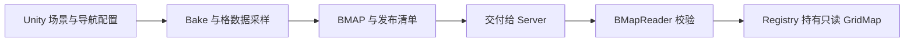
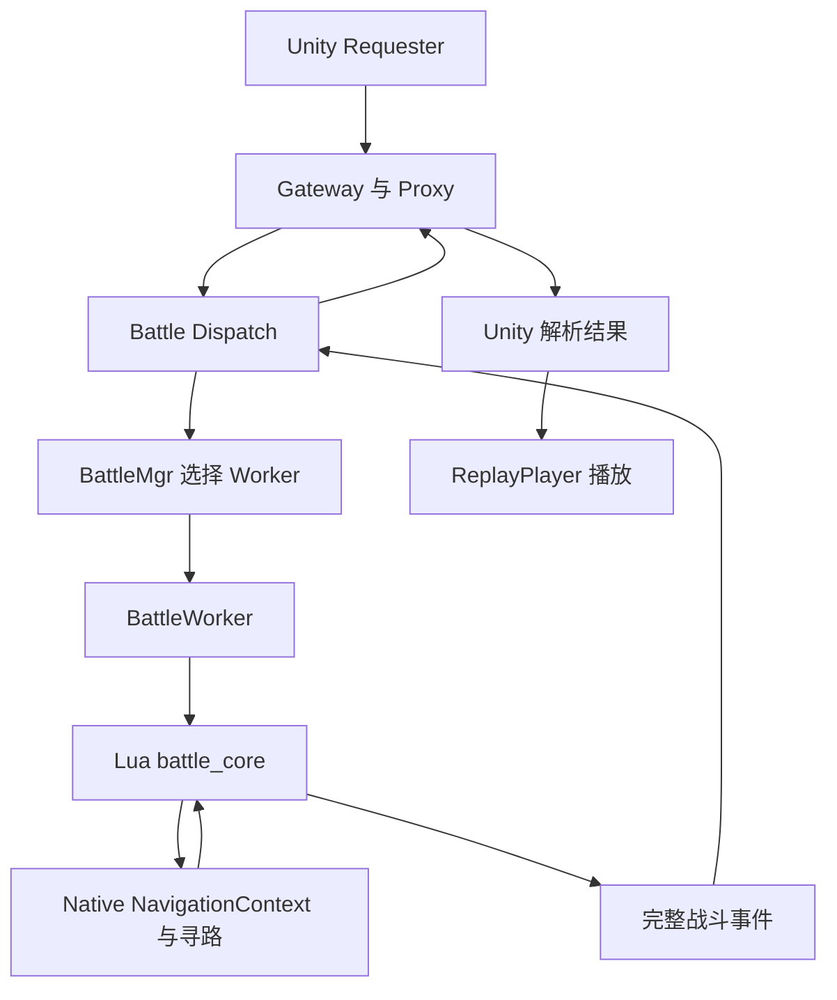

# PART 0：战斗 1001 回放——功能入口与完整链路

本节先建立代码阅读地图：从哪里触发，谁真正完成战斗，最终怎样判断回放开始。暂不展开 BMAP 格式、A* 或 Skynet 消息机制，后续章节再沿实际执行链逐段精读。

本文路径均相对于仓库根目录。Unity 源码与场景以 Windows 工作区为阅读来源；Server 源码以 WSL 工作区为阅读来源。本文按指定位置存放在 WSL 的 `docs/专题教程/回放/`。

## 1. 本节目标与阅读范围

读完应能说明：

- 地图生产与战斗请求为什么是两条不同的链。
- 客户端提交什么，服务端决定什么。
- Requester、Player、Gateway、Dispatch、Manager、Worker 各自负责哪一段。
- 地图为什么可以共享，而动态占位和查询状态必须独立。
- 从哪些断点和日志判断结果已进入播放器。

本节只读源码与场景配置，不需要重建场景、重新导出资产或启动服务。

## 2. 当前回放功能做什么

当前联网回放流程是：

> Unity 请求服务端运行场景 1001；服务端完成整场自动战斗，返回有序事件；Unity 按这些事件播放战斗过程。

需要区分两个时间：

| 时间 | 谁负责 | 用途 |
|---|---|---|
| 服务端逻辑时间 | Battle 模拟 | 判断移动、攻击冷却、伤害与结束时刻 |
| 客户端播放时间 | ReplayPlayer | 决定用户此刻在屏幕上看到哪一段事件与移动表现 |

服务端连续计算完整场战斗，不必按真实时间等待每个 Tick。客户端拿到结果后，再按逻辑时间播放。这使战斗规则可以脱离网络与 Unity 帧率单独测试，也适合批量模拟和重复验证。

当前客户端播放器创建胶囊单位、沿路径移动、输出攻击与 HP 日志，并销毁死亡单位。完整血条和攻击特效不属于这份播放器当前已实现的表现。

## 3. 功能入口在哪里

场景：

```text
unity/BattleNavigation/Assets/BattleNavigation/Scenes/Battle_1001.unity
```

场景已有 `BattleReplayRuntime` 对象，挂载两个组件：

| 组件 | 负责什么 | 后续调试用途 |
|---|---|---|
| BattleReplayRequester | 请求结果，转换后交给播放器 | 排查连接失败、业务拒绝与结果转换异常 |
| BattleReplayPlayer | 按事件改变显示对象 | 排查事件顺序、移动、死亡与结束表现 |

仓库场景保存的配置：

```text
host          = 127.0.0.1
port          = 19011
scenarioId    = 1001
replayPlayer  = 同对象上的播放器组件
replayJson    = 空
playbackSpeed = 1
```

这是文件中的配置，当前编辑器若有未保存修改，应以 Inspector 观察到的值进一步核对。

真正的联网触发点：

```text
unity/BattleNavigation/Assets/BattleNavigation/client/BattleReplayRequester.cs
BattleReplayRequester.Start()
```

进入 Play Mode 后，Unity 调用 Start，自动发起一次战斗请求。该方法先检查播放器引用与场景编号，再把网络工作交给后台 Task；主线程协程等待结果，成功后调用播放器。

为什么这样安排：阻塞网络等待不能卡住 Unity 主线程；后台线程也不能直接操作场景对象。网络完成后回到主线程，才可以安全地创建、移动和销毁 GameObject。

菜单“91 接入 Battle_1001 回放”位于：

```text
unity/BattleNavigation/Assets/BattleNavigation/Scripts/Editor/BattleReplaySceneSetup.cs
BattleReplaySceneSetup.AttachReplay()
```

它负责给已有场景安装组件、连接引用并保存场景，本身不请求战斗，也不生成 BMAP。当前场景已有接线，本节不需要执行该菜单。

Requester 与 Player 分开后，播放器既可以消费联网结果，也可以消费离线 JSON。遇到显示异常时，给 Player 一份已知正确的事件文档，就能隔离网络与播放问题。

## 4. 客户端发送了什么

阅读入口：

```text
unity/BattleNavigation/Assets/BattleNavigation/Scripts/Protocol/ServerBattleClient.cs
ServerBattleClient.Run(uint scenarioId)
```

核心业务过程：创建仅带 scenario_id 的 RunAutoBattleRequest，通过 Gateway 发送，再把响应 body 解析成 RunAutoBattleResponse。

客户端选择场景，不上传双方出生位置、HP 或伤害。服务端输入来自：

```text
server/lualib/battle/scenario_1001.lua
M.make_snapshot(scenario_id)
```

当前固定输入包括：

```text
battle_id = 70001，battle_version = 1
map_id = 1001，map_version = 1
seed = 123456
tick_ms = 50
max_logic_ms = 30000

单位 1001：阵营 1，HP = 100
单位 2001：阵营 2，HP = 100
```

这是可重复的教学场景；当前固定 battle_id 不代表生产系统已经实现动态战斗 ID 分配。

每次 make_snapshot 都创建全新的嵌套 table，避免两次模拟共享可变输入。服务端掌握正式输入，可以防止客户端替换 HP 或伤害，也方便相同输入重复模拟，核对事件是否一致。

提前区分三个编号：

| 字段 | 当前值 | 意义 |
|---|---:|---|
| scenario_id | 1001 | 哪套战斗初始配置 |
| map_id | 1001 | 哪张导航地图 |
| command | 1002 | 网络消息要求执行 RunAutoBattle |

场景与地图编号当前相同，但职责不同。多套场景可以使用同一地图。QueryCell 的 command 恰好为 1001，也不能与 map_id 或 scenario_id 混淆。

## 5. 第一条链：准备服务端地图



这条链回答：服务端怎样知道哪里能走。

Unity 的地面、障碍和导航配置先转成服务端能够读取的格数据。Server 加载 BMAP，不读取 Unity 场景，不操作 GameObject。

关键位置：

| 文件 | 当前解决的问题 |
|---|---|
| unity/BattleNavigation/Assets/BattleNavigation/Editor/BattleMapPipeline.cs | 编排场景校验、Bake、保存与导出 |
| unity/BattleNavigation/Assets/BattleNavigation/Editor/BattleMapExporter.cs | 将当前场景转换并导出导航资产 |
| unity/BattleNavigation/Assets/BattleNavigation/Editor/BMapWriter.cs | 写入 BMAP 字节格式 |
| server/native/grid_map/src/bmap_reader.cpp | 校验文件并创建地图 |
| server/native/grid_map/src/map_registry.cpp | 按地图 ID 与版本登记和查找 |
| server/native/grid_map/src/grid_map.cpp | 提供只读坐标转换和 Cell 查询 |

地图生产、交付、加载通常发生在战斗请求之前。点击 Play 不等于重新 Bake。两边只有消费一致的资产内容与版本，服务端计算出的路线才可能与客户端展示的环境对应。

## 6. 第二条链：请求、模拟与回放



两条链在 Worker 创建 NavigationContext 时接上：通过 map_id/map_version 找到已加载的地图，再为这场战斗准备独立的动态占位与寻路状态。

职责分工：

| 模块 | 当前工作 | 为什么需要 |
|---|---|---|
| Gateway / Proxy | 连接、协议处理、跨进程转发和回推 | 将连接处理与战斗业务隔离 |
| Battle Dispatch | 分发请求、创建场景输入、限制并发和响应大小 | 在业务入口拒绝无效或超限请求 |
| BattleMgr | 从固定 Worker 池选择执行者 | 管理执行资源，不混入结算规则 |
| BattleWorker | 创建 Context、调用模拟、关闭 Context | 明确一次模拟的资源生命周期 |
| battle_core | 推进逻辑时间、目标选择、移动、攻击和死亡 | 集中保存权威战斗规则 |
| Native 导航 | 通行、寻路、移动复验与占位维护 | 提供可测试的导航计算与数据能力 |

Server 文件：

```text
server/service/gateway/gateway_main.lua
server/service/gateway/gateway_proxy.lua
server/service/battle/battle_main.lua
server/service/battle/battle_dispatch.lua
server/service/battle/battle_mgr.lua
server/service/battle/battle_worker.lua
server/lualib/battle/battle_core.lua
server/native/lua_battle_nav/src/lua_battle_nav.cpp
server/native/grid_map/src/grid_pathfinder.cpp
```

battle_main 创建本地服务并显式注入 handle，等待依赖就绪后发布跨进程入口。Manager 等待 Worker 结果时可以 yield；battle_core 连续模拟阶段保持 no-yield，避免核心状态推进依赖外部等待。

不同战斗可以共享不可变地图，但不能共享正在变化的 occupancy、查询 scratch 或路径跟随 cursor。这是后续理解资源所有权与并发安全的基础。

### 当前网络源码与课程说明的差异

当前 WSL battle_dispatch.lua 使用 send_data，跨进程负载包括：

```text
gateway_epoch
connection_id
command_id
data
```

请求与结果通过 cluster.send 转发、回推。课程中部分描述使用 route token/Envelope 等术语，与当前 Server 接口存在差异。本节不据此宣称端到端兼容已经验证；网络章节将沿两端真实收发代码核对请求格式、身份关联与回包路径。

## 7. 结果如何进入播放器

Requester 收到响应后：

1. 检查 response.Result 是否为 OK。
2. ConvertResult 将协议事件复制成 ReplayDocument，保留原来的 seq 和 logic_ms 顺序。
3. 调用 BattleReplayPlayer.Play。
4. Play 检查事件顺序和时间，验证成功后清理上一场显示状态并开始播放。

Player.Update 根据表现时间消费事件；Apply 处理出生、移动、攻击日志、死亡和结束。播放器使用服务端给出的路径，不调用 NavMeshAgent 重新寻路，也不重新结算伤害。

seq 表示事件的先后顺序，logic_ms 表示发生时刻。同一逻辑时刻可以有多个事件，因此只有时间还不足以确定播放顺序。

## 8. 第一组断点与观察点

本节先认识位置，暂不要求启动全部进程。

| 断点位置 | 观察什么 | 能区分的问题 |
|---|---|---|
| BattleReplayRequester.Start | host、port、scenarioId、replayPlayer | 配置错误与组件缺失 |
| ServerBattleClient.Run | 请求参数、响应业务结果 | 网络失败与业务拒绝 |
| BattleReplayRequester.ConvertResult | 事件数量、字段转换 | 协议结果到播放数据的转换问题 |
| BattleReplayPlayer.Play | 第一条 seq、事件时间、结束时间 | 事件文档是否合法 |
| BattleReplayPlayer.Apply | 事件类型、单位编号与位置 | 某条事件为什么没有对应显示变化 |

正常联网结果被播放器接受后，Console 出现：

```text
BATTLE_GATEWAY_RESULT_LOADED events=...
```

这说明响应成功、转换完成且 Play 接受了文档，不证明后续每一帧的表现都正确。日志中的事件数量也不代表所有事件都有可见特效。

## 9. 本节检查点

脱离代码后，应能解释：

- 为什么进入 Play Mode 会自动请求一次战斗。
- 为什么接入回放的 Editor 菜单不执行战斗。
- 为什么客户端只提供 scenario_id，而正式 Snapshot 由 Server 构造。
- 为什么地图准备在先、请求模拟在后。
- 为什么 Worker 为每场模拟单独创建 NavigationContext。
- 为什么服务端模拟与客户端播放使用不同的时间驱动。

下一节：PART 1，Unity 场景中哪些内容参与生成 BMAP，以及 Bake 与 BMAP 导出分别解决什么问题。