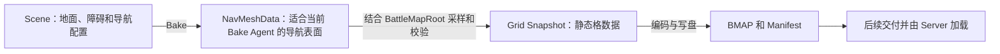

# PART 1：Unity 场景输入，以及 Bake 与 BMAP 导出的分工

目录入口：[章节目录](README_章节目录.md)；前置阅读：[PART 0](PART_00_功能入口与完整链路.md)。

本节从地图生产链的起点开始。先在 Battle_1001 场景中认出地面、障碍和导航配置，再说明 Bake 如何得到可走表面，以及 BMAP 导出为何还需要地图范围和网格参数。下一节才逐步进入采样、Clearance 和校验算法。

本文依据 Windows 工作区中已保存的 Scene、项目配置和 Unity 源码编写；服务端出生配置对照 WSL 源码。Inspector 若有未保存修改，数值可能与本文不同，应记录差异后继续核对。

## 1. 先明确这一节要解决的问题

Unity 能显示一堵墙，但 Server 运行时看不到这个 GameObject。Server 需要一份明确的数据，说明某个世界位置是否可走、地表高度是多少、属于哪类地形。

因此，这一段链路要完成三次转换：



读图要点：Scene 是编辑输入；NavMeshData 是 Bake 的产物；Grid Snapshot 是导出中的内存数据；BMAP 是 Server 最终读取的文件。四者有不同的内容和生命周期。进入 Unity Play Mode 不会自动重做这条资产链。

学完本节，应能说明：

- 哪些场景对象提供 Bake 几何，哪些提供导出参数，哪些参与校验或显示。
- 当前场景的坐标、地面高度、地图覆盖范围和 Cell 大小。
- NavMeshSurface 怎样选择 Bake 输入，Agent 设置怎样限制生成的表面。
- Bake 与 BMAP 导出的输入、产物和成功证据分别是什么。
- 改动墙、出生点或地图参数后，应重新执行哪一阶段。

## 2. 打开场景，先认清对象的职责

【只读】在 Unity Project 窗口中打开：

`unity/BattleNavigation/Assets/BattleNavigation/Scenes/Battle_1001.unity`

本节先观察已有场景。Hierarchy 显示对象的组织关系；选中对象后，Inspector 显示它的 Transform 和组件。Scene View 用于编辑观察；Game View 显示 Camera 拍到的画面。

已有场景的主要结构如下。分组名称有助于阅读，Bake 的实际收集规则由后面的 NavMeshSurface 决定。

```text
BattleMapRoot                         地图身份和网格范围
├─ Environment                       静态几何分组
│  ├─ Ground
│  │  └─ MainGround                   基础地面
│  ├─ StaticObstacles
│  │  ├─ NorthWall / SouthWall        南北边墙
│  │  ├─ WestWall / EastWall          东西边墙
│  │  ├─ CenterBlock                  中央阻挡
│  │  └─ WestPillar / EastPillar      柱体
│  └─ Landmarks
│     ├─ WestRamp / EastRamp          坡道
│     └─ WestPlateau / EastPlateau    台地
├─ SpawnPoints                       双方出生点标记
├─ Lighting                          灯光
├─ Authoring Camera                  观察相机
└─ Navigation                        NavMeshSurface

BattleReplayRuntime                  请求和播放组件
```

先选中 MainGround，再选 CenterBlock，查看 BoxCollider、Renderer 和 NavMeshModifier；随后查看 BattleMapRoot 与 Navigation。这样能先看到真实对象，再读对应代码。

| 场景内容 | 在地图生产中做什么 | 后面哪里使用 |
|---|---|---|
| 地面、坡道、台地的 Collider 与 Transform | 提供几何位置、形状和朝向 | Bake 形成可走表面，Exporter 从中采样高度 |
| 墙、柱、中央阻挡的 Collider 与 Modifier | 提供阻挡几何并指定 Not Walkable | Bake 影响可走范围，导出反映为阻挡或缺失表面的 Cell |
| Navigation 上的 NavMeshSurface | 指定收集范围、Layer、几何类型和 Agent | Pipeline 启动 Bake，Sampler 读取已加载的结果 |
| BattleMapRoot 组件 | 指定地图身份、世界原点、范围、Cell 大小 | Sampler、Validator 和 Writer |
| BattleSpawnPoint 与 Transform | 标记队伍、序号和位置 | Authoring Validator 与导出前出生点校验 |
| 材质、灯光、相机 | 帮助观察场景 | Editor 和客户端显示 |
| BattleReplayRuntime | 请求并播放战斗结果 | 后续运行链路 |

## 3. 坐标和 Transform：看到的对象如何成为几何输入

### 3.1 World、Local 和单位

GameObject 是场景对象，组件为它提供不同能力。Transform 保存位置、旋转和缩放。Local Position 相对于父对象；World Position 是换算父级变换后在整个场景中的位置。

本项目把 1 Unity Unit 约定为 1 米，并在导出边界转换为毫米。因此 0.5 米对应 500 毫米。Unity Unit 本身没有自动赋予物理单位，米制来自项目约定。

先用不含旋转和缩放的非负例子理解父子关系：

```text
世界 X 轴，单位：米；World 原点 = 0

0 ───────── 10 ──── 12 ─────────────→ +X
             P      C
             │      └─ Child World X = 12
             └─ Parent World X = 10

以 Parent 为局部原点：
Local 0 ───── Local 2 → +X
   P              C
```

读图要点：Child 的 Local X 为 2，World X 为 12。父对象有旋转或缩放时，不能简单相加；Inspector 的 Transform 通常显示局部值，源码中的 `transform.position` 读取世界位置。

这在地图生产中很实用：移动 Environment 可能同时移动它下面的地面、墙和坡道。只看某个子对象的 Local Position，可能漏掉整个地图已经发生的位移。

### 3.2 XZ 是地面，Y 是高度

```text
地面俯视：单位米；示意原点 O=(0,0,0)

       +Z
        ↑
        │       地面中的一个点 P=(2,0,3)
      3 │       ●
        │
        O───────2────────→ +X

同一点的侧视：
       +Y（高度）
        ↑
      0 O────────────────→ 地面方向
          地面表面高度 Y=0
```

读图要点：地面位置主要由 X/Z 描述，Y 表示高度。坡道和台地让 Y 随位置变化；BMAP 中的格高度来自后续采样得到的表面。

在 Battle_1001 中，World 原点位于地图中央附近。向左是负 X，向俯视图下方是负 Z；负坐标是合法世界位置。

MainGround 是中心位于 `(0,-0.25,0)`、尺寸为 `(30,0.5,20)` 的 Cube。它从 Y=-0.5 延伸到 Y=0，所以可观察的上表面在 Y=0。Cube 的 Transform Position 是中心，不能直接当成地面高度。

几何经过 Transform 后影响 Bake。在当前 Physics Colliders 模式下，BoxCollider 的形状也会随对象变换改变。Renderer 的外观若与 Collider 不一致，画面里看到的轮廓和 Bake 使用的轮廓就可能不同。

## 4. BattleMapRoot：定义 Server 将使用的地图范围

BattleMapRoot 解决“导出哪张地图、覆盖多大范围、分成多细的格子”。这些配置随 Scene 保存，导出工具读取它们。

【只读】入口：

`unity/BattleNavigation/Assets/BattleNavigation/Runtime/BattleMapRoot.cs`

先读字段和 `Width`、`Height`、`CellSizeMm`、`OriginXMm`、`OriginZMm`，再看 `GridToWorldCenter` 和 `ValidateOrThrow`。辅助舍入与溢出检查可先理解用途，逐行细节留给采样章节。

当前 Scene 保存的配置：

| 字段 | 当前值 | 含义 |
|---|---:|---|
| mapId | 1001 | 导出地图身份 |
| mapVersion | 1 | 当前资产业务版本 |
| originMeters | (-15,-10) | 世界 XZ 平面上的左下角 |
| sizeXMeters | 30 | 沿世界 X 覆盖 30 米 |
| sizeZMeters | 20 | 沿世界 Z 覆盖 20 米 |
| cellSizeMeters | 0.5 | 每格边长 0.5 米 |
| multiLayerSeparationMeters | 0.25 | 后续合并近似同层高度候选的阈值 |

`originMeters` 使用 Vector2，其中 x 分量对应世界 X，y 分量对应世界 Z。这里的第二个分量不是世界高度 Y。

范围和世界原点的关系如下：

```text
Battle_1001 俯视；单位米；↑ +Z，→ +X

Z=+10  ┌──────────────────────────────────┐
       │                                  │
       │             地图范围             │
Z=  0  │                 O=(0,0)          │
       │                                  │
Z=-10  G──────────────────────────────────┘
       X=-15            X=0             X=+15

G：Grid 左下角世界 XZ=(-15,-10)
O：世界坐标原点 XZ=(0,0)
X 覆盖 30 米，Z 覆盖 20 米；每格边长 0.5 米
```

读图要点：世界原点 O 与 Grid 原点 G 是两个位置。Grid 原点决定格子从哪里铺起，世界原点决定所有对象的世界坐标。当前格覆盖 X 的 `[-15,15)`、Z 的 `[-10,10)`；最右、最上边界之后已经没有下一格。

30 米按 0.5 米划分得到 60 列，20 米得到 40 行，总计 2400 格。后续导出和查询都会使用这一空间合同。

只看左下角第一格：

```text
第一格俯视；方向同上，单位米

Z=-9.5   ┌─────────┐
         │    ●    │  ●中心=(-14.75,-9.75)
Z=-10    G─────────┘
         X=-15   X=-14.5

格边长：0.5 米；中心距两条起始边各 0.25 米
```

读图要点：Sampler 要在每格中心寻找导航表面。`GridToWorldCenter` 返回的 Y=0 只是提供 XZ 定位；最终地表高度仍由采样确定。

BattleMapRoot 的这些字段使用世界坐标含义。仅移动 BattleMapRoot 的 Transform 不会自动改写 `originMeters`；它下面的几何却会随父级移动。因此移动根对象后，要重新核对几何、Surface 范围与导出范围是否仍然对齐。

地图长度必须整除 Cell 大小。工具会拒绝半格截断，因为静默截断会让 Unity 与 Server 对边界产生不同理解。`mapVersion` 也不会自动递增：影响导航语义的修改需要显式管理版本。

## 5. NavMeshSurface：Bake 收集什么

NavMeshSurface 把散落的几何和构建配置汇总成一份导航表面。选择 Navigation，在 Inspector 查看该组件。

当前 Scene 的关键配置已经按序列化字段与 AI Navigation 1.1.7 源码核对：

| 配置 | 当前值 | 对输入的影响 |
|---|---|---|
| Agent Type | Humanoid，ID=0 | 选择 Bake 使用的 Agent 设置 |
| Collect Objects | Volume | 按空间范围收集符合条件的对象 |
| Center | (0,4,0) | 收集盒的中心 |
| Size | (30,12,20) | 收集盒覆盖的长度 |
| Include Layers | Default | 当前 Layer Mask 只包含 Layer 0 |
| Use Geometry | Physics Colliders | 使用 Collider 几何 |
| Default Area | Walkable，编号 0 | 普通构建源使用的默认 Area |
| Ignore NavMeshAgent / NavMeshObstacle | 开启 | 收集时过滤对应组件的对象 |

### 5.1 Volume 和地图范围是两份配置

Bounds 可理解为一个空间盒，用中心和尺寸描述。它帮助工具决定在哪个区域收集几何。

当前 Navigation 与地图根没有位移或旋转，所以收集盒中心对应世界 `(0,4,0)`，范围如下：

```text
Bake 收集盒侧视；单位米；这里只画 Y 与 X

Y=10   ┌──────────────────────────────────┐
       │                                  │
Y= 4   │              中心                │
       │                                  │
Y= 0   │──────── 地面上表面 ──────────────│
Y=-2   └──────────────────────────────────┘
       X=-15                            X=+15 → +X
       ↑ +Y

Z 方向范围同样为 [-10,+10]；盒高 12 米
```

读图要点：收集盒具有 Y 范围，能够覆盖地面厚度、障碍和台地；BattleMapRoot 指定的是铺网格的 XZ 范围。两份配置当前在 XZ 上对齐，但工具没有把它们自动绑定成同一字段。

扩大地图导出范围后，若 Bake 范围没有覆盖新增区域，新增格子可能找不到导航表面。扩大 Bake 范围也不会自动扩大 BMAP 网格。后续排查地图边缘异常时，要同时看这两处。

当前 Volume 收集模式按范围选择几何，不要求对象必须挂在 Navigation 下面。因此 Navigation 没有子对象，也能收集同一场景中符合范围和 Layer 条件的地面与墙。

### 5.2 Layer、几何与 Modifier 各解决什么问题

Layer 是对象分类，Include Layers 是收集过滤条件。它回答“哪些分类的对象可以参与这次 Bake”。当前地面和障碍在 Default Layer，Surface 的 Mask 包含它们。标签、目录名或分组名不直接决定可走性。

Physics Colliders 则回答“使用对象的哪一种几何”。MainGround 等 Cube 同时有显示 Mesh 和 BoxCollider，当前 Bake 使用后者。给物体换颜色不会改变碰撞几何；改变 Collider 的尺寸会影响 Bake，即使视觉模型没有变化。

NavMeshModifier 回答“这份构建源应该怎样参与导航”。当前墙、柱、CenterBlock 的配置是 Override Area 开启、Area=Not Walkable，并且保留几何进入构建。这样高处障碍顶面也不会被当作可走平台。

Not Walkable 与 Ignore From Build 的作用不同：前者让这份几何按不可走语义参与构建；后者将该源排除。把墙的几何排除后，可能失去阻挡证据，下面的地面反而形成可走面。

Layer 与 Area 也要区分：Layer 用于过滤对象，Area 用于描述导航表面的类别。本项目采样时把 Unity Area 映射成稳定的 BattleArea 编码；当前普通 Walkable 对应 Normal。Unity Area Cost 不会作为 Server A* 的成本表自动导出，Server 的成本规则在后续 AgentProfile 章节核对。

## 6. Agent 设置：可走表面是按什么体型算出来的

Humanoid 的配置保存在：

`unity/BattleNavigation/ProjectSettings/NavMeshAreas.asset`

在 Navigation 的 Agents 设置中观察当前类型；不同 Editor 界面布局可能略有差别，可通过 Surface 的 Agent Type 对应到该配置。

| 参数 | 当前值 | 直观作用 |
|---|---:|---|
| Radius | 0.5 米 | 给单位中心与障碍之间预留空间 |
| Height | 2 米 | 判断上方空间是否足够 |
| Max Slope | 45 度 | 限制生成的可走坡面 |
| Step Height / Climb | 0.75 米 | 限制允许连接的高差 |

以障碍旁的一段地面为例：

```text
俯视局部示意；↑ +Z，→ +X；距离单位米

障碍边界 │<── 约 0.5 米 ──>│ 可走中心位置所在区域
████████ │    预留区        │ ● ● ●
████████ │                 │ ● ● ●

这是 Radius 作用的概念图；实际边界受体素、形状和构建精度影响
```

读图要点：NavMesh 描述的是适合该 Bake Agent 移动的中心位置集合。看起来有一块地面，不等于它一定生成了导航表面。

Bake 的体素精度与 Server Grid 的 Cell 大小也是两项配置。当前 Surface 未开启 Voxel Size Override，保存的体素大小约为 0.1667 米；BattleMapRoot 的格边长为 0.5 米。前者影响 Bake 对几何的表达，后者决定导出网格的分辨率。

必须记住一个后续会用到的限制：WSL 的 `scenario_1001.lua` 中 AgentProfile 半径是 200 毫米，Bake Agent 半径是 500 毫米。Server 查询仍建立在已 Bake 后采样出来的地图上；更小的 Server 半径不能恢复 Bake 阶段已经裁掉的通道。Clearance 和 Server 通行判断怎样叠加影响路线，将在 PART 7—8 按实际代码展开。

## 7. 出生点与显示对象：哪些信息没有进入 BMAP

BattleSpawnPoint 是位置标记，带有队伍和同队序号，当前没有 Collider。它在 Scene 中画出的球和竖线是 Gizmo，方便观察；这些线条不提供 Bake 几何。

【只读】入口：

`unity/BattleNavigation/Assets/BattleNavigation/Runtime/BattleSpawnPoint.cs`

当前有双方各两个出生点。Bake 前的 Authoring Validator 检查双方标记存在；导出前的 Snapshot Validator 检查身份唯一、位置在范围内，并且对应格子可走。

出生点参与校验，但当前 BMAP 不保存出生点列表。Server 的正式出生位置来自 `server/lualib/battle/scenario_1001.lua`。Unity 中的 Team1_Spawn_01 与当前服务端单位 1001 都使用 X=-11、Z=4 的位置，但没有自动同步机制。

所以，把 Unity 出生点拖到另一个位置并导出 BMAP，不会自动移动 Server 的战斗单位。资产与战斗配置的交接，后续分别在 PART 3 和 PART 10 阅读。

灯光、材质和 Camera 帮助看清场景，不提供当前 Collider Bake 所需的几何。BattleReplayRuntime 上的请求和播放组件属于运行链路；这一步生成静态地图时不会把 HP、伤害、网络连接或播放状态写进 BMAP。

## 8. Bake 和导出：分别产生什么结果

### 8.1 Bake 解决几何可走性

Bake 输入是收集到的几何、Modifier 和 Agent 设置；输出是 NavMeshData。它把场景几何转成 Unity 可以查询的导航表面。

看见 Scene 中蓝色导航覆盖区域，可以帮助检查墙附近是否留出空间、坡道是否连接。但已经存在 NavMeshData 引用，只表示场景引用了一份结果，不能证明它是在最后一次修改墙以后生成的。

### 8.2 导出解决 Server 所需的静态地图数据

BMAP Export 使用当前已加载的 NavMesh 和 BattleMapRoot，先得到格数据，再写入 BMAP 与 Manifest。它不在导出入口里自动重新 Bake。

因此，修改几何后直接点击导出，可能把旧 NavMesh 再次采样成一份新文件。新文件的时间戳不能证明其几何来源是最新的。这就是推荐流水线按顺序执行的原因。

| 阶段 | 输入 | 产物 | 后续使用者 |
|---|---|---|---|
| Authoring 校验 | 地图配置、Collider、出生标记 | 通过日志或错误 | Bake 流水线 |
| Bake | 几何与导航构建设置 | 持久化 NavMeshData，保存 Scene 引用 | Sampler |
| 采样与校验 | NavMesh、地图配置、出生标记 | 合法 Grid Snapshot | Writer |
| BMAP 写盘 | Snapshot | `shared/navigation/battle_1001/battle_1001.bmap` | 后续 Server Reader |
| Manifest | Snapshot 与正式 BMAP 校验信息 | JSON 摘要 | 人工审查与工具核对 |

当前 Manifest 是审查摘要，Server Runtime 不读取它。BMAP 则包含地图身份、空间参数和静态 Cell 数据；文件布局及交付规则将在 PART 3 精读。

## 9. 沿菜单进入代码：掌握阶段顺序

【只读】本节读入口和关键分支；不要求重建场景。

| 菜单：Tools / 战斗导航 | 对应入口 | 做什么 |
|---|---|---|
| 00 一键执行：校验 → 烘焙 → 导出（推荐） | BattleMapPipeline.BuildAll | 串联完整资产生产阶段 |
| 01 校验当前战斗场景 | BattleMapAuthoringValidator.Validate | 快速检查地图参数、Collider、双方出生点 |
| 02 烘焙当前场景 NavMesh | BattleMapPipeline.BakeOnly | 校验后 Bake，保存资产和 Scene |
| 03 导出当前场景 BMAP | BattleMapExporter.Export | 使用已有 NavMesh 采样、校验并写盘 |
| 调试 / 11 切换 Grid Overlay | BattleMapOverlay.Toggle | 展示最近一次成功导出的 Snapshot |

推荐按下面的顺序读源码：

1. `unity/BattleNavigation/Assets/BattleNavigation/Editor/BattleMapAuthoringValidator.cs` 的 `Validate`：看基础输入检查。它只要求场景中有 Collider，不能据此推断收集范围和 Layer 一定正确。
2. `unity/BattleNavigation/Assets/BattleNavigation/Editor/BattleMapPipeline.cs` 的 `BuildAll`、`BakeOnly`、`StartBake`：看两个菜单怎样共用流程，以及是否需要继续导出。
3. 同文件的 `CompleteBakeWhenReady`：看异步 Bake 完成后如何保存与进入导出。
4. `unity/BattleNavigation/Assets/BattleNavigation/Editor/BattleMapExporter.cs` 的 `Export`：先认识 Sample → Clearance → Validate → Write → Manifest 顺序；内部算法由 PART 2—3 逐步讲解。

`StartBake` 检查播放状态、Scene 是否已保存、是否已有任务，以及当前场景是否有唯一 Surface。确认前置条件后，由 AI Navigation 的 Editor Asset Manager 开始异步 Bake。

异步的含义是启动后先返回，让 Editor 继续响应。Pipeline 订阅 `EditorApplication.update`，周期性调用 `CompleteBakeWhenReady`，查询 Bake 是否结束；结束后检查 NavMeshData、保存资产和 Scene，再按请求决定是否导出。它避免在主线程用同步循环一直等待。

对应阶段日志为：

```text
BATTLE_MAP_AUTHORING_OK
BATTLE_MAP_BAKE_STARTED
BATTLE_MAP_BAKE_OK
MAP_VALIDATE_OK
BMAP_EXPORT_OK
BATTLE_MAP_PIPELINE_OK
```

这些是不同代码位置的观察点，运行时还可能穿插采样和其他日志。单独 Bake 不会出现导出完成日志；单独 Export 不会出现本次 Bake 开始日志。

`BATTLE_MAP_PIPELINE_OK` 说明该次调用完成了流水线。它不会注册运行中的 Server 地图，也没有证明 Server 已读取同一份资产。这个交接边界留到 PART 3。

`Battle1001SceneBuilder.cs` 的“90 重建示例场景”用于初始场景构造，会覆盖现有场景。它不能代表当前场景的全部配置：例如已有 Scene 中的 Navigation 配置，要直接读 Scene 和 Inspector 核对。本节用 Builder 理解几何与 Modifier 的来源即可。

## 10. 不改场景也能完成的观察与调试

先完成以下【只读】观察：

1. 在 Hierarchy 选 BattleMapRoot，核对 1001 / 1、原点、范围和 Cell 大小。
2. 选 Navigation，核对 Volume、Default Layer、Physics Colliders、Agent Type。
3. 选 MainGround，区分 Transform 中心与 Collider 上表面高度。
4. 选 CenterBlock，查看 Collider 及 Not Walkable Modifier。
5. 选出生点，区分 Scene Gizmo、校验标记与 Server 初始位置。
6. 在 Surface Inspector 查看 NavMeshData 引用和导航显示；具体资产名以当前引用为准，不凭文件名中的后缀猜测哪份最新。

若下一步实际执行菜单，先保存场景，并明确这是会更新资产的操作。建议先用 01 隔离基础配置问题，再用 02 观察 Bake，最后用 03 观察导出；熟悉各阶段后再使用 00。

适合本节的断点：

| 位置 | 观察字段 | 可回答的问题 |
|---|---|---|
| BattleMapRoot.ValidateOrThrow | Width、Height、CellSizeMm | 导出范围是否合法 |
| BattleMapPipeline.StartBake | surfaces、pendingSurface、shouldExport | Bake 是否启动，用了哪个 Surface |
| BattleMapPipeline.CompleteBakeWhenReady | navMeshData、shouldExport | 是否已经完成、是否还要导出 |
| BattleMapExporter.Export | root、snapshot、bmapPath | 使用什么配置，结果写到哪里 |

常见现象和检查顺序：

| 现象 | 先检查什么 | 原因 |
|---|---|---|
| Bake 没有可见导航面 | Collider、收集范围、Layer、Agent 设置 | 这些决定构建源和可走条件 |
| 一块视觉地面没有进入结果 | Collider 与显示 Mesh 是否一致 | 当前收集的是 Collider 几何 |
| 改墙后导出的结果像旧地图 | 是否在修改后重新 Bake | Export 消费已有 NavMesh |
| 出生点校验失败 | Bounds、采样格和可走区域 | 标记存在不等于位置合法 |
| NavMesh 看起来正常，Overlay 却没有变化 | 是否重新成功导出 | Overlay 展示的是缓存 Snapshot |
| 一键流程未进入导出 | 第一条阶段错误 | 前置检查或 Bake / 保存失败会阻止继续 |

本节文档进行了 Scene、项目配置和源码核对；编写过程中未重新 Bake、导出、修改场景或运行战斗。上表是后续操作的观察方法，不能当作本次运行已经通过的证据。

## 11. 本节检查点与下一节

不看源码时，尝试回答：

- 为什么地面的 Renderer 和 Collider 需要分别观察？
- 当前 Navigation 为何没有子对象，也能收集地面与墙？
- Bake Volume 与 BattleMapRoot 范围各由谁使用？
- 第一格中心为什么是世界 XZ=(-14.75,-9.75)？
- 为什么 Y=-0.25 的地面中心对应 Y=0 的上表面？
- Bake 半径 0.5 米与 Server 半径 200 毫米为何不能直接互相替换？
- 移动 Unity 出生点后，Server 初始位置是否自动变化？
- 改动一堵墙后，从保存场景到交付 Server 还需要经过哪些阶段？

下一节按目录进入 **PART 2：从 NavMesh 采样到可验证的网格快照**。从 `BattleMapExporter.Export` 调用 `BattleMapSampler.Sample` 的位置继续，追踪第一批 Cell 如何得到高度、可走标记和 Area，再解释 Clearance 与校验。
