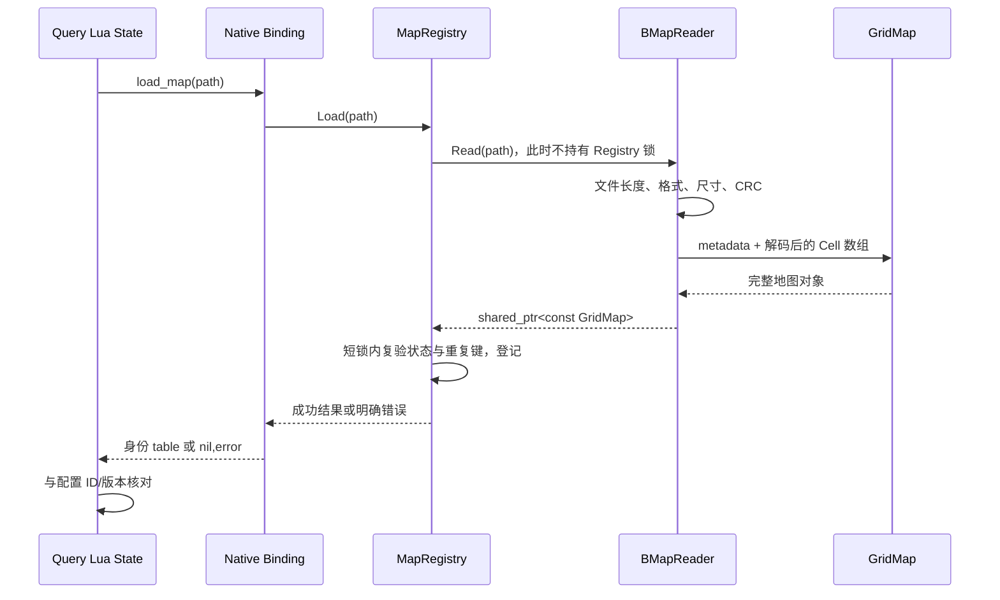

# PART 5：BMAP 如何进入 Native 地图注册表

本节接着 PART 4 的 `query_logic.start(config)` 往下读：磁盘上的 `battle_1001.bmap` 怎样变成 C++ 内存中的地图，怎样登记供同进程的 Worker 使用，以及一次世界坐标查询怎样读到正确的 Cell。

本节只使用当前新路径。Navigation 源码位于 FlyWow 的 `navigation/`；课程 Server 保留启动、配置和业务适配代码。Lua 局部变量仍叫 `battle_nav`，但它实际执行的是 `require "flywow_navigation"`。

这里不展开 metatable、userdata 和完整 Lua 栈注册过程；它们在 PART 6。Context 的动态状态在 PART 7，A* 与 smoothing 在 PART 8。读到这些入口时，只确认它们怎样取得本节已经加载好的静态地图。

## 1. 本节先解决一个具体问题

PART 4 中，Query Service 的启动包含：

```lua
query_logic.start(config)
```

启动成功之后，后面的 Worker 可以按 `map_id=1001、map_version=1` 创建导航 Context。

这中间必须有一个明确的过程：

1. 读到正确的文件。
2. 确认文件可以按 BMAP V1 解释，长度和内容没有损坏。
3. 把磁盘字节解码成可查询的地图对象。
4. 按地图 ID 和版本登记这个对象。
5. 让调用方拿到地图时，它的生命周期仍然有保证。

否则，端口虽然启动了，第一场 Battle 才发现地图不存在、版本不对或指针已经失效，错误会落在离根因很远的位置。

本节结束应能回答：**Query 加载的是谁的地图？Worker 为什么不用重新读文件？一格的数据怎样从文件位置对应到世界位置？**

## 2. 先把源码位置与阅读重点接好

路径约定：`server/...` 相对于课程仓库；`navigation/...` 相对于 FlyWow 根目录。开发时 FlyWow 根由 `FLYWOW_ROOT` 指定；正式交付由宿主固定框架提交。本机开发源是 WSL 的 `~/workspace/skynet-battle-navigation-commercial-learning/server/third_party/skynet-flywow`。

以下文件全部为**只读阅读**，本节不要求替换生产源码。

| 当前文件 | 它解决的问题 | 本节精读位置 | 可以先略读 |
| --- | --- | --- | --- |
| `server/config/battle.lua` | 明确本进程应该加载哪张地图 | `map.id/version/bmap` | Cluster 配置 |
| `server/service/battle/navigation_query.lua` | 启动 Query 并在地图加载后安装消息处理 | `query_logic.start(config)`、READY 输出顺序 | 调试器接线 |
| `server/lualib/battle/navigation/query_logic.lua` | 把配置要求和 Native 实际资产身份核对起来 | `M.start`、`M.query` | 协议错误表的全部枚举 |
| FlyWow `navigation/lualib/flywow_navigation.lua` | 提供 Lua 的公开入口和类型说明 | 最后的 Native `require`、地图身份与位置类型 | 本课尚未使用的 Path 类型 |
| FlyWow `navigation/native/lua/src/lua_navigation.cpp` | 从 Lua 进入实际 Native 操作 | `l_load_map`、`l_query_cell`、`l_new_context` 中的 `Find` | metatable 注册和动态导航方法 |
| FlyWow `navigation/native/grid_map/include/bmap_format.h` | 规定文件常量和内存数据字段 | Header/Cell 长度、Metadata、NavCell、WorldPosition | 无 |
| FlyWow `navigation/native/grid_map/src/bmap_reader.cpp` | 验证文件并构造地图 | `BMapReader::Read` 按顺序完整阅读 | CRC 每一轮 bit 运算可先略读 |
| FlyWow `navigation/native/grid_map/src/grid_map.cpp` | 管理内存地图与只读坐标查询 | 构造、`WorldToGrid`、`FloorDiv`、`IndexOf`、`QueryWorld` | 动态进入固定配置的查询方法 |
| FlyWow `navigation/native/grid_map/src/map_registry.cpp` | 管理进程内地图目录与共享生命周期 | `Instance`、`Load`、`Find`、`Freeze` | 无 |

阅读顺序由调用链决定，先不用逐个通读所有头文件。

## 3. 从配置进入实际加载：这里有两种“正确”

### 3.1 配置要求加载什么

只读 `server/config/battle.lua` 中的地图段：

```lua
map =
{
    id      = 1001,
    version = 1,
    bmap    = "../shared/navigation/battle_1001/battle_1001.bmap",
},
```

这些值分别回答：加载哪个文件、业务预期它的身份是什么。`bmap` 是路径；`id/version` 是业务要求，两者不能互相代替。

当前启动脚本在 `server/` 工作目录运行，所以这个相对路径落到课程仓库的 `shared/navigation/battle_1001/`。Native 的 `ifstream` 按 OS 当前工作目录解析相对路径，并不会去寻找 Unity 工程，也不会根据 Lua 文件的位置重新定位。

### 3.2 `M.start` 实际做的三次检查

只读 `server/lualib/battle/navigation/query_logic.lua`，关键节选：

```lua
local battle_nav = require "flywow_navigation"

-- M.start 内部：config 归当前 Query Service 持有。
config = assert(options)
local loaded, err = battle_nav.load_map(config.map.bmap)
assert(loaded, err and (err.code .. ": " .. err.message) or "load_map failed")
assert(loaded.map_id == config.map.id, "BMAP map_id does not match config")
assert(loaded.map_version == config.map.version,
       "BMAP map_version does not match config")
```

按执行顺序拆开：

1. `load_map` 检查文件、构造并注册地图，成功返回实际 Header 中的身份。
2. 第一个 `assert` 检查加载是否成功；失败时把 Native 的稳定错误码与诊断带到启动异常中。
3. 后两个 `assert` 检查“这份合法文件是否也是当前业务要求的文件”。

例如，路径写着 `battle_1001.bmap`，里面却是一份结构合法的 `map_id=2001` 文件。Reader 无法仅凭文件名判断业务意图，它可以读取成功；Query 的身份检查仍会拒绝启动完成。

再例如，文件中的 `map_version=2`，配置要求版本 1。格式版本仍然可能是 BMAP V1，但这张业务地图的内容版本已经不匹配。

**结构合法**与**业务身份正确**是连续的两道检查，分别由 Native 文件读取层和宿主启动适配层负责。

当前身份比较发生在 Native 注册之后。身份不符时已经注册的对象不会被这几个 `assert` 自动撤回；启动流程不能继续发布 READY，启动工具随后按失败流程处理进程。这里不要误认为“所有启动校验都在注册前完成”。

### 3.3 本调用属于什么执行边界

`M.start` 是 Query Service 的普通 Lua 函数调用；`load_map` 是同一 Lua State 进入 C++ 的同步调用。

它执行文件 I/O、CRC、内存分配及 Registry 短锁，**没有通过 `skynet.call` 向另一个 Service 请求读文件，也没有 Skynet yield 点**。调用期间当前执行线程在做这些工作，因此地图加载放在启动阶段。

## 4. 顺序图：先构造完整地图，再登记



读图要点：Reader 不负责登记，Registry 不负责逐字段解码。只有 Reader 已经产出完整对象后，Registry 才把它放进目录。文件缓冲、Cell 数组、地图对象和注册表不是同一层资源。

## 5. Binding 这一层：传进去的是路径，返回的不是地图指针

只读 FlyWow `navigation/native/lua/src/lua_navigation.cpp` 的 `l_load_map`。先抓住两行：

```cpp
const char *path = luaL_checkstring(L, 1);
const auto loaded = maps->Load(path);
```

`luaL_checkstring(L,1)` 取本次 Lua 调用的第一个参数，并检查它是否能作为字符串使用。这里拿到的是 Lua 管理的字符串内容；C++ 在本次同步调用期间借用它，没有把这根字符串指针保存进 Registry。

`maps` 指向当前进程的 `MapRegistry`。模块注册时绑定这个依赖，具体 closure/upvalue 如何工作留到 PART 6。

失败分支是：

```cpp
if (!loaded.ok())
{
    push_error(L, flywow_navigation::NavErrorName(loaded.error), loaded.detail);
    return 2;
}
```

这里的 `2` 是交给 Lua 的结果数量。`push_error` 准备的是：

```text
nil, { code = "稳定错误名", message = "具体诊断" }
```

因此 Lua 可以写 `local loaded, err = ...`。C++ 的 `detail` 在这条边界上转换为 Lua 的 `message` 字段。

成功分支从地图元数据取得 ID/版本，创建 Lua table，并返回一个结果：

```lua
-- 成功返回值的形状；不是完整 Cell 数组，也不是 Native 指针。
{
    map_id      = 1001,
    map_version = 1,
}
```

所以 Query 保存的 Lua 配置、这个身份 table、Registry 中的 C++ 地图分别是三个对象。后续 Worker 不会通过这个 table 获得 Cell；它按 ID/版本再次查 Registry。

## 6. Reader 第一步：先确认文件长度，再分配缓冲

入口是 FlyWow `navigation/native/grid_map/src/bmap_reader.cpp`：

```cpp
NavResult<std::shared_ptr<const GridMap>> BMapReader::Read(const std::string &path)
```

返回值表达的是“完整地图对象或者错误”，不是只返回读取到的裸字节。

### 6.1 为什么使用 `binary | ate`

```cpp
std::ifstream stream(path, std::ios::binary | std::ios::ate);
```

`binary` 让 BMAP 按原始字节读取；文件里的长度和 CRC 都以原始字节为依据。`ate` 让打开后的位置先到文件尾，接着 `tellg()` 获得文件长度。

这个顺序有实际用途：在分配一整份文件缓冲前，先知道它是否连一个完整 Header 都放不下，或者已经超过资源上限。

当前检查顺序：

1. 打不开文件：`IO_ERROR`。
2. `tellg` 失败：`IO_ERROR`。
3. 文件小于 64 bytes：`BMAP_TRUNCATED`。
4. 文件超过 128 MiB 或超过本平台可寻址大小：`BMAP_SIZE_OVERFLOW`。
5. 通过后才创建 `std::vector<std::uint8_t> file`。

128 MiB 是当前单文件保护上限，在 `bmap_format.h` 的 `kBMapMaxFileSize` 中定义。它限制这次文件缓冲；不等于进程总地图、所有 Context 或实际内存都限制为 128 MiB。

### 6.2 为什么取完长度还要 `seekg(0)`

```cpp
stream.seekg(0, std::ios::beg);
std::vector<std::uint8_t> file(static_cast<std::size_t>(file_size));
stream.read(reinterpret_cast<char *>(file.data()),
            static_cast<std::streamsize>(file.size()));
```

刚才读取位置在文件尾。现在必须回到开头，否则第一次 `read` 就从尾部开始，无法取得完整内容。

这里一次读完文件，随后所有 Header 和 Cell 解码都访问内存，不会查询一个 Cell 就再访问一次磁盘。

`reinterpret_cast<char*>` 仅把 byte 缓冲传给 `ifstream::read` 的接口；它没有把文件强行当成某个 Header struct。真正字段解析仍在后面逐字节完成。

读取后同时检查 stream 状态和 `gcount()`。如果实际取得的字节少于之前测量的长度，返回 `BMAP_TRUNCATED`，不带着半份缓冲继续解析。

离线完整目录发布减少“文件正在被改写”的机会；Reader 的完整读检查负责拒绝它观察到的短读。Runtime 不应消费仍在写入的候选文件。

## 7. Reader 第二步：按 BMAP V1 的固定布局解释 Header

### 7.1 先确认布局，再读业务字段

当前 Reader 已确认文件至少有 64 bytes，随后依次检查：

```text
0..3：是否是 B M A P
4..5：format_version 是否等于 1
6..7：header_size 是否等于 64
```

这解决“后面这些 offset 应按哪套布局理解”的问题。比如另一格式把第 16 byte 定义为别的字段，直接当 width 读取就会把后续尺寸计算全部带偏。

这里的 V1 Header 长度是强制检查的 64 bytes；当前 Reader 不会因为文件声明 `header_size=80` 就自动兼容扩展 Header。

### 7.2 当前文件的 Header 字段位置

| 起始 offset，byte | 字段 | 长度，byte | Battle_1001 实际值 |
| --- | --- | --- | --- |
| 0 | magic | 4 | BMAP |
| 4 | format_version | 2 | 1 |
| 6 | header_size | 2 | 64 |
| 8 | map_id | 4 | 1001 |
| 12 | map_version | 4 | 1 |
| 16 | width | 4 | 60 格 |
| 20 | height | 4 | 40 格 |
| 24 | cell_size_mm | 4 | 500 mm |
| 28 | origin_x_mm | 4 | -15000 mm |
| 32 | origin_z_mm | 4 | -10000 mm |
| 36 | flags | 4 | 当前资产为 0 |
| 40 | cell_stride | 2 | 8 |
| 42 | reserved0 | 2 | 0 |
| 44 | payload_size | 4 | 19200 bytes |
| 48 | payload_crc32 | 4 | FE9E6F90，十六进制 |
| 52 | header_crc32 | 4 | 373641F4，十六进制 |
| 56 | 其余保留字节 | 8 | 当前资产为 0 |

每个 offset 来自前面字段占用的字节累计。例如开头 4-byte magic，加上两个 2-byte 字段，共占 8 bytes，所以 map_id 从 offset 8 开始。它不是 `BMapMetadata` 成员在 C++ 内存中的 offset。

代码节选：

```cpp
metadata.map_id       = ReadU32Le(file.data() + 8);
metadata.map_version  = ReadU32Le(file.data() + 12);
metadata.width        = ReadU32Le(file.data() + 16);
metadata.height       = ReadU32Le(file.data() + 20);
metadata.cell_size_mm = ReadU32Le(file.data() + 24);
metadata.origin_x_mm  = ReadI32Le(file.data() + 28);
metadata.origin_z_mm  = ReadI32Le(file.data() + 32);
```

`file.data()+24` 指向第 24 个 byte；`ReadU32Le` 在这个位置读取 4 bytes 并组成一个整数。

### 7.3 用 500 mm 看懂 Little Endian 解码

Cell 边长 500 的文件字节为：

```text
offset 24       25       26       27
       F4       01       00       00
```

一个 byte 有 256 种取值。把低位 byte 放在前面后，各位置分别承担 1、256、256×256、256×256×256 的权重。

因此先从位数含义写出直接关系：

```text
整数 = 第 0 个 byte
     + 第 1 个 byte × 256
     + 第 2 个 byte × 65536
     + 第 3 个 byte × 16777216
```

代入这四个 byte：

```text
F4 = 244
01 = 1
500 = 244 + 1 × 256 + 0 + 0
```

代码把乘以这些权重写成左移 0、8、16、24 个 bit；移位后的片段互不重叠，再用 `|` 拼到一起。先转换成 `uint32_t`，让移位按目标无符号位宽进行。

原点字段则使用 `ReadI32Le`，按当前平台的有符号补码表示解释同样的 32-bit 位型，因此能够恢复负原点。

**逐字段读的价值**是文件布局独立于主机字节序、struct padding 和地址对齐。磁盘上的 Cell 固定 8 bytes，不能靠 `sizeof` 推测文件步长。

### 7.4 哪些字段现在被检查

解码后，Reader 拒绝 ID、版本、width、height 或 cell_size 为 0；拒绝 `cell_stride!=8`；拒绝 `reserved0!=0`。

需要准确区分合同和实际门禁：当前代码读取 Header flags，但没有逐项拒绝它的未知位；也没有单独要求 offset 56..63 全为 0。它们仍参与 Header CRC。Cell 的未知 flags/Area 以及 Clearance 是否与几何一致，也没有由这里重新推导验证。

因此，“CRC 和长度通过”说明这份字节满足本 Reader 已实现的结构检查，不能直接推出“所有资产语义都已经重新检查”。场景规则和 Clearance 生产校验属于前面的离线链路。

## 8. Reader 第三步：三种长度必须相互印证

Reader 手里现在有三种信息：

1. width、height、cell_stride 可以算出应该有多少 Payload。
2. Header 自己声明了 payload_size。
3. OS 实际给出的文件长度。

不能只相信其中一个。

### 8.1 先用一个小地图建立关系

假设横向 3 格、纵向 2 行，每格 8 bytes：

```text
每行 3 个 Cell × 2 行 = 6 个 Cell
6 个 Cell × 每个 8 bytes = 48 bytes Payload
64 bytes Header + 48 bytes Payload = 112 bytes 文件
```

定义好单位后才写代码关系：

```text
cell_count = width × height                  # 单位：Cell
expected_payload_size = cell_count × stride # 单位：byte
expected_file_size = header_size + expected_payload_size
```

### 8.2 代入当前 Battle_1001

```text
60 × 40 = 2400 个 Cell
2400 × 8 = 19200 bytes Payload
64 + 19200 = 19264 bytes 文件
```

实际文件长度确实为 19264 bytes。

源码中的关键步骤：

```cpp
const std::uint64_t cell_count =
    static_cast<std::uint64_t>(metadata.width) * metadata.height;
const std::uint64_t expected_payload_size =
    cell_count * static_cast<std::uint64_t>(cell_stride);
```

为什么在乘法前提升位宽？如果 width/height 都是 32-bit，先乘再转 64-bit，乘法可能已经回绕，转型只会保存错误结果。这里先把参与计算的数提升到 64-bit，再检查结果是否能进入实际数组尺寸及 Header 的 u32 payload_size。

### 8.3 三类不一致分别意味着什么

| 情况 | 实现怎样判断 | 稳定错误 |
| --- | --- | --- |
| Header 的尺寸算出 19520 bytes，声明仍是 19200 | `payload_size != expected_payload_size` | `BMAP_PAYLOAD_SIZE_MISMATCH` |
| 尺寸和声明一致，但实际文件缺了末尾 byte | `file_size < expected_file_size` | `BMAP_TRUNCATED` |
| 正常文件后又追加了 byte | `file_size > expected_file_size` | `BMAP_TRAILING_BYTES` |

第一个例子可以由 width 从 60 改为 61 产生：61×40×8=19520。代码先报尺寸/声明不一致，尚未走到 Header CRC。这说明**首个错误码由检查顺序决定**。

拒绝多余尾字节也有用途：当前 V1 没有定义这段内容，Reader 不会忽略它后宣称整份文件已经完整理解。

## 9. Reader 第四步：确认内容与 Writer 一致

长度通过后，访问 CRC 范围才有明确边界。Reader 分别校验 Header 和 Payload。

### 9.1 Header CRC 为什么要把自己的字段清零

文件的 offset 52..55 存着 Header CRC 结果。如果计算时把这个结果本身也带进去，就不再是 Writer 当时计算的那串输入。

Writer 和 Reader 采用同一个约定：**把该字段当作四个 0，计算全部 64-byte Header 的 CRC**。

读取端的关键代码：

```cpp
std::array<std::uint8_t, kBMapHeaderSize> header{};
std::copy_n(file.data(), header.size(), header.data());
WriteU32Le(header.data() + kHeaderCrcOffset, 0);
if (Crc32(header.data(), header.size()) != expected_header_crc)
{
    return NavResult<std::shared_ptr<const GridMap>>::Failure(
        NavError::kHeaderCrcMismatch, "header crc mismatch");
}
```

它复制 Header 再清零，原文件缓冲及从原文件读取的预期 CRC 保持不变。这里比较的是：重新算出的 CRC 与文件保存的 CRC。

如果只改原点 X 的一个 byte，尺寸仍然自洽，但重算 Header CRC 不再等于 `373641F4`，返回 `BMAP_HEADER_CRC_MISMATCH`。

### 9.2 Payload CRC 覆盖什么

```cpp
const std::uint8_t *payload = file.data() + header_size;
if (Crc32(payload, payload_size) != expected_payload_crc)
{
    return NavResult<std::shared_ptr<const GridMap>>::Failure(
        NavError::kPayloadCrcMismatch, "payload crc mismatch");
}
```

`payload` 从 offset 64 开始，覆盖当前文件的 19200-byte Cell 数据。修改一个 Cell 的高度、flags、Area 或 Clearance，只要没有同步重算 CRC，就会被拒绝。

CRC helper 使用与 Unity Writer 一致的 CRC-32/ISO-HDLC 参数，逐个 byte 混入累计值、逐 bit 推进，最后做固定的结束处理。本课理解“覆盖哪些输入、和谁比较”即可，不需要把 bit 循环当成另一门数学课。

### 9.3 CRC、SHA-256 和 Registry key 分别干什么

| 值 | 本链路用途 | 谁实际使用 |
| --- | --- | --- |
| Header/Payload CRC | 核对 BMAP 字节与其中保存的校验结果 | Native Reader |
| 完整 BMAP 的 SHA-256 | 发布时锁定具体内容身份 | Manifest 与离线 `verify_asset.py` 门禁 |
| map_id + map_version | 查找本进程登记的地图对象 | Native Registry |

当前 Native `load_map` **不会读取 Manifest，也不会重新校验 SHA-256**。同样，当前 `query_logic.start` 核对的是 BMAP 返回的 ID/版本。发布门禁与这次 Runtime 加载必须按实际实现分别理解。

CRC 能发现本课演示的内容损坏；重新计算过 CRC 的另一份文件仍可能通过。因此正式发布还需要版本/hash 交付，不能只凭文件名和 CRC 声称内容身份已经固定。

## 10. Reader 第五步：把 Cell 字节解码成自己的内存数组

### 10.1 再看一眼文件形状

```text
文件 byte offset（从 0 开始）

0                         64                                      19264
|------ Header 64 B ------|----------- Payload 19200 B ------------|
                          | Cell 0 | Cell 1 | ... | Cell 2399 |
                          |  8 B   |  8 B   | ... |    8 B    |
```

读图要点：Header 不属于 Cell 0；进入 Payload 后，每前进一个 Cell 才跨过 8 bytes。

Reader 分配 `cells`，然后逐条解码：

```cpp
std::vector<NavCell> cells;
cells.resize(static_cast<std::size_t>(cell_count));
for (std::size_t index = 0; index < cells.size(); ++index)
{
    const std::uint8_t *source = payload + index * cell_stride;
    cells[index].height_mm       = ReadI32Le(source);
    cells[index].flags           = ReadU16Le(source + 4);
    cells[index].area_type       = source[6];
    cells[index].clearance_cells = source[7];
}
```

这些 4、6、7 来自 Cell 的字段累计：高度占 4 bytes；flags 再占 2 bytes；之后分别是 1-byte Area 和 1-byte Clearance。

### 10.2 二维格怎样对应到数组和文件

先用 3×2 小图。X 从左向右，Z 从下向上，数字是数组下标：

```text
Z 增大 ↑               单位：格；原点在左下边界

z=1       [ 3 ][ 4 ][ 5 ]
z=0       [ 0 ][ 1 ][ 2 ]
          x=0  x=1  x=2  → X 增大
```

要访问 `(x=2,z=1)`：前面先跨过 1 整行，每行 3 个 Cell，再在本行跨过 2 个 Cell。

```text
前面 Cell 数 = 已跨行数 × 每行 Cell 数 + 本行列下标
             = z × width + x
             = 1 × 3 + 2
             = 5
```

接着从 Payload 起点前进 5 个 8-byte Cell：

```text
Cell 文件起点 = Header 长度 + 前面 Cell 数 × 单格字节数
              = 64 + 5 × 8
              = 104 byte offset
```

然后回到 Battle_1001 的 `(3,2)`：

```text
数组下标 = 2 × 60 + 3 = 123
文件起点 = 64 + 123 × 8 = 1048
该 Cell 占 offset 1048..1055
```

这套顺序同时连接了 Unity Snapshot、Writer、Native Reader 和 GridMap。只要某一端改成按列排列，文件仍可能长度正确，但世界位置会读到另一格。

### 10.3 真实 `(3,2)` 保存了什么

当前资产的这 8 bytes 为：

```text
00 00 00 00 | 00 00 | 00 | 00
高度 i32      flags    Area Clearance
```

它的静态 `walkable=false`。Height 0 是这条不可走记录的字段值，不能据此推断那里真实地面海拔为 0。

为了对照，当前 `(8,28)` 的查询结果为：

```text
height_mm = 83
flags 的 Walkable bit = 1
area = 0
clearance = 5 个 Cell
```

Reader 只还原这些字段；它不会重新跑 Unity Bake 或多源 BFS 来计算 Clearance。

## 11. Reader 最后一步：把数组交给不可变 GridMap

核心代码：

```cpp
std::shared_ptr<const GridMap> map =
    std::make_shared<const GridMap>(metadata, std::move(cells));
return NavResult<std::shared_ptr<const GridMap>>::Success(std::move(map));
```

这里发生三件相关的事。

### 11.1 `std::move(cells)` 交接数组所有权

Reader 已经有一份解码后的 Cell 数组，构造地图时把这份数组的存储交给 GridMap。它不会把 `file.data()` 中的某一段地址借给地图，也不需要再复制一整份 Cell 数组作为最终地图。

这就是为什么 `Read` 返回以后，临时原始字节缓冲可以释放：GridMap 已有自己的解码数组。

### 11.2 GridMap 构造再次核对内存数据自洽

只读 `grid_map.cpp` 的构造函数：

```cpp
const std::uint64_t expected =
    static_cast<std::uint64_t>(metadata_.width) * metadata_.height;
if (metadata_.cell_size_mm == 0 || expected != cells_.size())
{
    throw std::invalid_argument("GridMap metadata/cell mismatch");
}
```

Reader 检查的是文件；GridMap 检查的是传进来的内存对象。GridMap 也可能由 Native 测试直接构造，所以不能完全依赖“所有调用者都一定经过 Reader”。

构造函数还检查可选的动态进入**固定配置**数组是否等长、枚举是否有效。这里没有单位 occupancy；这类固定地图配置与每场 Battle 的动态占位在 PART 7 再分开阅读。

Reader 用 `try/catch` 包住地图构造，把此阶段构造异常转换为 `BMAP_INVALID_DIMENSIONS`。构造没成功，就没有完整对象可以交给 Registry。

### 11.3 `const GridMap` 的用途

地图保存的 metadata、cells 等成员是只读成员；对外共享的是 `shared_ptr<const GridMap>`。调用者通过这个公开指针读取地图，不会把“单位移动后占了某格”写回静态 Cell。

这为同进程多个 Service 并行读同一张地图建立前提：对象已经构造完毕，公开查询只读，不需要围着每次 Cell 查询再加一个地图大锁。

`const` 不保证所有导航算法自动线程安全。后面 A* 的 scratch 与占位需要独立 owner，留到 PART 7。

## 12. Registry：把完整地图登记到进程内目录

### 12.1 Reader 返回后，`Load` 才进入登记阶段

FlyWow `navigation/native/grid_map/src/map_registry.cpp` 的执行顺序：

```cpp
NavResult<std::shared_ptr<const GridMap>> loaded = BMapReader::Read(path);
if (!loaded.ok())
{
    return loaded;
}

const BMapMetadata &metadata = loaded.value->metadata();
const Key key{metadata.map_id, metadata.map_version};
std::lock_guard<std::mutex> lock(mutex_);
```

Reader 成功，才从地图的真实 Header 身份生成 key。

key 是一对值：`(map_id,map_version)`。因此 `(1001,1)` 和 `(1001,2)` 可以代表两份不同版本；只有 map_id 相同还不足以认定找到正确地图。

`unordered_map` 的 `KeyHash` 帮助找桶，最后仍要由 `Key::operator==` 同时比较 ID 与版本。它是容器 hash，不是 Manifest 的 SHA-256，也不是地图内容摘要。

### 12.2 为什么 I/O 在锁外

Registry 的锁保护地图目录和冻结状态。如果把文件读取、CRC 和解码放在锁内，一次慢读文件就会阻塞同进程其它 Service 的地图查找。

当前先把地图完整构造好，再抢短锁，锁内只处理：

1. 是否已经冻结。
2. 同键是否已登记。
3. 把成功对象加入容器。

`lock_guard` 负责在离开作用域时解锁，包括提前 `return`；它不是需要手工执行 `unlock` 的借用锁。

### 12.3 为什么拿到锁以后还要复验

假设两个线程同时请求加载 `(1001,1)`：

```text
线程 A：读文件并构造地图 ──→ 拿到锁 ──→ 同键不存在 ──→ 登记
线程 B：读文件并构造地图 ──────→ 拿到锁 ──→ 同键已存在 ──→ 拒绝
```

即使 B 在读文件前观察到“还没有”，读完后状态也可能已经被 A 改变。真正发布到共享容器前必须在锁内核对当前事实。

这和“先计算、提交前再验状态”的工程习惯一致；这里只涉及地图目录，尚不涉及单位移动。

### 12.4 重复加载不是成功复用

当前同键检查：

```cpp
if (maps_.find(key) != maps_.end())
{
    return NavResult<std::shared_ptr<const GridMap>>::Failure(
        NavError::kDuplicateMap, "duplicate map/version");
}
maps_.emplace(key, loaded.value);
return loaded;
```

第二次加载同一个文件，也返回 `DUPLICATE_MAP_VERSION`。当前没有“字节完全相同就当成幂等成功”的分支。

用途是拒绝同一 ID/版本被覆盖，否则已经开始的 Battle 与后来创建的 Battle 可能在同一身份下使用不同地图内容。

由于检查发生在 Read 之后，重复调用仍会先读文件、校验并构造一个临时地图，然后才被拒绝。`load_map` 不是每次查询之前调用的“确保地图存在”操作；启动阶段由一个 owner 加载一次即可。

### 12.5 Freeze 存在，但当前启动链没有调用它

`MapRegistry::Freeze()` 在短锁内把 `frozen_` 设置为 true，之后 `Load` 拒绝新增地图，返回 `REGISTRY_FROZEN`。第一次 Freeze 返回成功值 true；重复 Freeze 仍是成功，值 false 表示没有再次发生状态转换。

当前 Lua 模块没有暴露 freeze，Query 启动链也没有调用它。因此不能把“Query READY”讲成“Registry 已经冻结”。当前只读地图对象与 Registry 是否允许新增条目是两件不同的事。

这也说明阅读源码时，要把“有一个方法”和“业务流程真的调用了这个方法”分别确认。

## 13. 找到地图以后，为什么指针不会立即失效

### 13.1 `Find` 不把容器内部借用引用交给调用者

关键节选：

```cpp
std::lock_guard<std::mutex> lock(mutex_);
const auto iterator = maps_.find(Key{map_id, map_version});
if (iterator == maps_.end())
{
    return NavResult<std::shared_ptr<const GridMap>>::Failure(
        NavError::kMapNotFound, "map/version not found");
}
return NavResult<std::shared_ptr<const GridMap>>::Success(iterator->second);
```

上面失败诊断用简短文字展示控制流；实际源码的 `detail` 包含具体 map_id/version。

最后一行复制的是 shared_ptr：让调用方也成为同一地图对象的 owner。它不复制 Cell 数组。

返回值准备完成后 `lock_guard` 才销毁并解锁。调用方随后使用自己的 shared_ptr 读地图，无需继续持有 Registry 锁。

### 13.2 用对象关系看 `shared_ptr`

```text
Battle OS Process 内存

Registry maps_[(1001,1)] ───── shared_ptr ─────┐
一次 query_cell 的 found.value ─ shared_ptr ───┼──→ 同一个 const GridMap
某场 Context 保存的 map_ ───── shared_ptr ────┘          │
                                                   Cell 数组
```

读图要点：三根指针可以指向同一个对象；多一个 owner 只增加共享所有权，不增加一整张地图副本。

`load_map` 返回的 Lua 身份 table 不在这些 owner 里。Binding 的临时 `loaded` 离开函数后销毁，Registry 仍然持有地图。

一次只读查询结束，临时 `found.value` 释放；Registry 和已有 Context 仍可持有地图。Context 关闭也只释放自己的那份引用，不会把其它 Battle 正在读的静态地图删掉。

当前 Registry 没有卸载 API，目录 owner 随进程存在。是否支持卸载和何时回收旧版本，是后续能力，不要从 shared_ptr 本身推导出已有热卸载功能。

### 13.3 同进程共享什么，不同进程共享什么

当前 `MapRegistry::Instance()` 使用函数内 static。在同一 OS 进程、加载同一 Native 模块实例的前提下，各 Lua State 使用的是同一个 Registry。

```text
Battle Process，PID A
  Query Lua State  ── require 得到本 State 的模块 table ──┐
  Worker Lua State ── require 得到本 State 的模块 table ──┼→ 同一 Native Registry
  Worker Lua State ── require 得到本 State 的模块 table ──┘

另一 Battle Process，PID B
  自己的 Lua States → 自己的 Native Registry → 自己的内存地图
```

Lua `require` 缓存按 Lua State 独立；共享的是 Native 里的只读对象，不是 Query 的 Lua table。

不同 PID 有不同地址空间。即使文件路径和 ID/版本相同，也不会自然共享 C++ 指针。PID B 必须完成自己的地图加载；Cluster 消息传身份和业务数据，不把 PID A 的指针变成 PID B 的有效指针。

Gateway 的搜索路径包含 Navigation，也不意味着它自动加载了地图。只有实际 require/load_map 才进入相应操作。

## 14. 用一次 Cell 查询读通世界坐标到数组

入口仍是普通同步 Native 调用：

```lua
--- 只读示例；位置单位为整数毫米，调用方持有 record。
---@type FlyWowNavigationPosition
local position =
{
    x_mm = -13250,
    y_mm = 999999,
    z_mm = -8750,
}
local cell, err = battle_nav.query_cell(1001, 1, position)
```

Y 故意传了一个与地表不符的值，用来观察本接口的二维归格边界。

### 14.1 Binding 先找版本正确的地图

`l_query_cell` 检查 ID/版本是正 uint32、第三个参数是位置 table，然后读取三轴整数毫米。

```cpp
const auto found = maps->Find(map_id, version);
```

找不到完整 key 就返回 `MAP_NOT_FOUND`，不静默选择最新版本。后续 `map` 引用依赖本次 `found.value` 的 shared_ptr，在本次调用期间有效。

当前 `l_query_cell` 先调用 `WorldToGrid` 取得调试下标，再调用 `QueryWorld` 取得 Cell。`QueryWorld` 内部还会归格一次；当前实现确实有两次换算，不要把它讲成已经合并的单次查询。

### 14.2 先用非负数看归格关系

假设地图原点 X=0，格边长 500 mm，查询 X=1750 mm：

```text
第 0 格：[0,500)
第 1 格：[500,1000)
第 2 格：[1000,1500)
第 3 格：[1500,2000)
```

1750 距离原点跨过 3 个完整格，剩下 250 mm，所以属于第 3 格。

要把这个判断用于任意原点，先减去原点，得到相对地图的偏移，再按格长分段：

```text
relative_x = world_x - origin_x              # 单位：mm
grid_x = 向下取整(relative_x / cell_size_mm) # 单位：格下标
```

这里“向下取整”指向负无穷，原因在下一段。

### 14.3 再代入当前负原点

世界零点 X=0、Z=0 位于地图中间；X 负方向是往左，Z 负方向是往下。负世界坐标本身合法，要看它相对地图边界的位置。

```text
XZ 俯视；标注单位：mm

Z 增大 ↑
       │         地图上边界 Z=10000（不包含）
       │     +--------------------------------+
       │     |              世界零点(0,0)     |
       │     |                                |
       │     | Cell(3,2)中心                  |
       │     | (-13250,-8750)                 |
       │     +--------------------------------+
       │   原点(-15000,-10000)                X=15000
       └────────────────────────────────────→ X 增大
           左/下边界包含，右/上边界不包含
```

计算只在毫米中进行：

```text
relative_x = -13250 - (-15000) = 1750 mm
relative_z =  -8750 - (-10000) = 1250 mm

1750 / 500 = 3.5 → 第 3 格
1250 / 500 = 2.5 → 第 2 行
```

源码对应：

```cpp
const std::int64_t relative_x = world.x_mm - metadata_.origin_x_mm;
const std::int64_t relative_z = world.z_mm - metadata_.origin_z_mm;
const std::int64_t grid_x = FloorDiv(relative_x, metadata_.cell_size_mm);
const std::int64_t grid_z = FloorDiv(relative_z, metadata_.cell_size_mm);
```

Y 没有参与计算。输入 Y=999999 不会把它当作此 Cell 的地表高度。

### 14.4 为什么普通 C++ 除法会把地图外的位置算错

查询 X=-15001 mm，也就是比左边界再往左 1 mm：

```text
relative_x = -15001 - (-15000) = -1 mm
数学商 = -1 / 500 = -0.002
它属于第 -1 格，即地图外
```

C++ 整数除法向 0 截断，会给出 0。若直接使用这个结果，左边界外的位置就混进了第 0 格。

当前 `FloorDiv` 的实现：

```cpp
std::int64_t quotient = value / divisor;
const std::int64_t remainder = value % divisor;
if (remainder != 0 && value < 0)
{
    --quotient;
}
return quotient;
```

先取得截断商；只有负偏移且没有整除时，再往负方向退一格：

| 相对偏移 mm | C++ 截断商 | 是否还要退一格 | 最终格下标 |
| --- | --- | --- | --- |
| -1 | 0 | 是 | -1 |
| -500 | -1 | 否，已经整除 | -1 |
| -501 | -1 | 是 | -2 |
| 0 | 0 | 否 | 0 |
| 499 | 0 | 否 | 0 |
| 500 | 1 | 否 | 1 |

商算出后还要检查 GridPos 能否表示，再用 `Contains` 检查 0≤x<width、0≤z<height。当前 BMAP V1 实现也先拒绝 X/Z 超出 int32 范围的业务坐标；外层 WorldPosition 使用 int64，并不等于此版本地图覆盖了任意 int64 世界范围。

### 14.5 为什么右边界不属于最后一格

60 格，每格 500 mm，沿 X 总长 30000 mm。由原点 -15000 往右走完整地图长度，得到右边界 15000 mm。

```text
X=15000 → relative_x=30000 → grid_x=60
合法下标只有 0..59 → OUT_OF_BOUNDS
```

左/下边界包含、右/上边界不包含，让相邻格不会同时拥有同一条边界。X=-15000 属于第 0 格，X=15000 已在地图外；最后一格覆盖 `[14500,15000)`。

### 14.6 从 `(3,2)` 读取 Cell

```cpp
return NavResult<NavCell>::Success(cells_[IndexOf(grid.value)]);
```

前面已经确认范围合法，`IndexOf` 才按 `z*width+x` 计算 123。`QueryWorld` 返回 Cell 值的副本，Binding 再把字段复制成 Lua table。

当前真实结果：

```text
grid_x=3，grid_z=2
cell_height_mm=0，area=0，clearance=0，walkable=false
```

读取成功说明 Cell 存在且可以读取，不说明它可走。当前 Native `QueryWorld` 不因 Walkable bit 为 0 而返回错误。

宿主 `query_logic.M.query` 还把结果转换为 Proto Response；当前实现未因 `value.walkable=false` 返回 NOT_WALKABLE，也没有把 walkable 字段写入该 Response。不能把 enum 中定义过 NOT_WALKABLE 误认为当前每次查询都会使用它。

对照真实可走格 `(8,28)`：

```text
世界中心 X=-10750 mm，Z=4250 mm
Native 返回高度 83 mm、Area 0、Clearance 5、walkable=true
```

这个结果后面会为 Agent 通行和占位判断提供静态输入；“一个单位是否能站进去”还要结合它的 Profile 与当前动态状态。

## 15. Worker 怎样取得地图：只查目录，不重新读盘

只读 `server/service/battle/battle_worker.lua` 中的 Context 入口：

```lua
local battle_nav = require "flywow_navigation"
local context, err = battle_nav.new_context(
    snapshot.map_id,
    snapshot.map_version,
    snapshot.profiles)
```

接着只读 Binding 的 `l_new_context`，本课只看地图取得这一段：

```cpp
const auto found = maps->Find(map_id, map_version);
if (!found.ok())
{
    return push_nav_failure(L, found.error, found.detail);
}
owner->context.reset(new flywow_navigation::NavigationContext(found.value));
```

这里没有 `BMapReader::Read`，也没有文件路径。Worker 按 Snapshot 指定的 ID/版本，从同进程 Registry 取得 shared_ptr，再把地图共享所有权交给 Context。

因此后续用途已经接上：

```text
启动时 Query：文件 → 静态地图 → Registry
每场 Worker：Snapshot 的 ID/版本 → Registry → 本场 Context
每次寻路/移动：本场 Context → 共享静态地图 + 本场私有动态状态
```

本课停在第二行。Context 内存、Profile、动态占位和关闭行为按 PART 7 的顺序展开。

## 16. 失败怎样回到启动流程

### 16.1 常规文件失败的完整传播

以 Payload 损坏为例：

```text
BMapReader::Read
  返回 kPayloadCrcMismatch
      ↓
MapRegistry::Load
  直接返回失败，不加入 maps_
      ↓
l_load_map
  转成 nil,{code="BMAP_PAYLOAD_CRC_MISMATCH",message=...}
      ↓
query_logic.start
  assert(loaded, ...) 失败
      ↓
Query 不会到达 NAV_QUERY_READY
      ↓
PART 4 的后续依赖就绪流程无法完成
```

失败判断使用 `loaded.ok()` 或 Lua 的 loaded 是否为 nil；不能把日志出现“正在读地图”当成完成。

### 16.2 阅读时用的失败定位表

| 现象/错误 | 首先看哪里 | 还没有完成哪一步 |
| --- | --- | --- |
| IO_ERROR | 工作目录、配置路径、文件访问 | 没取得完整字节 |
| BMAP_BAD_MAGIC / UNSUPPORTED_VERSION | 开头字段、资产来源 | 没认可布局 |
| INVALID_HEADER_SIZE / INVALID_CELL_STRIDE | Writer/Reader 格式合同 | 没认可记录宽度 |
| PAYLOAD_SIZE_MISMATCH / TRUNCATED / TRAILING_BYTES | 尺寸、声明长度、实际长度 | 没认可完整文件范围 |
| HEADER_CRC_MISMATCH | Header 内容及 CRC 字段 | 没认可 Header 内容 |
| PAYLOAD_CRC_MISMATCH | Cell 字节与 Payload CRC | 没开始解码 Cell 数组 |
| DUPLICATE_MAP_VERSION | 是否多个 owner 都调用 load_map | 新地图未登记，已有地图仍保留 |
| REGISTRY_FROZEN | 是否有额外流程调用 Freeze | 新地图未登记 |
| BMAP map_id/map_version does not match config | Query 配置与返回的身份 | 未完成业务身份检查 |
| MAP_NOT_FOUND，发生在创建 Context 时 | 启动是否加载了同进程的完整 key | Context 未取得地图 |
| OUT_OF_BOUNDS | 实际世界坐标、原点、尺度及范围 | 未取得合法 Cell |

表内省略了部分共同的 `BMAP_` 前缀，实际分支以 `nav_result.cpp` 的字符串为准。

Reader 的构造 `try/catch` 只覆盖末尾地图构造阶段；文件 byte vector、Cell vector 分配以及 Registry 容器分配并未由 `l_load_map` 的统一 C++ 异常捕获包围。本课验证的是明确返回错误的常规校验路径，不能把它描述为“任意 Native 异常都保证返回 nil,error”。这一观察记录实现边界，不在阅读课里修改加载器。

## 17. 先看断点，再做可复现的只读观察

### 17.1 沿本次加载下断点

| 断点 | 停住后看什么 | 继续后预期到哪里 |
| --- | --- | --- |
| `query_logic.M.start` 的 load_map 行 | options.map 路径、ID、版本 | `l_load_map` |
| `l_load_map` 的 maps->Load | path、当前 Lua State | `MapRegistry::Load` |
| `BMapReader::Read` 的长度检查 | file_size=19264 | Header 检查 |
| metadata 解码后 | 1001/1、60×40、500、负原点 | 长度交叉检查 |
| Header/Payload CRC 比较处 | 预期与实际 CRC | Cell 解码 |
| Cell 循环 index=123 | 文件 offset 1048、八个 0 bytes | GridMap 构造 |
| `MapRegistry::Load` 的 emplace | key=(1001,1)、重复键是否存在 | Binding 返回身份 |
| `MapRegistry::Find` | Worker 或 Query 查询的完整 key | 返回共享地图 owner |
| `GridMap::WorldToGrid` | relative_x/z、floor 商和边界 | IndexOf/Cell 读取 |

Lua 断点进不到 C++ 时，按 PART 4 已配置的 Native 调试入口附加 Battle 进程。本节关注函数断点和局部值，不需要开始执行一整场战斗才能观察地图加载。

### 17.2 只读检查真实文件

以下命令从 WSL 课程仓库的 `server/` 执行。**只读文件，不启动进程服务，不改正式资产。**

```bash
python3 - <<'PY'
# 职责：核对本节真实文件长度、地图字段和单个 Cell 的磁盘位置。
# 边界：只读离线观察；不替代完整 Reader 校验，不更新资产。
from pathlib import Path
import struct

path = Path('../shared/navigation/battle_1001/battle_1001.bmap')
data = path.read_bytes()
map_id, version, width, height, cell_mm = struct.unpack_from('<IIIII', data, 8)
origin_x, origin_z = struct.unpack_from('<ii', data, 28)
index = 2 * width + 3
offset = 64 + index * 8
print('file_bytes=', len(data))
print('identity=', map_id, version)
print('dimensions=', width, height, 'cell_mm=', cell_mm)
print('origin_mm=', origin_x, origin_z)
print('cell_3_2_offset=', offset, 'bytes=', data[offset:offset + 8].hex(' '))
PY
```

预期：长度 19264，身份 1001/1，尺寸 60×40，格长 500，原点 -15000/-10000，Cell offset 1048，八个 0 bytes。

### 17.3 独立 Lua 进程观察 Native，不进入 Gateway

前提：当前 Native Debug 产物已经构建。需要构建时，从 `server/` 执行：

```bash
./scripts/linux/run_server.sh build
```

下面是**新建临时观察文件**，位置在 `server/run/`；不是替换业务模块。它使用 Skynet 自带的固定 Lua 解释器，避免拿系统 Lua 检验修改版 Lua ABI。

```bash
mkdir -p run
cat > run/part05_map_probe.lua <<'LUA'
--- 职责：独立观察当前地图的加载、只读 Cell 查询和重复注册拒绝。
--- 边界：一次性进程；只读正式 BMAP，不启动 Skynet Service，不管理动态状态。
--- 输入：固定 FlyWow 相对路径与 BMAP 路径；失败抛错、成功输出观察值。
package.path = "./third_party/skynet-flywow/navigation/lualib/?.lua;" .. package.path
package.cpath = "./third_party/skynet-flywow/build/native/?.so;" .. package.cpath
local navigation = require "flywow_navigation"
local identity, load_error = navigation.load_map(arg[3])
assert(identity, load_error and load_error.message)
assert(identity.map_id == 1001 and identity.map_version == 1)

---@type FlyWowNavigationPosition
local position =
{
    x_mm = -13250,
    y_mm = 999999,
    z_mm = -8750,
}
local cell, query_error = navigation.query_cell(1001, 1, position)
assert(cell, query_error and query_error.message)
print("CELL", cell.grid_x, cell.grid_z, cell.cell_height_mm,
    cell.area, cell.clearance, cell.walkable)

local duplicate, duplicate_error = navigation.load_map(arg[3])
assert(duplicate == nil and duplicate_error.code == "DUPLICATE_MAP_VERSION")
print("DUPLICATE", duplicate_error.code)
LUA

./third_party/skynet/3rd/lua/lua run/part05_map_probe.lua \
    ../shared/navigation/battle_1001/battle_1001.bmap
```

预期第一行字段是 `3、2、0、0、0、false`；第二次注册被拒绝。

这个独立解释器也是一个新的 OS 进程，有自己的 Registry。即使正常 Battle 进程已经加载了地图，这次第一次加载仍应成功；本观察不会在正常 Battle 的目录里造成重复注册。

### 17.4 坏文件观察只针对临时副本

不要为了练习 CRC 直接修改 `shared/navigation/` 的正式 BMAP。复制到独占临时目录，在新观察进程中测试，并清理副本。

本节生成时已用真实 Native 模块执行这些观察：

| 对临时文件的改动 | 实际拒绝结果 |
| --- | --- |
| 只保留 63 bytes | BMAP_TRUNCATED |
| 原文件删除最后一个 byte | BMAP_TRUNCATED |
| 原文件末尾追加一个 0 | BMAP_TRAILING_BYTES |
| magic 第一个 byte 改为 X | BMAP_BAD_MAGIC |
| format_version 改为 2，不重算 CRC | BMAP_UNSUPPORTED_VERSION |
| cell_stride 改为 16，不重算 CRC | BMAP_INVALID_CELL_STRIDE |
| width 从 60 改为 61，不重算 CRC | BMAP_PAYLOAD_SIZE_MISMATCH |
| 修改 origin_x 的一个 byte，不重算 CRC | BMAP_HEADER_CRC_MISMATCH |
| 修改第一个 Payload byte，不重算 CRC | BMAP_PAYLOAD_CRC_MISMATCH |

同时实测了同进程重复注册、请求不存在的版本、X=-15001 与 X=15000 越界，以及 `(3,2)` 和 `(8,28)` 的字段。没有为这些观察启动 Gateway/Battle，也没有修改生产源码或正式地图。

完整 BMAP SHA-256 为：

```text
faf042e53f7765e8aadfbefea5d4de0104f18af206b87e44dcb155a35088ac00
```

这些是当前固定资产上的实际证据；不是性能测试，也不代表所有损坏组合都已穷举。

## 18. 本节检查点与下一节边界

请先沿本节顺序回答，不需要提前解释 A*：

1. 配置路径正确，为什么还要核对加载返回的 map_id/version？
2. `load_map` 在哪个 Lua State 调用？它是否跨 Service 或产生 Skynet yield？
3. Reader 为什么先到文件尾取长度，又回到开头读取？
4. 哪几道检查发生在分配文件缓冲之前？128 MiB 限制的是哪项资源？
5. 为什么不能直接把字节指针 cast 成 Header struct？
6. 500 mm 的四个 Little Endian byte 为什么是 F4 01 00 00？
7. 当前地图的 19264-byte 文件长度怎样逐步算出来？
8. 修改 width 后为什么可能先得到长度错误，而不是 CRC 错误？
9. Header CRC 为什么清零 offset 52..55？清零的是哪份缓冲？
10. Cell `(3,2)` 为什么对应数组下标 123、文件 offset 1048？
11. Reader 返回后原始 byte 缓冲被释放，GridMap 为什么仍能查询？
12. Registry 的锁为什么不包围文件 I/O 和 Cell 查询？
13. 两个线程同时加载同键地图时，哪一步决定谁能登记？
14. 重复加载为什么不等于“取得已有地图”？Find 与 Load 分别干什么？
15. 当前 Query READY 是否说明调用过 Freeze？怎样从源码确认？
16. shared_ptr 增加了 owner，为什么不会复制整张 Cell 数组？
17. 同进程不同 Lua State 共享什么？不同 PID 为什么不能直接共享这个指针？
18. 左边界外 1 mm 为什么需要 FloorDiv？右边界为什么得到下标 60 并被拒绝？
19. `(3,2)` 查询成功但 walkable=false，为什么没有矛盾？
20. Worker 创建 Context 时，哪一行证明它只找 Registry，没有重新读 BMAP？

本节停留点：**文件已经变成有共享生命周期的不可变地图；Lua 能按 ID/版本进入 Native 并取得查询结果。**

下一节按目录进入 PART 6：只沿当前 Binding，讲 Lua 函数表、closure/upvalue、metatable、userdata、参数检查与每一步的栈变化。本节出现的 `return 1/2` 和错误 record 会在那一节用实际栈图完整展开。
