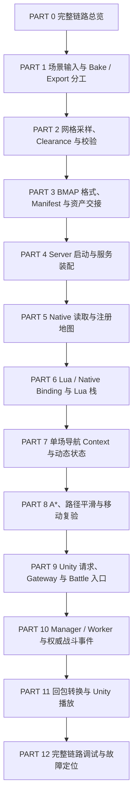

# 战斗 1001 回放专题：章节目录与阅读约定

本专题沿现有项目学习从 Unity 场景生成导航资产、Server 加载和使用地图，到请求自动战斗并在 Unity 播放完整结果的链路。章节目录是后续教程的固定入口；每次进入新课前，先核对本目录中的主题、前置章节和当前阅读进度。

文档存放在 WSL 仓库的 `docs/专题教程/回放/`。本文中所有源码路径相对于仓库根目录。

## 一、学习主线

先认识资产从哪里来，再认识服务端如何使用它，最后沿一次真实请求读完模拟与播放。

PART 1—8 建立运行所需的资产、服务和导航基础。PART 9—11 沿一次请求的实际顺序阅读。某个函数在前置章节已经讲过，后续调用到它时只说明输入、输出和状态变化，再链接回原章节。

## 二、固定章节目录

### PART 0：功能入口与完整链路

现有文档：[PART_00_功能入口与完整链路.md](PART_00_功能入口与完整链路.md)。

认识地图生产链和请求回放链，区分场景编号、地图编号、网络 command、服务端逻辑时间和客户端播放时间。知道各模块负责什么、地图与单场战斗状态分别由谁持有。

完成标志：能指着链路说出“地图从哪里来、谁算战斗、谁播放结果”。源码细节从后续章节逐步展开。

### PART 1：Unity 场景输入，以及 Bake 与 BMAP 导出的分工

现有文档：[PART_01_Unity场景与Bake及BMAP导出的分工.md](PART_01_Unity场景与Bake及BMAP导出的分工.md)。

- 从 `Battle_1001.unity` 的 Hierarchy 和 Inspector 开始，辨认地面、障碍、导航组件、地图根、出生点和显示对象。
- 解释 Transform、World / Local、X/Y/Z、Unity Unit 与毫米的关系；用同一张示意图建立 Bounds 和地图覆盖范围的认识。
- 看 NavMeshSurface 收集哪些对象，Collider、Layer、Agent 设置、Area / Modifier 如何影响 Bake；以当前场景配置为依据。
- 说明哪些场景信息影响导航，哪些只参与校验或显示，哪些最终写入资产。
- 解释 Bake 生成 NavMeshData，BMAP Export 消费 Bake 结果和地图参数；辨认校验、Bake、保存、导出菜单和一键流水线。

主要入口：`unity/BattleNavigation/Assets/BattleNavigation/Runtime/BattleMapRoot.cs`、`BattleSpawnPoint.cs`，以及 `Editor/Battle1001SceneBuilder.cs`、`BattleMapAuthoringValidator.cs`、`BattleMapPipeline.cs`。

完成标志：能解释改动一堵墙后为什么要重新 Bake，改动地图采样参数后导出会受到什么影响，以及成功 Bake 后还需要哪些步骤才能交付 Server。

### PART 2：从 NavMesh 采样到可验证的网格快照

现有文档：[PART_02_网格采样Clearance与校验.md](PART_02_网格采样Clearance与校验.md)。

- 沿 Exporter 的 Sample → Clearance → Validate 顺序阅读。
- 从 Bounds、origin、cell_size 推导网格尺寸和 Cell 中心；解释一维数组如何保存二维格数据。
- 解释采样得到的高度、可走标记、Area，以及采样偏移、多层表面和 2.5D 限制。
- 说明 Clearance 为后续单位半径和通行判断提供什么数据，并用障碍旁边的几个格子举例。
- 通过 Snapshot、Validator 和 Overlay 判断“导出成功”与“格数据符合场景预期”。

主要入口：`unity/BattleNavigation/Assets/BattleNavigation/Editor/BattleMapExporter.cs`、`BattleMapSampler.cs`、`BattleMapSnapshot.cs`、`BattleMapClearance.cs`、`BattleMapValidator.cs`、`BattleMapOverlay.cs`。

完成标志：能追踪一个具体位置对应的 Cell，并解释它为什么可走、不可走或被校验拒绝。

### PART 3：BMAP 文件合同、Manifest 与资产交接

现有文档：[PART_03_BMAP格式Manifest与资产交接.md](PART_03_BMAP格式Manifest与资产交接.md)。

- 从内存 Snapshot 到 Header、Cell Payload，解释尺寸、索引顺序、字段单位、Little Endian、CRC 和格式版本。
- 区分 format_version、map_id、map_version 与内容 hash 的用途。
- 沿 Writer 的临时文件、回读校验和正式文件替换过程，讲清发布边界及失败行为。
- 解释 Manifest 记录什么、哪些字段在当前 Server 中实际被校验，哪些仅供发布核对。
- 核对 Windows 候选资产与 WSL Server 消费的 `shared/navigation/` 资产，说明 Git / 发布交付与运行目录的关系。

主要入口：`unity/BattleNavigation/Assets/BattleNavigation/Runtime/BMapFormat.cs`、`NavCell.cs`，`Editor/BMapWriter.cs`、`BMapManifestWriter.cs`，以及 `shared/navigation/battle_1001/`。

完成标志：能说明 Server 应读取哪个文件，并识别版本、长度、校验或交付不一致。

### PART 4：Server 怎样启动并装配服务

现有文档：[PART_04_Server启动与服务装配.md](PART_04_Server启动与服务装配.md)。

- 从启动脚本和配置中的 start 入口读起，区分 OS Process、Skynet Service、Lua State 和普通 require 模块。
- 追踪 Battle Process 创建 Query、Manager、Worker、Dispatch 的顺序，以及 Gateway Process 的启动依赖。
- 解释 newservice、handle 注入、call、ready 和 yield 在当前启动流程中的作用。
- 核对 BMAP 相对路径从哪个工作目录解析，Native 模块如何被找到，以及 READY 日志实际保证了什么。

主要入口：`server/scripts/lessons/run_lesson_02_processes.sh`、相关 Skynet 配置，`server/service/battle/battle_main.lua`、`navigation_query.lua`、`battle_mgr.lua`，`server/service/gateway/gateway_main.lua`，`server/lualib/battle/navigation/query_logic.lua`。

完成标志：能解释为什么先等待地图和 Worker 就绪，再开放请求入口，并找到启动失败的第一处错误。

### PART 5：BMAP 如何进入 Native 地图注册表

现有文档：[PART_05_Native地图读取与注册.md](PART_05_Native地图读取与注册.md)。

- 从 Query 启动时的 `battle_nav.load_map` 追进 Binding、Reader、GridMap 和 Registry。
- 按真实读取顺序解释文件校验、地图身份和尺寸检查，说明错误怎样回到 Lua 并阻止启动。
- 解释 Registry 持有的不可变地图、查找时返回的生命周期保证，以及同进程多 Service 与不同进程的区别。
- 用一个 Cell 查询串起世界坐标转换、边界判断和只读字段访问。

主要入口：课程仓库的 `server/lualib/battle/navigation/query_logic.lua`；FlyWow 的 `navigation/native/navigation_binding.cpp`、`navigation/native/grid_map/bmap_reader.cpp`、`grid_map.cpp`、`map_registry.cpp`。

完成标志：能说明 Worker 如何找到已加载地图，以及为什么创建 Context 无需重新读 BMAP。

### PART 6：Lua 与 Native Binding，以及每一步的 Lua 栈

计划文档：`PART_06_LuaNativeBinding与栈.md`。

- 从 require 和模块入口认识函数表、closure / upvalue、metatable 和 userdata 的注册过程。
- 跟踪一次 Lua 调用进入 C++：参数检查、类型转换、Native 调用、返回值和错误 record。
- 在关键 API 旁展示调用前后栈内容，结合项目解释 `luaL_newmetatable`、`lua_setfield`、`lua_pop`、`return n` 等操作。
- 解释 Context / Path userdata、显式关闭、GC 兜底和借用引用的生命周期。

主要入口：`server/native/lua_battle_nav/include/lua_battle_nav.h`、`server/native/lua_battle_nav/src/lua_battle_nav.cpp`。

完成标志：能看懂一个 Binding 函数的输入栈、输出栈和返回数量，并判断资源由谁释放。

### PART 7：单场战斗的 NavigationContext 与动态状态

计划文档：`PART_07_NavigationContext与动态占位.md`。

- 解释 AgentProfile 的通行条件，以及静态 Cell 数据如何被使用。
- 追踪 Context 创建、单位放置、动态占位、自身排除、移动提交和释放。
- 讲清查询 scratch、动态 occupancy 和路径跟随状态的所有权；按现有实现核对 reservation 等能力是否存在。
- 解释两场战斗共享地图时，为什么动态状态仍要隔离。

主要入口：`server/native/grid_map/src/navigation_context.cpp`、`dynamic_occupancy.cpp`，相关头文件及 `server/service/battle/battle_worker.lua` 的 Context 创建位置。

完成标志：能解释同一地图上的两场战斗为何不会互相占格，并追踪一个单位的占位生命周期。

### PART 8：A*、路径平滑与移动复验

计划文档：`PART_08_A星路径平滑与移动复验.md`。

- 用小网格例子跟踪邻居展开、候选成本、优先队列、父节点和路径重建，解释各步骤为什么需要。
- 结合当前实现讲通行检查、对角移动、拐角穿越、搜索预算和相同输入下的稳定选择。
- 追踪 smoothing 如何减少路点，解释直线段怎样验证，为什么不能直接连接起终点。
- 区分规划时可走与移动时仍可走；讲清动态占位变化后的复验、停止或重新规划路径。
- 解释失败码和路径长度、成本等结果字段，避免用数学公式替代执行过程。

主要入口：`server/native/grid_map/src/grid_pathfinder.cpp`、`navigation_context.cpp`，以及 Lua 导航适配层的对应调用。

完成标志：能手工解释一条路线为什么绕行、为什么某些路点被删除，以及路径后来为什么可能不能继续走。

### PART 9：一次请求从 Unity 经过 Gateway 到 Battle 入口

计划文档：`PART_09_Unity请求与GatewayBattle通信.md`。

- 从 `BattleReplayRequester.Start()` 进入：Inspector 配置、主线程协程、后台 Task、短连接与 Dispose。
- 沿握手、长度帧、Envelope 和业务请求解释 command、request_id、协议版本和 Protobuf 类型。
- 沿当前 Gateway 接收、解码、Proxy 转发和 Battle Dispatch 处理代码，讲清跨 Service / Process 的消息参数来源与 yield 边界。
- 以 WSL 当前 `send_data` 合同核对 gateway_epoch、connection_id、command_id、data 和反向回包路由；逐项确认客户端和 Server 是否兼容。
- 区分握手失败、网络断开、业务拒绝、超时，以及实际代码实现的身份检查和资源限制。

主要入口：Unity 的 `client/BattleReplayRequester.cs`、`Scripts/Protocol/ServerBattleClient.cs`、`GatewayEnvelopeClient.cs`、`LengthFrame.cs`；`shared/protocol/`；WSL 的 `server/service/gateway/gateway_proxy.lua`、`server/service/battle/battle_dispatch.lua` 与固定 submodule 中实际调用的 FlyWow Gateway / SDK 文件。

完成标志：能把一个 scenario_id=1001 请求追到 Battle 业务入口，并说明每次转换后数据是什么、由谁拥有。

### PART 10：BattleMgr、Worker 与权威战斗事件

计划文档：`PART_10_权威战斗模拟与事件生成.md`。

- 从业务入口构造 `scenario_1001` Snapshot，核对地图身份、seed、tick_ms、双方单位及规则输入。
- 追踪 Manager 的 Worker 选择、并发限制、Worker 创建 / 关闭 Context 和错误传播。
- 沿 battle_core 的固定 Tick 阅读目标选择、导航、移动、攻击、HP、死亡和结束条件。
- 追踪每类 Event 在哪里产生，解释 seq、logic_ms、路径点和最终结果如何形成。
- 解释模拟连续推进与客户端按真实时间播放的区别，以及确定性检查当前验证哪些内容。

主要入口：`server/lualib/battle/scenario_1001.lua`、`battle_core.lua`、`navigation/`，`server/service/battle/battle_mgr.lua`、`battle_worker.lua`、`battle_dispatch.lua`。

完成标志：能从一条 MOVE_PATH、ATTACK 或 DEATH 事件追到产生它的权威状态变化。

### PART 11：结果回包、回放文档转换与 Unity 播放

计划文档：`PART_11_结果回包与Unity回放.md`。

- 追踪完整结果从 Worker 回到 Dispatch、Gateway，再到客户端；核对响应大小限制与业务失败码。
- 解释 Proto Event → ReplayDocument 的转换、整数范围检查、单位保留和事件顺序校验。
- 沿 Play、Update、Apply 阅读播放时间、事件消费、路径插值、单位出生 / 销毁、死亡和结束表现。
- 解释坐标毫米到 Unity 世界坐标的转换，以及逻辑事件时间与表现帧率的关系。
- 补充离线 batch、JSON Writer 和 Player 输入：如何使用同一份结果隔离网络问题与播放问题。

主要入口：`server/service/battle/batch_runner.lua`、`server/lualib/battle/replay_writer.lua`，Unity 的 `client/BattleReplayRequester.cs`、`BattleReplayPlayer.cs`、`Scripts/Editor/BattleReplaySceneSetup.cs`。

完成标志：能解释收到成功响应后为何仍可能播放异常，并把问题定位到回包、转换、事件数据或显示阶段。

### PART 12：完整链路调试与故障定位

计划文档：`PART_12_端到端调试与故障定位.md`。

- 汇总资产版本核对、启动顺序、日志、Lua / Native / C# 断点和观察字段。
- 按资产 → 地图加载 → 请求 → 模拟 → 回包 → 播放顺序验证一次 Battle_1001 完整回放。
- 使用前面章节已解释的失败路径，定位资产错误、未 READY、协议不一致、业务拒绝、寻路失败和播放错误。
- 核对重复输入的结果以及不同播放帧率下的事件消费，明确实际运行证据和未验证项。

完成标志：能独立启动、观察并定位一次回放，从 BMAP 身份一直核对到 BATTLE_END。

## 三、每节的讲解和推进方式

每节先写成 MD，再以文档为依据讨论。正文按以下顺序组织：当前要解决的问题 → 最小概念及示意图 → 场景配置和源码入口 → 关键步骤及其理由 → 输出与后续用途 → 断点、日志和失败路径 → 本节检查点。

解释 API 时结合当前调用说明作用、参数来源、状态变化和资源归属。算法先举可跟踪的小例子，再回到真实代码。Unity 首次出现的空间与 Editor 概念应说明在哪里观察，并提供方向、单位、原点和边界明确的图。

每次只推进当前 PART。插问在当前章节上下文中回答；需要补充时更新当前文档，记录停留位置。收到“继续”“下一节”后，按本目录进入下一 PART。插问及临时环境修复不改变章节编号。

## 四、源码依据与进度

- Unity 源码与 Scene：Windows 工作区。
- Server、Native 与服务端协议源：WSL 工作区。
- 技术基线、能力和合同按对应 Spec / Engineering Decision 核对。旧教程和另一工作区中的旧实现不能替代当前源码。
- 现有 WSL 网络入口使用统一 `send_data`；PART 9 必须检查实际两端收发，不把旧 route token 描述直接套用。
- 文档中的计划文件只有写完并核对后才标记完成；目录中的“完成标志”是学习目标，不代表已测试通过。

当前进度：PART 0、PART 1、PART 2、PART 3、PART 4、PART 5 文档已生成；当前阅读 PART 5。下一节进入 PART 6。其余章节为计划，尚未编写。收到“继续”“下一节”后进入 PART 6。

此前误标为 PART 1 的请求教程保留为 `草稿_Unity入口到Gateway请求_待按PART09核对.md`。它基于旧网络代码，需按当前 WSL 合同重新核对后才能用于 PART 9。
